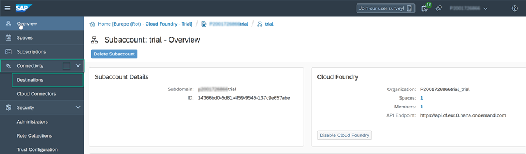
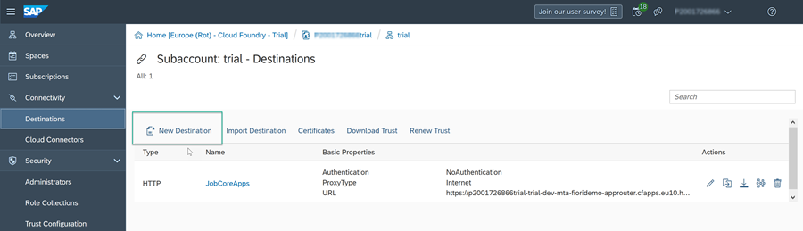
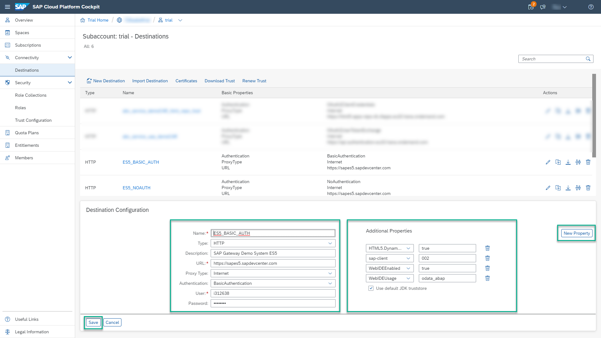
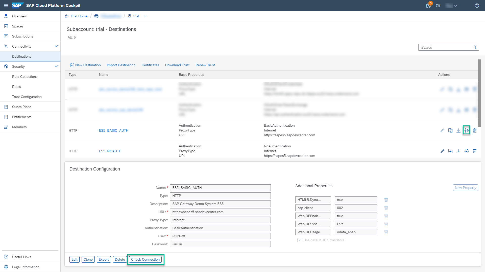
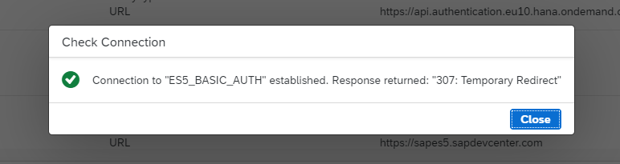

## Prerequisites
- You have created an account on the Gateway Demo System as described in [Create an Account on the Gateway Demo System](gateway-demo-signup). Make a note of the user name and password you select. You'll need them it in this tutorial.

## Details
### You will learn
  - How to create a destination between SAP Business Technology Platform and the SAP Gateway Demo System account

[ACCORDION-BEGIN [Step 1: ](Open your subaccount)]

In this tutorial, we are using the trial subaccount, but you can also open your own subaccount.

1. Log on to SAP BTP and click **Enter Your Trial Account**.

     

2. Click your subaccount tile.

     

[DONE]
[ACCORDION-END]

[ACCORDION-BEGIN [Step 2: ](Create a destination to the SAP Gateway Demo System)]

1.  In the left navigation panel, click **Connectivity** | **Destinations**.

      

2. Click **New Destination**.

    

3.  Add the following destination properties:

    |  Field     | Value
    |  :------------- | :-------------
    |  Name           | `ES5_BASIC_AUTH`
    |  Type          | `HTTP`
    |  Description    | `SAP Gateway Demo System ES5`
    |  URL           | `https://sapes5.sapdevcenter.com`
    |  Proxy Type          | `Internet`
    |  Authentication    | `BasicAuthentication`
    |  User Name          | Your ES5 Gateway user
    |  Password    | Your ES5 Gateway Password

4. When you specify a URL with the HTTPS scheme, the **Use default JDK truststore** checkbox appears. Make sure it is selected.

5. Enter the following **Additional Properties**. Click the **New Property** button each time to add a new property.

    |  Field     | Value
    |  :------------- | :-------------
    | `HTML5.DynamicDestination`          | `true` (Type this additional property manually as it is not available in the drop-down list)
    | `sap-client`          | `002`
    | `WebIDEEnabled`          | `true`
    | `WebIDEUsage`           | `odata_abap`

    >Make sure to add the **HTML5.DynamicDestination** additional property in the destination configuration.

6. Click **Save**.

    !

[VALIDATE_6]

[ACCORDION-END]
[ACCORDION-BEGIN [Step : ](Check the connection)]

Click on the **Check Connection** icon on the newly created destination or the **Check Connection** button to see if everything works.

!

> The response is `307: Temporary Redirect`. This is not an error. The check connection operation tries to open the ES5 URL and gets redirected to the login page.

> !

[DONE]
[ACCORDION-END]
