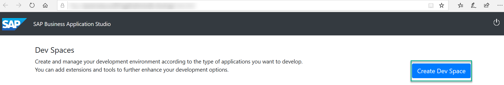
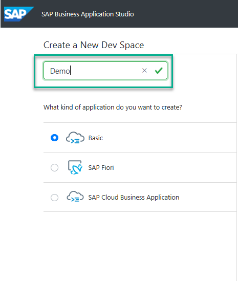
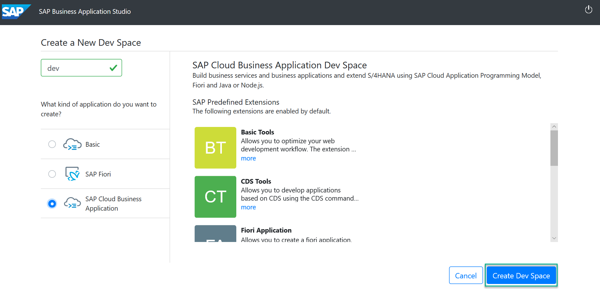

## Prerequisites
 - You are subscribed to SAP Business Application Studio. See [Getting Started](https://help.sap.com/viewer/9d1db9835307451daa8c930fbd9ab264/Cloud/en-US/19611ddbe82f4bf2b493283e0ed602e5.html)

## Details
### You will learn
  - How to create a dev space for developing business applications.

  
---
[ACCORDION-BEGIN [Step 1: ](Create your preconfigured dev space)]
1. Open **SAP Business Application Studio**.

2. Choose **Create Dev Space**.

    

3. Choose a name for your dev space.

    

4. Choose **SAP Cloud Business Application** as the application type.

    

5. Choose **Create Dev Space**.

    

[VALIDATE_6]
[ACCORDION-END]
