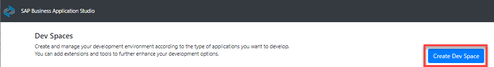
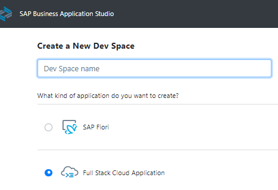
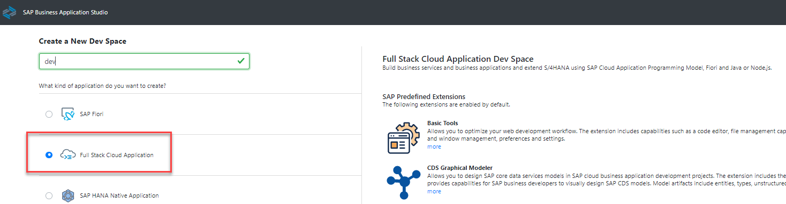
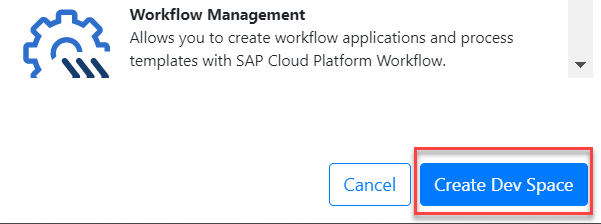

## Prerequisites
 - You are subscribed to SAP Business Application Studio. See [Getting Started](https://help.sap.com/viewer/9d1db9835307451daa8c930fbd9ab264/Cloud/en-US/19611ddbe82f4bf2b493283e0ed602e5.html)

## Details
### You will learn
  - How to create a dev space in SAP Business Application Studio for developing business applications

---
[ACCORDION-BEGIN [Step 1: ](Create your preconfigured dev space)]
1. Open **SAP Business Application Studio**.

2. Choose **Create Dev Space**.

    !

3. Choose a name for your dev space.

    !

4. Choose **Full Stack Cloud Application** as the application type.

    !

    >By selecting SAP Cloud Business Application, your dev space comes with several extensions out-of-the-box that you need to develop CAP applications. For example, CDS tools, Java Tools, and MTA Tools.

5. Choose **Create Dev Space**.

    !

    >The creation of the dev space takes a while. You see that the status for your dev space will change from **STARTING** to **RUNNING**.

6. Once the dev space is running, click the dev space name to open it.

[DONE]
[ACCORDION-END]

[ACCORDION-BEGIN [Step 1: ](Test yourself)]

[VALIDATE_6]
[ACCORDION-END]
