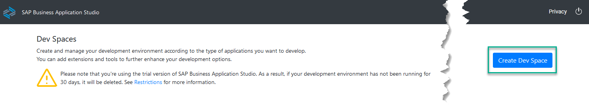
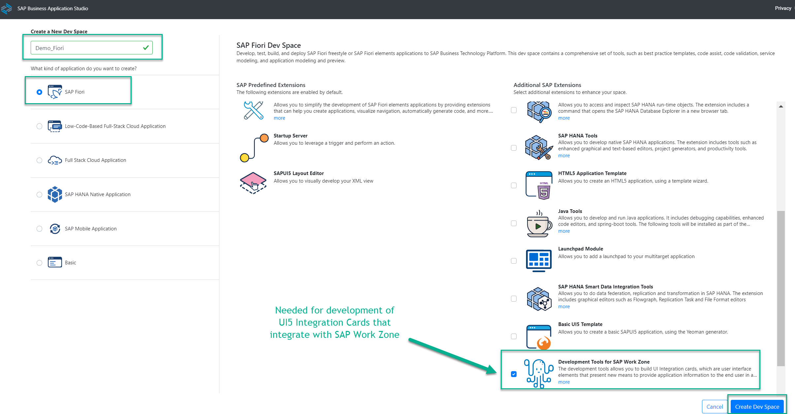
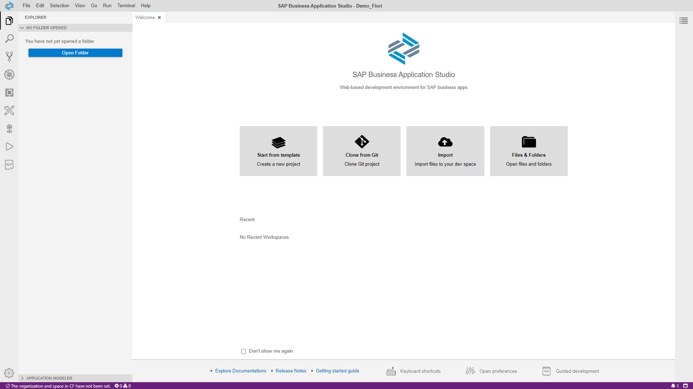

## Prerequisites
  - You have access to SAP Business Application Studio (see [Set Up SAP Business Application Studio for Development](appstudio-onboarding)).

## Details
### You will learn
  - How to create an SAP Business Application Studio dev space for SAP Fiori apps

Dev spaces are like isolated virtual machines in the cloud that can be instantly spin-up. Each dev space type contains tailored tools and pre-installed run-times for a target scenario such as SAP Fiori or mobile development. This simplifies and saves time in setting up the development environment as there's no need to install anything or upgrade, letting developers focus on their business domain, anytime, anywhere.

---

[ACCORDION-BEGIN [Step 1: ](Create a preconfigured SAP Fiori dev space)]

1. Access SAP Business Application Studio, and choose **Create Dev Space** in the welcome page or dev space manager.

    >Welcome page for SAP Business Application Studio:

    >!

     
    >Dev space manager for SAP Business Application Studio:

    >!

2. Enter `Demo_Fiori` for your dev space **name**.

3. Choose **SAP Fiori** as the application type.

4. Click **Create Dev Space**.

    !

    >The dev space is in status **STARTING**. Wait until it is in status **RUNNING**. This might take a couple of minutes.

    !

[VALIDATE_1]
[ACCORDION-END]

[ACCORDION-BEGIN [Step 2: ](Open the SAP Fiori dev space)]

1. **Click** the name of the dev space you created.

    !

2. The SAP Fiori dev space opens and the **Welcome** tab appears.

    !

    >You may be prompted to accept the legal terms.

    >The purple color of the status bar indicates that there is no open workspace.

[DONE]
[ACCORDION-END]

---

Hooray!!! With this, you have successfully completed the creation of a dev space for SAP Fiori applications development.

>After a period of idle time the dev space is automatically stopped. In order to re-start the dev space open the [dev space manager](https://triallink.eu10.trial.applicationstudio.cloud.sap/), click the **Play** icon, and click the dev space.

>The period for idle time for Factory accounts is different than for trial accounts.

---
