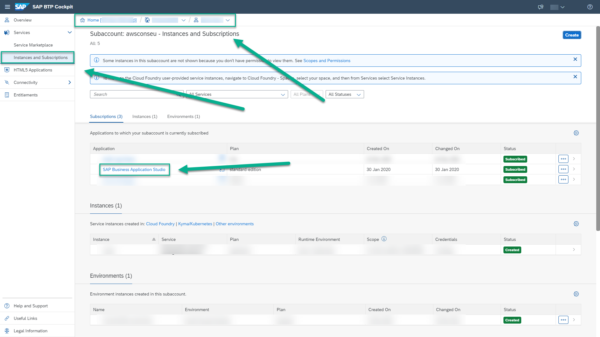
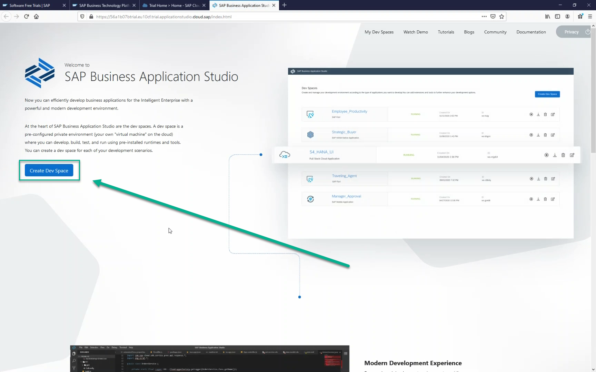

# Create a Dev Space for SAP Fiori Apps
<!-- description --> Create an SAP Business Application Studio dev space, a preconfigured environment with the required tools and extensions tailored for a specific business scenario.

## Prerequisites
  - You have access to SAP Business Application Studio (to onboard SAP Business Application Studio in a trial account, see [Set Up SAP Business Application Studio for Development](appstudio-onboarding)).

## You will learn
  - How to create an SAP Business Application Studio dev space for SAP Fiori apps

## Intro
Dev spaces are like isolated virtual machines in the cloud that can be instantly spin up. Each dev space type contains tailored tools and pre-installed run-times for a target scenario such as SAP Fiori or mobile development. This simplifies and saves time in setting up the development environment as there's no need to install anything or upgrade, letting developers focus on their business domain, anytime, anywhere.

---

### Create a Preconfigured SAP Fiori Dev Space

1. Access SAP Business Application Studio.

    >Options:

    >1. Use a link or a bookmark to open the dev space manager of SAP Business Application Studio.

    >2. In a trial account, launch the SAP BTP trial landing page, and choose **SAP Business Application Studio**.
    ><!-- border -->

    >3. In a productive account (as well as a trial account), access SAP BTP cockpit, navigate to the subaccount with the SAP Business Application Studio subscription, click **Instances and Subscriptions**, and click **SAP Business Application Studio**.
    ><!-- border -->

     
    >You might be asked to accept the privacy statement. Check the box and click OK.

2. Choose **Create Dev Space** in the landing page or dev space manager.

    >Landing page for SAP Business Application Studio:

    ><!-- border -->

     
    >Dev space manager for SAP Business Application Studio:

    ><!-- border -->

3. Enter `Demo_Fiori` for your dev space **name**.

4. Choose **SAP Fiori** as the application type.

5. Click **Create Dev Space**.

    >To develop UI5 Integration Cards that integrate with SAP Build Work Zone, check the **Development Tools for SAP Build Work Zone** extension in the **Additional SAP Extensions** section.

    <!-- border -->

    >The dev space is in status **STARTING**. Wait until it is in status **RUNNING**. This might take a couple of seconds.

    <!-- border -->

### Open the SAP Fiori Dev Space

1. **Click** the name of the dev space you created.

    <!-- border -->

    >You might be asked to accept the privacy statement. Check the box and click OK.

2. The SAP Fiori dev space opens and the **Get Started** tab appears.

    <!-- border -->

    >You may be prompted to accept the legal terms.

    >Wait until "We have finished installing all tools and templates" notification appears at the bottom right of the screen.

---

Congratulations! 

You have now successfully created a dev space for developing SAP Fiori applications.

>After a period of idle time the dev space is automatically stopped. To restart the dev space, open the [dev space manager](https://triallink.eu10.trial.applicationstudio.cloud.sap/), click the **Play** icon, and click the dev space.

>The period of idle time for Factory accounts is different than for trial accounts.

---
