## Prerequisites
 - You have access to SAP Business Application Studio. See [Set Up SAP Business Application Studio for Development](appstudio-onboarding).
 - A destination to ES5 is configured in the subaccount from which you accessed the SAP Business Application Studio. See:
    - [Create an Account on the Gateway Demo System](gateway-demo-signup)
    - [Create a Destination within the Cloud Foundry Environment](cp-cf-create-destination), and set the ES5 destination properties as follows:
        - Common properties
            - Name: **ES5**
            - Type: **HTTP**
            - Description: **ES5**
            - URL: **`https://sapes5.sapdevcenter.com`**
            - Proxy Type: **Internet**
            - Authentication: **`BasicAuthentication`**
            - User Name: **Your ES5 Gateway user**
            - Authentication: **Your ES5 Gateway password**
        - Additional Properties:
            - HTML5.DynamicDestination: **true**
            - sap-client: **002**
            - `WebIDEEnabled`: **true**
            - `WebIDESystem`: **ES5**
            - `WebIDEUsage`: **`odata_abap`**
 - For the deployment step, additional prerequisites apply. You need to have the following available in the space to which you will log on (see [Add a New Entitlement to Your Subaccount](cp-cf-entitlements-add)):
      - Application Runtime: 1GB free
      - Destination: 1 free
      - HTML5 Applications: 1 free


## Details
### You will learn
  - How to create an SAPUI5 application for SAP Cloud Platform, Cloud Foundry environment
  - How to configure Cloud Foundry settings in SAP Business Application Studio
  - How to build and deploy an application to Cloud Foundry

---
>Make sure to add the **HTML5.DynamicDestination** additional property in the destination configuration.

[ACCORDION-BEGIN [Step 1: ](Open SAP Business Application Studio)]
1. Go to your Cloud Foundry environment subaccount and click the **Subscriptions** tab.

    !

2. Locate the **SAP Business Application Studio** tile.

3. Click **Go to Application**.

[DONE]
[ACCORDION-END]

[ACCORDION-BEGIN [Step 2: ](Create a preconfigured SAP Fiori dev space)]

1. Choose **Create Dev Space**.

    !

2. Choose `Demo_Fiori` for your dev space **name**.

3. Choose **SAP Fiori** as the application type.

4. Click **Create Dev Space**.

    !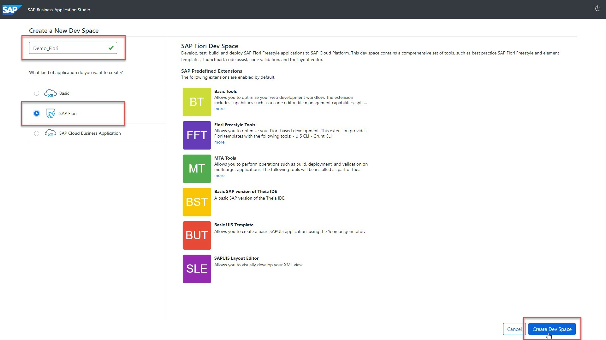

    >The dev space is in status **STARTING**. Wait until it is in status **RUNNING**.

    !

[VALIDATE_1]
[ACCORDION-END]

[ACCORDION-BEGIN [Step 3: ](Create new project)]

1. In SAP Business Application Studio, open the SAP Fiori dev space you created by clicking the name of the dev space.

    !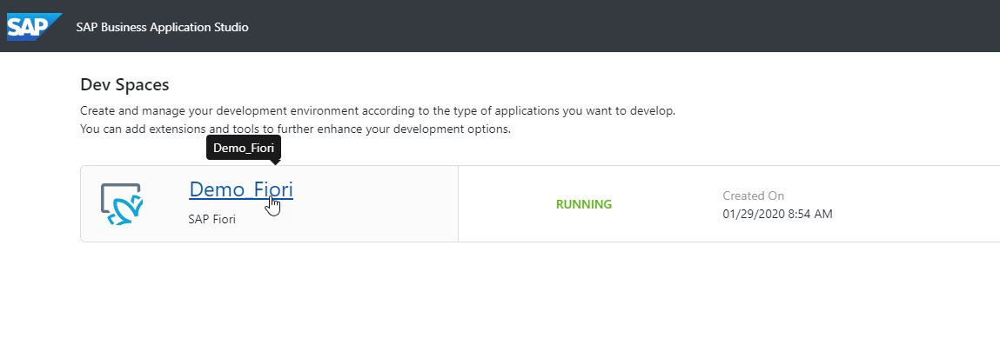
    &nbsp;
    !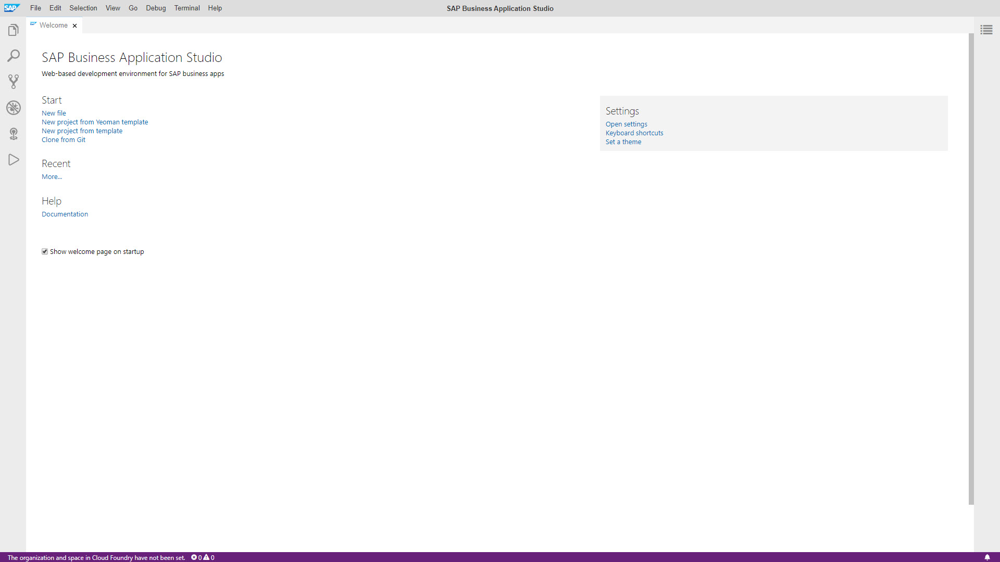

    >The purple color of the status bar indicates that there is no open workspace.

2. Create a new SAP Fiori project from a template.

    !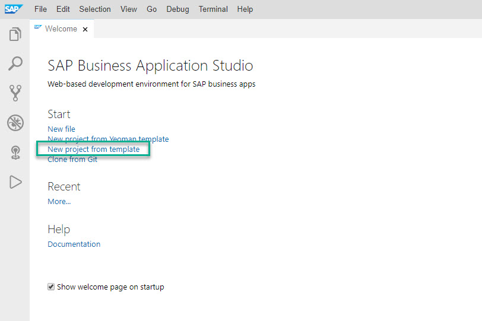

3. Select the `Fiori Project` template and click **Next**.

    !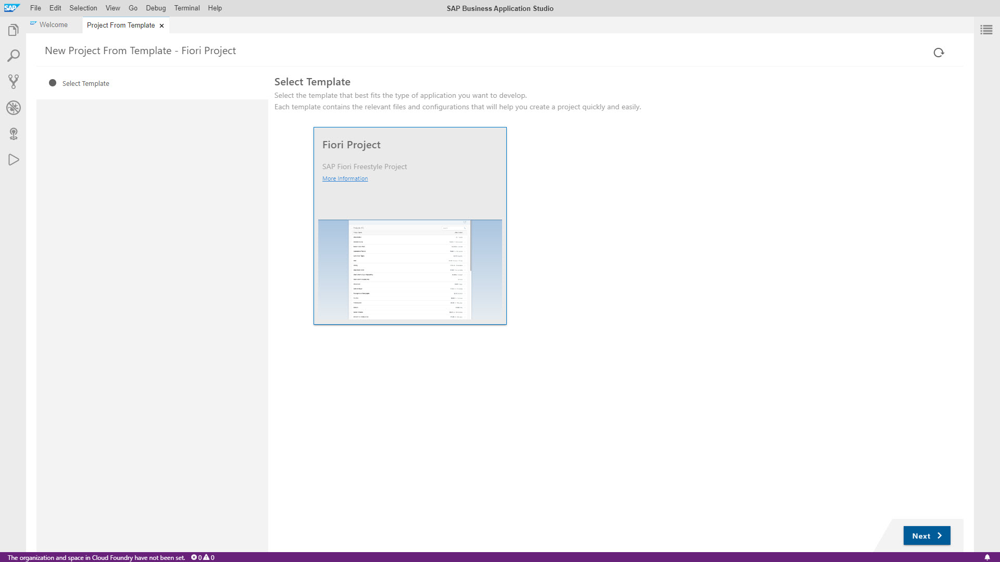

4. For `Target Running Environment`, select the following, and click **Next**.

    | Step | Parameter | Value |
    |:-----|:----------|:------|
    | A | Select the target running environment | **Cloud Foundry** |
    | B | Select the template you want to use | **SAPUI5 Application** |

    !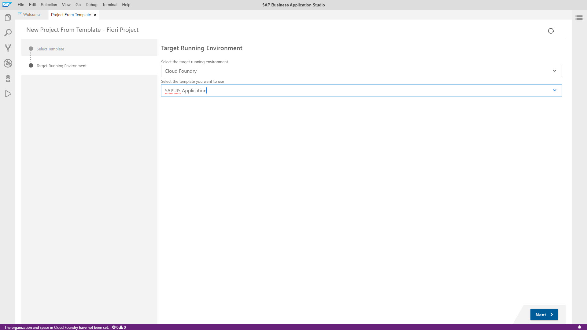

5. For `Project Name`, enter `FioriDemo`, and click **Next**.

    !

6. For `Basic Attributes`, select the following, and click **Next**.

    | Step | Parameter | Value |
    |:-----|:----------|:------|
    | A | Enter an HTML5 module name | **`BusinessPartners`** |
    | B | Do you want to add authentication | **No** |
    | C | Enter a namespace | **ns** |

    !

7. For `View Name`, select the following, and click **Next**.

    | Step | Parameter | Value |
    |:-----|:----------|:------|
    | A | Enter a view name | **Suppliers** |
    | B | Do you want to add a data service | **Yes** |

    !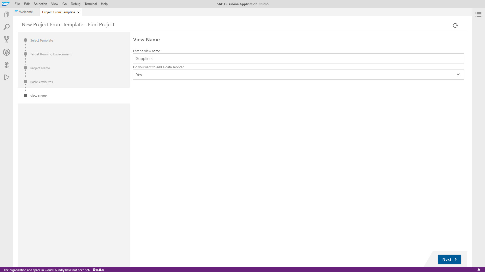

8. For `Providers`, select the following, and click **Next**.

    | Step | Parameter | Value |
    |:-----|:----------|:------|
    | A | Select a system | **My SAP systems** |
    | B | Select a source | **ES5 [Catalog]** |
    | C | Select a service | **`GWSAMPLE_BASIC`** |

    !

    >A notification that the project has been generated appears at the bottom right of the screen.

    !

9. Click **Open in New Workspace** in the notification or **File > Open Workspace**, and choose projects.

    !

    >The **Explorer** opens and you can see the `FioriDemo` project, its folder structure, and files. If not, you can click the **Explorer** view button at the top left of the screen.

    >The status bar color changed to blue, indicating that a workspace is open.

[VALIDATE_2]
[ACCORDION-END]

[ACCORDION-BEGIN [Step 4: ](Open the layout editor)]

Open the layout editor in SAP Business Application Studio to easily make a few changes. In this case, you will make changes so that data from the backend service is displayed when the app is running.

1. Choose **`FioriDemo` > `webapp` > `view`** and right-click the `Suppliers.view.xml` file that you created with the template in a previous step.

2. Choose **Open With > Layout Editor**.

    !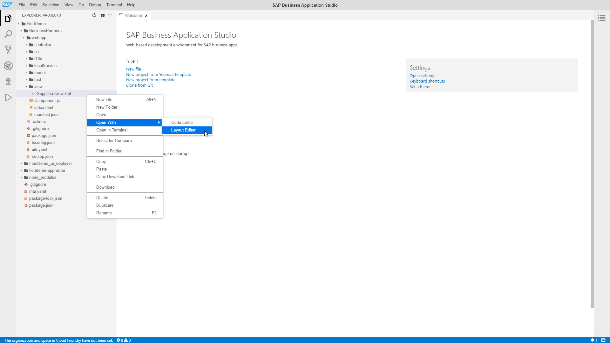
    &nbsp;
    !

3. You can optionally choose to open it with the code editor and see how modifications in the Layout Editor are manifested in the code editor.

    !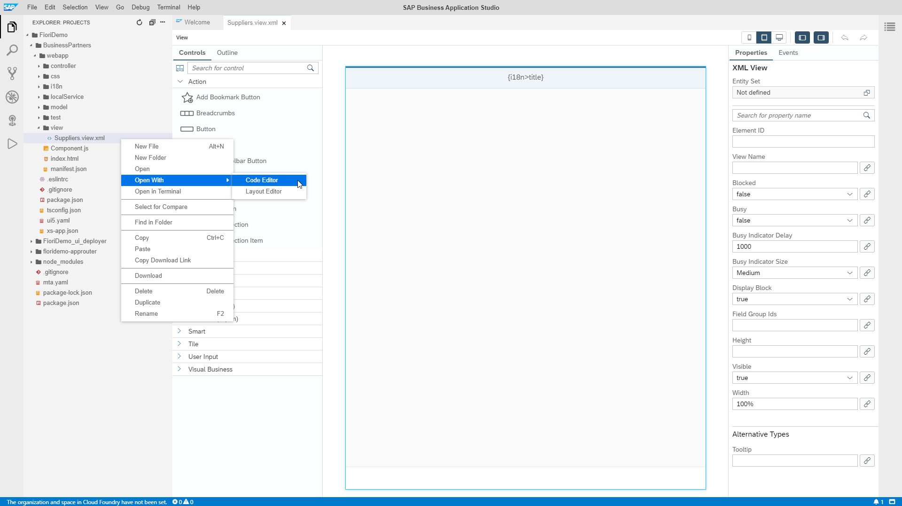
    &nbsp;
    !

4. For convenience, place the code editor below the Layout Editor. Use the drag & drop functionality.

    !
    &nbsp;
    !

[DONE]
[ACCORDION-END]


[ACCORDION-BEGIN [Step 5: ](Make changes to the UI)]

Make some changes using the layout editor, with no need to do any coding.

1. In the **Controls** pane, enter `List` to filter the controls list in the search box.

    !

2. Drag the **List** control and drop it on the **View** control in the canvas.

    !

3. Select the **List** control and, in the **Entity Set** property in the **Properties** pane, click the Bind icon.

    !

    >The `Select Entity Set` view is presented.

4. Select the **Define entity set and set the selected control as template** option, and in the **Entity Set** dropdown list, choose the `BusinessPartnerSet` entity set. Click **Bind** to complete the operation.

    !
    &nbsp;
    !

5. In the **Properties** pane, in the **Title** property, click the Bind icon.

    !

    >The `Data Binding` view is displayed.

6. Click the **Clear expression** (eraser) icon to clear the default text, and in the data fields double click  `CompanyName`. Click **Bind** to complete the operation.

    !

7. Repeat the last steps for the **Description** property in the **Properties** pane. Choose  `BusinessPartnerID`.

    !

[VALIDATE_5]
[ACCORDION-END]

[ACCORDION-BEGIN [Step 8: ](Set Cloud Foundry preferences)]

Before you can deploy your new application, set your Cloud Foundry preferences.

1. Open the **command palette** and select **CF: Login to cloud foundry**.

    !
    &nbsp;
    !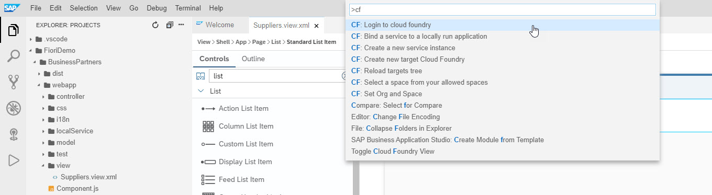

2. When prompted, select the API endpoint, organization and space for your project.

    >The Cloud Foundry organization and space appear in the status line at the bottom left part of the screen.

    !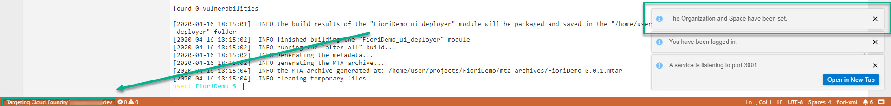

[DONE]
[ACCORDION-END]

[ACCORDION-BEGIN [Step 8: ](Add a Destination Service Instance in Your Space)]

A destination service instance is required for test running the app.

1. Open a new terminal.

    !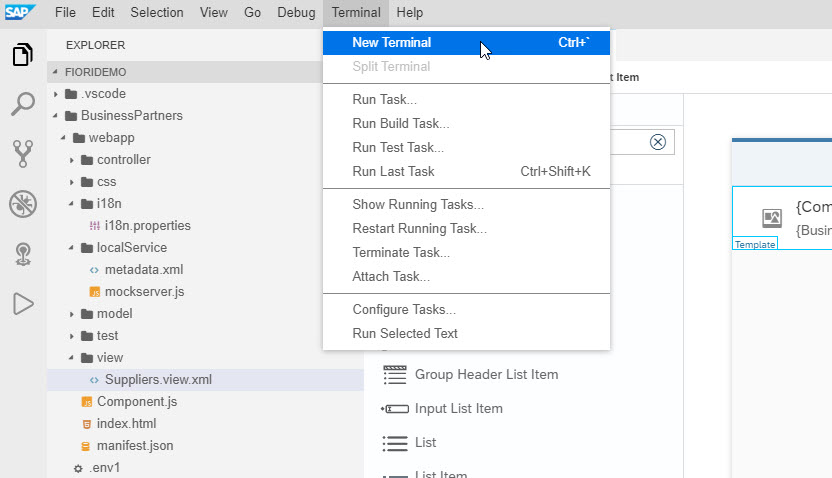
    &nbsp;
    !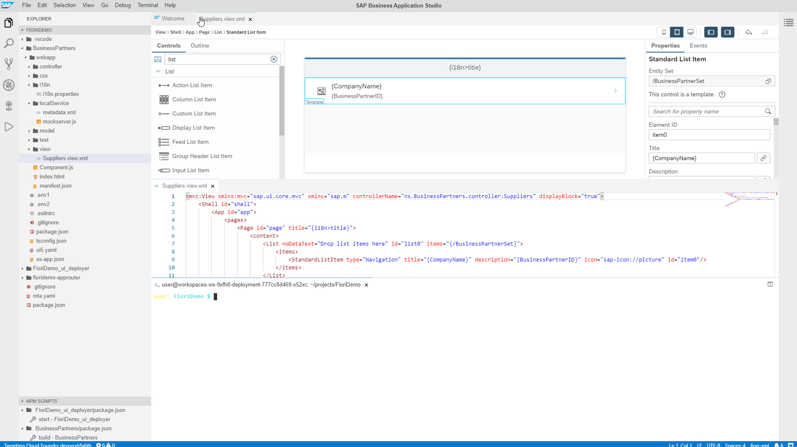

2. Create a new destination service called **`destination_ES5`**.

    ```Shell/console
      cf create-service destination lite destination_ES5
    ```

    !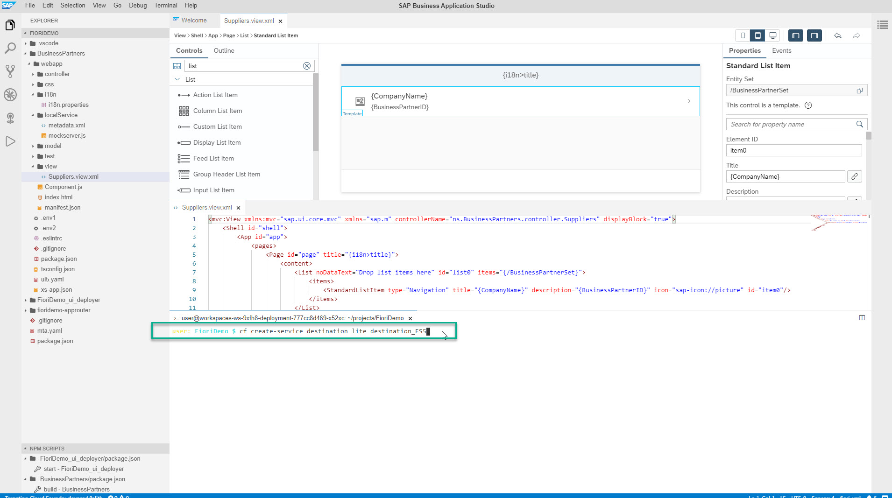
    &nbsp;
    !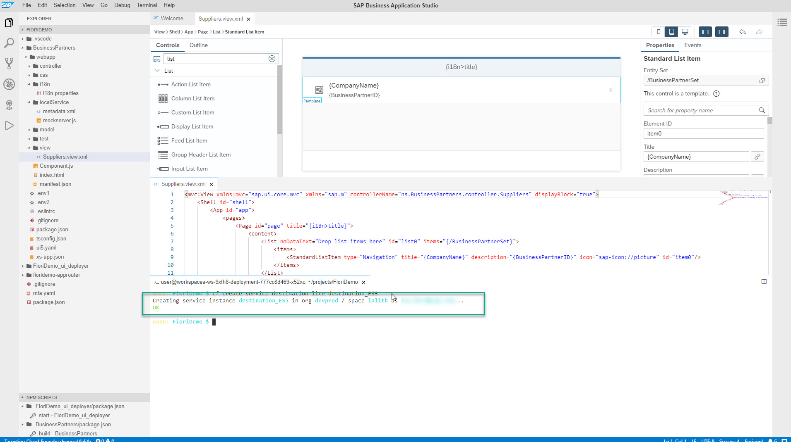

[DONE]
[ACCORDION-END]

[ACCORDION-BEGIN [Step 6: ](Test run the application)]

Run your new application to test it.

1. Open the **Run Configurations** view.

    !

2. Click `+` and select **`BusinessPartners`**.

    !

3. For the next steps of the wizard, select the following:

    | Step | Parameter | Value |
    |:-----|:----------|:------|
    | A | What would you like to run | **`BusinessPartners`** |
    | B | Select a runnable file | **index.html** |
    | C | Select a UI5 version | **latest** |

    >A new run configuration is generated for the `FioriDemo` project.

4. Expand the run configuration to display the services that can be bound.

    !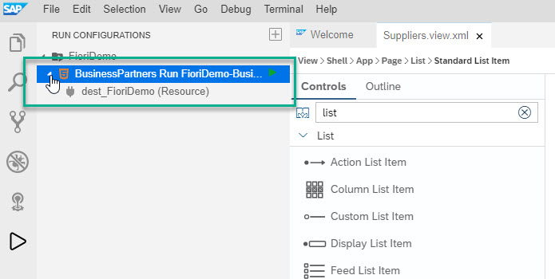

    >SAP Business Application Studio allows you to test your app with resources.

5. To bind to the destination service, click the `bind` icon to the right of the Destination Service resource and select an destination service from the list.

    !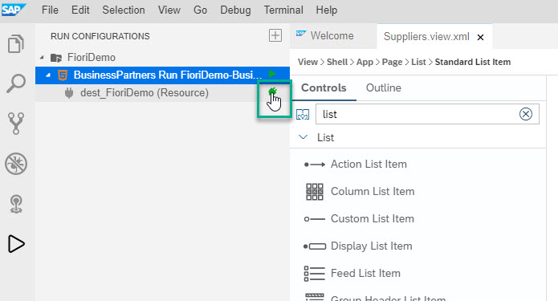
    &nbsp;
    !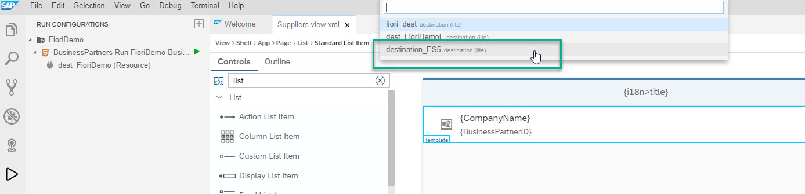

    >Once the destination service has been bound, the Bind icon turns green.

    >To unbind the destination service, click the Unbind icon.

    !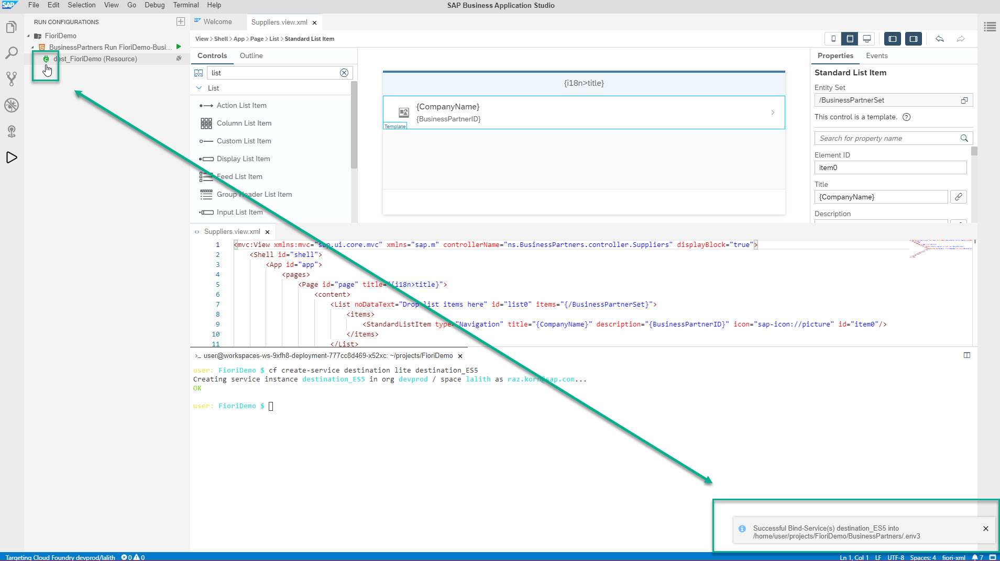

6. Hover over the run configuration and click the Run Module icon.  

    !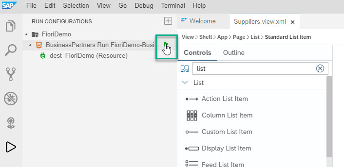

7. Wait for the notification `A service is listening to port 6004`. Click the notification's button.

    >The left side pane changes to the debug pane and the status bar color changes to orange to indicate that the app is running in debug mode.

    >If you are running the app for the first time, the button in the notification will say `Expose and Open`. Otherwise it will say `Open in New Tab`.

    !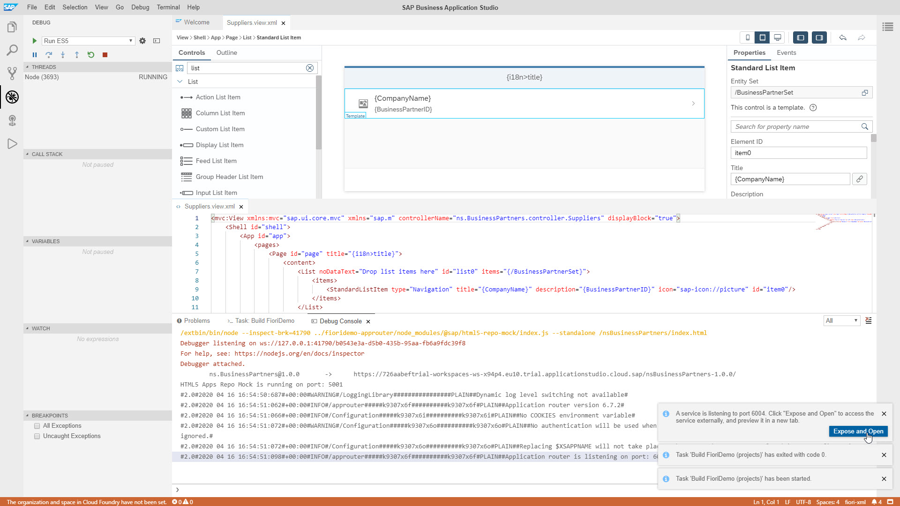

    >You may optionally add a port description.

    >You may need to authenticate yourself to access the backend.

    The app is opened in a new tab and a list of suppliers is displayed.

    !

[VALIDATE_7]
[ACCORDION-END]

[ACCORDION-BEGIN [Step 7: ](Build the application)]

1. Right-click the project's folder and select **Open in Terminal**.

  >A terminal is opened in the project's folder.

  !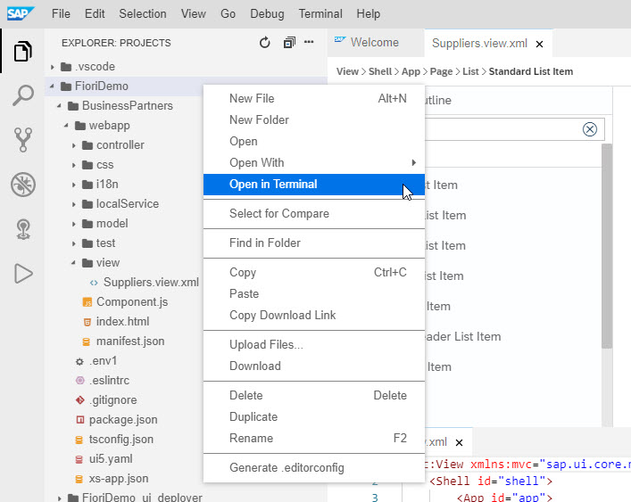

2. Execute the following command:

    ```Shell/console
    mbt build -p=cf
    ```

    !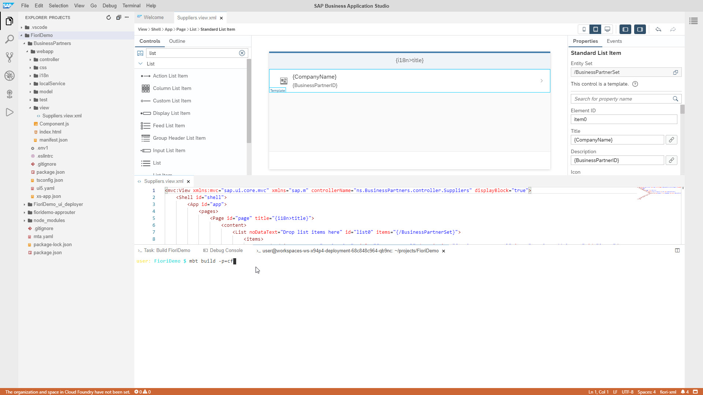

    >The build process creates a multi target archive (`MTAR`) file in your project that packages all the project modules for deployment. You can find the MTAR file in the `FioriDemo/mta_archives` folder.

    !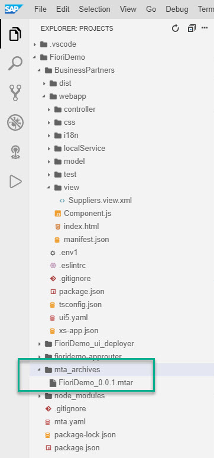

[DONE]
[ACCORDION-END]

[ACCORDION-BEGIN [Step 9: ](Deploy the application)]

Deploy your application to SAP Cloud Platform, Cloud Foundry environment.

1. Right-click the `mtar` file and select **Deploy MTA Archive**.

    !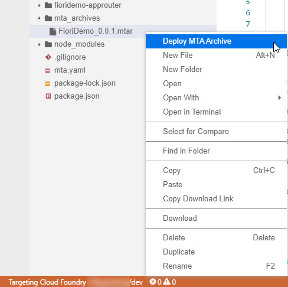

    >The application deployment to the space you are connected to starts and a notification appears. The deployment process takes a few minutes. You can see that the deployment is still in progress in the `Task: Deploy` console at the bottom right of your screen.

    >When the deployment process is complete, you should see a notification.

[DONE]
[ACCORDION-END]

[ACCORDION-BEGIN [Step 10: ](Get URL to access the application)]

Access your deployed application in the SAP Cloud Platform cockpit. The steps below show you how to create a URL that you can use to access your new application.

1. Access the space to where the app is deployed and go to the **Applications** tab.

    !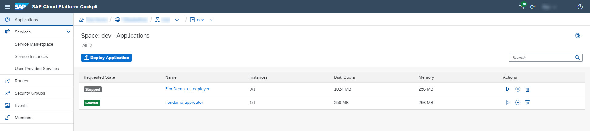

2. Make sure your application is in **Started** state, and  click its name (`fioridemo_approuter`). The **Application: `fioridemo_approuter` - Overview** page opens.

3. Right-click the URL under **Application Routes** and save the URL in a text file.

    !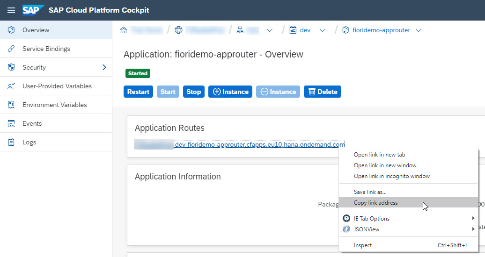

4. Locate the `sap.app id` from the `manifest.json` file, located in your HTML5 module, and add it to the copied link after removing the periods.

    !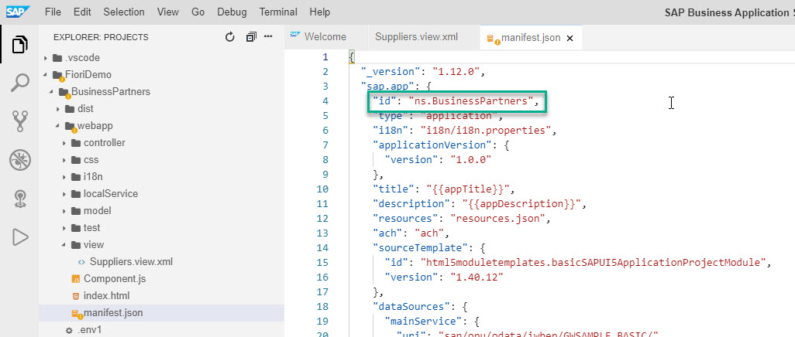

    > For future reference, this is the construct of the final URL: `<URL_from_application_overview_page>/<mynamespace><project_name>/index.html`

    You can use this URL in any browser to access your new application.

[VALIDATE_10]
[ACCORDION-END]


---
