## Prerequisites
  - You have created an SAP Fiori dev space in SAP Business Application Studio. See [Create a preconfigured dev space for developing SAP Fiori apps](appstudio-devspace-fiori-create).
  - The SAP Fiori dev space is in status `RUNNING` and you opened it.
  - You configured a destination to SAP Gateway Demo System (ES5) (see [Connect SAP Cloud Platform to Your SAP Gateway Demo System Account (ES5)](cp-portal-cloud-foundry-gateway-connection)).


## Details
### You will learn
  - How to create an SAPUI5 application for SAP BTP, Cloud Foundry environment
  - How to test-run the app locally in the dev space

You'll build an application that presents a list of suppliers from an on-premise backend. The suppliers' data will be retrieved from the `BusinessPartnerSet` collection in the `GWSAMPLE_BASIC` OData service that is available from SAP's ES5 demo Gateway system.

The flow consists of the following parts:

1. Running a wizard that creates a basic multi-target application (MTA) project. This is required in order to create the deployment artifact for SAP BTP, Cloud Foundry environment. If you are not familiar with the multitarget application concepts, read this [guide](https://www.sap.com/documents/2016/06/e2f618e4-757c-0010-82c7-eda71af511fa.html).

2. Running a wizard that configured the app to use Managed Application Router. This is best practice as well as required in order to include the app in SAP launchpad.

3. Running a wizard that generates the app based on SAPUI5 Application template.

4. Enhancing the application by creating the UI and presenting data fetched from an SAP backend.

>**Important**

>After a period of idle time the dev space is automatically stopped. In order to re-start the dev space open the [dev space manager](https://triallink.eu10.trial.applicationstudio.cloud.sap/), click the **Play** icon, and click the dev space.

>The period for idle time for Enterprise accounts is different than for trial accounts.

---

[ACCORDION-BEGIN [Step 1: ](Create new Multitarget Application project)]

1. In the menu bar, select **View | Find Command** to open the **command palette**.

    !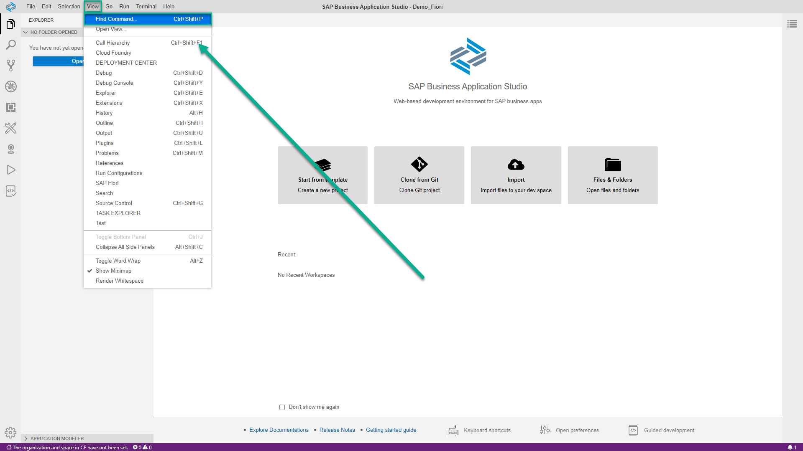

2. The command palette is opened at the top-center of the SAP Business Application Studio window.

    !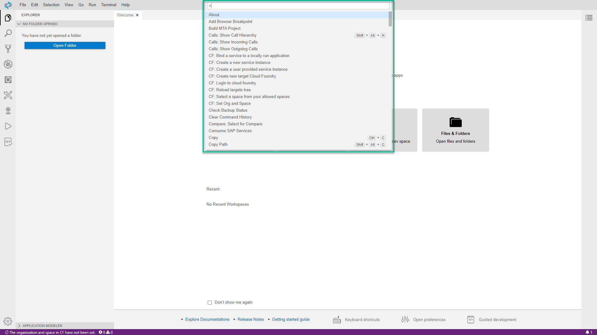

3. Enter the **Open Template Wizard** command in the command palette. Type `wizard` in the command palette text field to filter the commands.

    >Filter the list of commands in the command palette by typing part of the command in the command palette text field.

    !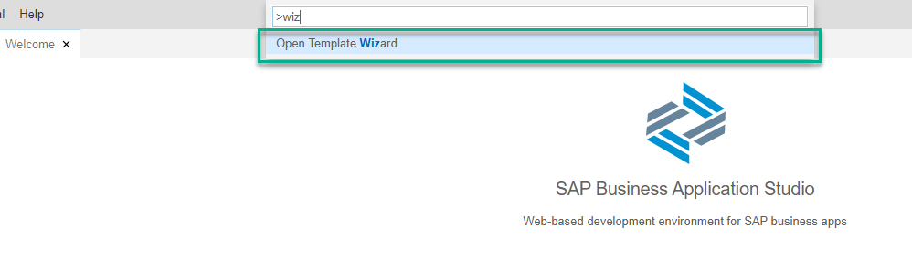

4. The **Template Wizard** tab is opened.

    !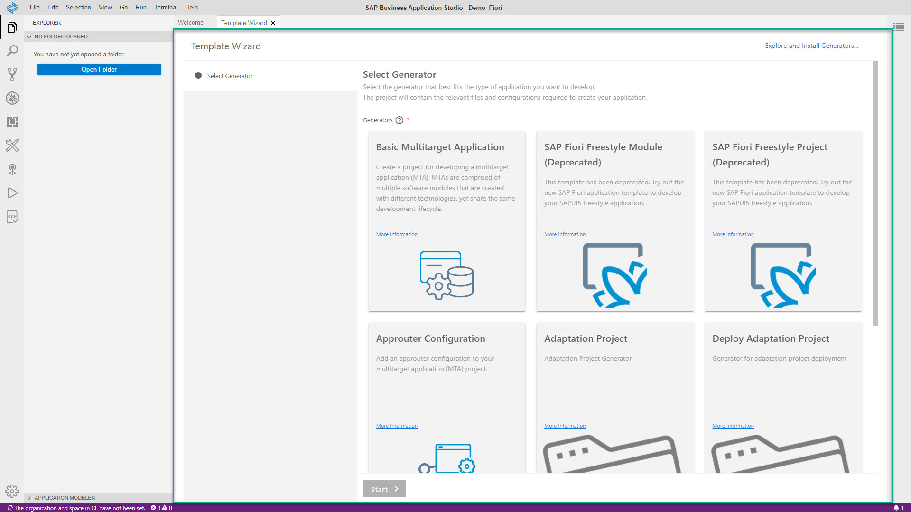

5. Select the **Basic Multitarget Application** wizard, and click **Start**.

    !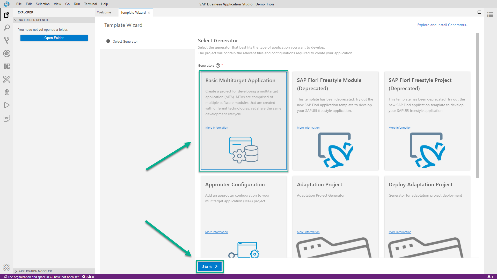

6. For **Enter a Project Name**, enter `FioriDemo`, and click **Finish**.

    !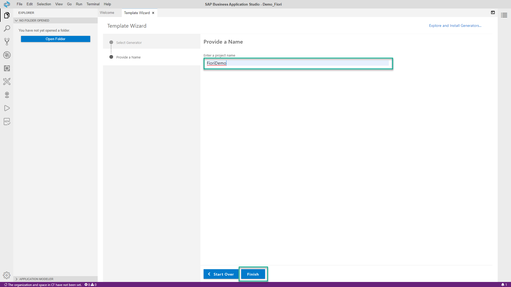

7. SAP Business Application Studio reloads with the `FioriDemo` project open in its workspace. In the Explorer view you can see the `FioriDemo` project, its folder structure, and files.

    >Your workspace is an entity containing your project's settings, debug configurations, and task configurations. In SAP Business Application Studio, a workspace is created for you as part of the Project Creation wizard. You can choose to create a new workspace or for each project, or you can set up a multi-root environment. You can find out more about **Workspaces** in the SAP Business Application Studio [documentation](https://help.sap.com/viewer/9d1db9835307451daa8c930fbd9ab264/Cloud/en-US/0919ce1ca4a342628e49c0f5e9c8cdcf.html).

    >The status bar color changes to blue, indicating that a workspace is open.

    !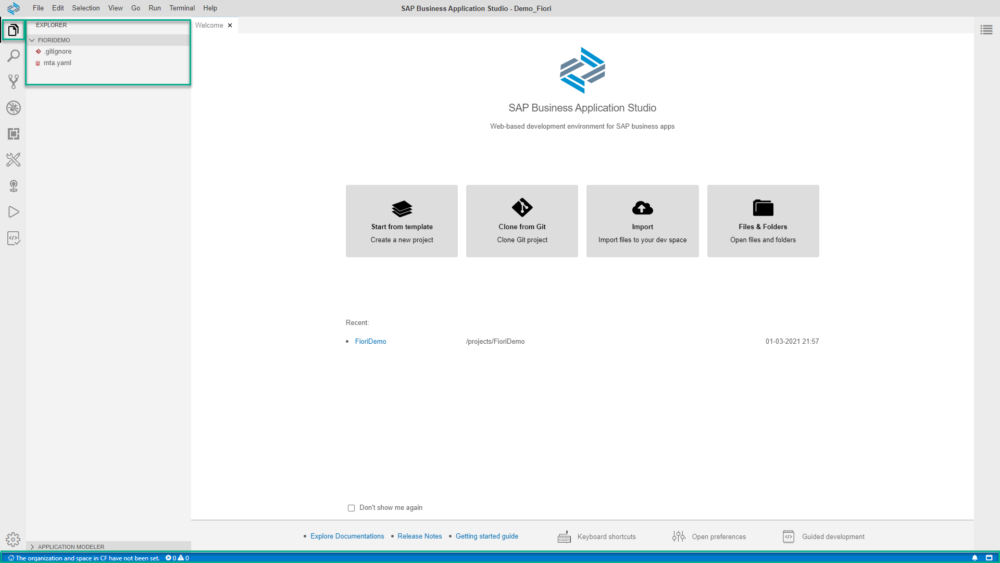

[DONE]
[ACCORDION-END]

[ACCORDION-BEGIN [Step 2: ](Configure the app to use Managed Application Router)]

When end-users access an app in the Cloud Foundry environment, they actually access the Application Router first. The application router is used to serve static content, authenticate users, rewrite URLs, and forward or proxy requests to other micro services while propagating user information.

The recommendation is to use **Managed Application Router** that provides many benefits, when compared to Standalone Application Router, such as save resources, lower maintenance efforts, etc. Standalone Application Router should only be used in advanced cases, for example when application router extensibility is required. More information is available in [Developing HTML5 Applications in the Cloud Foundry Environment](https://help.sap.com/viewer/65de2977205c403bbc107264b8eccf4b/Cloud/en-US/11d77aa154f64c2e83cc9652a78bb985.html)

1. In the menu bar, select **View | Find Command** to open the **command palette**.

    !

2. The command palette is opened at the top-center of the SAP Business Application Studio window.

    !

3. Enter the **Open Template Wizard** command in the command palette. Type `wizard` in the command palette text field to filter the commands.

    >Filter the list of commands in the command palette by typing part of the command in the command palette text field.

    !

4. Select the **Approuter Configuration** wizard, and click **Start**.

    !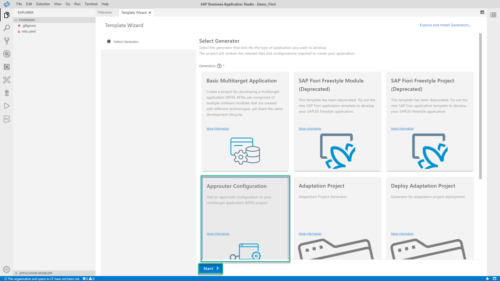

5. For **Project Location > Specify a path to the root project**, click the folder icon.

    !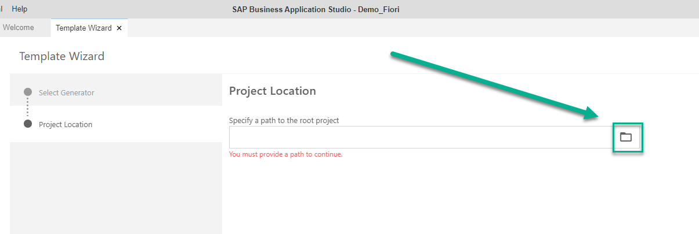

6. Select `FioriDemo` and click **Open**.

    !

7. Verify that the correct path appears (`/home/user/projects/FioriDemo`), and click **Next**.

    !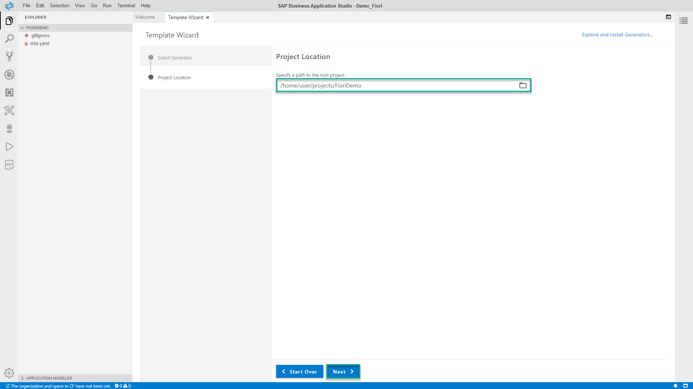

8. For **Approuter configuration**, select the following, and click **Next**.

    | Step | Parameter | Value |
    |:-----|:----------|:------|
    | A | Select your HTML5 application runtime | **Managed Approuter** |
    | B | Enter a unique name for the business solution of the project (1) | **BP** |
    | C | Do you plan to add a UI | **Yes** (default) |

    >(1) Any name can be used for the business solution

    !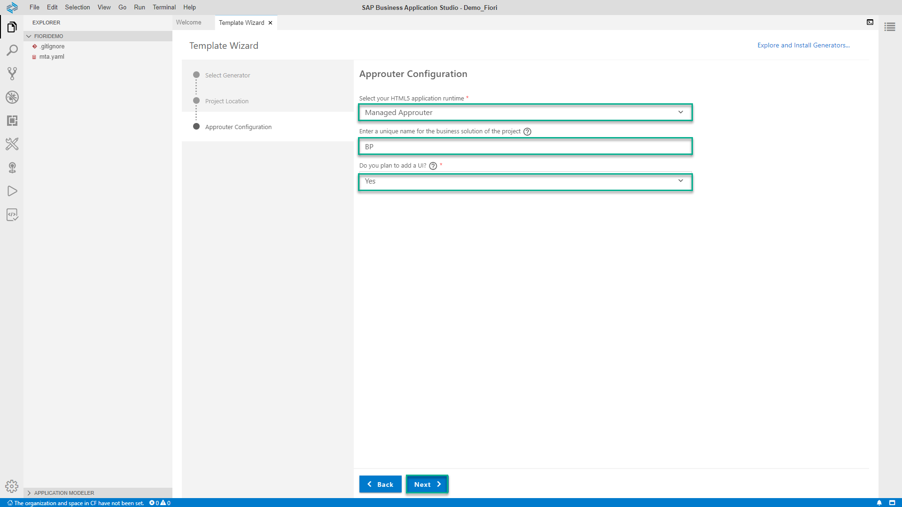


[DONE]
[ACCORDION-END]

[ACCORDION-BEGIN [Step 3: ](Generate an app based on SAPUI5 Application template)]

1. In the **Welcome** tab click **Start from template**.

    !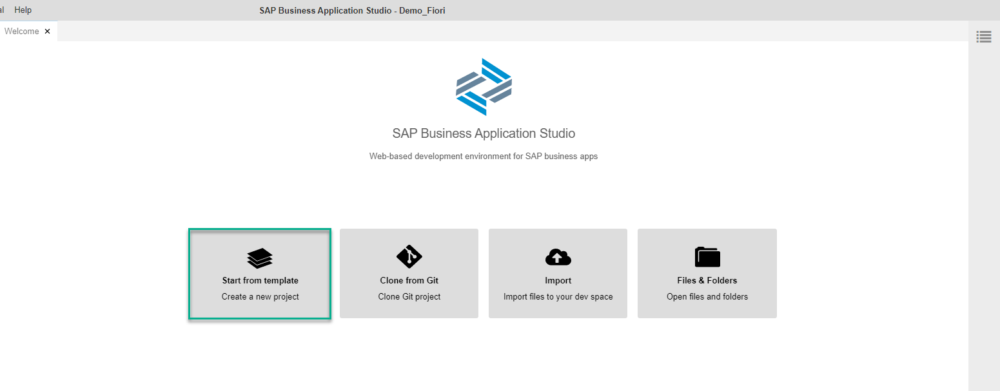

    >If the Welcome Page does not appear, in the menu bar, select **View | Find Command** to open the **command palette** and select the command **Welcome**. The command palette is opened at the top-center of the SAP Business Application Studio window.

    >!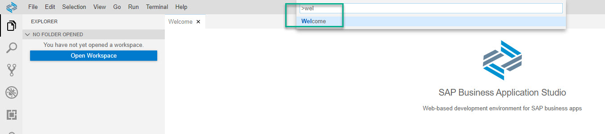

    >The easiest way to develop an SAP Fiori freestyle app from scratch is to create it from a template. To continue developing an existing application, the best practice is to use git source code management and clone the repository.

    >Using the UI wizard you can at any point click the `Back` button to go back to the previous step, or click the specific wizard step to go back to that step.

    > You can also create a project from the terminal using Yeoman (`@sap/fiori` generator).

2. Select the **SAP Fiori Application** tile, and click **Start**.

    !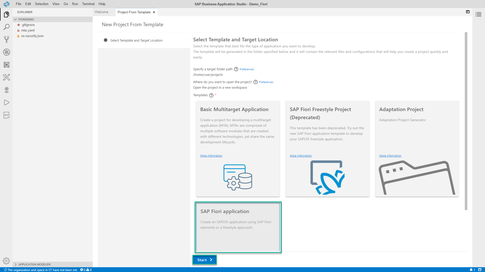

3. For **Floorplan Selection**, select the following, and click **Next**.

    | Step | Parameter | Value |
    |:-----|:----------|:------|
    | A | Application type | **SAPUI5 freestyle** |
    | B | Which `floorplan` do you want to use? | **SAPUI5 Application** tile |

    !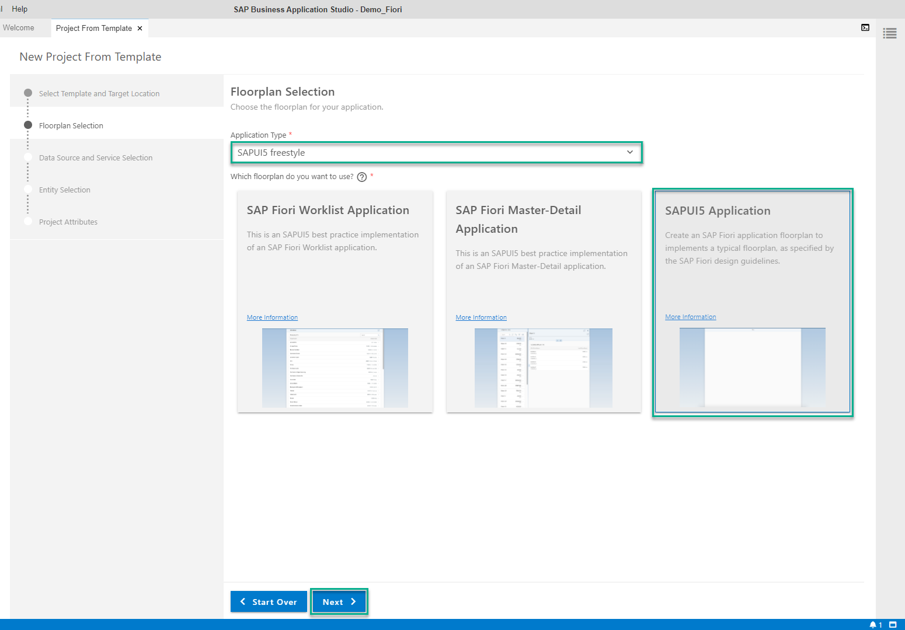

4. For **Data Source and Service Selection**, select the following, and click **Next**.

    | Step | Parameter | Value |
    |:-----|:----------|:------|
    | A | Data source | **Connect to a system** |
    | B | System | **`ES5`** |
    | C | Service | **`ZGWSAMPLE_BASIC (1) - OData V2`** |

    !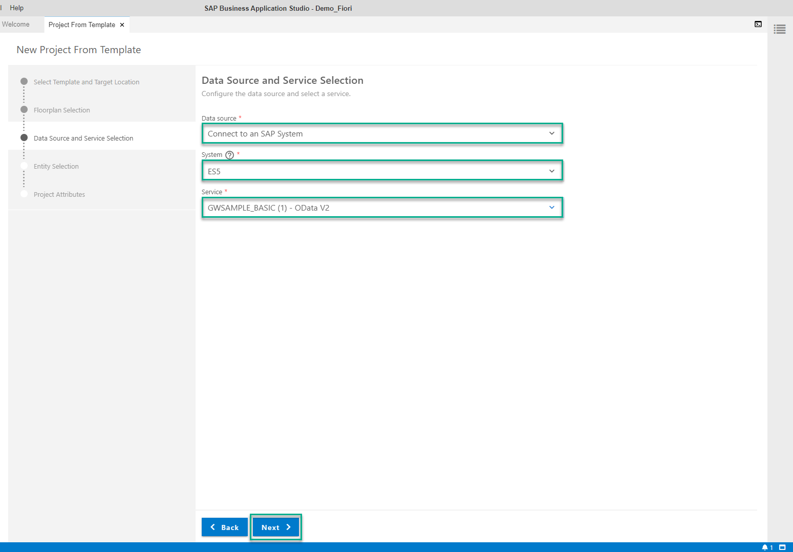

5. For **Entity Selection > View name**, enter `Suppliers`, and click **Next**.

    !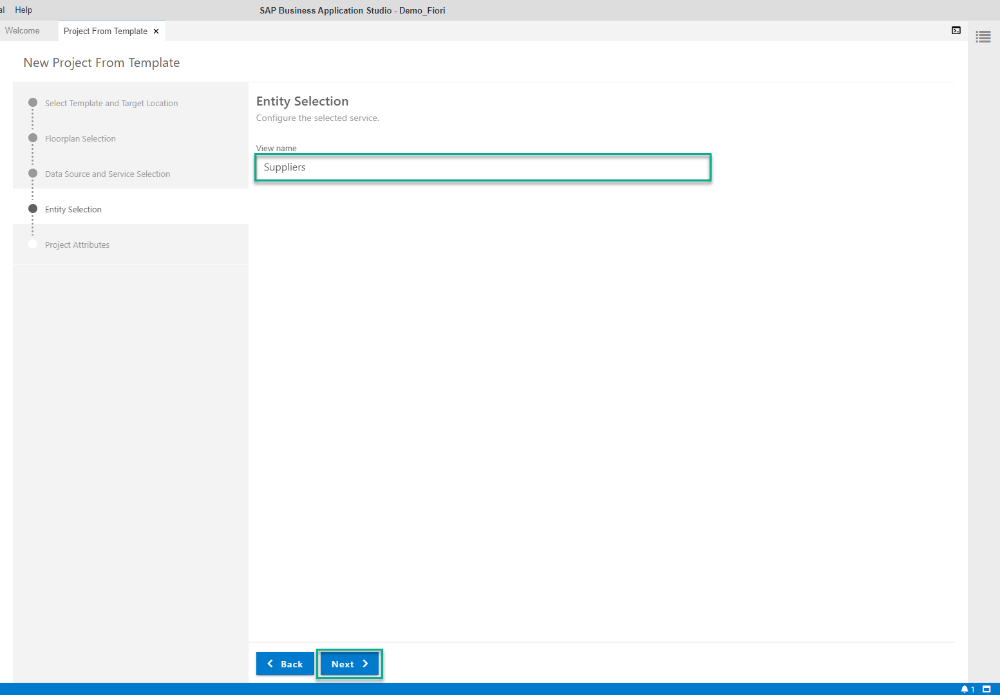

6. For **Project Attributes**, select the following, and click **Next**.

    | Step | Parameter | Value |
    |:-----|:----------|:------|
    | A | Module name | **`businesspartners`** |
    | B | Application title | **Suppliers** |
    | C | Application namespace | **ns** |
    | D | Description | **An SAPUI5 freestyle app to view a list of suppliers (demo)** |
    | E | Project folder path | **`/home/user/projects/FioriDemo`** |
    | F | Add deployment configuration | **Yes** (default after setting the project folder path)|
    | G | Add FLP configuration | **Yes** |
    | H | Configure advanced options | **No** (default) |

    !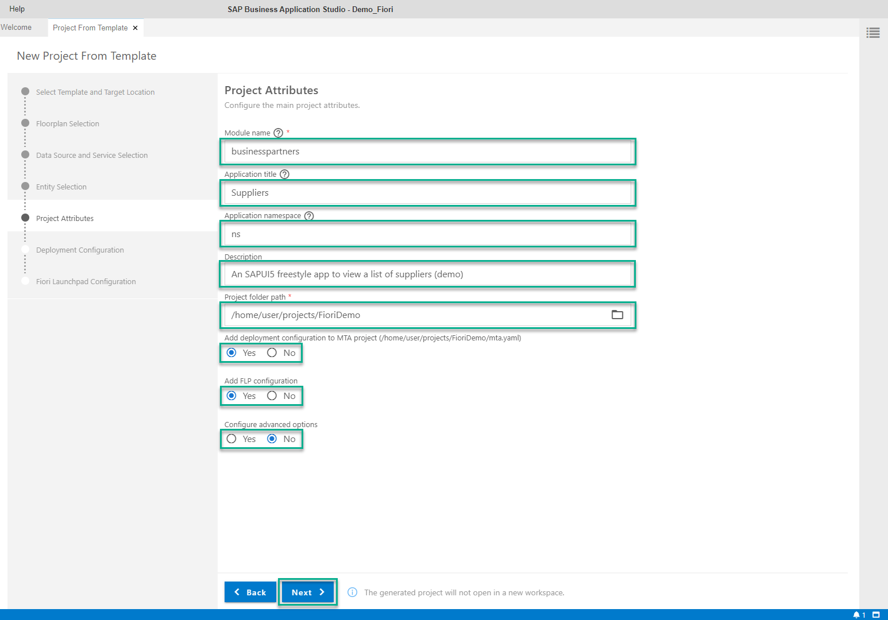

7. For **Deployment Configuration**, select the following, and click **Next**.

    | Step | Parameter | Value |
    |:-----|:----------|:------|
    | A | Please choose the target | **Cloud Foundry** (default) |
    | B | Destination name | **ES5 - https: //sapes5.sapdevcenter.com** (default) |

    !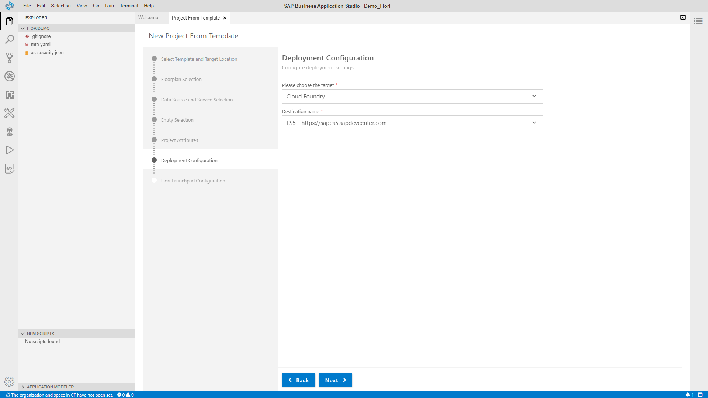

8. For **Fiori Launchpad Configuration**, select the following, and click **Finish**.

    | Step | Parameter | Value |
    |:-----|:----------|:------|
    | A | Semantic Object | **Object** |
    | B | Action | **display** |
    | B | Title | **`{{appTitle}}`** |
    | B | Subtitle (optional) | **`{{appSubTitle}}`** |

    !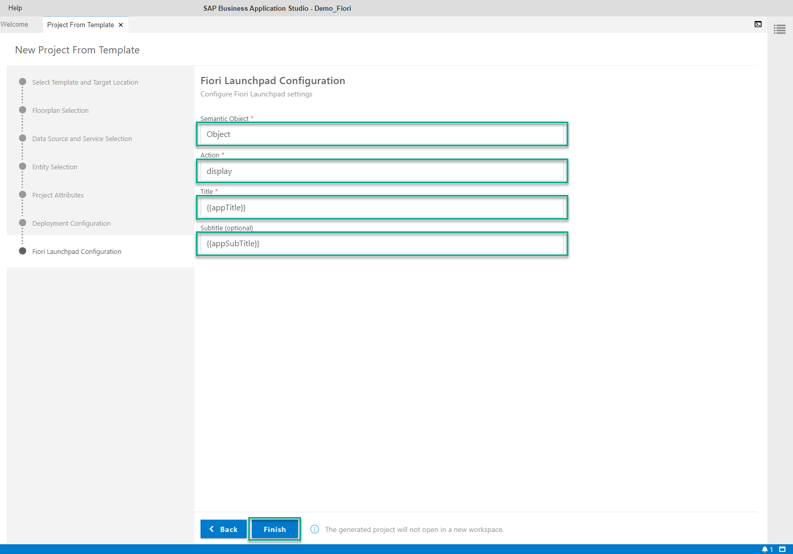

9. Wait until the installation of project dependencies is completed. A notification that "The project has been generated" appears at the bottom right of the screen and the files and project structure in the **Explorer** view are updated.

    !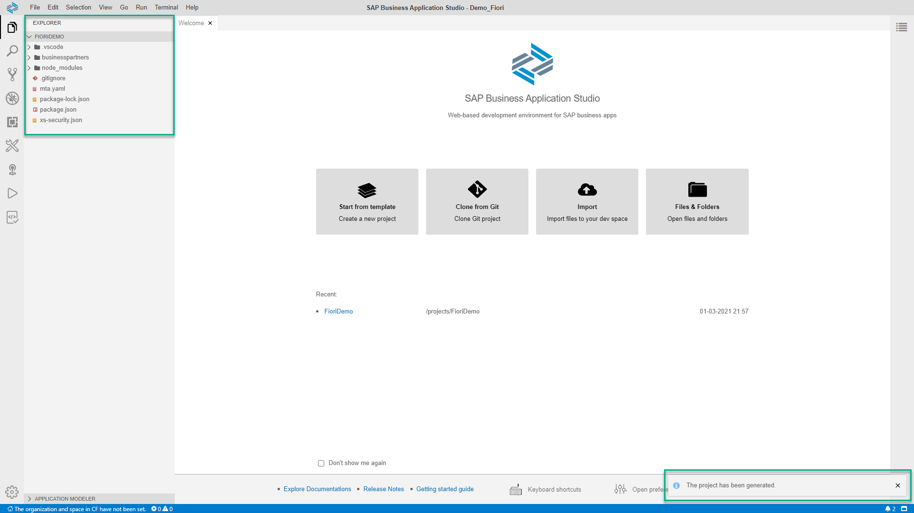

10. A glitch in the wizard that we need to fix manually: Open `businesspartners/webapp/index.html` and modify the following line:

    ```HTML[9]
    <!DOCTYPE html>
    <html>
        <head>
            <meta charset="utf-8" />
            <meta name="viewport" content="width=device-width, initial-scale=1.0" />
            <title>businesspartners</title>
            <script
                id="sap-ui-bootstrap"
                src="https://sapui5.hana.ondemand.com/resources/sap-ui-core.js"
                data-sap-ui-theme="sap_fiori_3"
                data-sap-ui-resourceroots='{"ns.businesspartners": "./"}'
                data-sap-ui-compatVersion="edge"
                data-sap-ui-oninit="module:sap/ui/core/ComponentSupport"
                data-sap-ui-async="true"
                data-sap-ui-frameOptions="trusted"
            ></script>
        </head>
        <body class="sapUiBody">
            <div
                data-sap-ui-component
                data-name="ns.businesspartners"
                data-id="container"
                data-settings='{"id" : "businesspartners"}'
            ></div>
        </body>
    </html>
    ```

    !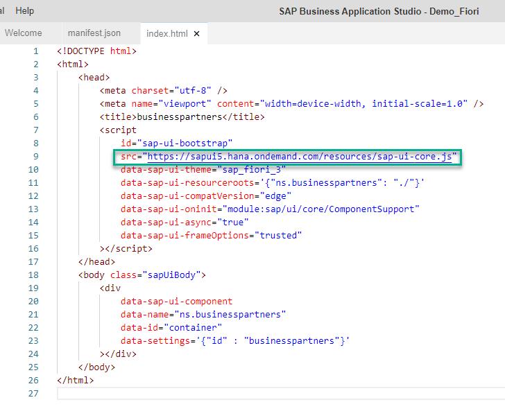


[VALIDATE_2]
[ACCORDION-END]

[ACCORDION-BEGIN [Step 4: ](Run the App Locally in the Dev Space)]

1.	Right-click any folder within the `businesspartners` folder, e.g. the **`webapp`** folder, and select **Preview Application**.

    !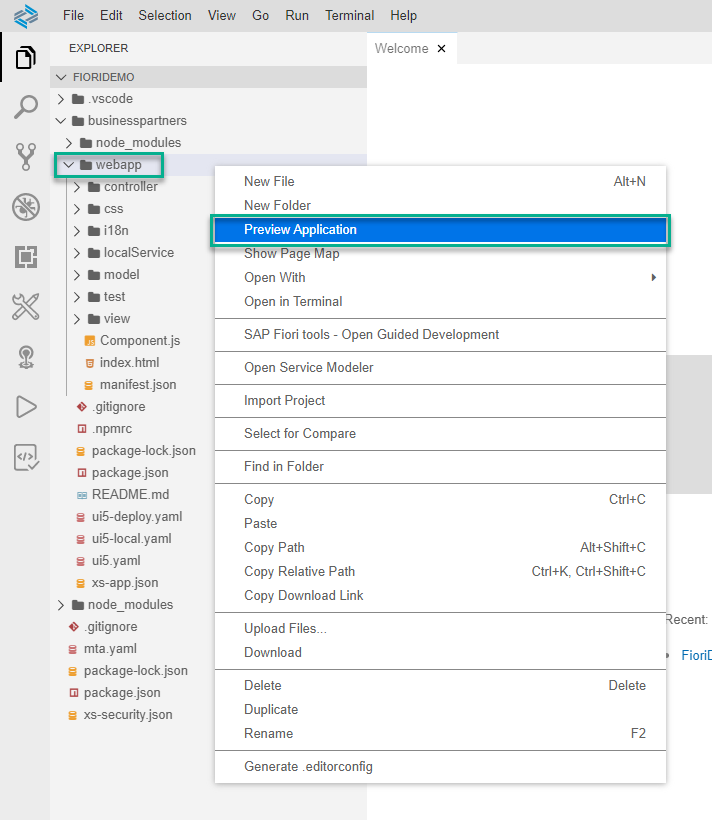

2.	The command palette opens with a list of `npm` scripts. Click **start** to run this script.

    >You may be prompted to allow pop-ups.

    >You may be prompted to open the app in a new tab.

    >A new browser tab opens showing the app.

    >If the browser tab does not open, or a notification "You have exceeded the number of ports you can expose" appears at the bottom-right of the page, you may need to un-expose ports. Select the **Ports: `Unexpose`** option in the command palette (View | Find Command) to un-expose a port that is in an **[Active]** state. Repeat this procedure until no more than two ports are in **[Active]** state, and try again.

    >A new tab opens in SAP Business Application Studio where you can see the log of the running app.

    !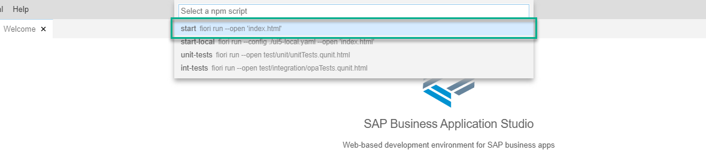

3. A new browser tab opens showing the app. In this stage of the development, the app only shows a title.

    !

[DONE]
[ACCORDION-END]


[ACCORDION-BEGIN [Step 5: ](Open the layout editor and the code editor)]

The layout editor allows users to easily make changes in the app using a visual editor. In this tutorial, you will make changes so that data from the backend service is displayed when the app is running.

1. Click **Toggle Bottom Panel** to free screen space for the editors pane.

    !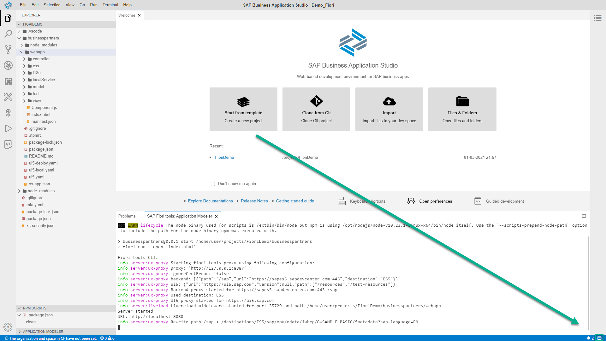

2. Choose **`FioriDemo` > `businesspartners` > `webapp` > `view`** and right-click the `Suppliers.view.xml` file that you created with the template in a previous step.

3. Choose **Open With > Layout Editor**.

    !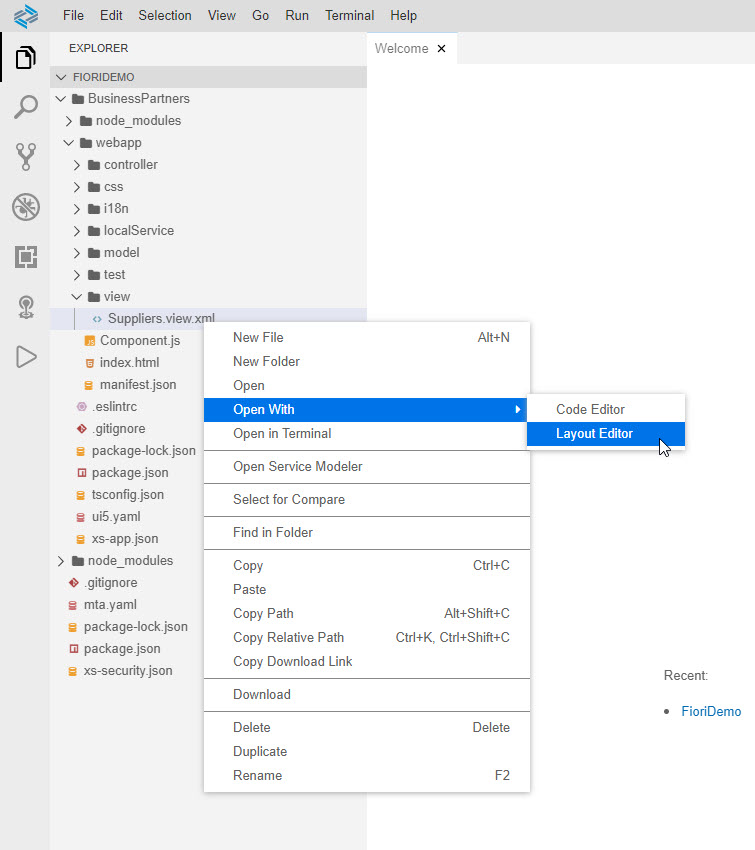

    >To have the Layout Editor option available after opening the workspace, you may need to wait a bit for the Layout Editor extension to be loaded.

4. The **Suppliers** view is opened in the **Layout Editor**.

    !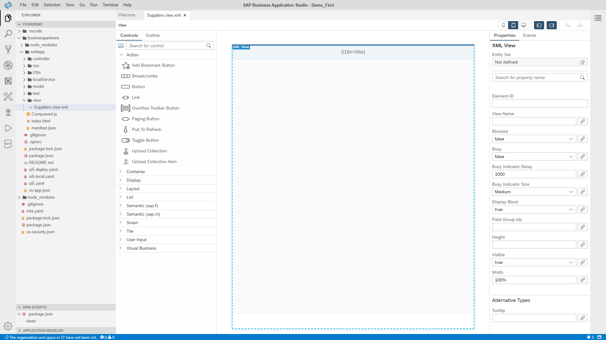

5. You can optionally choose to open it with the code editor and see how modifications in the Layout Editor are manifested in the code editor.

    !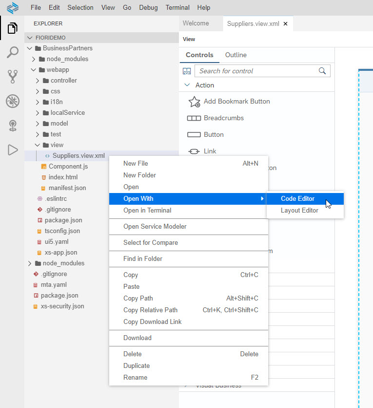

6. The **Suppliers** view is opened in the code editor in a tab next to the **Layout Editor**.

    !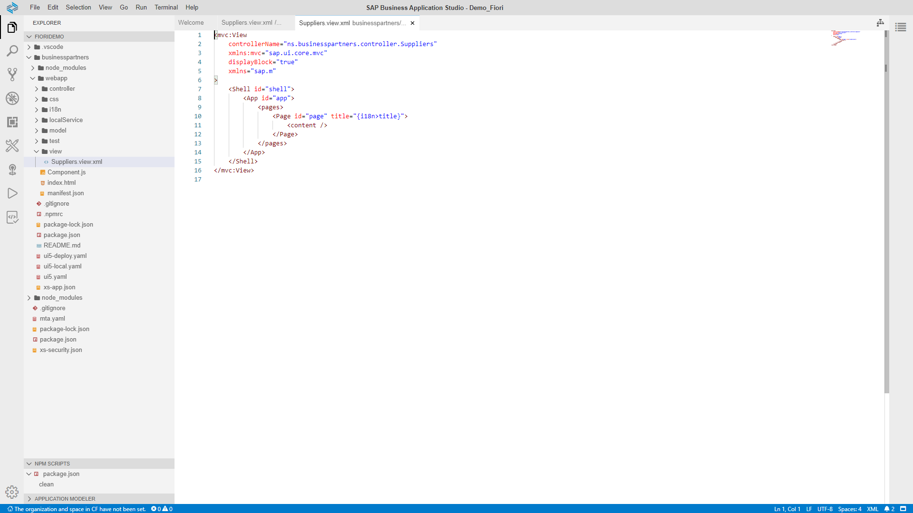

7. For convenience, place the code editor below the Layout Editor. Use the drag & drop functionality.

    !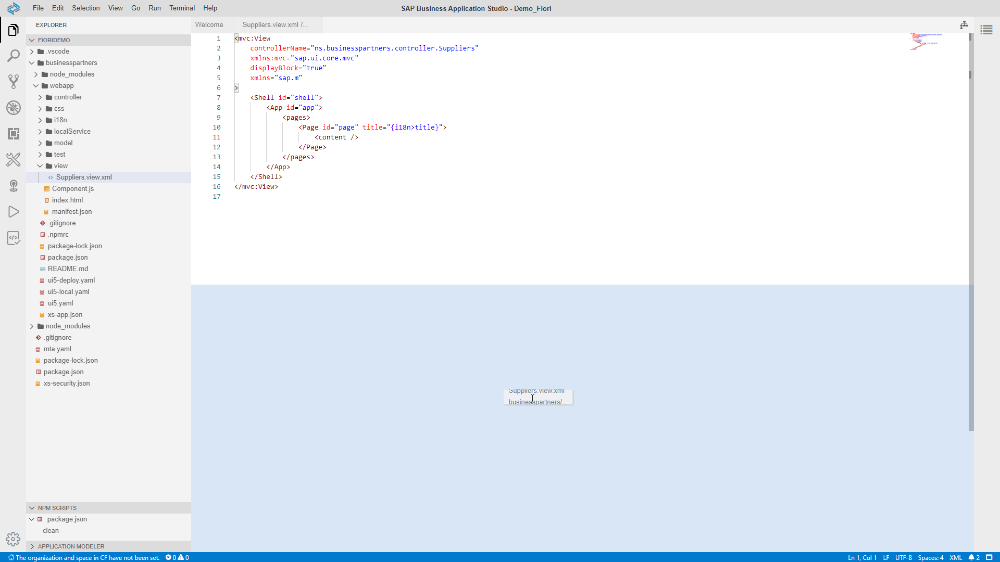

    >The **Layout Editor** and code editor are stacked so you can see how making changes to one will be reflected on the other.

    >!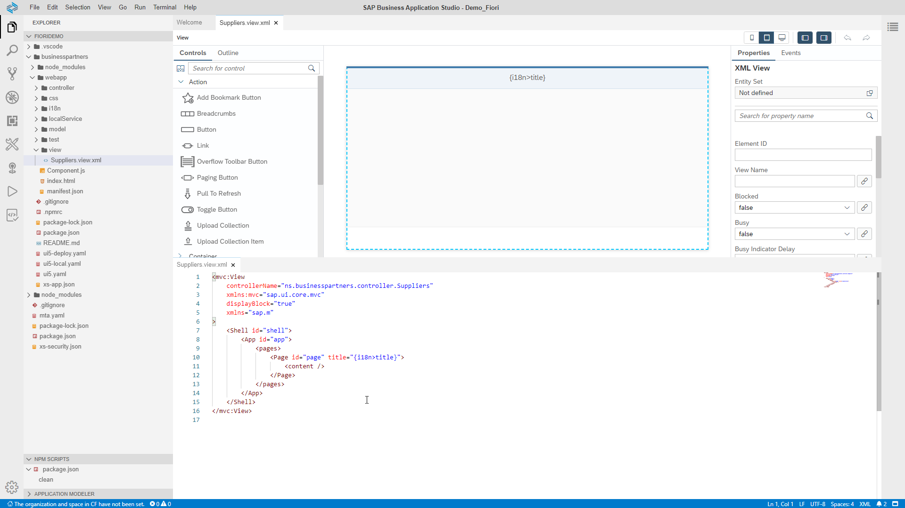

[DONE]
[ACCORDION-END]


[ACCORDION-BEGIN [Step 6: ](Make changes to the UI)]

1. Edit your app using the layout editor, with no need to do any coding.

    >Tip 1: Since auto save is enabled by default, every change to a file triggers the live reload of the app. If you place the browser where the app is running and the browser where SAP Business Application Studio is running side by side, you'll be able to see how code changes trigger the app's live reload.

    >Tip 2: To trigger live reload only when you save a file, in the menu bar, select **File | Auto Save** to toggle auto save from enable (default) to disable. A 'V' next to auto save indicates that  auto save is enabled.

2. In the **Controls** pane, enter `List` to filter the controls list in the search box.

    !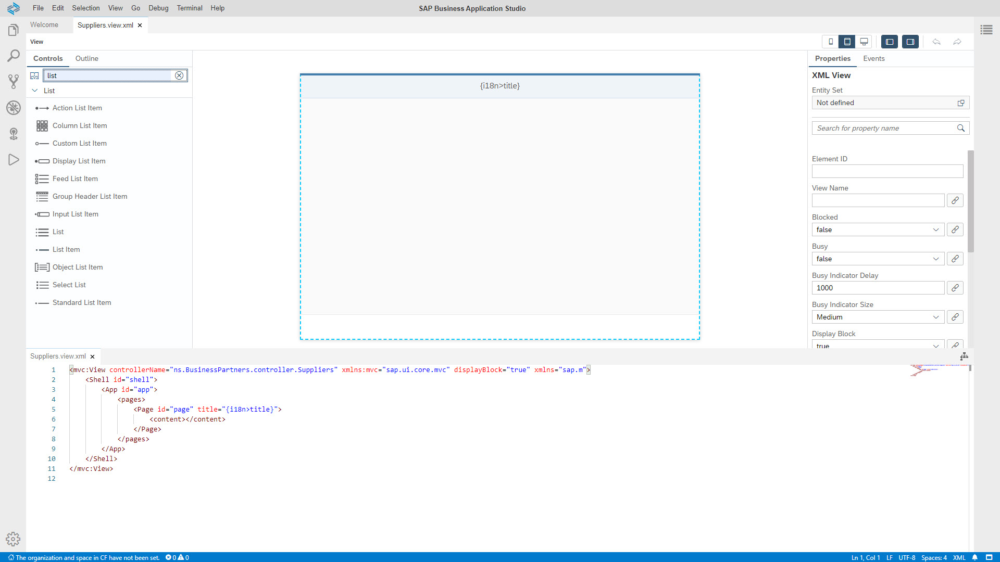

    >In order to get more screen real-estate, click the **Explorer** view button to close the `Explorer` view, and adjust the ratio between the Layout Editor and the code editor.


3. Drag the **List** control and drop it on the **View** control in the canvas.

    !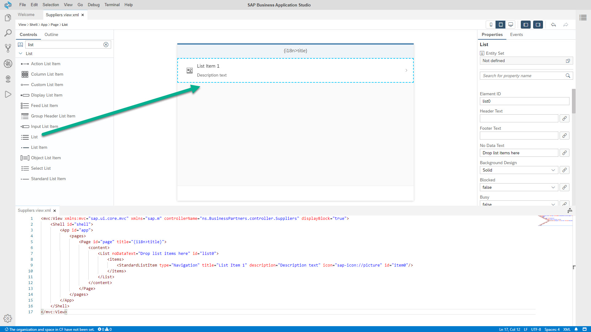

    >Adding the list control to the view is reflected in both the **Layout Editor** and the code editor.

    >!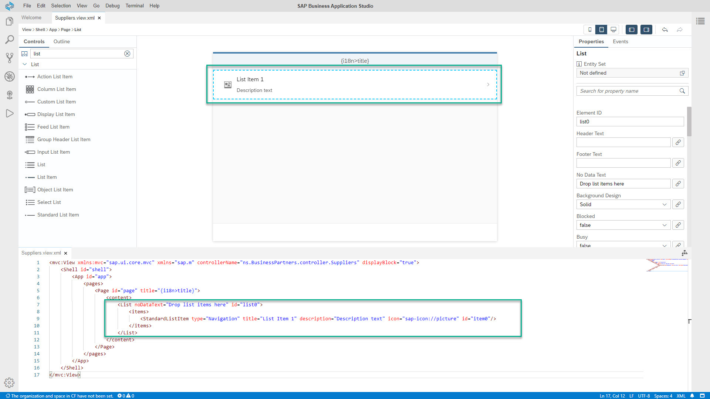

4. Select the **Standard List Item** control by clicking the **List** control you just added (the breadcrumb indicates which control is selected) and, in the **Entity Set** property in the **Properties** pane, click the Bind icon.

    !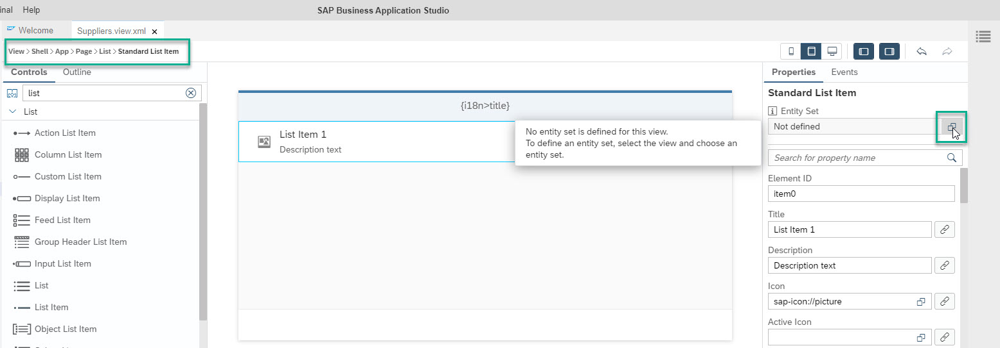

    >The **Select Entity Set** view is displayed.

5. Select the **Define entity set and set the selected control as template** option, and in the **Entity Set** dropdown list, choose the `BusinessPartnerSet` entity set. Click **Bind** to complete the operation.

    !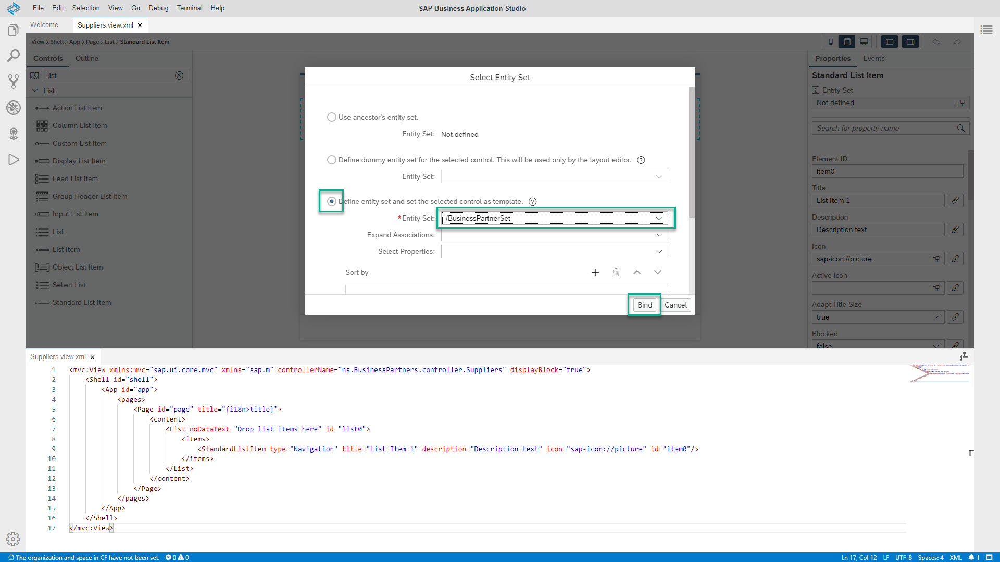

    >The space of the **Select Entity Set** view may be too narrow to show all options. In case you do not see the **Define entity set and set the selected control as template** option, scroll down in the **Select Entity Set** view to make it available.

    >The bind operation is reflected in both the **Layout Editor** and the code editor.

    >!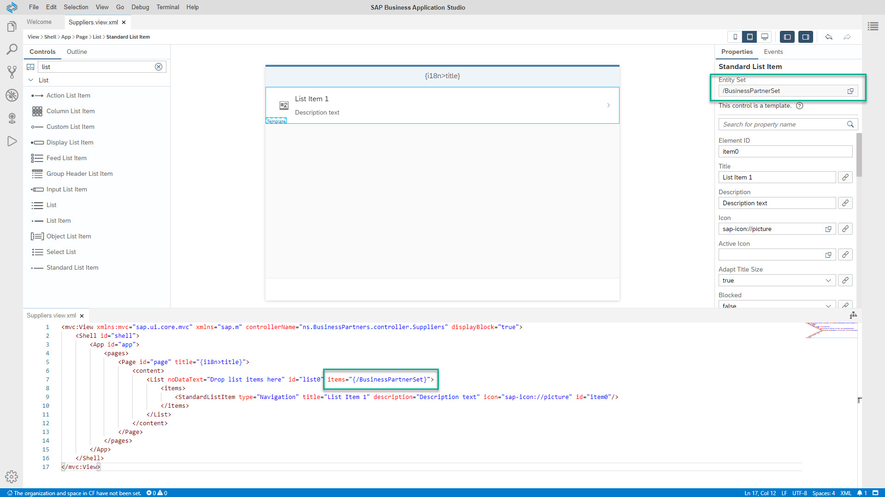

6. In the **Properties** pane, in the **Title** property, click the **Bind** icon.

    !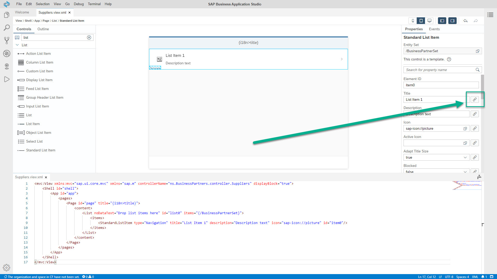

    >The **Data Binding** view is displayed.

7. Click the **Clear expression** (eraser) icon to clear the default text, and in the data fields double click  `CompanyName`. Click **Bind** to complete the operation.

    !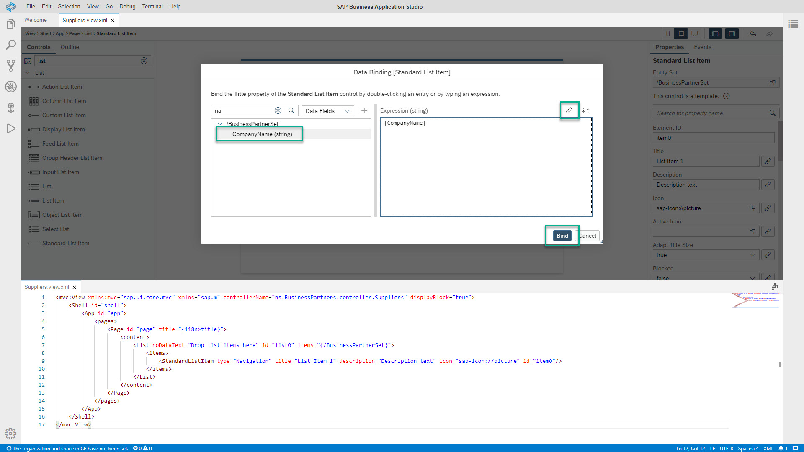

8. Repeat the last two steps for the **Description** property in the **Properties** pane. Choose  `WebAddress`.

    !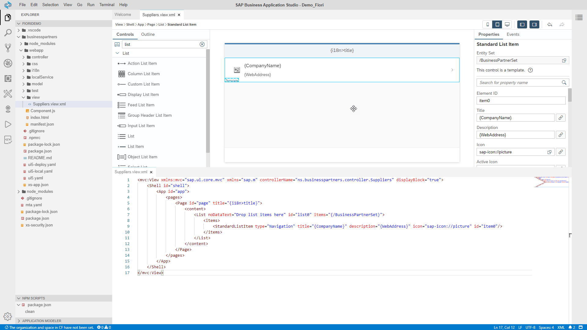

9. Wait for the live reload of the app to complete. A list of suppliers is displayed.

    !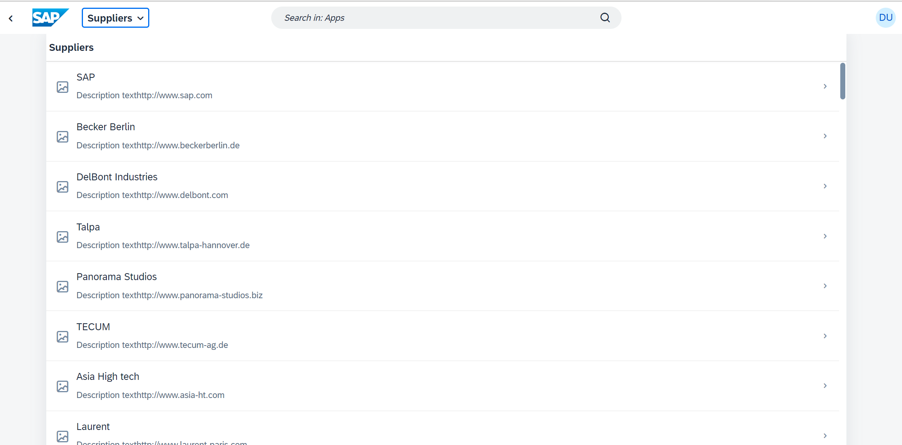

[VALIDATE_5]
[ACCORDION-END]

---

Congratulations!

With this, you have successfully completed the development of an SAP Fiori app using SAP Business Application Studio, including test-running the app locally in the dev space. In this tutorial, you learned about high productivity tools that are available out-of-the-box in SAP Business Applications Studio, such as: templates and wizards, command palette, Layout Editor, local run (Preview Application), and more.
