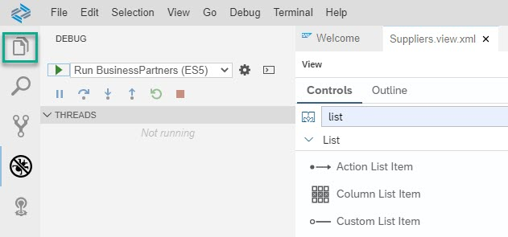
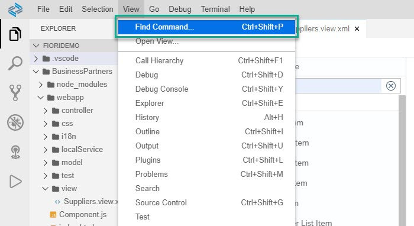
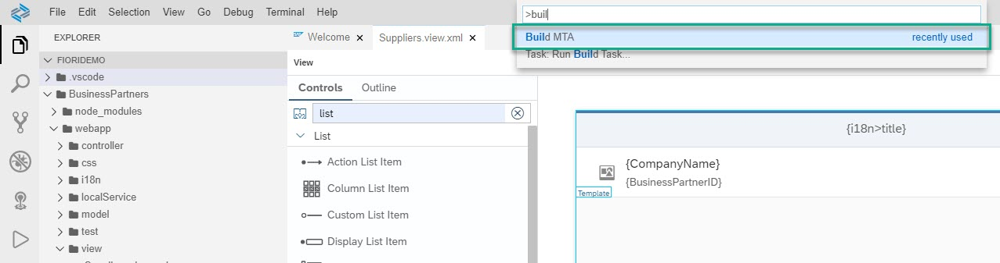
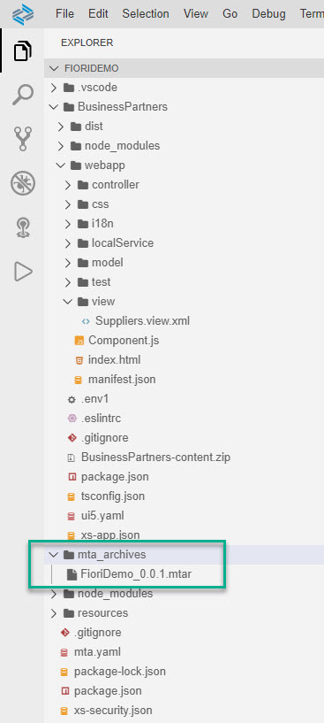
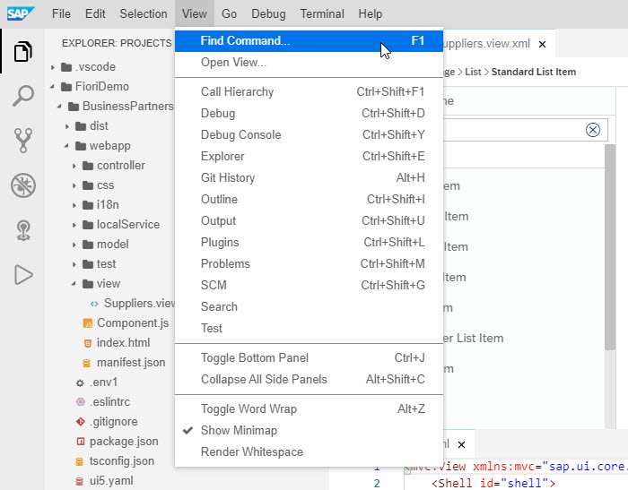
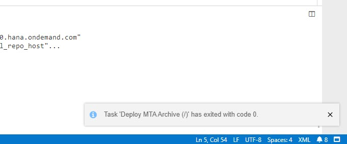
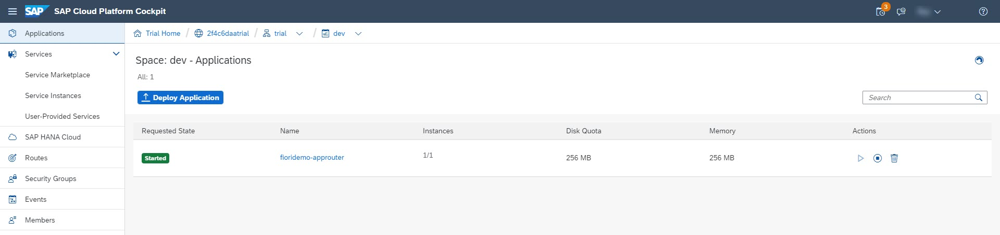

## Prerequisites
- The SAP Fiori dev space is in status `RUNNING` and you opened it.
- For the deployment step, additional prerequisites apply. You need to have the following available in the Cloud Foundry space to which you will log on (see [Add a New Entitlement to Your Subaccount](cp-cf-entitlements-add)):
    - Application Runtime: 1GB free
    - Destination: 1 free
    - HTML5 Applications: 1 free

## Details
### You will learn
  - How to build and deploy an application to SAP Cloud Platform, Cloud Foundry environment
  - How to configure Cloud Foundry settings in SAP Business Application Studio
  - How to run the deployed app from your space on SAP Cloud Platform, Cloud Foundry environment

After a period of idle time the dev space is automatically stopped. In order to re-start the dev space open the [dev space manager](https://triallink.eu10.trial.applicationstudio.cloud.sap/), click the **Play** icon, and click the dev space.

The period for idle time for Factory accounts is different than for trial accounts.

---

[ACCORDION-BEGIN [Step 1: ](Build the application)]

1. Click the **Explorer** view icon to open the **Explorer** view.

    !

2. In the menu bar, select **View | Find Command**.

    !

3. Select the command **Build MTA**.

    !

    >The build process creates a multitarget archive (`MTAR`) file in your project that packages all the project modules for deployment. You can find the `MTAR` file in the `FioriDemo/mta_archives` folder.

    !

[DONE]
[ACCORDION-END]

[ACCORDION-BEGIN [Step 2: ](Set Cloud Foundry preferences)]

Before you can deploy your new application, set your Cloud Foundry preferences.

1. In the menu bar, select **View | Find Command** to open the **command palette**.

    !

2. Select the command **CF: Login to cloud foundry**.

    >Type `cf` to filter commands.

    !

3. When prompted, provide your credentials, select the API endpoint, organization, and space for your project.

    >The Cloud Foundry organization and space appear in the status line at the bottom left part of the screen.

    !

[DONE]
[ACCORDION-END]

[ACCORDION-BEGIN [Step 3: ](Deploy the application)]

Deploy your application to SAP Cloud Platform, Cloud Foundry environment.

Right-click the `mtar` file and select **Deploy MTA Archive**.

!

>The application deployment to the space you are connected to starts and a notification appears. The deployment process takes a few minutes. You can see that the deployment is still in progress in the **Task: Deploy** console at the bottom right of your screen.

>When the deployment process is complete, a notification will temporarily appear at the bottom-right part of the screen.

>!

[DONE]
[ACCORDION-END]

[ACCORDION-BEGIN [Step 4: ](Get URL to access the application)]

This step is only applicable to apps that use **Standalone Approuter** (see [Create an SAP Fiori App Using SAP Business Application Studio](appstudio-fioriapps-create) > Create new SAP Fiori project > **HTML5 Applications**).

Access your deployed application in the SAP Cloud Platform cockpit. The steps below show you how to create a URL that you can use to access your new application.

1. Access the space to where the app is deployed and go to the **Applications** tab.

    !

2. Make sure your application is in **Started** state, and  click its name (`fioridemo_approuter`). The **`Application: fioridemo-approuter - Overview`** page opens.

3. Right-click the URL under **Application Routes** and save the URL in a text file.

    !

4. Locate the `sap.app id` from the `manifest.json` file located in your HTML5 module, and add it to the copied link after removing the periods.

    !

    > For future reference, this is the construct of the final URL: `<URL_from_application_overview_page>/<mynamespace><project_name>/index.html`.

    >Example: `https://SUBACCOUNT-SPACE-fioridemo-approuter.cfapps.eu10.hana.ondemand.com/nsBusinessPartners/index.html`

    You can use this URL in any browser to access your new application in your space on SAP Cloud Platform, Cloud Foundry environment.

[VALIDATE_10]
[ACCORDION-END]

---

Congratulations!

With this, you have successfully completed the deployment of your SAP Fiori app to SAP Cloud Platform using SAP Business Application Studio.

In this tutorial, you used high productivity tools that are available out-of-the-box in SAP Business Applications Studio that make it easy to build and deploy applications as well as work in the Cloud Foundry environment.

---
