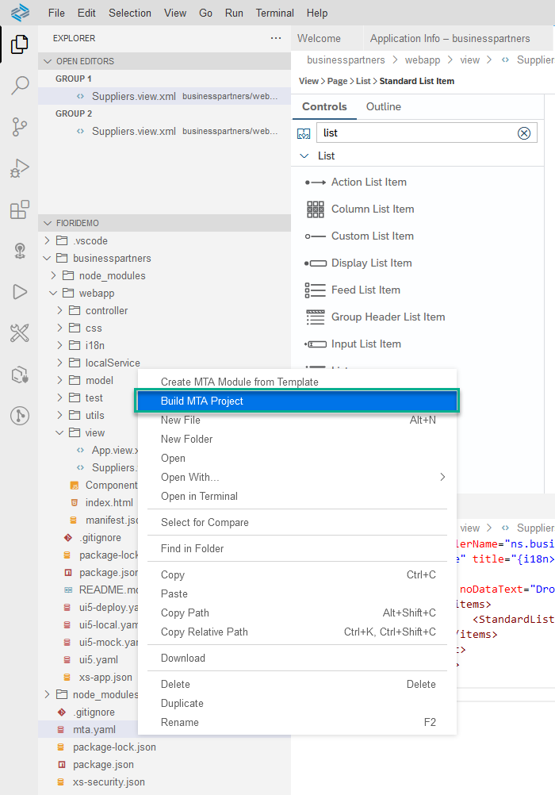
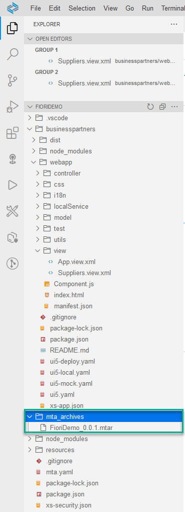
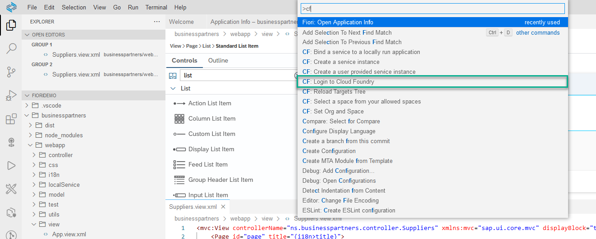
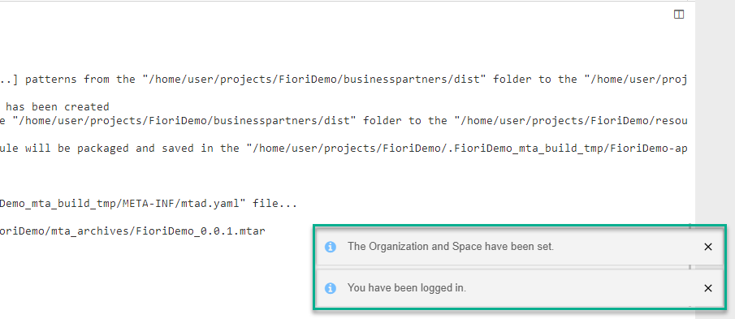
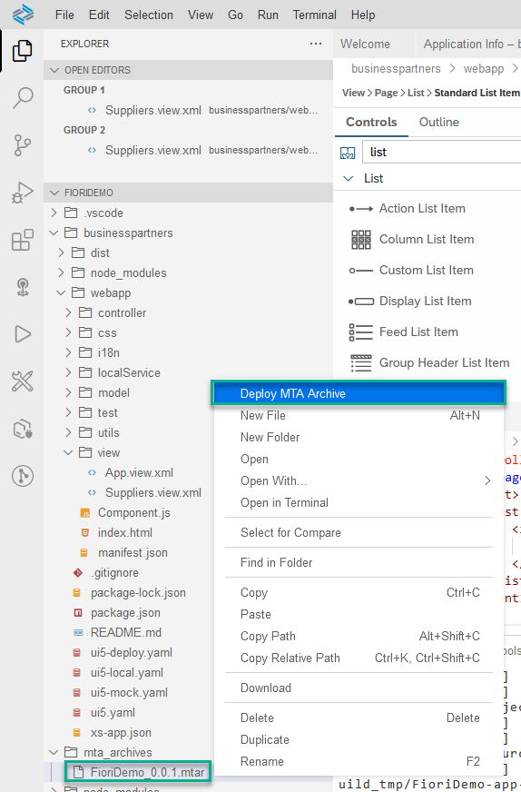

# Build and Deploy Your SAP Fiori App to SAP Business Technology Platform
<!-- description --> Build and deploy your SAP Fiori MTA project to your SAP BTP, Cloud Foundry environment.

## Prerequisites
- The SAP Fiori dev space is in status `RUNNING` and you opened it.
- You completed [Create an SAP Fiori App Using SAP Business Application Studio](appstudio-fioriapps-create).
- For the deployment step, additional prerequisites apply. You need to have the following available in the Cloud Foundry space to which you will log on (see [Add a New Entitlement to Your Subaccount](cp-cf-entitlements-add)):
    - Cloud Foundry Runtime: 1GB free
    - Destination: 1 free
    - HTML5 Applications: 1 free

## You will learn
  - How to build and deploy an application to SAP BTP, Cloud Foundry environment
  - How to configure Cloud Foundry settings in SAP Business Application Studio
  - How to run the deployed app from your space on SAP BTP, Cloud Foundry environment

## Intro
After a period of idle time the dev space is automatically stopped. In order to re-start the dev space open the [dev space manager](https://triallink.eu10.trial.applicationstudio.cloud.sap/), click the **Play** icon, and click the dev space.

The period for idle time for Factory accounts is different than for trial accounts.

---

### Build the application

1. In the **Explorer** pane, right-click the `mta.yaml` file and select **Build MTA Project**.

      <!-- border -->

    >The build process creates a multi-target archive (`MTAR`) file in your project that packages all the project modules for deployment. You can find the `MTAR` file in the `FioriDemo/mta_archives` folder.

    <!-- border -->

### Set Cloud Foundry preferences

If you are not logged in to a Cloud Foundry space - Before you can deploy your new application, set your Cloud Foundry preferences.

1. In the left side bar, select the **Hamburger icon | View | Command Palette…** to open the **command palette**.

    <!-- border -->    

2. Select the command **CF: Login to cloud foundry**.

    >Type `cf` to filter commands.

    <!-- border -->

3. A **Cloud Foundry Sign In** tab opens in SAP Business Application Studio. Select the API endpoint, provide your credentials (email and password), and click **Sign in**. If you don't know your API endpoint open the SAP Business Technology Platform Cockpit and navigate to your subaccount. Click on Overview on the left and you can see the URL of the API endpoint under "Cloud Foundry Environment".

    <!-- border -->

4. Select the Cloud Foundry organization, Cloud Foundry space, and click **Apply**.

    If the Cloud Foundry Target dropdowns are empty you need to change the default Cloud Foundry Endpoint to the one of your subaccount (see previous step). To obtain your subaccount’s Cloud Foundry Endpoint open the SAP Business Technology Platform Cockpit and navigate to your subaccount. Click on Overview on the left and you can see the URL of the API endpoint under “Cloud Foundry Environment”.

    <!-- border -->

    >**You have been logged in.** notification appears at the bottom-right of your screen.

    ><!-- border -->

### Deploy the application

Deploy your application to SAP BTP, Cloud Foundry environment.

1. In the **Explorer** pane under the folder `mta_archives`, right-click the `mtar` file and select **Deploy MTA Archive**.

    <!-- border -->

    >The application deployment to the space you are connected to starts and a notification appears. You can follow the deployment progress in the **Task: Deploy** console at the bottom of your screen.

3. Wait for the deployment to complete.

    >The deployment process takes a few minutes. When the deployment process is complete, the notifications **Process finished.** and **Terminal will be reused by tasks.** will appear at the bottom of the **Task: Deploy** console.

    ><!-- border -->

    If you have issues with the deployment, check out the [SAP Business Application Guided Answers](https://ga.support.sap.com/dtp/viewer/index.html#/tree/2827/actions/41344) for troubleshooting.

### Open the application

1. Go back to your SAP BTP Trial account and click the button **Go To Your Trial Account**. 

<!-- border -->

2. Click the trial tile to navigate to your trial subaccount in the SAP BTP cockpit. 

<!-- border -->

3. Select **HTML5 Applications** in the left navigation panel.

<!-- border -->

4. You will see a list of all HTML5 Application you deployed up to now. Select the one you deployed in the previous step.

<!-- border -->

---

Congratulations!

With this, you have successfully completed the deployment of your SAP Fiori app to SAP BTP using SAP Business Application Studio.

In this tutorial, you used high productivity tools that are available out-of-the-box in SAP Business Applications Studio that make it easy to build and deploy applications as well as work in the Cloud Foundry environment.

---
