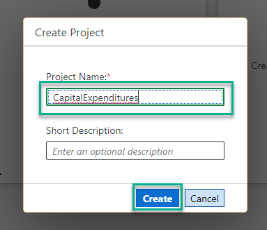
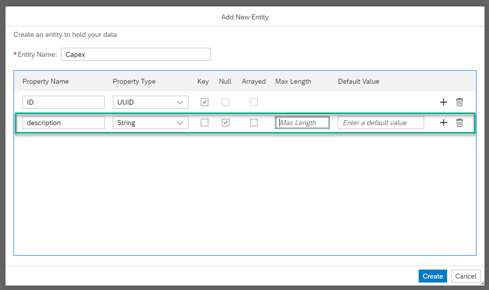
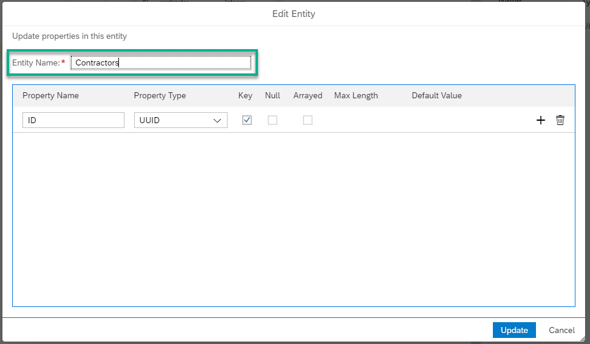
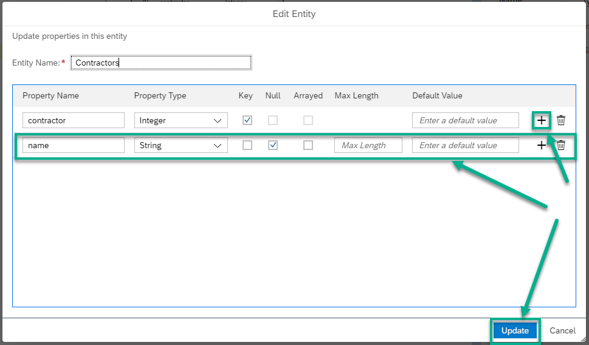
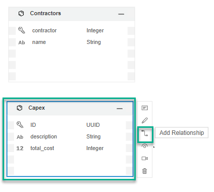
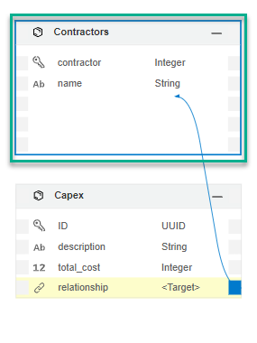
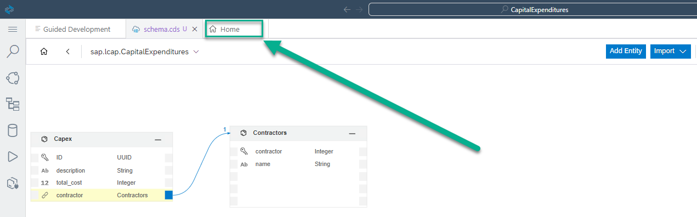
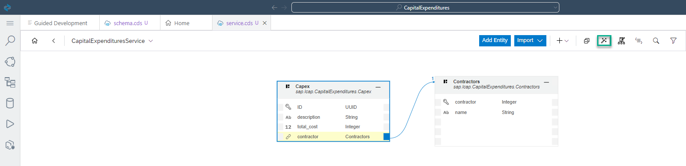
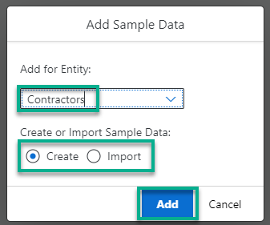
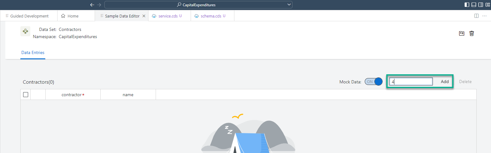

# Create a Data Model and Expose It as a Service
<!-- description --> Create a capital expenditures data model and expose it via a service, using the high productivity development capabilities of SAP Business Application Studio.

## Prerequisites
 - You have access to SAP Business Application Studio and created a dev space for developing apps using high productivity tools, as described in [Set Up SAP Business Application Studio for App Development in the Trial Environment](appstudio-lcap-onboarding-trial).

## You will learn
- How to create a project from scratch
- How to create a data model for your application
- How to expose the data using a service so that you'll be able to use it in your apps
- How to add sample data
- How to preview the service definition
- How to view the data before creating apps

---

### Create a project

1. Enter the **Dev Space** you created in [Set Up SAP Business Application Studio for App Development in the Trial Environment](appstudio-lcap-onboarding-trial). 

2. Wait for the "We have finished installing all tools and templates for you, enjoy your work!" notification.

    >Loading SAP Business Application Studio may take some time, especially if it's the first time in a day.

    <!-- border -->

    >Close the notification icon at the bottom of the screen (optional).

3. If no project exists in your dev space you have to create a new project. To do so open the **Project Explorer**.

    <!-- border -->

4. From the Project Explorer select the button **Create Project**.

    <!-- border -->

5. On the right side a new page opens. Select **Generator Full-Stack Project (Productivity Toolkit)** and press the button **Start**.

    <!-- border -->

6. Enter the **Project Name**, for example, `CapitalExpenditures`, and click **Finish**.

    <!-- border -->

7. If a project already exists in your dev space, you can create an additional project by selecting the **+** button in the **Project Explorer**.

    <!-- border -->

### Model your data - Entities

1. To open the storyboard tab please select the **Project Explorer** from the menu on the left.

    <!-- border -->

2. From the Project Explorer select the entry **Storyboard**.

    <!-- border -->

3. From the storyboard, click the **+** of the **Data Models** tile to add a data model to your project.

    <!-- border -->

4. The new entity is shown in the _schema.cds_ tab. Change the **Entity Name** in the header of the entitiy to a new name, for example, **`Capex`**.

    <!-- border -->

5. Choose the **Show Details** icon, to be able to add properties to the **`Capex`** entity.

    <!-- border -->

    A new menu opens on the right side of the screen.

6. Choose the + icon in the properties table and select the following:

    | Step | Parameter | Value |
    |:-----|:----------|:------|
    | A | Name | **description** |
    | B | Type | **String** (default) |
    | C | Length | Leave empty |
    | D | Default | Leave empty (default) |
    | E | Key | Leave unchecked (default) |
    | F | Null | **Yes** (default) |

    <!-- border -->

7. Add the following property (click **+**). When done with adding the properties choose **Save**.

    | Step | Parameter | Value |
    |:-----|:----------|:------|
    | A | Name | **total_cost** |
    | B | Type | **Integer** |
    | C | Default | Leave empty (default) |
    | D | Key | Leave unchecked (default) |
    | E | Null | **Yes** (default) |

    <!-- border -->

    The **`Capex`** entity appears in the _schema.cds_ tab with a default **ID** property.

    <!-- border -->

8. To add another data model to your project click the `Add Entity` button in the _schema.cds_ tab.

    <!-- border -->

    Drop the new entity somewhere on the screen.  

9. Change the **Entity Name** in the header of the entitiy to a new name, for example, **Contractors**.

    <!-- border -->

10. In the _Properties_ menu on the right side of the screen, change the **Name** of the **ID** property to **contractor**, and its **Type** to **Integer**.

    <!-- border -->

11. Add the following property to the **Contractors** entity, and **save** your changes**.

    | Step | Parameter | Value |
    |:-----|:----------|:------|
    | A | Name | **name** |
    | B | Type | **String** (default) |
    | C | Length | Leave empty |
    | D | Default | Leave empty (default) |
    | E | Key | Leave unchecked (default) |
    | F | Null | **Yes** (default) |

    <!-- border -->

    The **Contractors** entity appears in the _schema.cds_ tab.

### Model your data - Relationship between entities

1. With relationships you can connect your entities. To do so, select the **`Capex`** entity, choose the **Add Relationship** icon, and select the **Contractors** entity to add a relationship to the **Contractors** entity.

    <!-- border -->    

    <!-- border -->

2. In the **New Relationship** menu, select the following, and choose **Save**.

    | Step | Parameter | Value |
    |:-----|:----------|:------|
    | A | Type| **Association** (default) |
    | B | Direction | **Unidirectional** |
    | C | Key Property | **No** (default) |
    | D | Multiplicity | **To-One** (default) |
    | E | Name | **contractor** |
    | F | Target Entity | **Contractors** (default) |
    | G | Backlink Property | Leave empty (default) |

    <!-- border -->

3. You can re-arrange the entities on the canvas by clicking the **Auto Layout** icon to improve the data model visualization. In addition, you can also manually drag the entities over the canvas.

    <!-- border -->

### Expose your data

1. Access the **Storyboard** tab.

    <!-- border -->

2. Click the **+** of the **Services** tile to add a service through which data from the data model can be accessed.

    <!-- border -->

    A pop-up opens.

3. Select **CapitalExpenditures.Capex** as _Projection Type_, make sure Enable Draft editing is selected and choose **OK**.

    <!-- border -->

    The **`Capex`** service appears in the _service.cds_ tab.

4. To add another new service to your project click the `Add Entity` button in the **Service Editor** tab and place the new entity somewhere on the screen. A pop-up opens. 

    <!-- border -->

    Select **CapitalExpenditures.Contractors** as _Projection Type_, make sure Enable Draft editing is NOT selected  and choose **OK**.

    <!-- border -->

    The **Contractors** service is added to the _service.cds_ tab.

    <!-- border -->

5. In the screen **service.cds**, select the entry _Hide/Show Property Sheet_ in the upper right part of the screen to be able to see the property sheet of an entity.

    <!-- border -->

6. Find the `Capex` entity on the screen _service.cds_ and click on the header. A menu will appear on the right side of the screen. In the tab **settings**, check the checkbox for _Draft Editing_ and save your settings.

    >A draft is an interim version of a business entity that has not yet been explicitly saved as an active version. This allows users to pause, for example when being interrupted, and continue later on. For more information visit [SAP Fiori Design Guidelines - Draft Handling](https://experience.sap.com/fiori-design-web/draft-handling/).

    <!-- border -->

7. You can re-arrange the entities on the canvas by clicking the **Auto Layout** icon to improve the service visualization. In addition, you can also manually drag the entities over the canvas.

    <!-- border -->

8. Access the **Storyboard** tab. You can see that both the services are added to the **Services** tile.

    <!-- border -->

### Preview your data service

It is a common practice in software development to test run any change to an app as soon as possible. Prior to having the services defined, you were not able to test the app. Since now you have defined the services, you can test them.

1. Choose the **Run and Debug** option from the top right to preview your data. 

  
    <!-- border -->

2. The project preview page appears in a new tab with the links which allow you to test the service definition, access data exposed by the service, and more.

    <!-- border -->

3. In the preview page on the right side under **Services** choose the **metadata** link to view the service's XML. Close the XML file.

    <!-- border -->

4. Also in the preview page on the right side under **Services** select the button **view as code** next to **`Capex`** or **Contractors**  to view the data from the respective service.

    <!-- border -->

    >Here, the **value** appears as an empty list since the data model is empty.

### Add sample data and preview it

To test that the service works well, that is, returns data when it is available in the data model, let's add sample data to your project. Sample data is a powerful tool as it allows you to (1) develop an app with no connectivity to a data source; (2) Debug your app.

1. Go back to the browser tab with SAP Business Application Studio, and click on **Data Model** entity **Contractors** and select **Set Sample Data**.

    <!-- border -->

2. Select **Contractors**, select **Create**, and press **Add**.

    <!-- border -->

3. In the sample data editor add 4 rows.

    <!-- border -->

4. Update the sample data as follows:

    <!-- border -->

5. Access the **Storyboard** tab, and click on **Data Model** entity **Capex** and select **Set Sample Data**.

    <!-- border -->

6. Select **`Capex`**, select **Create**, and press **Add**.

    <!-- border -->

7. In the sample data editor add 3 rows, and update the **DESCRIPTION** and **CONTRACTOR** columns as follows:

    <!-- border -->

8. Access the **Storyboard** tab.

    <!-- border -->

9. Go back to the **project preview** browser tab, and select the button **view as code** next to **`Capex`** or **Contractors**. You can view the sample data you have added.

    <!-- border -->

---
