## Prerequisites
 - You have access to your Application Development Lobby.

## Details
### You will learn
- How to create a project from scratch from the Application Development Lobby
- How to create a data model for your application
- How to expose the data using a service so that you'll be able to use it in your apps
- How to add sample data
- How to preview the service definition
- How to view the data before creating apps

---

[ACCORDION-BEGIN [Step 1: ](Create a project)]

1. Projects are created from the Application Development Lobby. You can access the Lobby using its bookmark (if you saved it) or from the SAP BTP cockpit: Select the subaccount you created using the [Set Up SAP Business Application Studio for Low-Code Development](appstudio-onboarding) tutorial, expand **Services**, click **Instances and Subscriptions**, and choose **SAP AppGyver**.

2. Within the Application Development Lobby, click **Create** and select **Business Application**.

    !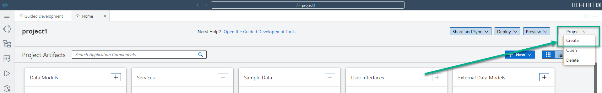

2. Provide a **Project Name**, e.g. `CapitalExpenditures`, and click **Create**.

    !

3. Wait for the homepage of SAP Business Application Studio for low-code development to load.

    >Loading SAP Business Application Studio for low-code development may take some time, especially if it's the first time in a day.

    !

    >Close the notification icon at the bottom of the screen (optional).

[DONE]
[ACCORDION-END]

[ACCORDION-BEGIN [Step 2: ](Model your data: Entities)]

1. From the homepage, click the **+** of the Data Model tile to add a data model to your project.

    !

2. Provide an **Entity Name** for the entity e.g. **`Capex`**, and choose **Create**.

    !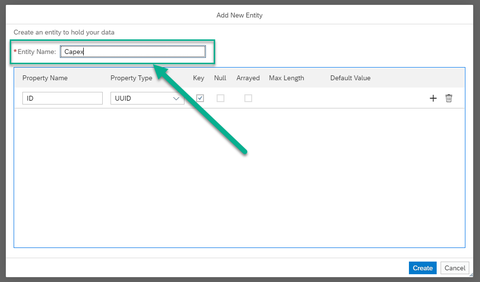

3. Click the **+** to add a property to the **`Capex`** entity.

    !

4. Select the following:

    | Step | Parameter | Value |
    |:-----|:----------|:------|
    | A | Property Name | **description** |
    | B | Property Type | **String** (default) |
    | C | Key Property | Leave unchecked (default) |
    | D | Null Value | **Yes** (default) |
    | E | Many | Leave unchecked (default) |
    | F | Other Facets (Max Length) | Leave empty (default) |

    !

5. Add the following property (click **+**), and choose **Create**.

    | Step | Parameter | Value |
    |:-----|:----------|:------|
    | A | Property Name | **`total_cost`** |
    | B | Property Type | **Integer** |
    | C | Key Property | Leave unchecked (default) |
    | D | Max Length | Leave empty (default) |
    | E | Null Value | **Yes** (default) |
    | F | Many | Leave unchecked (default) |

    !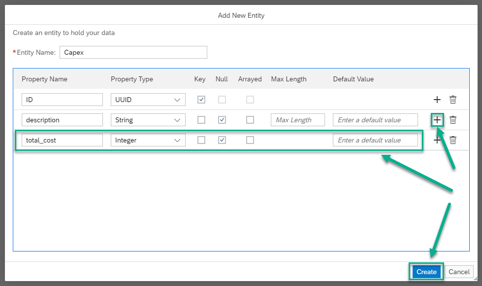

    The **`Capex`** entity appears in the **Data Model Editor** tab with a default **ID** property.

    >To edit an entity, click the entity's header and choose the **Edit Entity** icon.

    >!

6. Access the **Home** tab.

    !

7. Click the **+** of the Data Model tile to add a data model to your project.

    !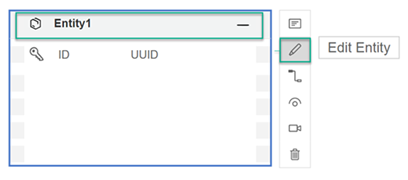

8. Provide an **Entity Name** for the entity e.g. **Contractors**.

    !

9. Change the **Property Name** of the **ID** property to **contractor**, and its **Property Type** to **Integer**.

    !

10. Add the following property to the **Contractors** entity, and choose **Create**.

    | Step | Parameter | Value |
    |:-----|:----------|:------|
    | A | Property Name | **name** |
    | B | Property Type | **String** (default) |
    | C | Key Property | Leave unchecked (default) |
    | D | Null Value | **Yes** (default) |
    | E | Many | Leave unchecked (default) |
    | F | Other Facets (Max Length) | Leave empty (default) |

    !

    The **Contractors** entity appears in the **Data Model Editor**.

[DONE]
[ACCORDION-END]


[ACCORDION-BEGIN [Step 3: ](Model your data: Relationship between entities)]

1. Select the **`Capex`** entity, and choose the **Add Relationship** icon to add a relationship to the **Contractors** entity.

    !

2. Select the following, and choose **Create**.

    | Step | Parameter | Value |
    |:-----|:----------|:------|
    | A | Relationship | **Association** (default) |
    | B | Relationship Type | **To-One** (default) |
    | C | Property Name | **contractor** |
    | D | Target Entity Type | **CapitaExpenditures.Contractors** (default) |
    | E | Backlink Property | Leave empty (default) |

    !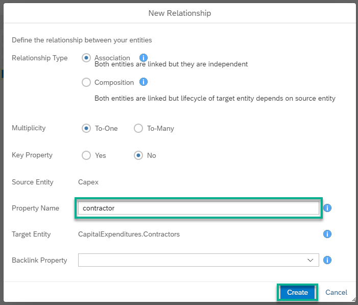

3. You can re-arrange the entities on the canvas manually or by clicking the **Auto Layout** icon to improve the data model visualization.

    !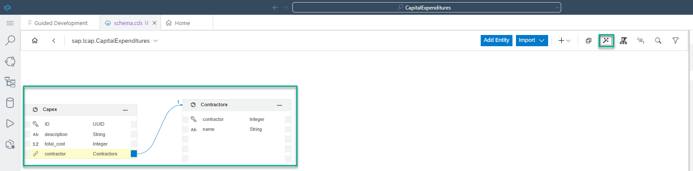

[DONE]
[ACCORDION-END]


[ACCORDION-BEGIN [Step 3: ](Expose your data)]

1. Access the **Home** tab.

    !

2. Click the **+** of the **Service** tile to add a service through which data from the data model can be accessed.

    !

3. Define the following for your new service, and choose **Create**.

    | Step | Parameter | Value |
    |:-----|:----------|:------|
    | A | Name | **`Capex`** |
    | B | Namespace | **`CapitalExpendituresService`** (default) |
    | C | Type | **`CapitalExpenditures.Capex`** |
    | D | &lt;all properties> | Leave checked (default) |
    | E | ID | Leave checked (default) |
    | F | description | Leave checked (default) |
    | G | `total_cost` | Leave checked (default) |
    | H | contractor | Leave checked (default) |

    !

    The **`Capex`** service appears in the **Service Editor** tab.

4. Access the **Home** tab, and define the following new service.

    | Step | Parameter | Value |
    |:-----|:----------|:------|
    | A | Name | **Contractors** |
    | B | Namespace | **`CapitalExpendituresService`** (default) |
    | C | Type | **`CapitalExpenditures.Contracotrs`** |
    | D | &lt;all properties> | Leave checked (default) |
    | E | contractor | Leave checked (default) |
    | F | name | Leave checked (default) |

    !

    The **Contractors** service is added to the **Service Editor**, with association to the **`Capex`** service.

    !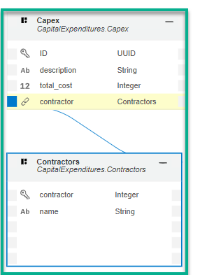

5. Select the **`Capex`** service (Which gets highlighted with a blue rectangle indication), and check the **Draft Editing** property.

    !

6. You can re-arrange the entities on the canvas manually or by clicking the **Auto Layout** icon to improve the service visualization.

    !

7. Access the **Home** tab. You can see that both the services are added to the **Service** tile.

    !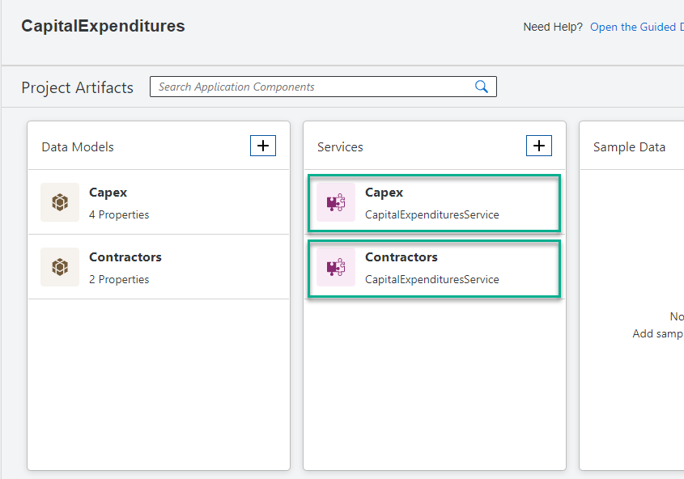

[VALIDATE_1]
[ACCORDION-END]

[ACCORDION-BEGIN [Step 4: ](Preview your data)]
It is a common practice in software development to test run any change to an app as soon as possible. Prior to having the services defined, you were not able to test the app. Since now you have defined the services, you can test them.

1. Choose the **Preview** option from the homepage.

    !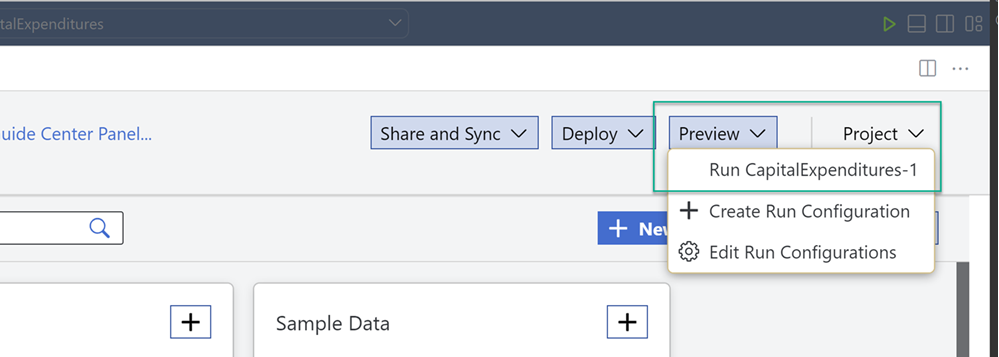

2. A new tab appears with the links which allow you to test the service definition, access data exposed by the service, and more.

    !

3. Choose the **$metadata** to view the service's XML.

    !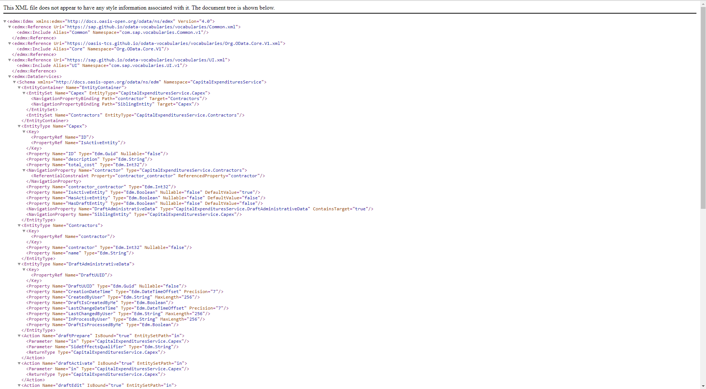

4. Choose the browser's **Back** button, and select the **`Capex`** or the **Contractors** links to view the data from the respective service.

    !

    >Here, the **value** appears as an empty list since the data model is empty.

[DONE]
[ACCORDION-END]

[ACCORDION-BEGIN [Step 5: ](Add sample data and preview it)]
To test that the service works well, i.e. returns data when it is available in the data model, let's add sample data to your project. Sample data is a powerful tool as it allows you to (1) develop an app with no connectivity to a data source; (2) Debug your app.

1. Go back to the browser tab with SAP Business Application Studio for low-code development, and click the **+** of the **Sample Data** tile.

    !

2. Choose **Create**, select **contractors**, and choose **Create**.

    !

3. Add the sample data, e.g.

    ```csv
    CONTRACTOR;NAME
    1;SAP
    2;Backer Berlin
    3;Pear Computing Services
    4;C.R.T.U.
    ```

    !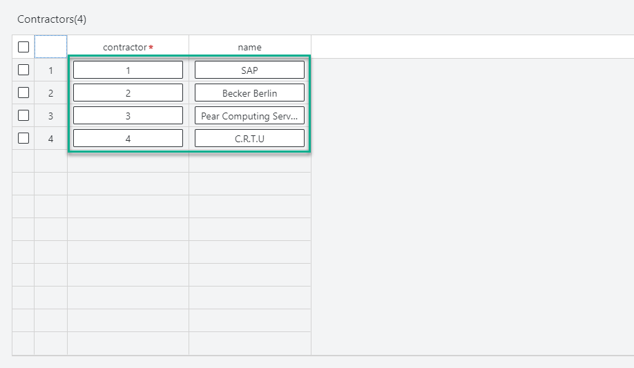

4. Repeat steps 1 - 3 for the **`Capex`** data model. Add the following sample data:

    ```csv
    ID;DESCRIPTION;TOTAL_COST;CONTRACTOR_CONTRACTOR
    7bef2fdf-9b31-4e24-994a-81bb2c28c828;Solar panel connectors;384;4
    3e6ad791-d531-4547-b4ad-f546a3dcfe14;Laptop maintenance;12645;3
    7e7e667e-f52b-4aaa-8d8c-823d1d69f5f3;Bicycles;1723;2
    ```

5. Access the **Home** tab. You can see that the sample data is added to the **Sample Data** tile.

    !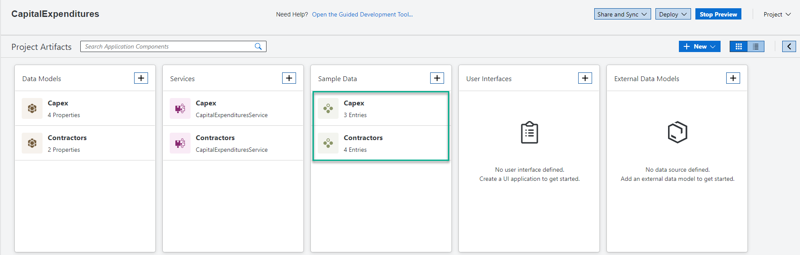

6. Go back to the browser tab with the links to the services, and click either the link of the **Contractors** service or the link of the **`Capex`** service. You can view the sample data you have added.

    !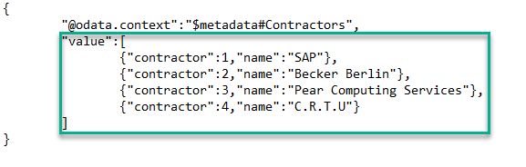

[DONE]
[ACCORDION-END]

---
