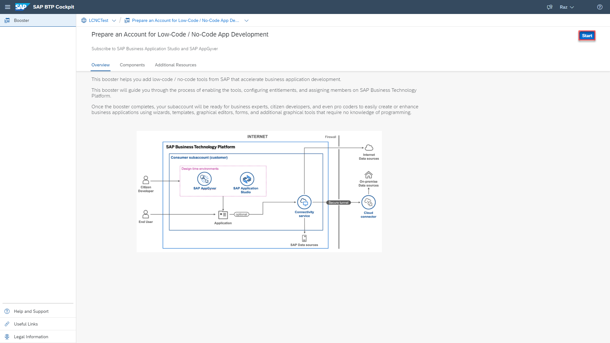
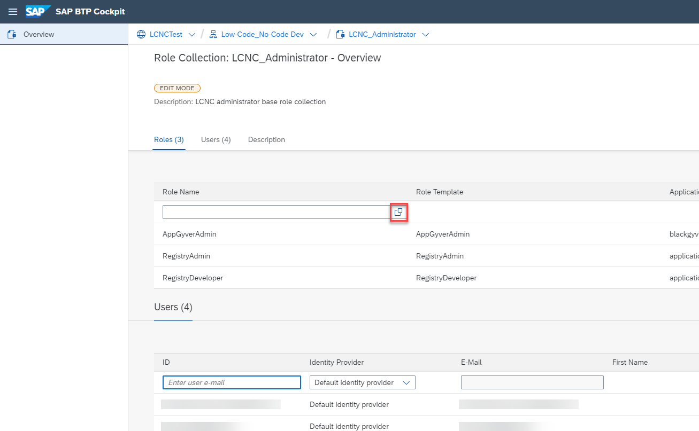
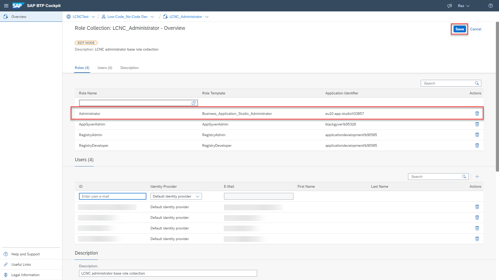

# Set Up SAP Business Application Studio for Low-Code Development in a Test and Evaluation Environment
<!-- description --> Perform the administration onboarding steps for SAP Business Application Studio so you can build low-code applications.

## Prerequisites
 - You have a global account (Enterprise Account) that is CPEA enabled, see [Getting a Global Account](https://help.sap.com/viewer/65de2977205c403bbc107264b8eccf4b/Cloud/en-US/d61c2819034b48e68145c45c36acba6e.html)
 - The global account has Low-Code/No-Code entitlements (SAP AppGyver and SAP Business Application Studio)
 - 4 units of SAP BTP, Cloud Foundry Runtime

## You will learn
- How to subscribe to the service on SAP BTP
- How to adjust the subscription to use the free-tier plan of SAP Business Application Studio
- How to access SAP Business Application Studio for low-code development within SAP BTP

## Intro
After completing the steps in this tutorial, you will have a test and evaluation environment, that is, a free environment to try, learn, and explore SAP Business Application Studio for low-code development.

Accessing SAP Business Application Studio for low-code development requires subscription to the Low-Code/No-Code capabilities on SAP BTP, which is available with a subscription booster. Boosters are a set of guided interactive steps that enable you to select, configure, and consume services on SAP BTP to achieve a specific technical goal. For more information about SAP BTP boosters, see [Boosters] (https://help.sap.com/viewer/65de2977205c403bbc107264b8eccf4b/Cloud/en-US/fb1b56148f834749a2bf51127421610b.html?q=btp%20booster).

Once the booster is completed successfully you gain access to various Low-Code/No-Code tools in a productive (paid) environment. For test and evaluation (free) environment of SAP Business Application Studio for low-code development, the account administrator needs to adjust the results of the booster to use the free-tier plan. For more information on the free-tier plan of SAP Business Application Studio, see [Application Plans](https://help.sap.com/products/SAP%20Business%20Application%20Studio/9d1db9835307451daa8c930fbd9ab264/2c72917df87e47c290e061a556d92398.html).

---
### Run the Low-Code/No-Code Booster

Run the **Prepare an Account for Low-Code/No-Code App Development** booster in order to access the low-code/no-code capabilities of SAP Business Application Studio.

1. From the navigation pane of your SAP BTP cockpit, choose **Boosters**.

    <!-- border -->

2. Choose the **Extension Suite – Developer Efficiency** filter and search for the **Prepare an Account for Low-Code / No-Code App Development** booster. Open your booster to see the overview, components, and additional resources to help you know more about the application development tools.

    <!-- border -->

3. Choose **Start**. The booster wizard guides you through the process of enabling the tools, configuring entitlements, and assigning roles to your users on the SAP BTP cockpit.

    <!-- border -->

4. The booster checks for required authorizations, compatible providers, and regions as prerequisites for successful execution. When the prerequisites are marked as **Done**, choose **Next**.

    <!-- border -->

5. Verify that the **Create Subaccount** option is checked, and choose **Next**.

    <!-- border -->

    >It is recommended to have a fresh subaccount for test and evaluation.

6. Enter your **Subaccount Name**, e.g. 'Low-Code_No-Code Dev', and **Org Name** and choose **Next**.

    >When entering your subaccount name, it is important to enter a new subaccount name, rather than targeting an existing SAP BTP subaccount.
    >The booster creates your new subaccount in the Europe (Frankfurt) - AWS region.

    <!-- border -->

7. Add any additional **Users** if needed and choose **Next**.

    <!-- border -->

8. Review the details of your subaccount, subdomain, and added users with the required roles and choose **Finish**.

    <!-- border -->

    You can see the progress of each action in the booster.

    <!-- border -->

9. After the completion, a success message appears confirming your subscription.

### Delete SAP Business Application Studio Subscription

In this step, you will remove the SAP Business Application Studio subscription that uses the Standard edition (paid) plan.

This is to adjust SAP Business Application Studio Subscription for Free-Tier Plan.

1. Choose **Navigate to Subaccount**.

    <!-- border -->

    >You're now in your newly created SAP BTP subaccount.

2. In the navigation pane of your subaccount, choose **Instances and Subscriptions**.

    <!-- border -->

3. In the Subscriptions section, choose **SAP Business Application Studio** subscription and choose **Delete**.

    <!-- border -->

4. Choose **Delete Subscription** to confirm.

    <!-- border -->

    The subscription to SAP AppGyver provides access to the Application Development Lobby that is used in order to launch SAP Business Application Studio for low-code development.

    Your SAP Business Application Studio subscription with the Standard edition (paid) plan is deleted.

    <!-- border -->

### Entitle SAP Business Application Studio Subscription Free-Tier Plan

In this step, you will add the SAP Business Application Studio subscription that uses the free-tier plan, that is, a free plan to use for test and evaluation purposes.

1. Choose **Entitlements**.

    <!-- border -->

2. Choose **Configure Entitlements**.

    <!-- border -->

3. Choose **Add Service Plans**.

    <!-- border -->

4. Filter and search for the **SAP Business Application Studio** entitlement.

    <!-- border -->

5. Choose **SAP Business Application Studio**, select **free (Application)**, and choose **Add 1 Service Plan**.

    <!-- border -->

6. Choose **Save**.

    <!-- border -->

### Subscribe to SAP Business Application Studio Free-Tier Plan

In this step, you will entitle the SAP Business Application Studio free-tier plan to your subaccount.

1. Choose **Service Marketplace**.

    <!-- border -->

2. In the **Service Marketplace** of your SAP BTP subaccount, search for **SAP Business Application Studio** and choose **Create**.

    <!-- border -->

3. In the **New Instance or Subscription** dialog box, verify that **SAP Business Application Studio** appears in the **Service** drop-down field. Choose **free** in the **Plan** drop-down field and choose **Create**.

    <!-- border -->

4. Choose **View Subscription**.

    <!-- border -->

5. Verify that the **Status** of the subscription is **Subscribed** and that the **Plan** is **free**.

    <!-- border -->

### Assign role collections

In this step, you will assign the role collections for your users to use low-code capabilities of the SAP Business Application Studio. It also allows you to administer SAP Business Application Studio and launch SAP Business Application Studio for low-code development as a citizen developer or a professional developer.

1. In the navigation pane of your SAP BTP subaccount, choose **Role Collections**.

    <!-- border -->

2. Locate the **LCNC Administrator** role collection and click to view it.

    <!-- border -->

3. Choose **Edit**.

    <!-- border -->

4. Click to open the list of available roles.

    <!-- border -->

5. Select the role where **Role Name** is **Administrator** and **Role Template** is **`Business_Application_Studio_Administrator`**, choose **Add**.

    <!-- border -->

6. Verify your added role, choose **Save**. 

    <!-- border -->

7. Repeat Steps 1 - 6 for the following:

    | Step | Parameter | Value |
    |:-----|:----------|:------|
    | A | Role Collection | **`LCNC_Developer`** |
    | B | Role Name / Role Template | **Developer** / **`Business_Application_Studio_Developer`** |

### Open the Application Development Lobby

From the Application Development lobby, you can manage your low-code and no-code and no-code projects: view the list of projects, create a new project, edit a project, and delete a project.  

1. Choose **Low-Code_No-Code Dev** subaccount that appears in the breadcrumbs of your subaccount.

    <!-- border -->

2. Choose **Instances and Subscriptions**.

    <!-- border -->

3. Locate your **SAP AppGyver** subscription and click it to launch the Application Development lobby.

    <!-- border -->

    You're now in the Application Development lobby.

    >**Bookmark this page!**

    >If you create a bookmark to this page, it is easy to get back to Application Development Lobby later.

    <!-- border -->

Well done!

From the Application Development lobby, you can create a business application using low-code development capabilities of the SAP Business Application Studio in the following tutorials.  

---
