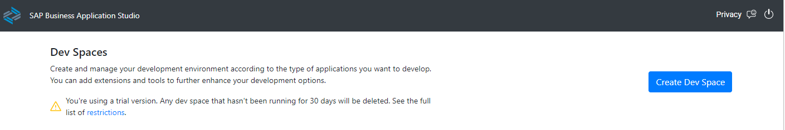

# Set Up SAP Business Application Studio for App Development in the Trial Environment
<!-- description --> SAP Business Application Studio is a development environment available on SAP Business Technology Platform (SAP BTP). This tutorial describes how to perform the onboarding steps for SAP Business Application Studio in the SAP BTP Trial environment. In addition, you learn how to create an SAP Business Application Studio dev space for developing full-stack applications using productivity tools.

## Prerequisites
 - You have an SAP BTP Trial account ([Get a Free Account on SAP BTP Trial](hcp-create-trial-account))

## You will learn
- How to set up SAP Business Application Studio in the SAP BTP Trial environment
- How to access the SAP Business Application Studio dev space manager page
- How to create an SAP Business Application Studio dev space for developing full-stack applications using productivity tools

## Intro
After completing the steps in this tutorial, you will have set up SAP Business Application Studio on the **SAP BTP Trial environment**. In addition, you will have created a dev space for developing full-stack applications using productivity tools.

>**Please note:** For the SAP BTP Trial environment, the dev space type **Full-Stack Application Using Productivity Tools** is only available on the US East (VA) data center (us10).

>If you want to onboard and access SAP Business Application Studio in an **SAP BTP Enterprise Account** there are two options: it can be obtained through manual subscription, or by using a subscription booster. Boosters are a set of guided interactive steps that enable you to select, configure, and consume services on SAP BTP to achieve a specific technical goal. For more information about SAP BTP boosters, see [Boosters] (https://help.sap.com/viewer/65de2977205c403bbc107264b8eccf4b/Cloud/en-US/fb1b56148f834749a2bf51127421610b.html?q=btp%20booster).

>- For **manual subscription** of SAP Business Application Studio in an SAP BTP Enterprise Account refer to the [Getting Started](https://help.sap.com/viewer/9d1db9835307451daa8c930fbd9ab264/Cloud/en-US/19611ddbe82f4bf2b493283e0ed602e5.html) topic of the SAP Business Application Studio Administrator Guide.
>- If you want to set up SAP Business Application Studio with the help of a **booster**, see this [blog post](https://blogs.sap.com/2022/07/22/boosting-the-low-code-experience-in-sap-business-application-studio-into-multiple-regions/).

---
### Log into SAP BTP Trial

1. Go to <https://account.hanatrial.ondemand.com> and log in to your SAP BTP cockpit.

2. You might be asked to accept the legal terms. Check the box and click **Accept**.

    <!-- border -->

### Launch SAP Business Application Studio

1. Click **SAP Business Application Studio** to launch SAP Business Application Studio.

    <!-- border -->

    >If your account was created with an error, it is recommended that you re-create your account: delete the account and then [Get a Free Account on SAP BTP Trial](hcp-create-trial-account).

2. You might be asked to accept the legal terms. Check the box and click **OK**.

    <!-- border -->

3. A new tab opens. If you have not created a dev space yet, the landing page for SAP Business Application Studio loads.

    <!-- border -->

    >If you have already created a dev space, the dev space manager for SAP Business Application Studio loads. You can skip the next step.

    ><!-- border -->

4. Click **My Dev Spaces** to open the SAP Business Application Studio dev space manager page.

    <!-- border -->

    The **Dev space manager** for SAP Business Application Studio opens
    <!-- border -->

    >**Bookmark this page!**

    >If you create a bookmark to this page, it is easy to get back to SAP Business Application Studio later.

### Create a preconfigured dev space

    >Dev spaces are like isolated environments in the cloud containing tailored tools and preinstalled runtimes per business scenario, such as SAP Fiori, SAP S/4HANA extensions, Workflow, Mobile and more. This simplifies and saves time in setting up the development environment as there is no need to install anything or upgrade, letting developers focus on their business domain, anytime, anywhere. For further information on dev spaces refer to [Dev Spaces in SAP Business Application Studio](https://help.sap.com/docs/SAP%20Business%20Application%20Studio/9d1db9835307451daa8c930fbd9ab264/6053df8bca3946f098bc9f89e49d7317.html)

1. If you have not created a dev space yet, choose **Create Dev Space** in the landing page of SAP Business Application Studio. If you have already created a dev space, choose **Create Dev Space** in the dev space manager.

    >Landing page for SAP Business Application Studio:
    <!-- border -->

     

    >Dev space manager for SAP Business Application Studio:
    <!-- border -->

2. Choose a name for your dev space.

3. Choose **Full-Stack Application Using Productivity Tools** as the application type.

    >The **Full-Stack Application Using Productivity Tools** dev space allows you to easily develop, test, build, and deploy apps using high productivity tools.

4. Choose **Create Dev Space**.

    <!-- border -->

    The creation of the dev space takes a while. You see that the status for your dev space will change from **STARTING** to **RUNNING**.

    <!-- border -->

5. Once the dev space is running, click the dev space name to open it.

     

Well done!

With this, you have successfully completed the setup of SAP Business Application Studio and created a dev space for developing apps using high productivity tools.  

---
