## Prerequisites
- You have access to your Application Development Lobby.

## Details
### You will learn
- How to create a responsive application for a service
- How to preview your application
- How to customize your application (for example, auto reload initial data and change titles)

---

[ACCORDION-BEGIN [Step 1: ](Create an application)]

1. From the home page, click the **+** of the **User Interface** tile.

    !

2. For **UI Application Details**, choose the following, and choose **Next**.

    | Step | Parameter | Value |
    |:-----|:----------|:------|
    | A | Display name | **`Capex Report`** |
    | B | Application name | **`CapexReport`** |
    | C | Description | **List of Expenses** |

    !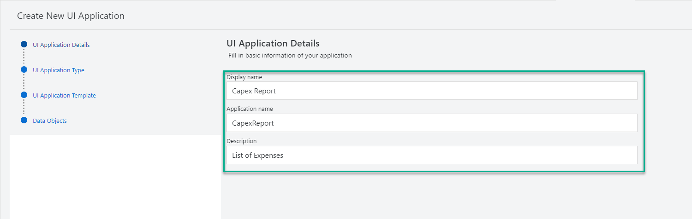

3. For **UI Application Type**, select **Template-Based, Responsive Application**, and choose **Next**.

    !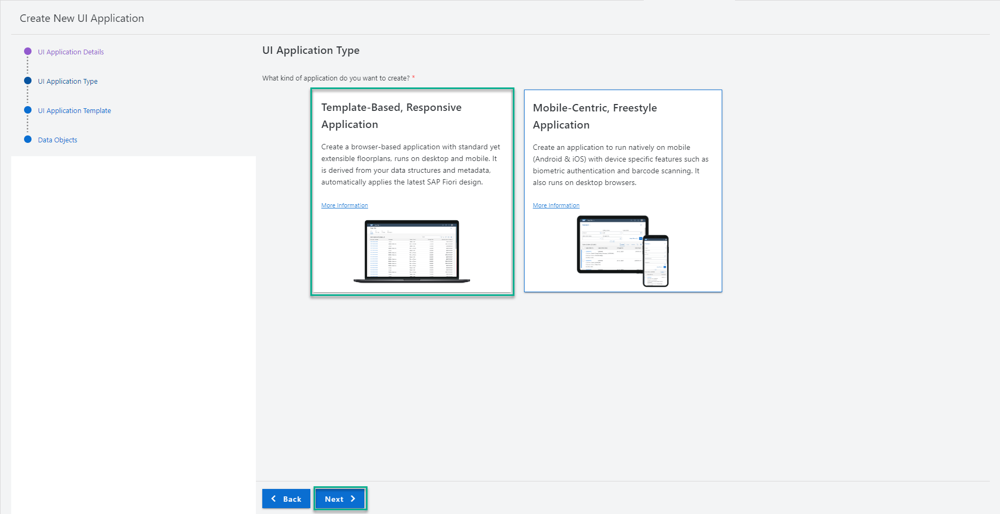

4. For **UI Application Template**, select **List Report Object Page**, and choose **Next**.

    !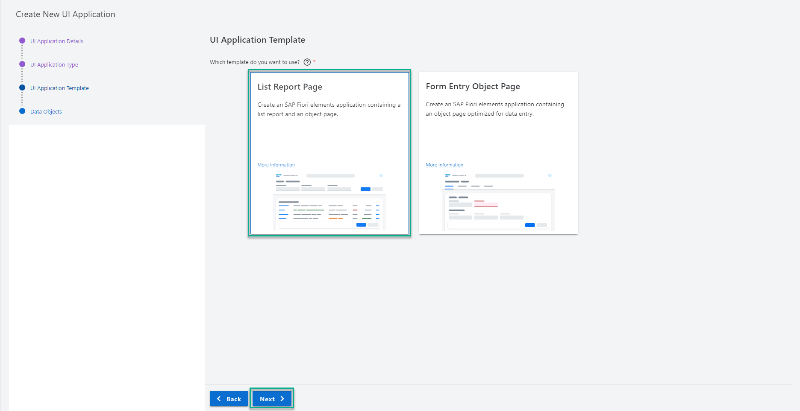

5. For **Data Objects**, select the following, and choose **Finish**.

    | Step | Parameter | Value |
    |:-----|:----------|:------|
    | A | Main entity | **`Capex`** |
    | B | Automatically add table ... | **Yes** (default) |

    !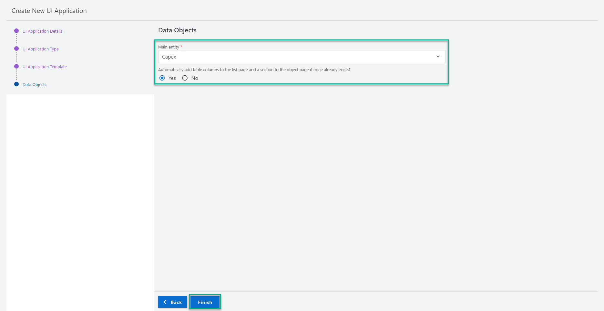

6. Wait for the success notification ( **The files have been generated** ) to appear.

    !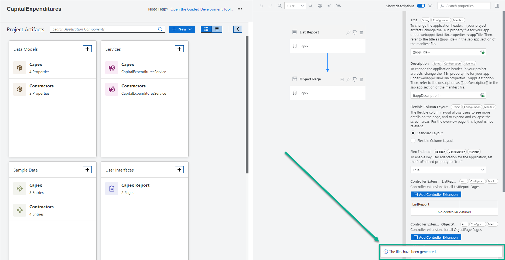

    The app is added to the **User Interface** tab in the home page.

    The **Page Map** (`CapexReport`) editor is opened side-by-side to the home page.

[DONE]
[ACCORDION-END]

[ACCORDION-BEGIN [Step 2: ](Preview the app)]

1. If the preview is running, choose **Stop Preview**. If the **Project Preview** tab is open, close it.

2. Choose **Preview** > **With Sample Data** to preview (test run) the app.

3. In the **Project Preview** tab, choose the **`Capex Report`** application's tile to launch the app.

    !

4. Choose **Go** to view the data in a list page.

    !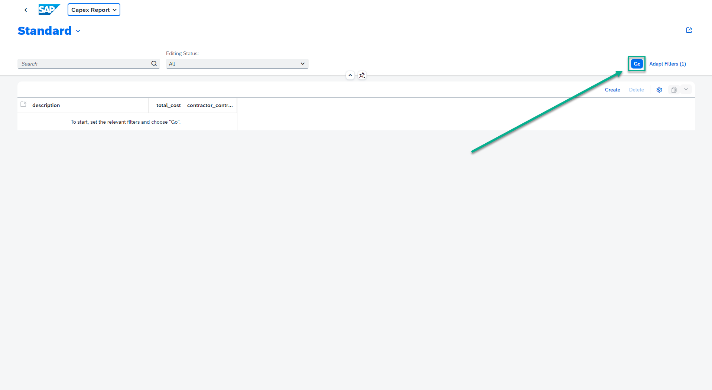

    You can view the data in a list page.

    !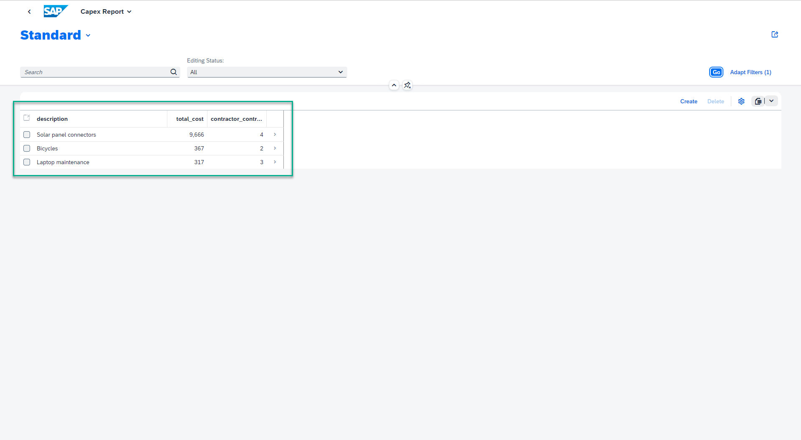

6. You can optionally click one of the list items to view its object page.

    !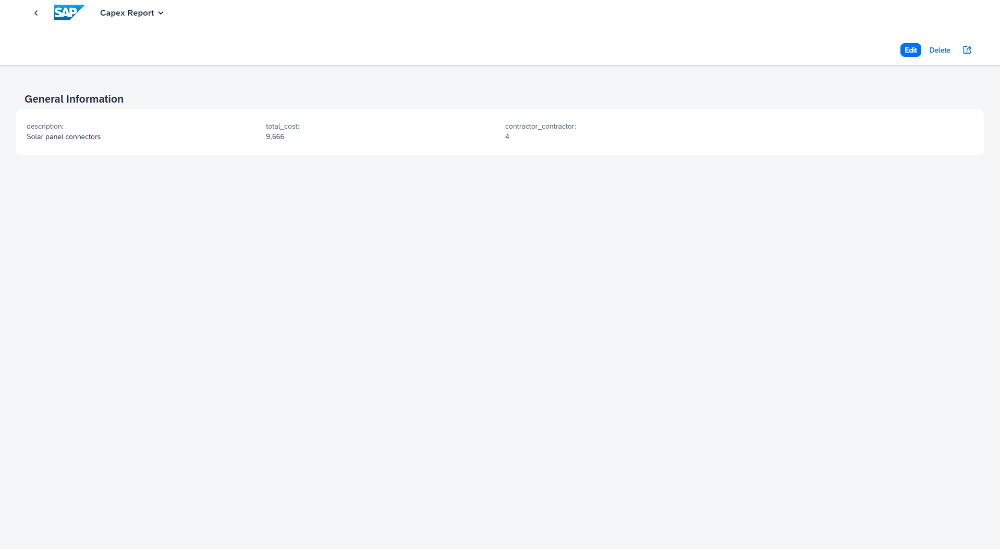

7. Choose the **Back** option to return to the list page or twice to return to the launch page.

    !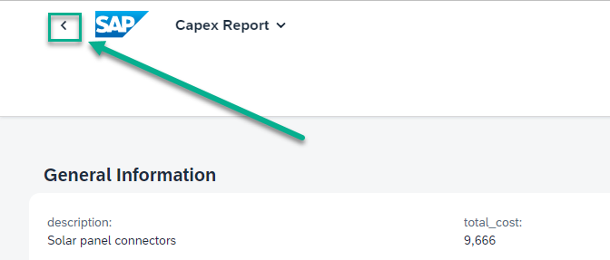

[DONE]
[ACCORDION-END]

[ACCORDION-BEGIN [Step 3: ](Customize the app: Enable initial load of data in the list page)]

To avoid clicking on **Go** option every time you want to present the information in the list page, in this section you'll configure the page to load the initial data as soon as it is loaded.

1. Close the browser tab where the **`Capex Report`** application is running.

2. In the **Project Preview** tab, choose the **`Capex Report`** application's tile to launch the app.

    !

3. The app is loaded with an empty list page.

    >From this step onwards you'll leverage the auto-refresh capability of the development environment. Every time you make any new change to the app, it gets refreshed automatically and you can view the updated changes.

    !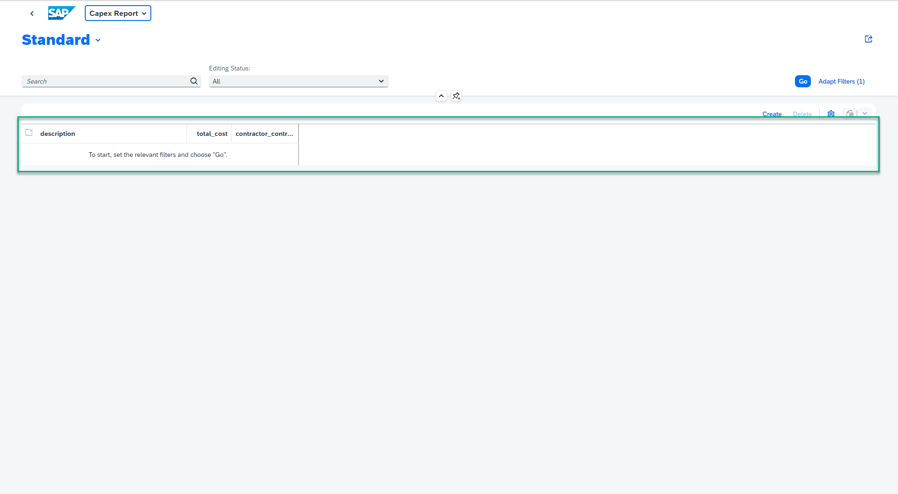

4. Go back to the homepage of SAP Business Application Studio for low-code development, and choose the **edit** button of the **List Report** page.

    !

5. Choose the **Table** element.

    !

6. For the **Initial Load** property, choose **Enabled** in the drop-down.

    !

7. Access application tab. Now, the data appears in the table without choosing the **Go** option.

    !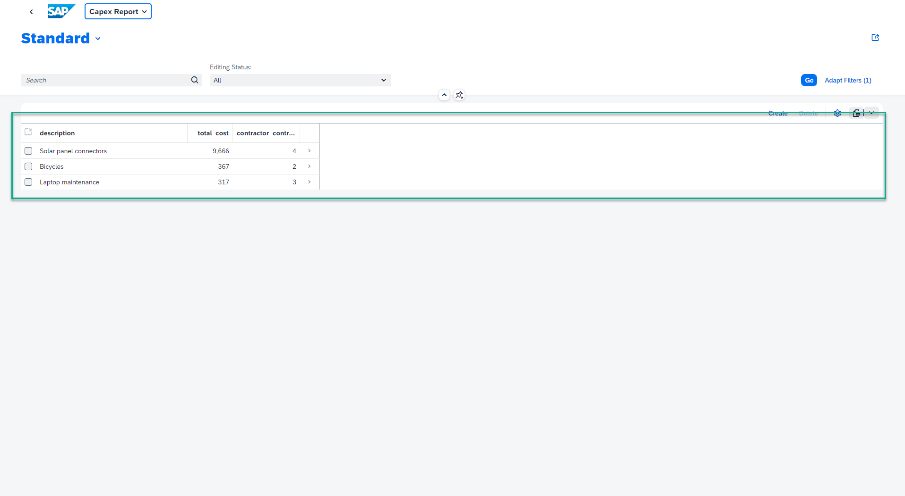

[VALIDATE_1]
[ACCORDION-END]

[ACCORDION-BEGIN [Step 4: ](Customize the app: Update table column titles)]

1. In the **Page Map** editor of SAP Business Application Studio for low-code development, expand **Columns**.

    !

2. Choose **description**.

    !

3. Change the **Label** to **Description**.

    !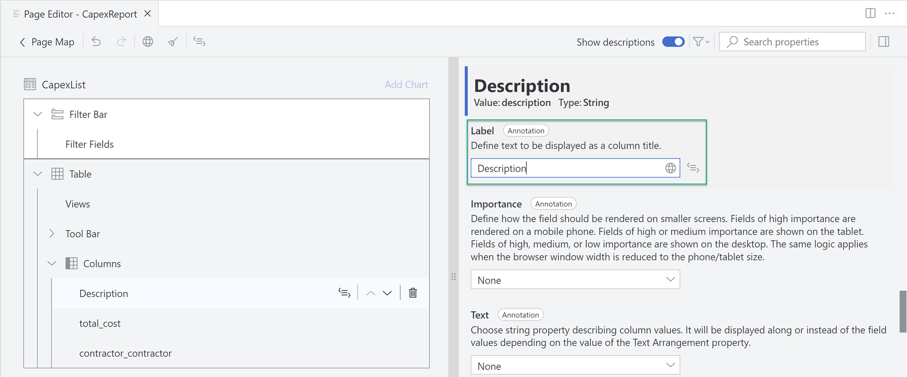

4. Repeat the previous steps to change **`total_cost`** **Label** to **Total Cost**.

    !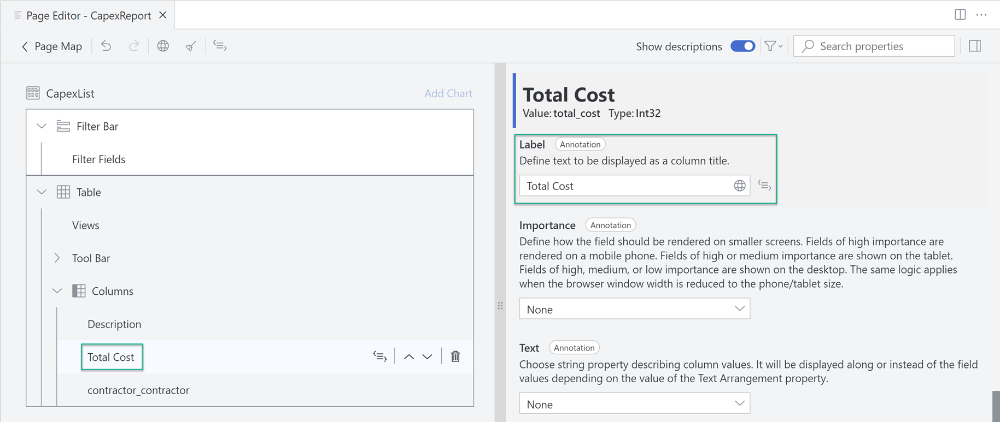

5. Repeat the previous steps to change **`contractor_contractor`** **Label** to **Contractor**.

    !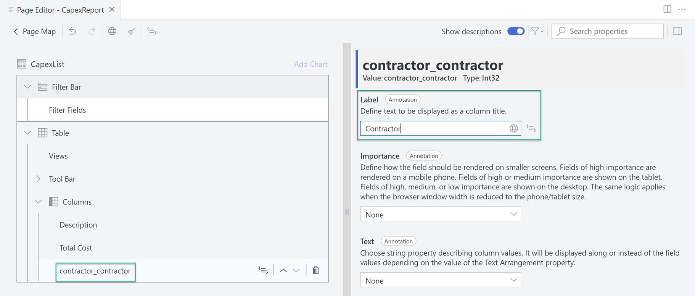

6. you can see that in the application's tab the column titles changed as per your updates. 

    !

[DONE]
[ACCORDION-END]

[ACCORDION-BEGIN [Step 5: ](Customize the app: Present contractor name)]

1. In the **Page Map** editor of SAP Business Application Studio for low-code development, choose **contractor/name** for the **Text** property.

    !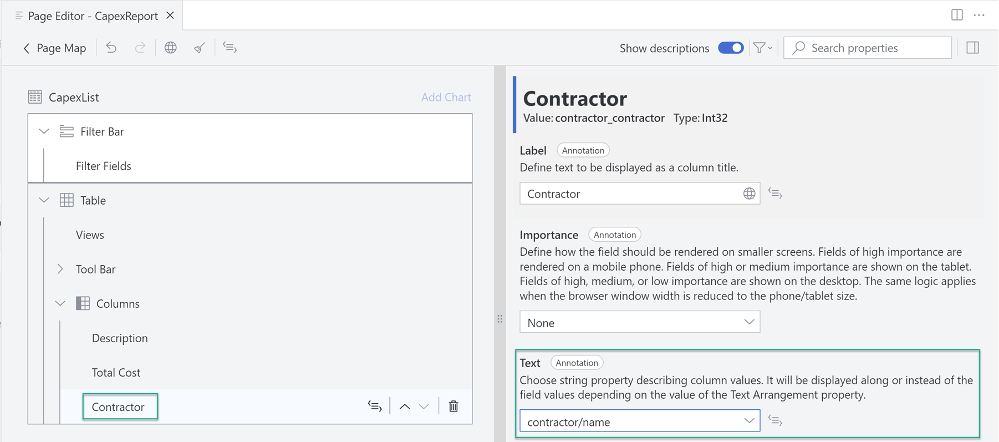

2. Choose **Text Only** for the **Text Arrangement** property.

    !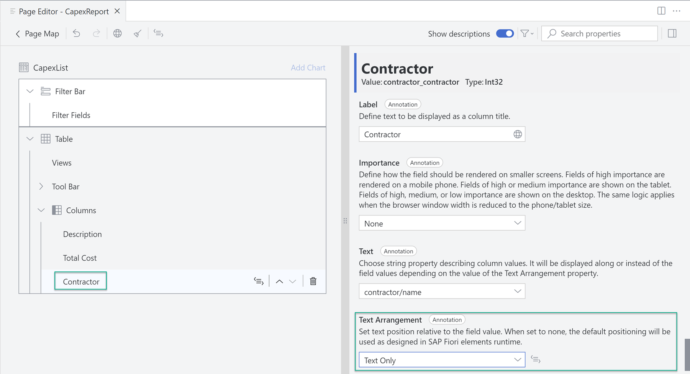

3. You can see that in the application's tab the ID is replaced by the name of the contractor.

    !

[DONE]
[ACCORDION-END]

[ACCORDION-BEGIN [Step 6: ](Customize the app: Change titles in the object page)]

1. In the SAP Business Application Studio for low-code development, choose the **Page Map** option.

    !

2. Choose the **edit** option of the **Object Page**.

    !

3. Expand **General Information** -> **Form** -> **Fields**.

    !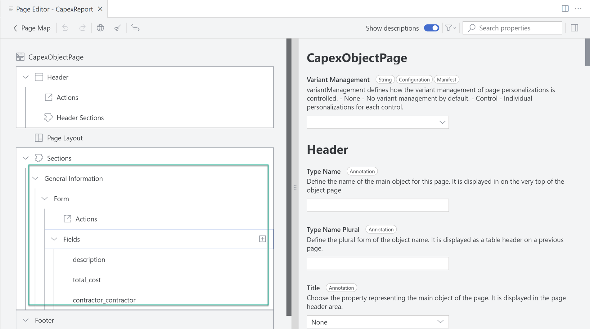

4. Repeat previous steps to make the following changes to the **Fields** **Label** property.

    >Hint: Trigger the **Label** update, by pressing [ENTER] or clicking somewhere on the screen.

    | Step | Parameter | Value |
    |:-----|:----------|:------|
    | A | description | **Description** |
    | B | `total_cost` | **Total Cost** |
    | C | `contractor_contracotr` | **Contractor** |

    !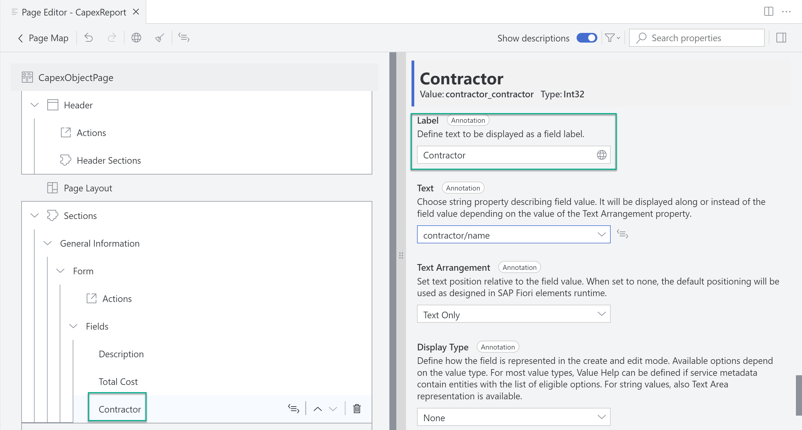

5. You can see that in the app's tab the titles are changed as per your updates.

    !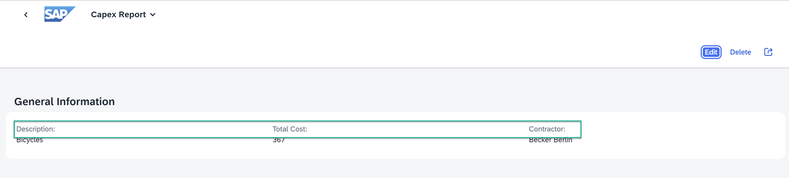

[DONE]
[ACCORDION-END]

[ACCORDION-BEGIN [Step 7: ](Customize the app: Add contractor section to the object page)]

1. In the **Page Map** editor of SAP Business Application Studio for low-code development, hover over **Sections**, and choose the **Add Sections** option.

    !

2. Choose **Add Form Section**.

    !

3. Set the **Label** to **Contractors** and choose **Add**.

    !

4. Expand **Contractors** -> **Form**.

    !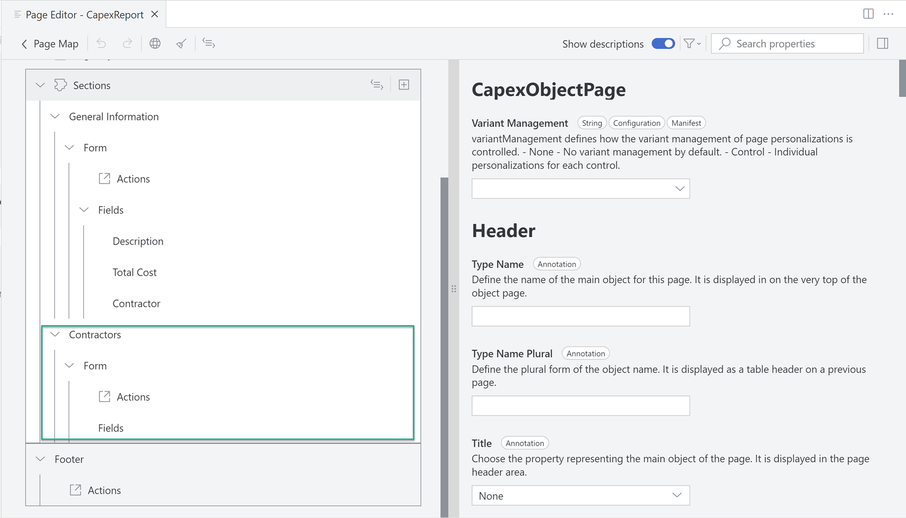

5. Drag and drop **Contractor** from **General Information -> Form -> Fields** to **Contractors -> Form**.

    !

6. You can see that in the application's tab, a new **Contractor** section appears with the **Contractor** field.

  !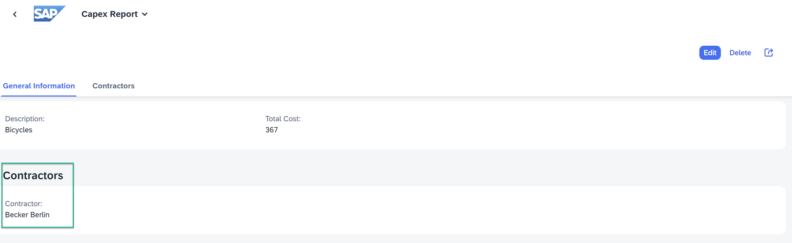

[DONE]
[ACCORDION-END]

[ACCORDION-BEGIN [Step 7: ](Customize the app: Change object page title)]

1. In the **Page Map** editor of SAP Business Application Studio for low-code development, choose **Header**.

    !

2. For the **Title** property choose **description**.

    !

3. You can see that in the application's tab the object page title changed as per your updates.

    !

[DONE]
[ACCORDION-END]

**Congratulations!**

With this, you have successfully completed developing a business application using low-code capabilities of SAP Business Application Studio.

During the development you have modelled your business data. You have created a service through which data in the data model is accessed. You have created a user interface, which is actually an app, from which an application user can interact with the data. Throughout the development process, you continually test run the app, which is a development best practice to make sure the development is on-track.

And in this tutorial, you learned about high-productivity tools that are available out-of-the-box in SAP Business Applications Studio, such as: home page, project explorer, data model editor, service editor, templates and wizards, application editors, application preview, and much more.

---
