# Create a Responsive User Interface Application
<!-- description --> Create a responsive application (user interface) that connects to your data through a service you previously created, using the high productivity development capabilities of SAP Business Application Studio.

## Prerequisites
- You have created a data model and exposed it as a service. (See [Create a Data Model and Expose It as a Service](appstudio-lcap-create-db-service))

## You will learn
- How to create a responsive application for a service
- How to preview your application
- How to customize your application (for example, auto reload initial data and change titles)

---

### Create an application

1. From the storyboard, click the **+** of the **User Interface** tile.

    <!-- border -->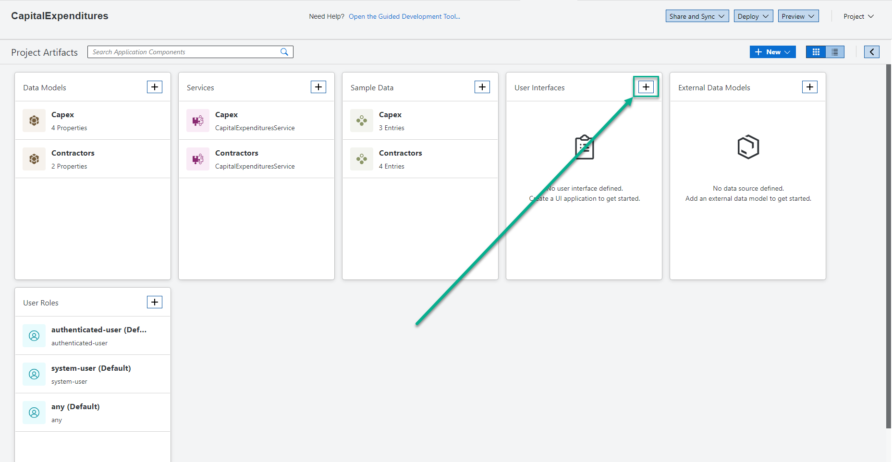

2. For **UI Application Details**, choose the following, and choose **Next**.

    | Step | Parameter | Value |
    |:-----|:----------|:------|
    | A | Display name | **`Capex Report`** |
    | B | Application name | **`CapexReport`** |
    | C | Description | **List of Expenses** |

    <!-- border -->

3. For **UI Application Type**, select **Template-Based, Responsive Application**, and choose **Next**.

    <!-- border -->

4. For **UI Application Template**, select **List Report Page**, and choose **Next**.

    <!-- border -->

5. For **Data Objects**, select the following, and choose **Finish**.

    | Step | Parameter | Value |
    |:-----|:----------|:------|
    | A | Main entity | **`Capex`** |
    | B | Automatically add table ... | **Yes** (default) |

    <!-- border -->

6. Wait for the success notification ( **The files have been generated** ) to appear.

    <!-- border -->

    The app is added to the **User Interface** tab in the storyboard.

    The **Page Map** (`CapexReport`) editor is opened side-by-side to the storyboard.

### Preview the app

1. If the **Project Preview** tab is open, close it.

2. Choose **Run and Debug** green button from the top right of the screen.

    <!-- border -->

3. In the **Project Preview** tab, choose the **`Capex Report`** application's tile to launch the app.

    <!-- border -->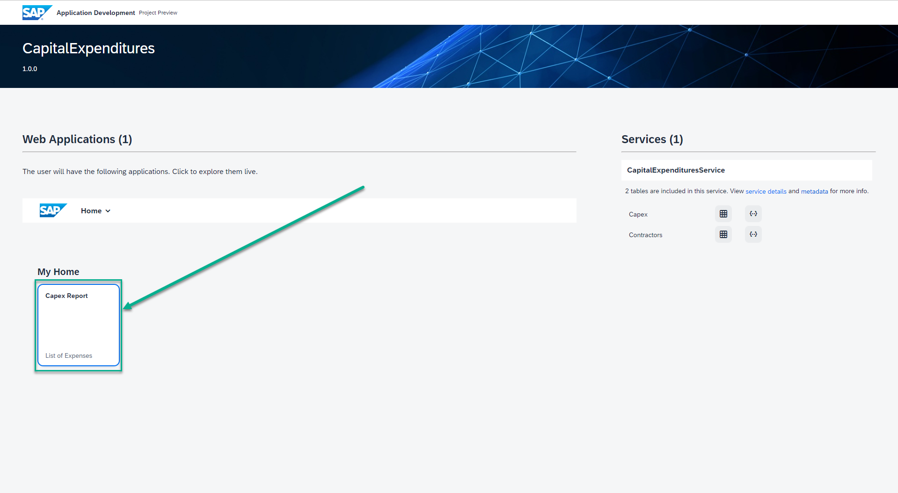

4. Choose **Go** to view the data in a list page.

    <!-- border -->

    You can view the data in a list page.

    <!-- border -->

6. You can optionally click one of the list items to view its object page.

    <!-- border -->

7. Choose the **Back** option to return to the list page or twice to return to the launch page.

    <!-- border -->

### Customize the app - Enable initial load of data in the list page

To avoid clicking on the **Go** option every time you want to present the information in the list page, in this section you'll configure the page to load the initial data as soon as it is loaded.

1. Close the browser tab where the **`Capex Report`** application is running.

2. In the **Project Preview** tab, choose the **`Capex Report`** application's tile to launch the app.

    <!-- border -->

3. The app is loaded with an empty list page.

    >From this step onwards you'll leverage the auto-refresh capability of the development environment. Every time you make any new change to the app, it gets refreshed automatically and you can view the updated changes.

    <!-- border -->

4. Go back to the storyboard of SAP Business Application Studio, and choose the **Configure Page** button of the **List Report** page.

    <!-- border -->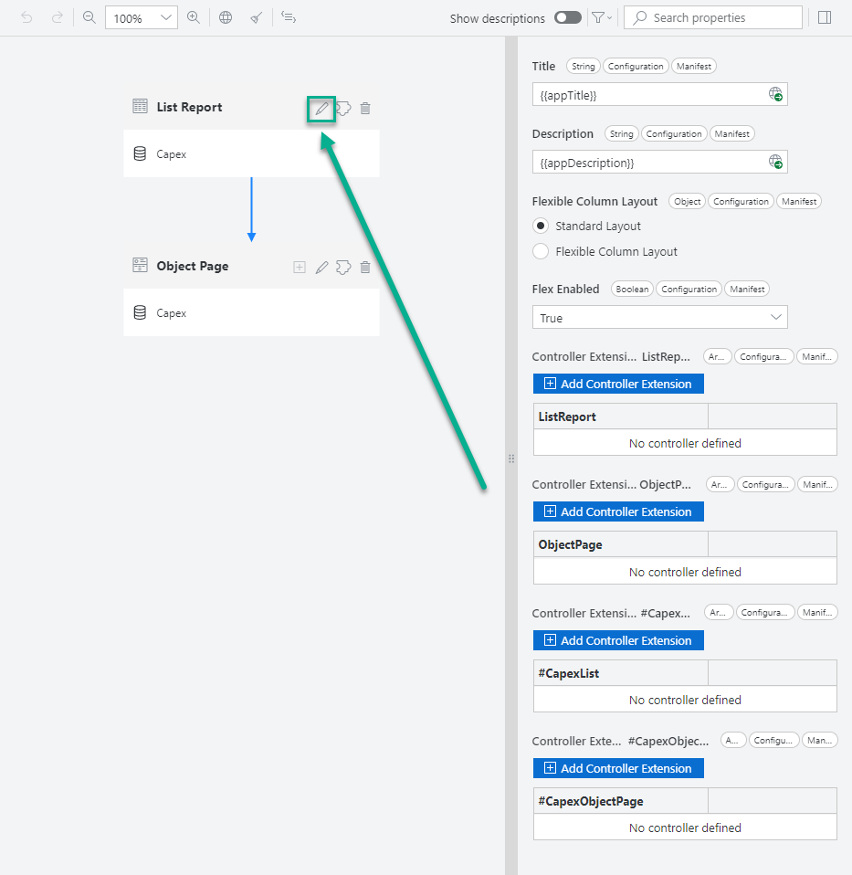

5. Choose the **Table** element.

    <!-- border -->

6. For the **Initial Load** property, choose **Enabled** in the drop-down.

    <!-- border -->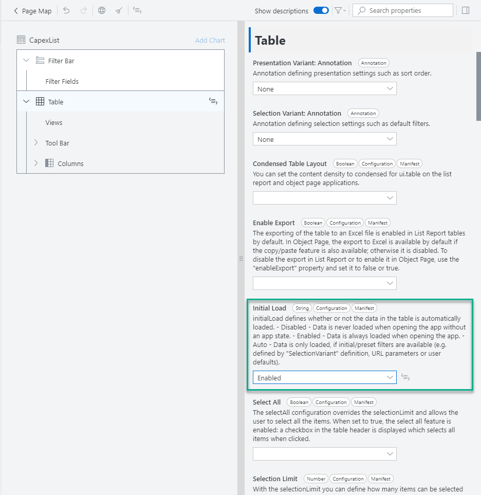

7. Access the application tab. Now, the data appears in the table without choosing the **Go** option.

    <!-- border -->

### Customize the app - Update table column titles

1. In the **Page Map** editor of SAP Business Application Studio, expand **Columns**.

    <!-- border -->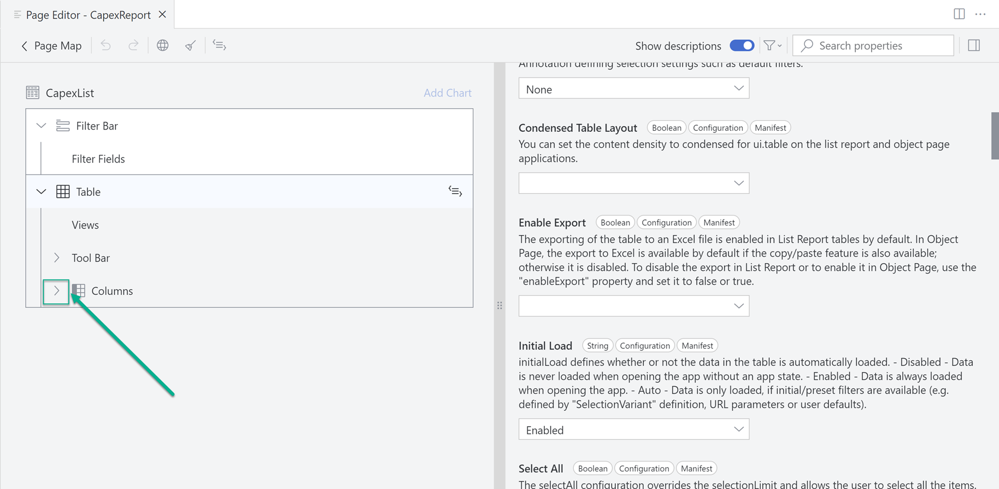

2. Choose **description**.

    <!-- border -->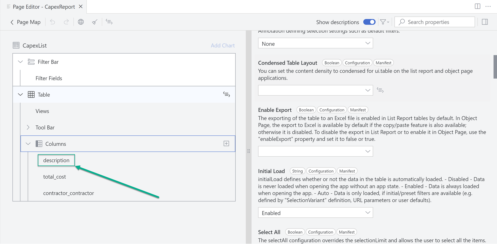

3. Change the **Label** to **Description**.

    <!-- border -->

4. Repeat the previous steps to change the **`total_cost`** **Label** to **Total Cost**.

    <!-- border -->

5. Repeat the previous steps to change the **`contractor_contractor`** **Label** to **Contractor**.

    <!-- border -->

6. Go back to the application's tab. You can see that the column titles changed as per your updates.

    <!-- border -->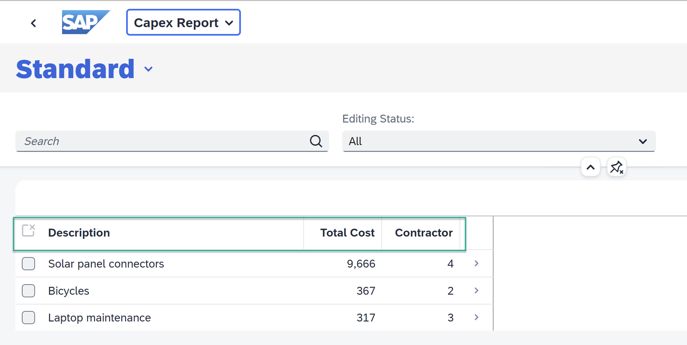

### Customize the app - Present contractor name

1. In the **Page Map** editor of SAP Business Application Studio, choose **contractor/name** for the **Text** property.

    <!-- border -->

2. Choose **Text Only** for the **Text Arrangement** property.

    <!-- border -->

3. Go back to the application's tab. You can see that the ID is replaced by the name of the contractor.

    <!-- border -->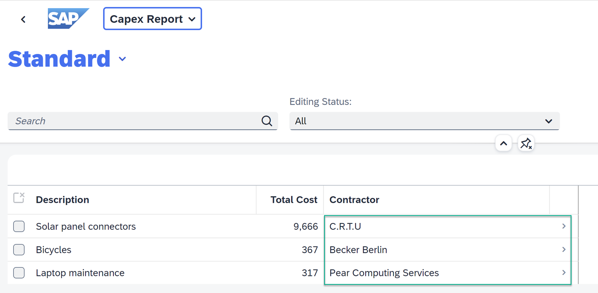

### Customize the app - Change titles in the object page

1. In the application's tab select one object, for example, **Bicycles**. The column titles are not updated yet. In this step we will change the column titles for the single objects.
    <!-- border -->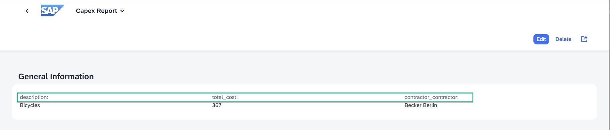

2. In the SAP Business Application Studio, choose the **Page Map** option.

    <!-- border -->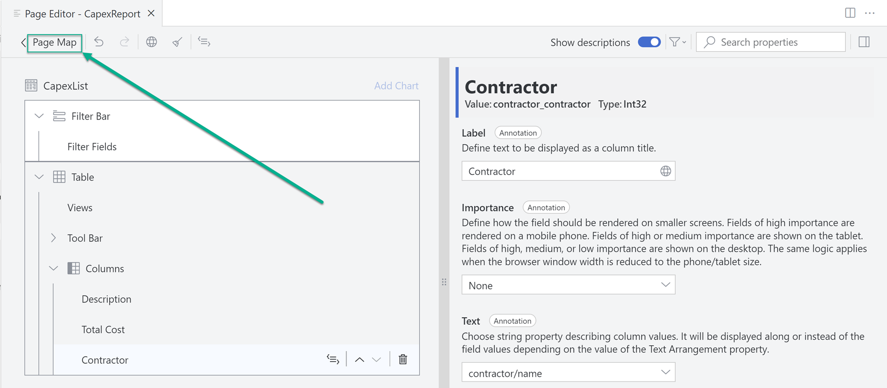

3. Choose the **edit** option of the **Object Page**.

    <!-- border -->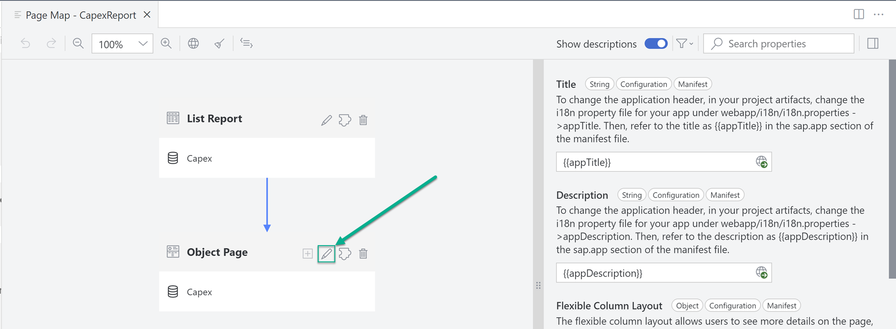

4. Expand **General Information** -> **Form** -> **Fields**.

    <!-- border -->

5. Make the following changes to the **Fields** **Label** property. (Repeat the steps listed in the two previous sections.)

    >Hint: Trigger the **Label** update, by pressing [ENTER] or clicking somewhere on the screen.

    | Step | Parameter | Value |
    |:-----|:----------|:------|
    | A | description | **Description** |
    | B | `total_cost` | **Total Cost** |
    | C | `contractor_contractor` | **Contractor** |

    <!-- border -->

6.  Go back to the application's tab. You can see that the titles are changed as per your updates.

    <!-- border -->

### Customize the app - Add contractor section to the object page

1. In the **Page Map** editor of SAP Business Application Studio, hover over **Sections**, and choose the **Add Sections** option.

    <!-- border -->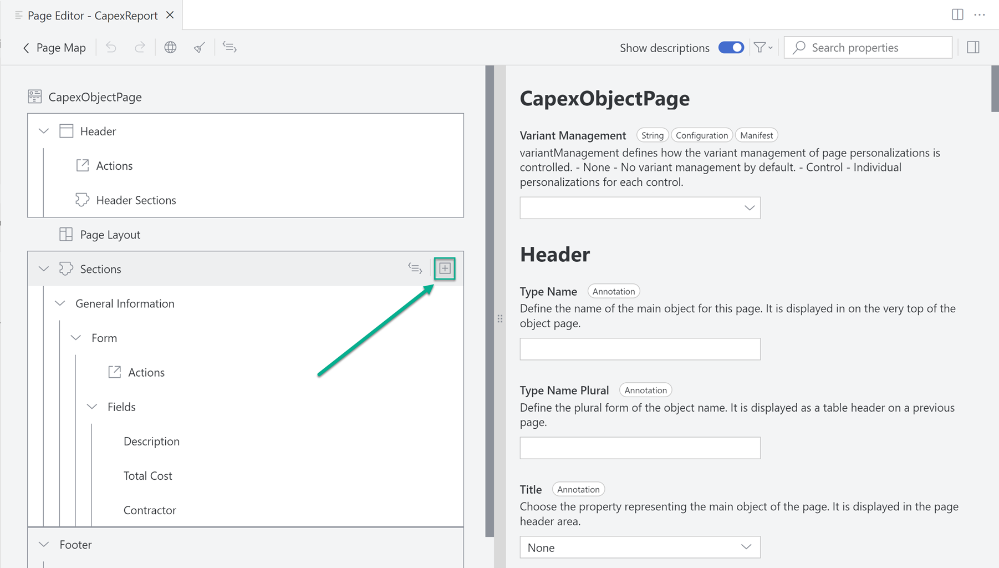

2. Choose **Add Form Section**.

    <!-- border -->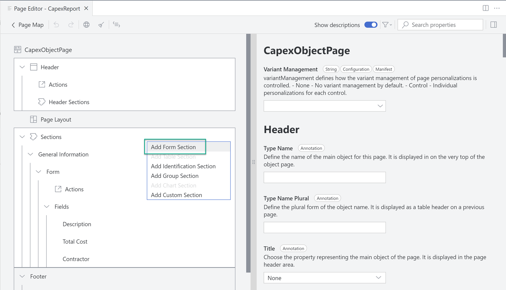

3. Set the **Label** to **Contractors** and choose **Add**.

    <!-- border -->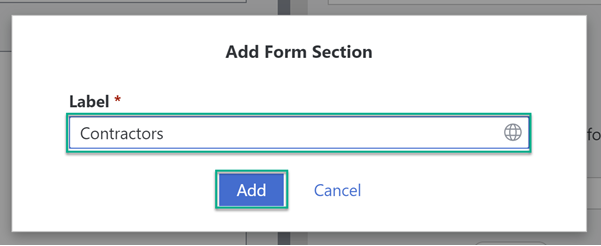

4. Expand **Contractors** -> **Form**.

    <!-- border -->

5. Drag and drop **Contractor** from **General Information -> Form -> Fields** to **Contractors -> Form**.

    <!-- border -->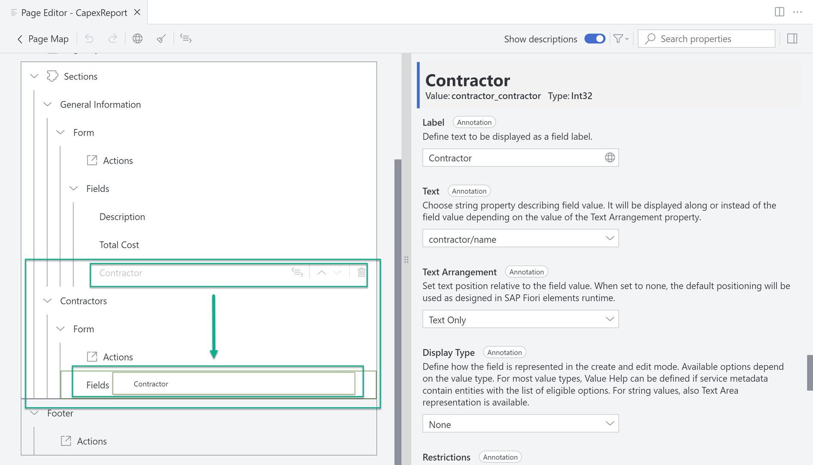

6.  Go back to the application's tab. You can see that a new **Contractors** section appears with the **Contractor** field.

    <!-- border -->

### Customize the app - Change object page title

1. In the **Page Map** editor of SAP Business Application Studio, choose **Header**.

    <!-- border -->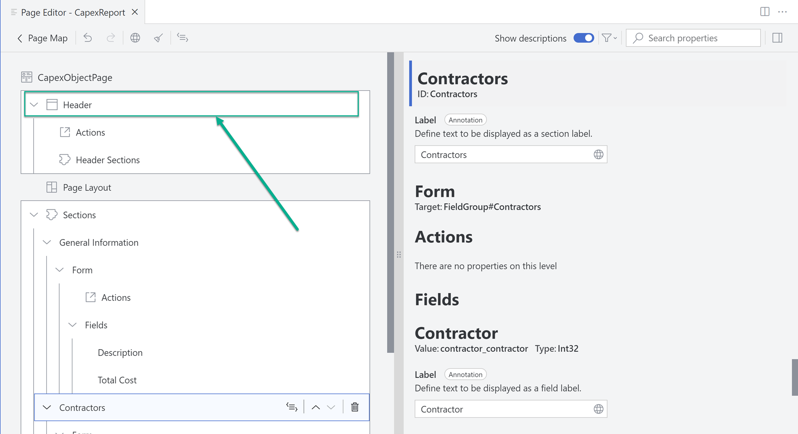

2. For the **Title** property choose **description**.

    <!-- border -->

3.  Go back to the application's tab. You can see that the object page title changed as per your updates.

    <!-- border -->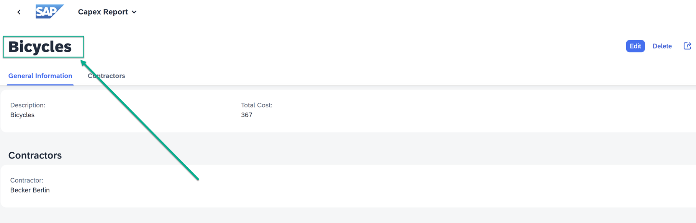

**Congratulations!**

With this, you have successfully completed developing a business application using the high productivity development capabilities of SAP Business Application Studio.

During the development you have modelled your business data. You have created a service through which data in the data model is accessed. You have created a user interface, which is actually an app, from which an application user can interact with the data. Throughout the development process, you continually test run the app, which is a development best practice to make sure the development is on-track.

And in this tutorial, you learned about high-productivity tools that are available out-of-the-box in SAP Business Applications Studio, such as: storyboard, project explorer, data model editor, service editor, templates and wizards, application editors, application preview, and much more.

---
