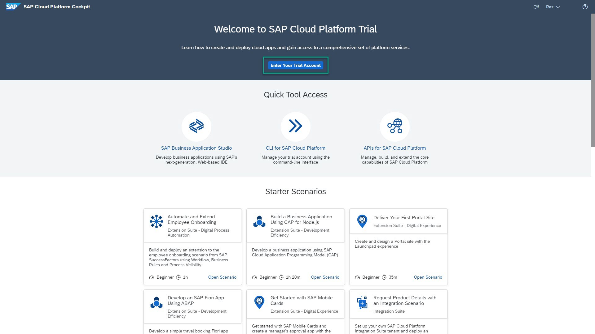
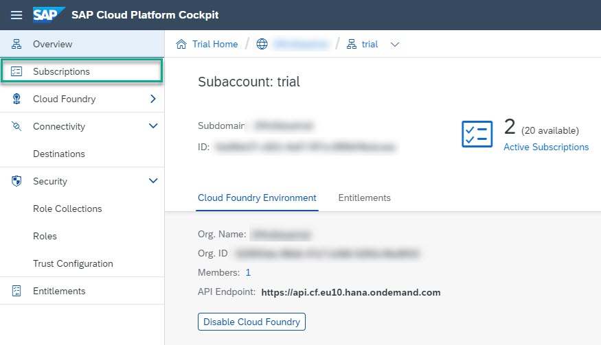
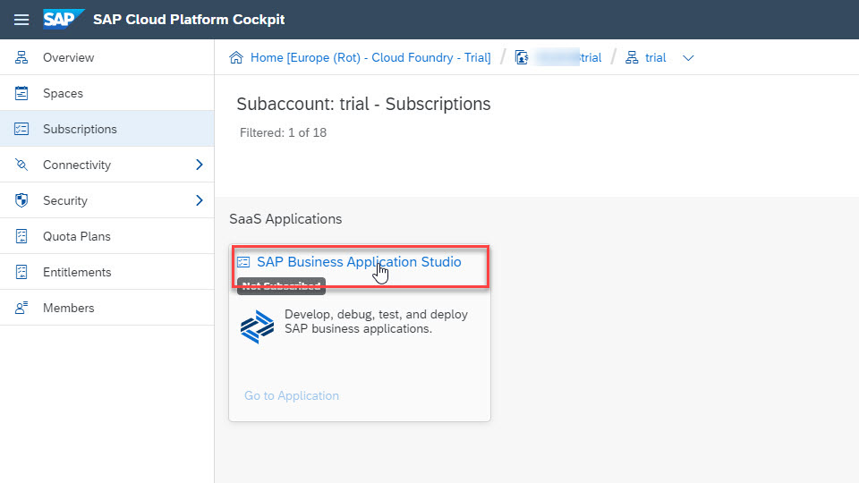
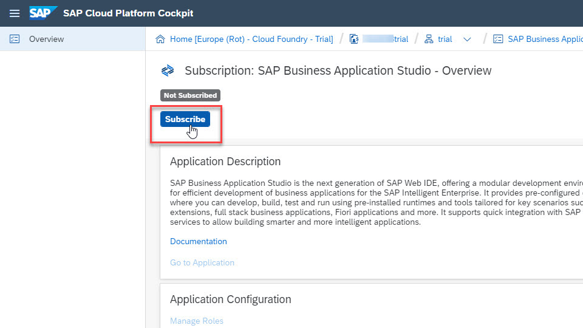
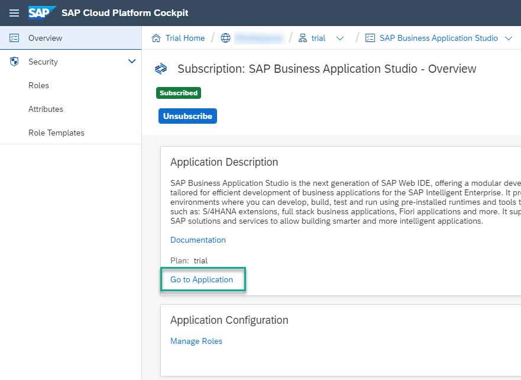
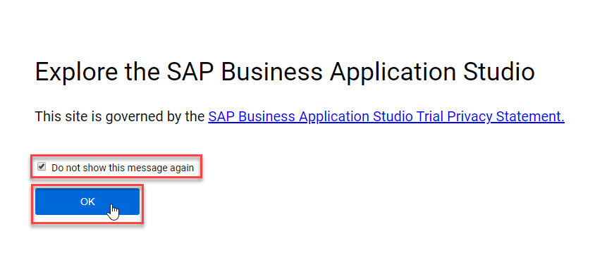
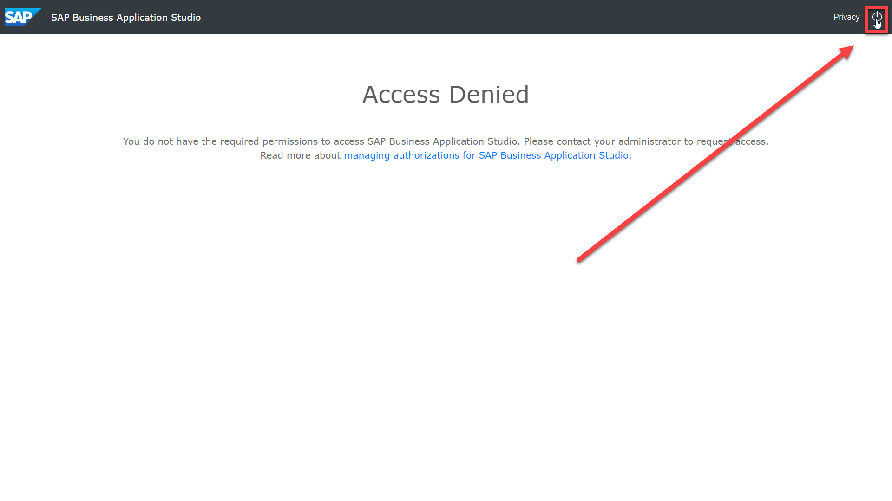
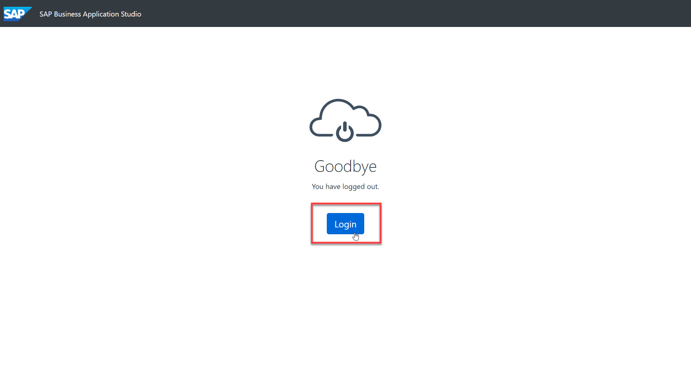
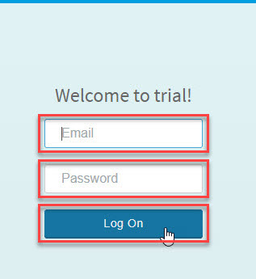
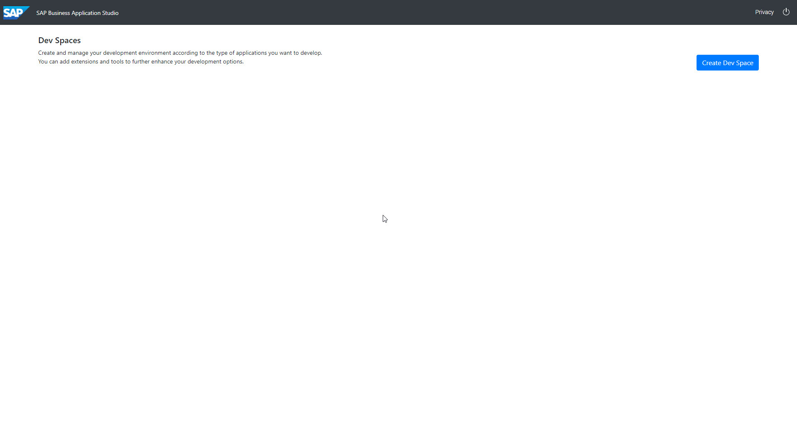

## Prerequisites
 - You have an SAP Cloud Platform account: [Get a Free Trial Account on SAP Cloud Platform](hcp-create-trial-account)

## Details
### You will learn
  - How to set up SAP Business Application Studio

This tutorial is based on the procedure described in the [Getting Started](https://help.sap.com/viewer/9d1db9835307451daa8c930fbd9ab264/Cloud/en-US/19611ddbe82f4bf2b493283e0ed602e5.html) topic of the SAP Business Application Studio Administrator Guide.

---

[ACCORDION-BEGIN [Step: 1](Log into SAP Cloud Platform)]

1. Go to <https://account.hanatrial.ondemand.com> and log in to your SAP Cloud Platform cockpit.

2. Click **Enter Your Trial Account** to access the Cloud Foundry environment.

    !

[DONE]
[ACCORDION-END]

[ACCORDION-BEGIN [Step: 2](Switch to subscriptions view)]

1. Select the tile of the subaccount in which you want to enable the SAP Business Application Studio subscription.

    >For the trial environment, SAP Business Application Studio is only available on:

    > - Amazon Web Services (AWS) - Europe (Frankfurt) or US East (VA) regions.

    >If you do not have a subaccount in one of these regions, you need to create a new subaccount, where:

    > - Provider = **Amazon Web Services (AWS)**
    > - Region = **Europe (Frankfurt)** or **US East (VA)**.

    !

2. From the navigation area, click **Subscriptions**.

    !

[DONE]
[ACCORDION-END]

[ACCORDION-BEGIN [Step: 3](Add SAP Business Application Studio subscription to subaccount)]

In this step, you will add the SAP Business Application Studio subscription to a subaccount. Depending on when you created the SAP Cloud Platform account, this subscription might already be added in the subaccount.

1. In the **Subscriptions** page, search for **`studio`**.

2. Click the **SAP Business Application Studio** tile.

    !

3. Click **Subscribe** to add the subscription to the subaccount.

    !

[DONE]
[ACCORDION-END]

[ACCORDION-BEGIN [Step: 4](Launch SAP Business Application Studio)]

1. Click **Go to Application**.

    !

2. You might be asked to accept the legal terms. Check the box and click **OK**.

    !

3. An **Access Denied** page may appear. Log out from SAP Business Application Studio and then log in as depicted below.

    !
    &nbsp;
    !

4. Enter your credentials, and click **Log On**.

    !

5. You might be asked to accept the legal terms. Check the box and click **OK**.

    !

6. A new tab opens and SAP Business Application Studio loads.

    >**Bookmark this page!**

    >If you create a bookmark to this page, it is easy to get back to SAP Business Application Studio later.

    !

[VALIDATE_4]
[ACCORDION-END]

---

Congratulations!

With this, you have successfully completed the setup of SAP Business Application Studio.
