## Prerequisites
 - You have an SAP Cloud Platform account. See [Get a Free Trial Account on SAP Cloud Platform](hcp-create-trial-account).

## Details
### You will learn
  - How to perform the admin steps required to work in SAP Business Application Studio

This tutorial is based on the procedure described in the [Getting Started](https://help.sap.com/viewer/9d1db9835307451daa8c930fbd9ab264/Cloud/en-US/19611ddbe82f4bf2b493283e0ed602e5.html) topic of the Administrator Guide.

---

[ACCORDION-BEGIN [Step: 1](Log in to SAP Cloud Platform)]

1. Go to <https://account.hanatrial.ondemand.com> and log in to your SAP Cloud Platform cockpit.

2. Click "Enter Your Trial Account" to access the Cloud Foundry environment.

    !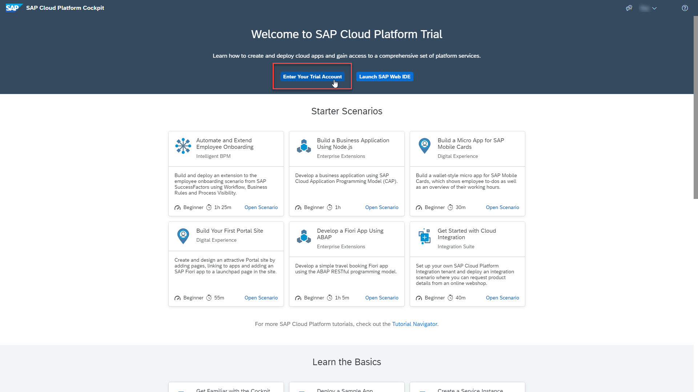

[DONE]
[ACCORDION-END]

[ACCORDION-BEGIN [Step: 2](Switch to subscriptions view)]

1. Select the tile of the subaccount in which you want to enable the SAP Business Application Studio subscription.

    >For the trial environment, SAP Business Application Studio is only available on Amazon Web Services (AWS) - Frankfurt region.

    >If you do not have a subaccount in this region, you need to create a new subaccount, where: Provider = **Amazon Web Services (AWS)** and Region = **Europe (Frankfurt)**.

    !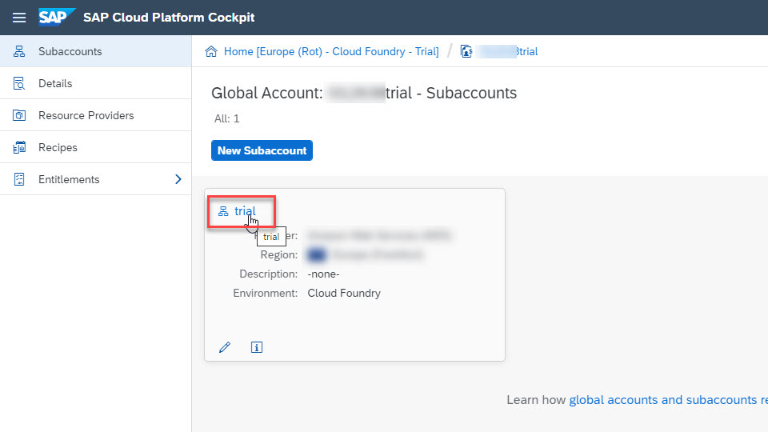

2. Click on **Subscriptions** in the Navigation area.

    !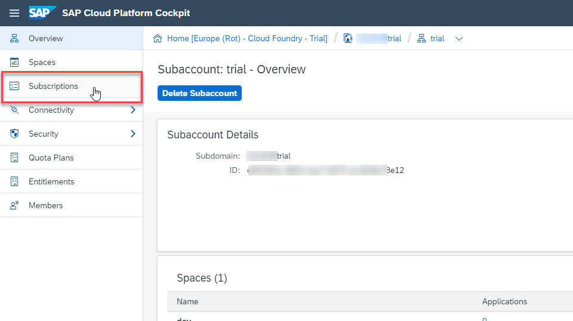

[VALIDATE_2]
[ACCORDION-END]

[ACCORDION-BEGIN [Step: 3](Add SAP Business Application Studio subscription to subaccount)]

In this step, you will add the SAP Business Application Studio subscription to a subaccount. Depending on when you created the SAP Cloud Platform account, this subscription might already be added in the subaccount.

1. In the **Subscriptions** page, search for **`studio`**.

2. Select the **SAP Business Application Studio** tile.

    !

3. Click on **Subscribe** to add the subscription to the subaccount.

    !

[DONE]
[ACCORDION-END]

[ACCORDION-BEGIN [Step: 4](Assign permissions)]

In this step, you will add the relevant role collections to your user.

Role collections are user-related authorizations that restrict access to resources and services based on defined user permissions. They consist of individual roles. The roles are based on role templates.

For SAP Business Application Studio, there are 2 role templates available: developer role and administrator role. The developer and administrator role collections, together with their corresponding templates, are created automatically when you subscribe to SAP Business Application Studio.

>The developer role allows developers to load and develop applications using SAP Business Application Studio.

>The administrator role allows administrators to manage (export and delete) user data.

1. Navigate to your subaccount.

    !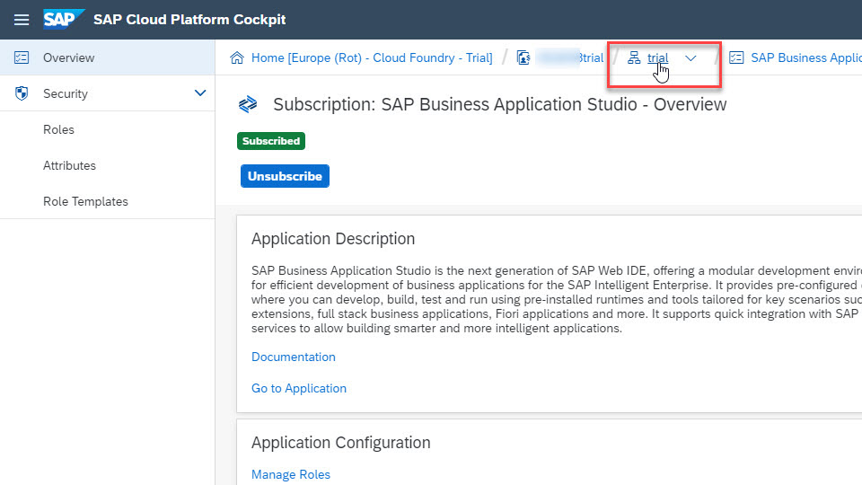

2. From the Navigation area, choose **Security > Trust Configuration**.

    !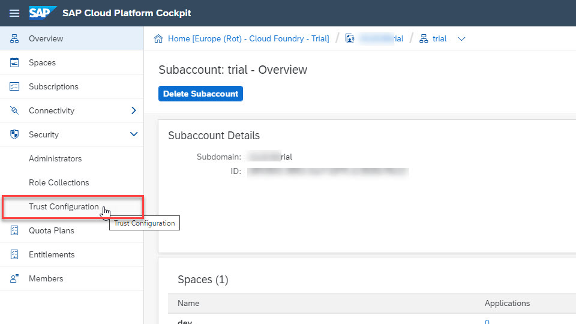

3. Select the relevant `IdP` (SAP ID Service).

    !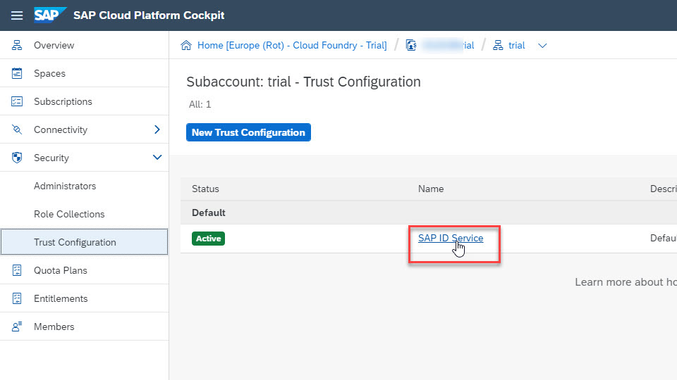

4. From the Navigation area, choose **Role Collection Assignment**, and enter the e-mail of the user to whom you want to give permissions.

    !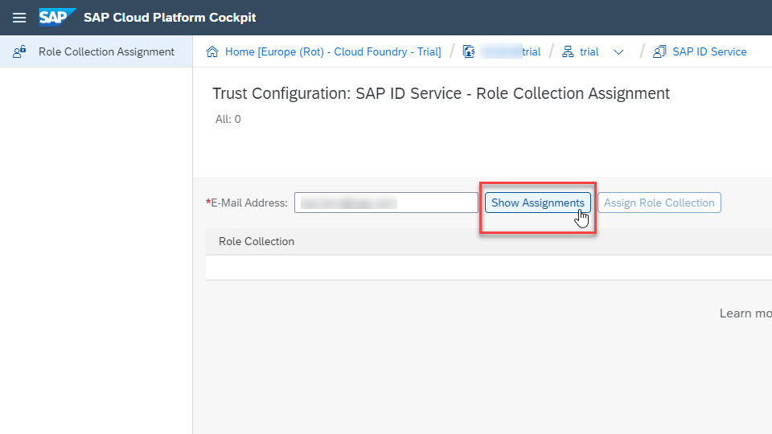

5. Click **Assign Role Collection**.

    !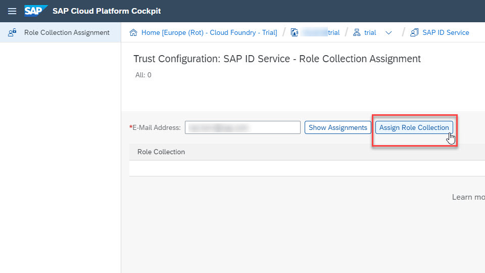

6. From the **Role Collection** dropdown list, select the **`Business_Application_Studio_Administrator`** role collection, and click **Assign Role Collection**.

    !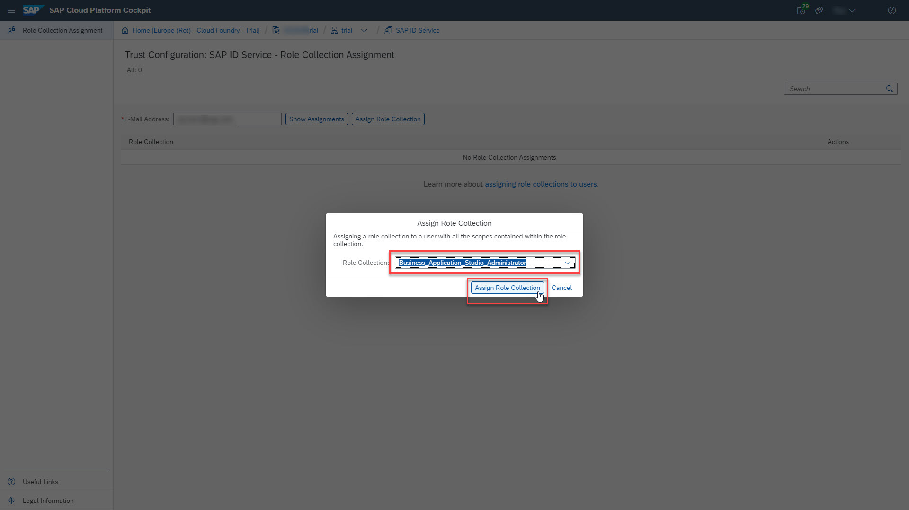

7. Repeat the role collection assignment for the **`Business_Application_Studio_Developer`** role collection.

    !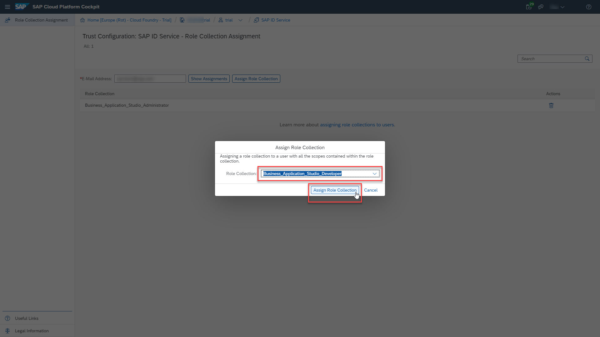

[DONE]
[ACCORDION-END]

[ACCORDION-BEGIN [Step: 5](Launch SAP Business Application Studio)]

1. Navigate to your subaccount.

    !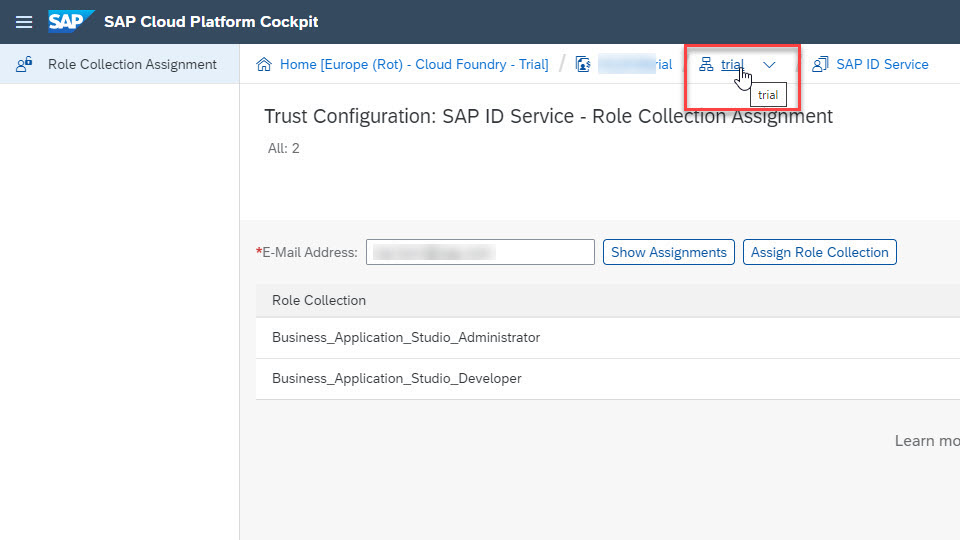

2. Click on **Subscriptions** in the Navigation area.

    !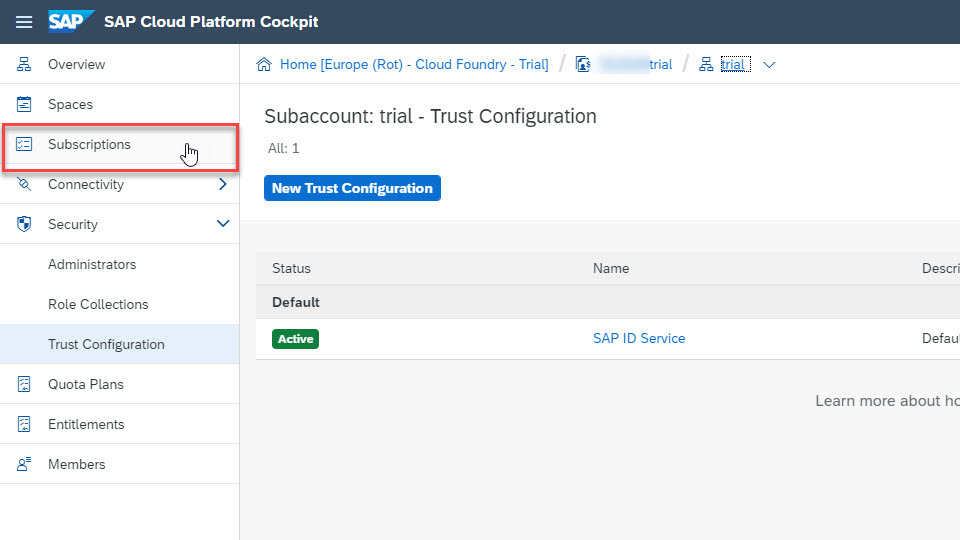

3. In the **Subscriptions** page, search for **`studio`**.

4. Click **Go to Application**.

    !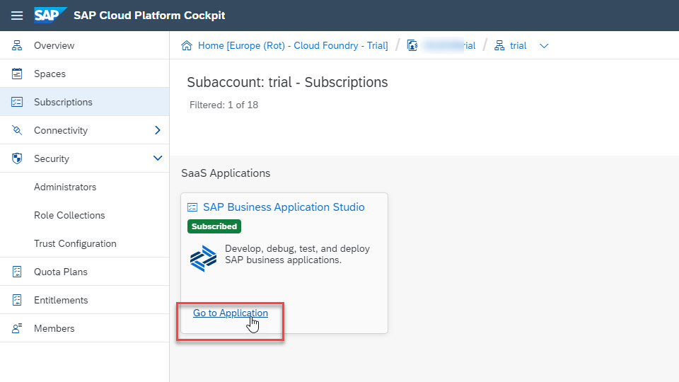

5. Enter your credentials, and click **Log On**.

    !

6. Click **OK** to accept the legal terms.

    !

7. A new tab opens and SAP Business Application Studio loads.

    >**Bookmark this page!**

    >If you create a bookmark to this page, it is easy to get back to SAP Business Application Studio later.

    !

[DONE]
[ACCORDION-END]

---
