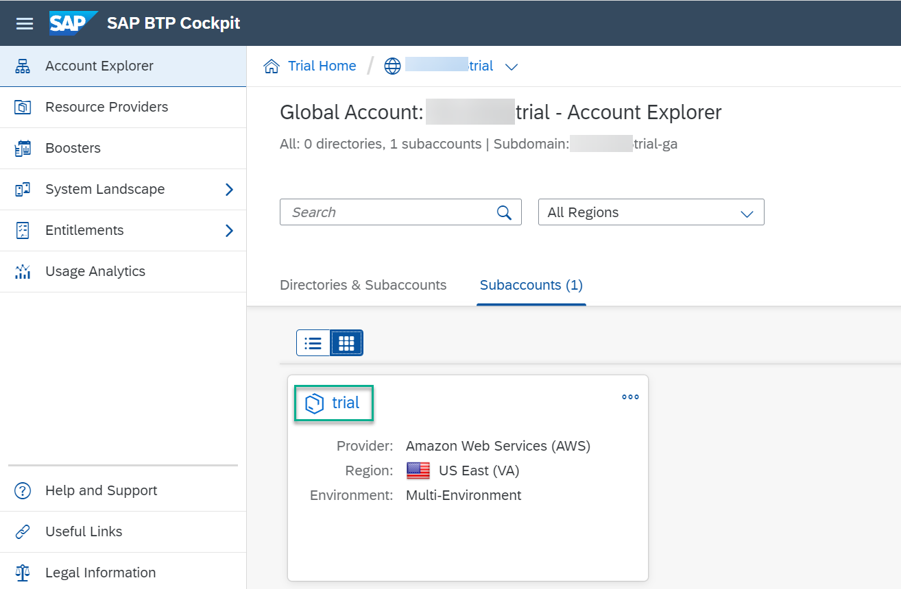
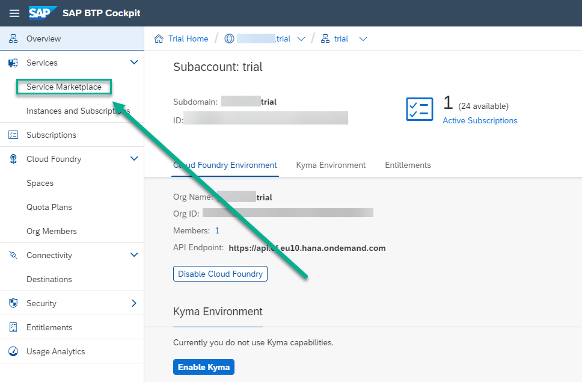
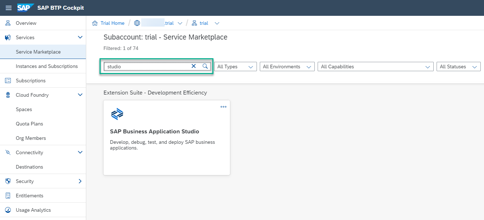
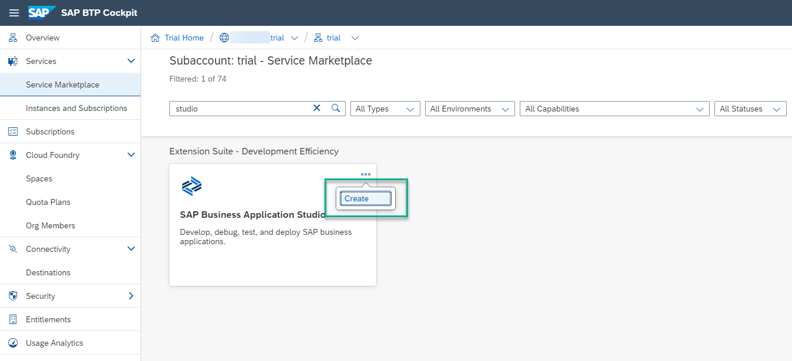
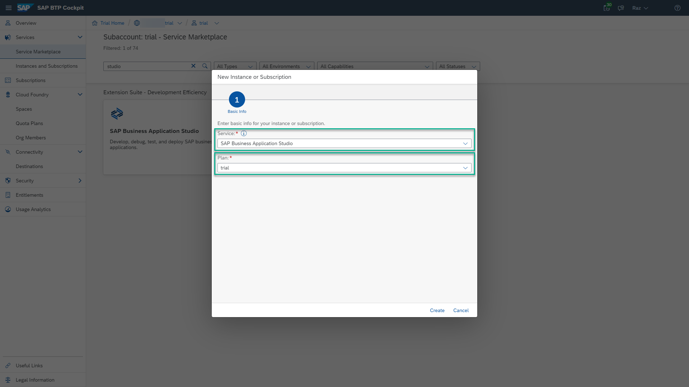
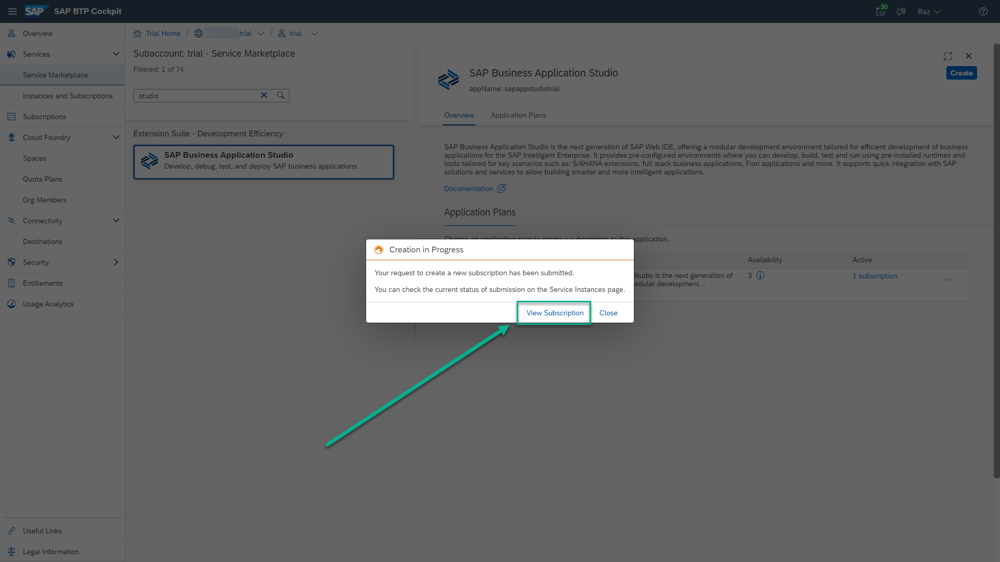
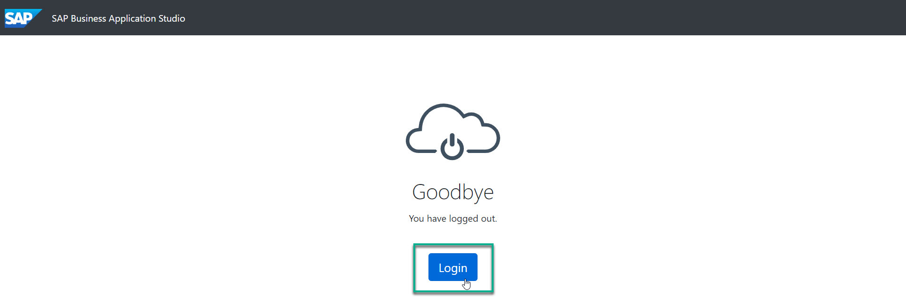

## Prerequisites
 - You have an SAP BTP Trial account: [Get a Free Account on SAP BTP Trial](hcp-create-trial-account)

## Details
### You will learn
  - How to set up SAP Business Application Studio

This tutorial is based on the procedure described in the [Getting Started](https://help.sap.com/viewer/9d1db9835307451daa8c930fbd9ab264/Cloud/en-US/19611ddbe82f4bf2b493283e0ed602e5.html) topic of the SAP Business Application Studio Administrator Guide.

---

[ACCORDION-BEGIN [Step: 1](Log into SAP BTP Trial)]

1. Go to <https://account.hanatrial.ondemand.com> and log in to your SAP BTP cockpit.

2. You might be asked to accept the legal terms. Check the box and click **Accept**.

    !

[DONE]
[ACCORDION-END]

[ACCORDION-BEGIN [Step: 2](Launch SAP Business Application Studio)]

1. Click **SAP Business Application Studio** to launch SAP Business Application Studio.

    !

    >In recently created trial accounts, SAP Business Application Studio is subscribed to by default.

    >If you receive an error message and your recently created account was created with error, it is recommended that you re-create your account: delete the account and then [Get a Free Account on SAP BTP Trial](hcp-create-trial-account).

    >**CAUTION:** If you receive an error message and your account was not created recently, you need to add a subscription to SAP Business Application Studio. Answer the validation question of the current step, go to the next step in this tutorial, and proceed from there.

2. You might be asked to accept the legal terms. Check the box and click **OK**.

    !

3. A new tab opens. If you have not created a dev space, the welcome page for SAP Business Application Studio loads.

    !

    >If this is not the first dev space, the dev space manager for SAP Business Application Studio loads.

    >!

4. Click **My Dev Spaces** to open the SAP Business Application Studio dev space manager page.

    !

    >Dev space manager for SAP Business Application Studio
    >!

    >**Bookmark this page!**

    >If you create a bookmark to this page, it is easy to get back to SAP Business Application Studio later.

     
    >**PAY ATTENTION:** If you reached this point in the tutorial, you have successfully on-boarded SAP Business Application Studio. Answer the validation question of the current tutorial step, and mark the rest of the steps as "Completed".

[VALIDATE_4]
[ACCORDION-END]

[ACCORDION-BEGIN [Step: 3](Add SAP Business Application Studio subscription to subaccount)]

Depending on when you created the SAP BTP Trial account, this subscription might already be added in the subaccount. If you are not subscribed to SAP Business Application Studio, follow this step to add the SAP Business Application Studio subscription to a subaccount.

1. Click **Enter Your Trial Account** to access the Cloud Foundry environment.

    !

2. Select the tile of the subaccount in which you want to enable the SAP Business Application Studio subscription.

    >For the trial environment, SAP Business Application Studio is only available on:

    > - Amazon Web Services (AWS) - Europe (Frankfurt) or US East (VA) regions.

    > - Microsoft Azure - Singapore region.

    >An updated list of regions is available in [SAP Discovery Center > Service Plan > Trial](https://discovery-center.cloud.sap/#/serviceCatalog/business-application-studio?tab=service_plan&licenseModel=free).

    >When creating an SAP BTP Trial account a **trial** subaccount is generated.

    !

3. From the navigation area, click **Service Marketplace**.

    !

4. In the **Service Marketplace** page, search for **`studio`**.

    !

5. Click **Actions** icon (three dots) to open the list of available actions.

    !

6. Click **Create** to launch the wizard for subscribing to SAP Business Application Studio.

    !

7. In the wizard verify that `SAP Business Application Studio` is selected in the **Service** field and `trial` is selected in the **Plan** field.

    !

8. Click **Create** to subscribe to SAP Business Application Studio.

    !

9. A **Creation in Progress** popup appears. Click **View Subscription** to view the SAP Business Application Studio subscription in the **Instances and Subscriptions** page.

    !

[DONE]
[ACCORDION-END]

[ACCORDION-BEGIN [Step: 5](Launch SAP Business Application Studio)]

1. Click **Go to Application**.

    !

2. You might be asked to accept the legal terms. Check the box and click **OK**.

    !

3. An **Access Denied** page may appear. Log out from SAP Business Application Studio and then log in as depicted below.

    !
    &nbsp;
    !

4. Enter your credentials, and click **Log On**.

    !

5. You might be asked to accept the legal terms. Check the box and click **OK**.

    !

6. A new tab opens and the welcome page for SAP Business Application Studio loads.

    !

7. Click **My Dev Spaces** to open the SAP Business Application Studio dev space manager page.

    !

    >Dev space manager for SAP Business Application Studio
    >!

    >**Bookmark this page!**

    >If you create a bookmark to this page, it is easy to get back to SAP Business Application Studio later.

[DONE]
[ACCORDION-END]

---

Congratulations!

With this, you have successfully completed the setup of SAP Business Application Studio.
