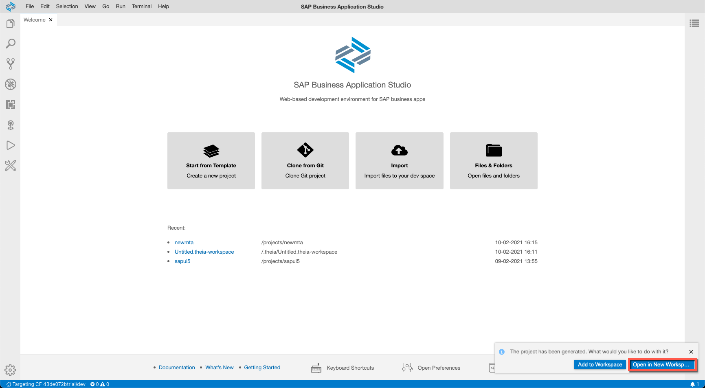
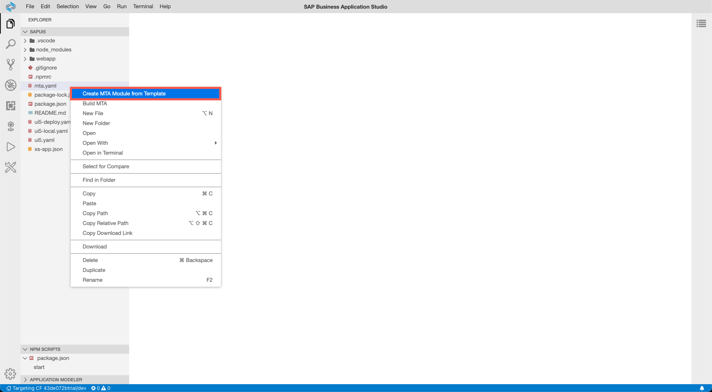

## Details
### You will learn
  - How to create an SAPUI5 project
  - How to build a project for Cloud Foundry
  - How to deploy a project to Cloud Foundry

---

[ACCORDION-BEGIN [Step : ](Open the Fiori dev space)]


**Start** a dev space of kind *SAP Fiori* and **open** it by clicking its name.

!

> Have a look at [this tutorial](appstudio-devspace-fiori-create) if you are unsure how to get here or how to create a dev space.


[DONE]
[ACCORDION-END]
[ACCORDION-BEGIN [Step : ](Create a UI5 destination)]

[Create a new destination](cp-cf-create-destination) of the name "ui5" that points to the URL `https://sapui5.hana.ondemand.com/`. This is where we'll pull the standard UI5 libs from later.


[DONE]
[ACCORDION-END]
[ACCORDION-BEGIN [Step : ](Connect to a Cloud Foundry endpoint)]

Make sure you are connected to a Cloud Foundry endpoint to which you will deploy the SAPUI5 application later.

1. Click on the bottom-left corner of the screen to start the connection flow.

    !

2. Enter the Cloud Foundry endpoint you want to use. If your environment runs in the EU10-region, this is `https://api.cf.eu10.hana.ondemand.com`. Enter your email and your password to proceed.

    !

3. Next, you need to select the Cloud Foundry Organization and space you want use. You will see that you are connected to the endpoint once these prompts have been answered.

    !


[DONE]
[ACCORDION-END]
[ACCORDION-BEGIN [Step : ](Create a new single-module-project)]
This step will guide you through the needed actions to create a project that contains a **single** SAPUI5 application. In case you want to create a project that contains multiple UI modules, please do not follow these instructions and rather create an empty MTA project to which you then add multiple UI modules.


1. Click on the link **Start from template** on the *Welcome* screen.

    !

2. Select **SAP Fiori freestyle SAPUI5 application** as the template category you want to use and click **Start**.

    !

3. Specify the application type **SAPUI5 freestyle** and the floor plan **SAPUI5 Application** and go to the **Next** screen.

    !

4. Now you have the option to connect your SAPUI5 application to a data source. As we won't need a data source in this tutorial, select **None** and click **Next**.

    !

4. Keep the default view name and click **Next** .

    !

4.   Name of the module **`sapui5`**, use the application title  **`Tutorial`**, define the namespace **`sap.btp`**, and **Add deployment configuration**. Keep the default values for the other parameters and select **Next** to go to the next step.

    !

4.  Choose **Cloud Foundry** as the target runtime and type in any value for the destination as it is a mandatory field. Press **Finish** to create the new project.

    !


4. Once you see the success message, click **Open in a new Workspace** to open the new project.


    !


[DONE]
[ACCORDION-END]
[ACCORDION-BEGIN [Step : ](A managed application router)]

The project is already deployable as it. But there is one thing missing in order make it accessible from your browser - [the managed application router](https://blogs.sap.com/2020/10/02/serverless-sap-fiori-apps-in-sap-cloud-platform/#serverless):

1. Right-click on the `mta.yaml` file and select **Create MTA Module from Template**.

    !

2.  Choose **Approuter Configuration** and **Start** to continue in the wizard.

    !


2.  Select **Managed Approuter** as there's not need to extend the approuter and therefore reduce the TCO of the project. Enter **`basic.service`** as the name of out business service and hit **Next** to close in the wizard.

    !

1. Now we need to reuse this business service in our web app. Open `webapp/manifest.json` and add the following lines.

    ```JSON[15-17]
    {
        "_version": "1.29.0",
        "sap.app": {
            "id": "sap.btp.sapui5",
            "type": "application",
            "i18n": "i18n/i18n.properties",
            "applicationVersion": {
                "version": "1.0.0"
            },
            "title": "",
            "description": "",
            "resources": "resources.json",
            "ach": "ach"
        },
        "sap.cloud": {
            "service": "basic.service"
        },
        "sap.ui": {
        ...
    ```

1. There's currently one glitch in the wizard that we need to fix manually. Go to the `mta.yaml` file and add the highlighted line.

    ```YAML[26]
    _schema-version: "3.2"
    ID: sap-btp-sapui5
    description: A Fiori application.
    version: 0.0.1
    modules:
      ...
      - name: sap-btp-sapui5-destination-content
        type: com.sap.application.content
        requires:
        - name: sap-btp-sapui5-destination-service
          parameters:
            content-target: true
        - name: sap-btp-sapui5-html5-repo-host
          parameters:
            service-key:
              name: sap-btp-sapui5-html5-repo-host-key
        - name: uaa_sap-btp-sapui5
          parameters:
            service-key:
              name: uaa_sap-btp-sapui5-key
        parameters:
          content:
            instance:
              destinations:
              - Name: basic_service_sap_btp_sapui5_html5_repo_host
                ServiceInstanceName: sap-btp-sapui5-html5-repo-host
                ServiceKeyName: sap-btp-sapui5-html5-repo-host-key
                sap.cloud.service: basic.service
              - Authentication: OAuth2UserTokenExchange
                Name: basic_service_uaa_sap_btp_sapui5
                ServiceInstanceName: sap-btp-sapui5-xsuaa-service
                ServiceKeyName: uaa_sap-btp-sapui5-key
                sap.cloud.service: basic.service
              existing_destinations_policy: ignore
        build-parameters:
          no-source: true
       ...
    ```


[DONE]
[ACCORDION-END]
[ACCORDION-BEGIN [Step : ](Build the application)]

Build (aka package) the project to a `mtar` archive to deploy it to Cloud Foundry.  

1. Right-click on the `mta.yaml` file and select **Build MTA** to trigger this process.

    !

3. Once the build is complete, you can see a message in the log. You can now find the generated `mtar` archive in the project tree under `mta_archives`.

    !


[DONE]
[ACCORDION-END]
[ACCORDION-BEGIN [Step : ](Deploy the archive to Cloud Foundry)]

Now that you created a `mtar` archive, you are all set to deploy the application.

1. Right-click on the `mtar` file and select **Deploy** and **Deploy MTA Archive**.

    !

2. Check the console output to make sure the process started.

3. You will see a success message and the URL of the app in the log once the deployment finished.

    !

4.   You can see the URL of the deployed app when running `cf html5-list -di sap-btp-sapui5-destination-service -u` in a new terminal session.

    !

    > You need to substitute the `cpp` with `launchpad`, in case you use the Launchpad service (instead of the Portal service).

[DONE]
[ACCORDION-END]

[ACCORDION-BEGIN [Step : ](Test to the application)]

1. **Open** the started application in your browser. You might need to log in with your SAP ID (the same credentials you use for the SAP BTP Cockpit).


2. See that the sample application consists of a header and an empty page. So you should see something like this:

!


Enter the URL of your running application:

[VALIDATE_1]
[ACCORDION-END]
