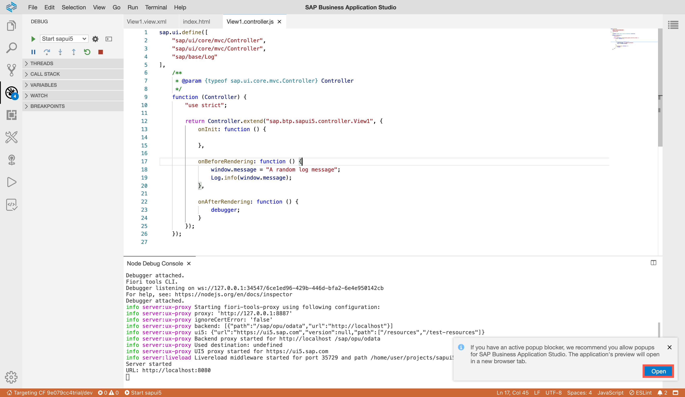
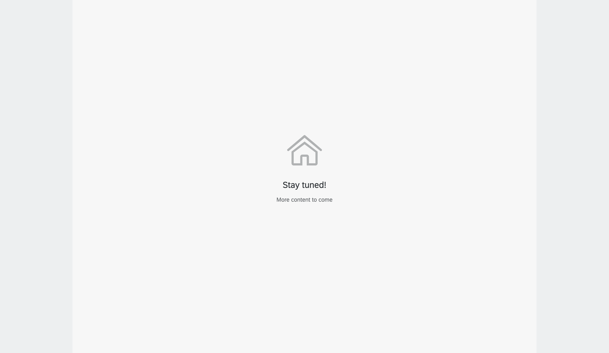
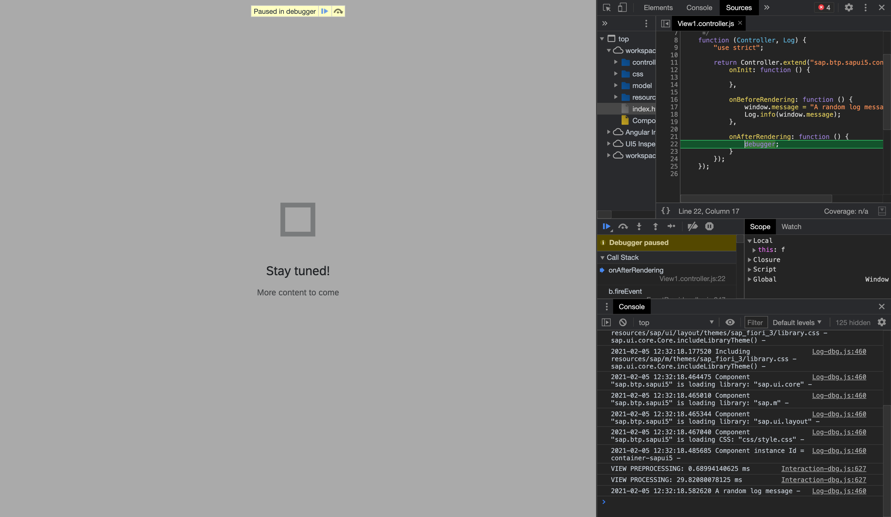

## Details
### You will learn
  - How to add breakpoints to your JavaScript code
  - How to log data to the console
  - How to use the Google Chrome DevTools

---

[ACCORDION-BEGIN [Step : ](Add a message page)]

Add a simple message page to let the users know you are still working on this app.

Replace the existing page in the file `webapp/webapp/view/View1.view.xml` with
```JavaScript [5]
<mvc:View controllerName="sap.cp.webapp.controller.View1" xmlns:mvc="sap.ui.core.mvc" displayBlock="true" xmlns="sap.m">
	<Shell id="shell">
		<App id="app">
			<pages>
				<MessagePage showHeader="false" description="More content to come" text="Stay tuned!" icon="sap-icon://home"/>
			</pages>
		</App>
	</Shell>
</mvc:View>
```


[DONE]
[ACCORDION-END]

[ACCORDION-BEGIN [Step : ](Change the log level)]

Add the following line to the `webapp/webapp/index.html` file to change to log level.
```HTML [14]
<!DOCTYPE html>
<html>
	<head>
		<meta charset="utf-8">
	    <meta name="viewport" content="width=device-width, initial-scale=1.0">
		<title>webapp</title>
		<script id="sap-ui-bootstrap"
			src="https://sapui5.hana.ondemand.com/resources/sap-ui-core.js"
			data-sap-ui-theme="sap_belize"
			data-sap-ui-resourceroots='{"sap.cp.webapp": "./"}'
			data-sap-ui-compatVersion="edge"
			data-sap-ui-oninit="module:sap/ui/core/ComponentSupport"
			data-sap-ui-async="true"
			data-sap-ui-logLevel="debug"
			data-sap-ui-frameOptions="trusted">
		</script>
	</head>
	<body class="sapUiBody">
		<div data-sap-ui-component data-name="sap.cp.webapp" data-id="container" data-settings='{"id" : "webapp"}'></div>
	</body>
</html>
```

> The log level acts like a filter and hides all log messages below the defined severity.


[DONE]
[ACCORDION-END]
[ACCORDION-BEGIN [Step : ](Write a log message to the console)]

Import the logger to the file `webapp/webapp/controller/View1.controller.js` and add this `onBeforeRendering` as well. This `Log` object allows you to write messages to the console.

Replace the highlighted lines from this snippet:
```JavaScript [2,3,8,14-19]
sap.ui.define([
    "sap/ui/core/mvc/Controller",
    "sap/base/Log"
],
	/**
     * @param {typeof sap.ui.core.mvc.Controller} Controller
     */
    function (Controller, Log) {
        "use strict";

        return Controller.extend("sap.cp.webapp.controller.View1", {
            onInit: function () {

            },

            onBeforeRendering: function () {
                window.message = "A random log message";
                Log.info(window.message);
            },
        });
    });

```


> This `onBeforeRendering` method is called every time the view is rendered. E.g., before the renderer is called and the HTML is placed in the DOM-Tree. It can be used to perform clean-up-tasks before re-rendering.


[DONE]
[ACCORDION-END]

[ACCORDION-BEGIN [Step: ](Add a breakpoint)]

Add this `onAfterRendering` hook to the same file to place a breakpoint in your code. A breakpoint will cause your app to stop when the execution thread reaches it. This gives you the chance to inspect the state of your app.
```JavaScript [21-23]
sap.ui.define([
    "sap/ui/core/mvc/Controller",
    "sap/base/Log"
],
	/**
     * @param {typeof sap.ui.core.mvc.Controller} Controller
     */
    function (Controller, Log) {
        "use strict";

        return Controller.extend("sap.cp.webapp.controller.View1", {
            onInit: function () {

            },

            onBeforeRendering: function () {
                window.message = "A random log message";
                Log.info(window.message);
            },

            onAfterRendering: function () {
                debugger;
            }
        });
    });

```

This `onAfterRendering` method is called every time the view is rendered after the HTML is placed in the DOM-Tree. It can be used to apply modifications to the DOM after the Renderer has finished.


> Don't worry if the SAP Business Application Studio complains about the "debugger" keyword. This warning is valid as breakpoints should not be shipped in production-ready code, but for the sake of learning, this is fine.


[DONE]
[ACCORDION-END]
[ACCORDION-BEGIN [Step: ](Create a new run configuration)]

Create a run configuration to be able to run the web app. This configuration needs to be created only once.

1. To run the UI module, switch to the **Run Configuration** panel on the left-hand bar. Click on the **+** icon to add a new run configuration.

    !


2. The first prompt will ask you which module you want to run, select **`webapp (html5)`** to continue.

    !

3. In the prompt, select **`index.html`** to add a new run configuration for your app.

    !


4. Choose the latest UI5 version.

    !


5. Choose **`Run Web App`** as the name of the configuration.

    !

[DONE]
[ACCORDION-END]
[ACCORDION-BEGIN [Step: ](Run the web app)]

Running your application has several advantages over deploying it. Among others, it's faster, doesn't require a "build" step and won't minify your JavaScript codebase.

1. To run the configuration you just created.

    !


2. Now the SAP Business Application Studio will start the app. When promoted, selected **Expose and open** to make the local port accessible for debugging. Choose any description for this port.

    !


3. A new tab should open that displays the following page.

    !


[DONE]
[ACCORDION-END]
[ACCORDION-BEGIN [Step: ](Stop at the breakpoint)]
Open the Chrome DevTools (or the [dev tools of your favorite browser](https://www.lifewire.com/web-browser-developer-tools-3988965)) by clicking **F12**. **Refresh the page** to run the script one more time.

You should now see that the app reached the breakpoint (the dev tools automatically switched to the `Sources` tab).



Run `console.log(message.replace("random", "Hello-World"))` in the console of the DevTools.

[VALIDATE_1]
[ACCORDION-END]
[ACCORDION-BEGIN [Step : ](Check the log message)]

Click **F8** to jump over the breakpoint and switch to the `Console` tab.
Now you should see your error message printed in red.

Can you spot the line in which you invoked the error message?


[DONE]
[ACCORDION-END]

---
