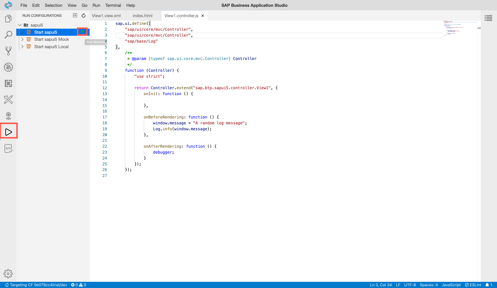

## Details
### You will learn
  - How to add breakpoints to your JavaScript code
  - How to log data to the console
  - How to use the Google Chrome DevTools

---

[ACCORDION-BEGIN [Step : ](Add a message page)]

Add a simple message page to let the users know you are still working on this app.

Replace the existing page in the file `webapp/view/View1.view.xml` with
```JavaScript [10]
<mvc:View
    controllerName="sap.btp.sapui5.controller.View1"
    xmlns:mvc="sap.ui.core.mvc"
    displayBlock="true"
    xmlns="sap.m"
>
	<Shell id="shell">
		<App id="app">
			<pages>
				<MessagePage showHeader="false" description="More content to come" text="Stay tuned!" icon="sap-icon://home"/>
			</pages>
		</App>
	</Shell>
</mvc:View>

```


[DONE]
[ACCORDION-END]

[ACCORDION-BEGIN [Step : ](Change the log level)]

Add the following line to the `webapp/index.html` file to change to log level.
```HTML [15]
<!DOCTYPE html>
<html>
    <head>
        <meta charset="utf-8" />
        <meta name="viewport" content="width=device-width, initial-scale=1.0" />
        <title>sapui5</title>
        <script
            id="sap-ui-bootstrap"
            src="resources/sap-ui-core.js"
            data-sap-ui-theme="sap_fiori_3"
            data-sap-ui-resourceroots='{"sap.btp.sapui5": "./"}'
            data-sap-ui-compatVersion="edge"
            data-sap-ui-oninit="module:sap/ui/core/ComponentSupport"
            data-sap-ui-async="true"
			data-sap-ui-logLevel="debug"
            data-sap-ui-frameOptions="trusted"
        ></script>
    </head>
    <body class="sapUiBody">
        <div
            data-sap-ui-component
            data-name="sap.btp.sapui5"
            data-id="container"
            data-settings='{"id" : "sapui5"}'
        ></div>
    </body>
</html>

```

> The log level acts like a filter and hides all log messages below the defined severity.


[DONE]
[ACCORDION-END]
[ACCORDION-BEGIN [Step : ](Write a log message to the console)]

Import the logger to the file `webapp/controller/View1.controller.js` and add this `onBeforeRendering` as well. This `Log` object allows you to write messages to the console.

Replace the highlighted lines from this snippet:
```JavaScript [2,3,8,14-19]
sap.ui.define([
    "sap/ui/core/mvc/Controller",
    "sap/base/Log"
],
	/**
	 * @param {typeof sap.ui.core.mvc.Controller} Controller
	 */
    function (Controller, Log) {
        "use strict";

        return Controller.extend("sap.btp.sapui5.controller.View1", {
            onInit: function () {

            },

            onBeforeRendering: function () {
                window.message = "A random log message";
                Log.info(window.message);
            },
        });
    });
```


> This `onBeforeRendering` method is called every time the view is rendered. E.g., before the renderer is called and the HTML is placed in the DOM-Tree. It can be used to perform clean-up-tasks before re-rendering.


[DONE]
[ACCORDION-END]

[ACCORDION-BEGIN [Step: ](Add a breakpoint)]

Add this `onAfterRendering` hook to the same file to place a breakpoint in your code. A breakpoint will cause your app to stop when the execution thread reaches it. This gives you the chance to inspect the state of your app.
```JavaScript [21-23]
sap.ui.define([
    "sap/ui/core/mvc/Controller",
    "sap/base/Log"
],
	/**
	 * @param {typeof sap.ui.core.mvc.Controller} Controller
	 */
    function (Controller, Log) {
        "use strict";

        return Controller.extend("sap.btp.sapui5.controller.View1", {
            onInit: function () {

            },

            onBeforeRendering: function () {
                window.message = "A random log message";
                Log.info(window.message);
            },

            onAfterRendering: function () {
                debugger;
            }
        });
    });

```

This `onAfterRendering` method is called every time the view is rendered after the HTML is placed in the DOM-Tree. It can be used to apply modifications to the DOM after the Renderer has finished.


> Don't worry if the SAP Business Application Studio complains about the "debugger" keyword. This warning is valid as breakpoints should not be shipped in production-ready code, but for the sake of learning, this is fine.


[DONE]
[ACCORDION-END]
[ACCORDION-BEGIN [Step: ](Run the web app)]

Running your application has several advantages over deploying it. Among others, it's faster, doesn't require a "build" step and won't minify your JavaScript codebase.

1. To run the pre-generated run configuration, switch to the **Run Configuration** panel on the left-hand bar. Click on the **▶️** icon of the first run configuration to add start the SAPUI5 app.

    !


2. Now the SAP Business Application Studio will start the app. When promoted, selected **Open** to make the local port accessible for debugging.

    !


3. A new tab should open that displays the following page.

    !


[DONE]
[ACCORDION-END]
[ACCORDION-BEGIN [Step: ](Stop at the breakpoint)]
Open the Chrome DevTools (or the [dev tools of your favorite browser](https://www.lifewire.com/web-browser-developer-tools-3988965)) by clicking **F12**. **Refresh the page** to run the script one more time.

You should now see that the app reached the breakpoint (the dev tools automatically switched to the `Sources` tab).


Run `console.log(message.replace("random", "Hello-World"))` in the console of the DevTools.

[VALIDATE_1]
[ACCORDION-END]
[ACCORDION-BEGIN [Step : ](Check the log message)]

Click **F8** to jump over the breakpoint and switch to the `Console` tab.
Now you should see your error message printed in red.

Can you spot the line in which you invoked the error message?


[DONE]
[ACCORDION-END]

---
