# Create a UI5 Integration Card that Displays Data from the SAP Gateway Demo System
<!-- description --> Create a UI5 integration card in SAP Build Work Zone to display data from the backend SAP Gateway Demo System.

## Prerequisites
- Please note that if you are following this tutorial as part of a workshop, you can skip these prerequisites.
- You have an account on the SAP Gateway Demo System. See [Create an Account on the SAP Gateway Demo System](gateway-demo-signup).
- You have connected the SAP BTP to your SAP Gateway Demo System Account. See [Connect SAP BTP to Your SAP Gateway Demo System Account (ES5)](cp-portal-cloud-foundry-gateway-connection).
- You have created a dev space. See [Create a Dev Space for SAP Fiori Apps](appstudio-devspace-fiori-create).
- To deploy a UI5 Integration card in the SAP Build Work Zone, you should have a subaccount in SAP BTP that includes a subscription to the SAP Build Work Zone service. Additionally, you have to configure a destination for SAP Build Work Zone instance See [Creating a Destination to the Content Repository](https://help.sap.com/docs/WZ/7d3b9c7211ca4d7a9630b524205ee836/4a90162810014b9396dd0edd00b9bc78.html).


>**IMPORTANT:** SAP Build Work Zone is not available in a trial account. If you only have a trial account and you want to learn more about the Integration cards you can follow this tutorial from steps 1 to 5.


## You will learn
- How to create a card for SAP Build Work Zone using SAP Business Application Studio (BAS)
- What the main elements of the Integration card are and understand their roles

## Intro
Integration cards are UI elements which display concise pieces of information in a limited-space container. Cards are small previews of application content, and each card represents a specific topic, task, or perspective. As a card developer, you only need to configure a descriptor (`manifest.json` file) and as a result you get fully functional and reusable card.


### Check for Development Tools for SAP Build Work Zone extension


>If you are following this tutorial as part of a workshop, please skip this step.

1. In SAP Business Application Studio, stop the dev space if it is not already stopped.

2. Edit the dev space by selecting the Edit button.

    <!-- border -->

3. Ensure that the **Development Tools for SAP Build Work Zone** extension is checked and save the changes.

    <!-- border -->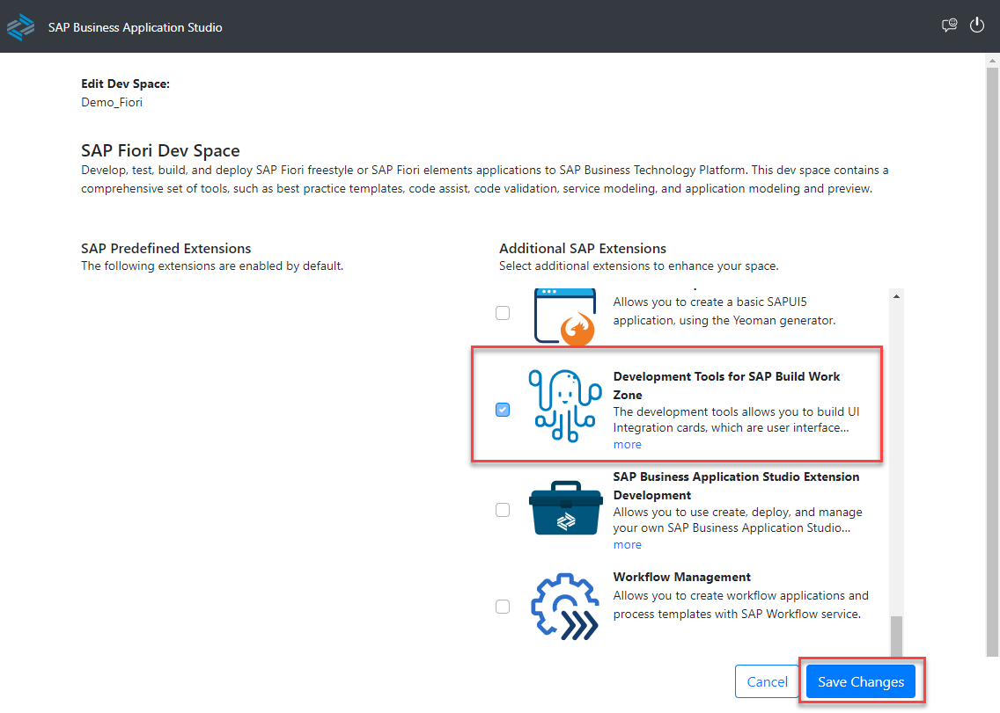


### Create application and run it


1. Open the dev space (If the dev space is not running, you first have to start it).

    <!-- border -->

2. Select **Start from template**.

    <!-- border -->

3. Choose the **UI Integration Card template** and select **Start**.

    <!-- border -->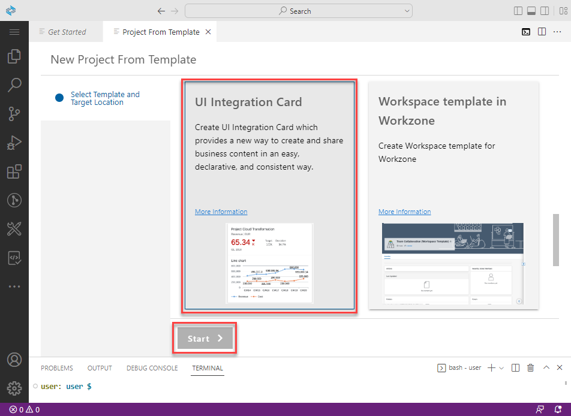

4. Fill-in the required project details. Use the **Highlight Card** template, which creates an Integration card of type List and select Finish.
>If you are following this tutorial as part of a workshop, please give your card a unique name. In this case your card name should be `wz<your unique identifier>_products_by_category_card`.

    | Description                                        | Value   
    | :-------------                                     | :-------------
    | Project Name                                       | `products_by_category_card` If you're taking part in a workshop, please add your unique identifier to the project name like this: `<your unique identifier>_products_by_category_card`.
    | Name Space                                         | `ns`
    | Select a Card Sample (dropdown menu)               | `Highlight Card`
    | Title                                              | `Products by Category Card`
    | Subtitle                                           | `UI5 Integration Card of Type List`
    | Compatible with SAP Mobile Cards (dropdown menu)   | `False`

    <!-- border -->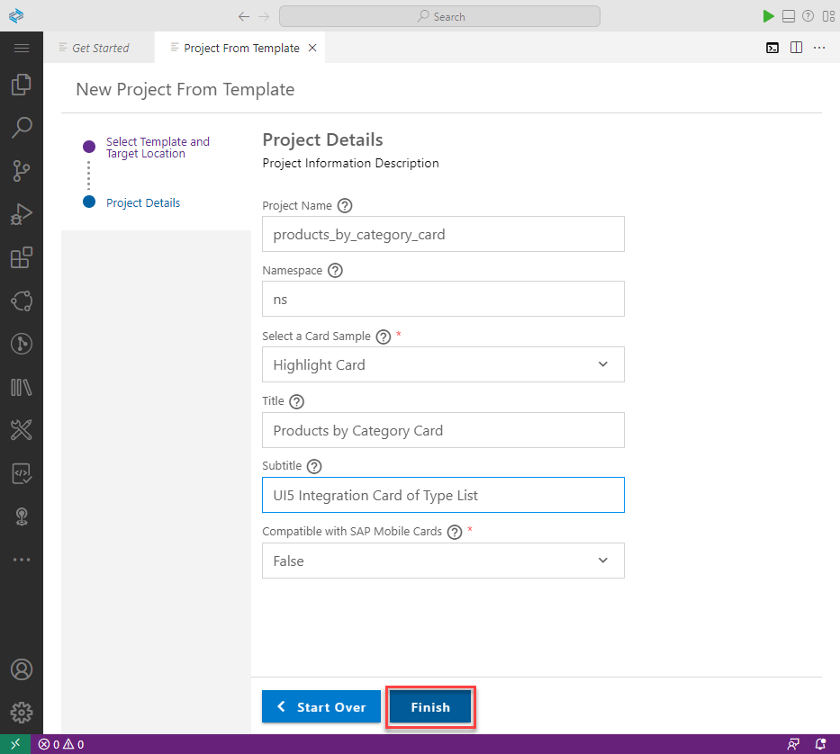

5. To see the card, right-click on `manifest.json` and select **UI Integration Card: Preview**.

    <!-- border -->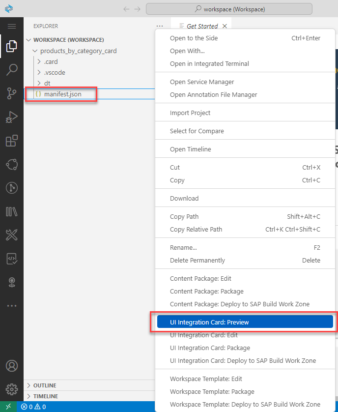

6. Currently the card displays only static data:

    <!-- border -->

7. Open the `manifest.json` file. Everything needed to render the card is described in this file.

    The `manifest.json` is a simple JSON file and has the following structure (check the picture below to see where each part is located):

    - `sap.app` namespace declaration. The `type: card` defines that this is a manifest for a card.  Each card has a unique ID.

    - `sap.card` section:
    <ul><li>Card type (List): Defines how the card is displayed. It could be one of the available content types - Adaptive, Component, Analytical, List, etc.
      </li><li>Header: Displays general information about the card. Using its properties, you can configure the title, subtitle, status text, and icon.
      </li><li>Content: This is the main section of the displayed card.</li></ul>

    - `data` sections: Define how the card handles its data. It can provide static data (see the `json` object below) or define required parameters for a data request to a backend system. Can be set on different levels (card, header, filter-definition, or content). The inner level data sections take precedence. In the example below the data section is defined on content level.

    <!-- border -->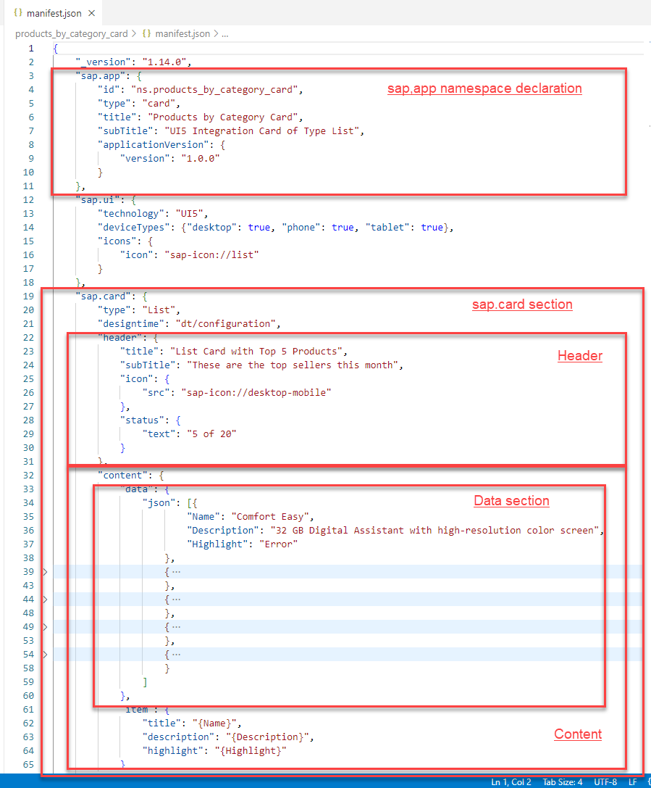

In the next steps you edit the `manifest.json` file to configure the card.


### Add destination to connect to Gateway
 By connecting your card to the SAP Gateway Demo System (ES5), you're enabling the card to display dynamic data. Card destinations are used for outbound communication to a remote resource and contain the required connection information.

1. To set a destination, add the following `configuration` section in the `sap.card` section after the `type` subsection. Note, that the card destination is pointing to the same (ES5) destination that is set on the subaccount level.

    ```JSON
      "configuration": {
                            "destinations": {
                                "ES5": {
                                    "name": "ES5",
                                   "defaultUrl": "/sap/opu/odata/sap/EPM_REF_APPS_SHOP_SRV/"
                                }
                            }
                        },
    ```

      <!-- border -->

2. To configure a data request pointing to the SAP Gateway Demo System, add a new `data` section after the `configuration`. In this way the `data` section will be defined on a card level. Note, that our destination is referred here using the double-bracket syntax `{{destinations.ES5}}`.

    ```JSON
    "data": {
    	"request": {
    "url": "{{destinations.ES5}}/sap/opu/odata/sap/EPM_REF_APPS_SHOP_SRV/Products",
    "withCredentials": true
                                },
                    "path": "/d/results"
            },
    ```

    <!-- border -->

3. To display the dynamically requested data, replace the static `content` section with the following one. The `title`, `description`, `icon`, and `info` properties are now dynamically requested.

    ```JSON
    "content": {
                "item": {
                    "title": "{Name}",
                    "description": "{Description}",
                    "icon": {
                        "src": "{ImageUrl}"
                    },
                    "info": {
                        "value": "{AverageRating}",
                        "state": "{= ${AverageRating} > 3.5 ? 'Success' : 'Warning' }"
                    }
                },
                "maxItems": 5
            }
    ```

      <!-- border -->

**Results after Step 3:**

The application displays dynamic data loaded from the SAP Gateway Demo System (ES5). Note, that the actual displayed products may differ depending on the current data in the ES5 demo system. You can also check the [manifest.json](https://raw.githubusercontent.com/SAPDocuments/Tutorials/master/tutorials/appstudio-sapui5-integrationcard-create/manifest_after_step3.json) file at this step. To learn more, see the [Destinations](https://sapui5.hana.ondemand.com/test-resources/sap/ui/integration/demokit/cardExplorer/webapp/index.html#/learn/features/destinations) and [Data](https://sapui5.hana.ondemand.com/test-resources/sap/ui/integration/demokit/cardExplorer/webapp/index.html#/learn/features/data) sections in the Card Explorer.


<!-- border -->

If you would like to deploy the card and see how it looks on SAP Build Work Zone, you can skip to Step 6 and deploy it. In the next steps you add card capabilities that can make your card more interactive.


### Add manifest parameters
 Manifest parameters provide dynamic values for card attributes. They are replaced during manifest processing and can be used with the double-bracket syntax like: `{{parameters.city}}`. As an example, in this step you will add parameters to set the header (`title` and `subTitle`) properties and the number (`maxItems`) of displayed items in the content.

>If you are following this tutorial as part of a workshop and run out of time, you can skip steps 4,5,6 and create a simpler card. You can later read the steps you missed.

1. To define parameters - add the following `parameters` subsection in the `manifest.json` in the `configuration` section (note the comma which divides the entries).

    ```JSON
    ,
                                "parameters": {
                                    "title" : {
                                        "value": "List Card with Top {{parameters.maxItems}} Products"
                                    },
                                    "subTitle": {
                                        "value": "These are the top sellers this month"
                                    },
                                    "maxItems": {
                                        "value": 4
                                  		  }
               		 	             }
    ```

      <!-- border -->

2. To use the new `maxItems` parameter, replace the `maxItems: 5` static value in the `content` section with the (`maxItems`) parameter as shown below:

    ```JSON
    "maxItems": "{{parameters.maxItems}}"
    ```

      <!-- border -->

3. Let's also use the new parameters in the `header` section. Use the double-bracket syntax and edit (or replace) the header, so it looks like this:

    ```JSON
    "header": {
    			"title": "{{parameters.title}}",
    			"subTitle": "{{parameters.subTitle}}",
    			"icon": {
    				"src": "sap-icon://desktop-mobile"
    			},
    			"status": {
    				"text": "{{parameters.maxItems}} of 20"
    			}
    		},
    ```

      <!-- border -->

**Results after Step 4:**

In this step you have learned how to declare configurable parameters and use them to achieve desired dynamic behavior. The application now displays a list of 4 items according to the `parameters` property (`maxItems value: 4`).

<!-- border -->

To learn more, see the [Manifest Parameters](https://sapui5.hana.ondemand.com/test-resources/sap/ui/integration/demokit/cardExplorer/webapp/index.html#/learn/features/manifestParameters) section in the Card Explorer.


### Add user interaction with filtering
 You can make the card even more dynamic when using filters. Filters appear as a dropdown under the card header, and users can interact to customize the data shown by the card. The value of each filter can be used inside a data request definition by using the `{filters>/myFilter/value}` placeholder. When the end user selects different value from the dropdown - a new data request is made with the updated value. As an example, in this step you will add a filter that enables users to filter products by a selected category.

1. Add a `filters` subsection in the `configuration` section. It defines a dropdown list with product categories, which are received by a data request.

    ```JSON
    ,
            "filters": {
                "mainCategory": {
                    "value": "{{parameters.selectedCategoryName}}",
                    "type": "string",
                    "label": "Main Category",
                    "description": "Filter products by main category.",
                    "item": {
                        "path": "/d/results",
                        "template": {
                            "key": "{Id}",
                            "title": "{Name}"
                        }
                    },
                    "data": {
                        "request": {
                            "url": "{{destinations.ES5}}/sap/opu/odata/sap/EPM_REF_APPS_SHOP_SRV/MainCategories",
                            "withCredentials": true
                        }
                    }
                }
            }
    ```

    <!-- border -->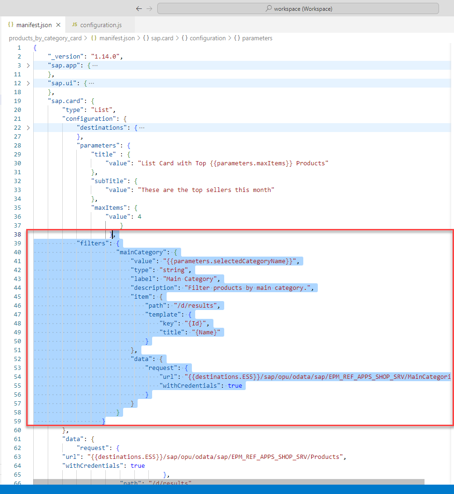

2. Add `selectedCategoryName` subsection in the `parameters` section. This is the category that is initially selected in the filter. Later, the user can change it from the dropdown list.

    ```JSON
    ,
                "selectedCategoryName": {
                    "value": "Computer Systems"
                }   
    ```

    <!-- border -->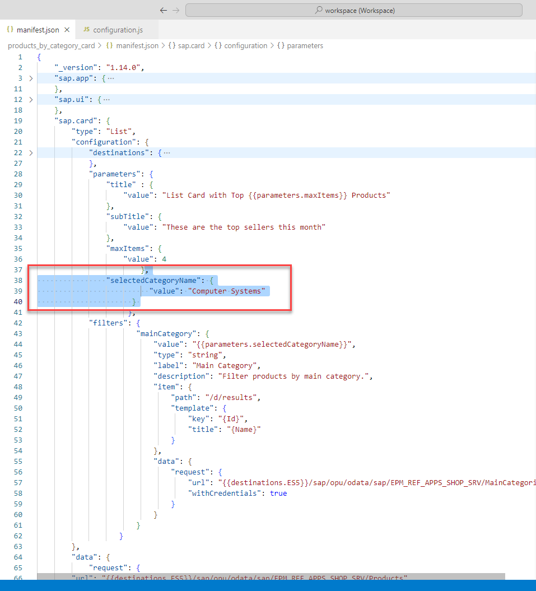

3. Add `parameters` in the main `data` section > `request` subsection, after the `url` property as shown below. The `$filter` parameter will be used in a data request for the category with `MainCategoryName` that is equal to the one selected by the user in the filter's dropdown list.

    ```JSON
    "parameters": {
			                "$filter": "MainCategoryName eq '{filters>/mainCategory/value}'"
		                },
    ```

    <!-- border -->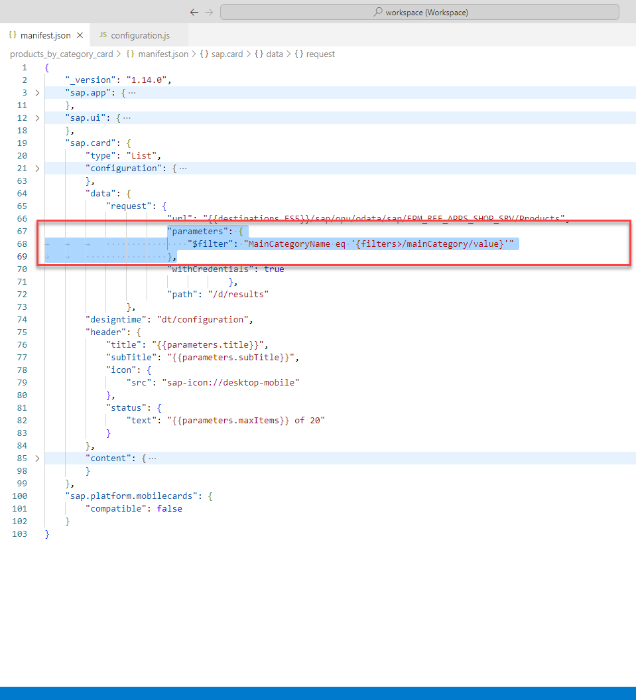

4. Finally replace the title in the `header` adding the `{filters>/supplier/selectedItem/title}` parameter, which will show the selected category:

    ```JSON
    "title": "Products filtered by {filters>/mainCategory/selectedItem/title} category",
    ```

    <!-- border -->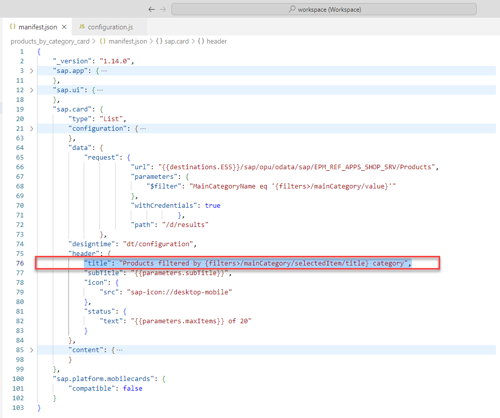

**Results after Step 5:**

If you have any issues you can check the [manifest.json](https://raw.githubusercontent.com/SAPDocuments/Tutorials/master/tutorials/appstudio-sapui5-integrationcard-create/manifest.json) file at this step. It is configured with destinations, parameters, and a filter. 


The application displays the products from the selected category:

<!-- border -->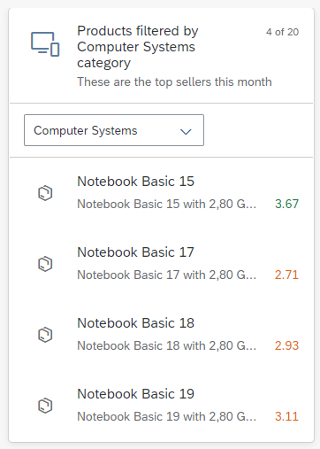

>**IMPORTANT:** Due to an issue with the **UI Integration Card: Preview** option, it may not be able to correctly display the products that are filtered!

To learn more, see the [Filters](https://sapui5.hana.ondemand.com/test-resources/sap/ui/integration/demokit/cardExplorer/webapp/index.html#/learn/features/filters) section in the Card Explorer.


### Configure card parameters that are displayed in SAP Build Work Zone


1. Select the `dt/configuration.js` file (in the Explorer view on the left).

    <!-- border -->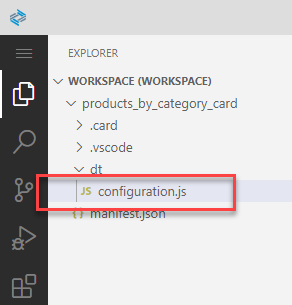

2. Replace the content with the code below:

```JSON
sap.ui.define(["sap/ui/integration/Designtime"], function (
    Designtime
) {
    "use strict";
    return function () {
        return new Designtime({
        "form": {
          "items": {
            "maxItems": {
              "manifestpath": "/sap.card/configuration/parameters/maxItems/value",
              "type": "integer",
              "label": "Maximum Items",
              "translatable": false,
              "description": "Defines how many items will be displayed at most."
            }
          }
        },
        "preview": {
          "modes": "LiveAbstract"
        }
      });
    };
});
```

The `dt/configuration.js` now looks like:

<!-- border -->


### Deploy card

1. Right-click on the `manifest.json` file (in the Explorer view on the left) and select the **UI Integration Card:Deploy to SAP Build Work Zone**  option from the dropdown menu.

    <!-- border -->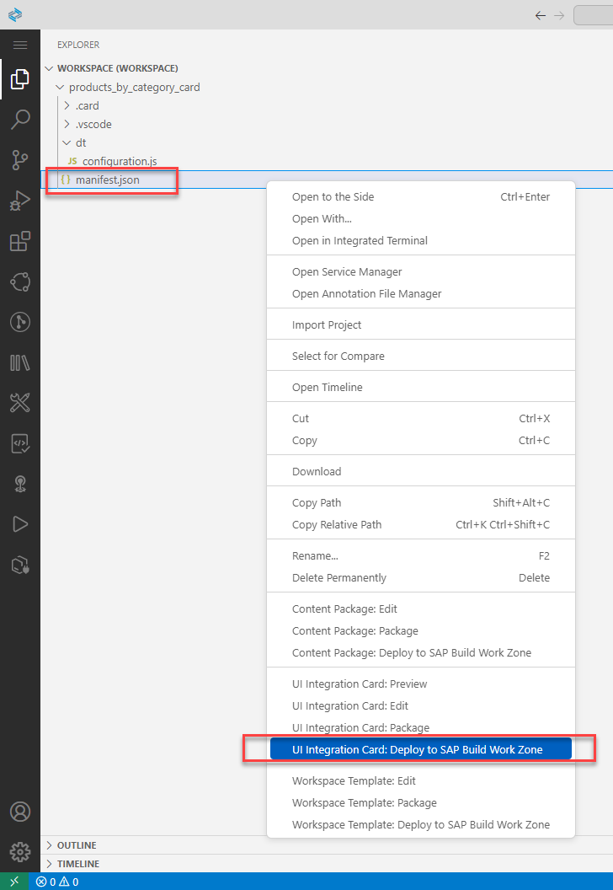

2. Select the target SAP Build Work Zone destination.

    <!-- border -->

3. In the right-bottom corner, confirm to **Continue** and wait to see the successful message.

    <!-- border -->

Now the basic UI5 card deployment is done!


To learn more about the Integration cards and their functionalities, see the [Card Explorer](https://sapui5.hana.ondemand.com/test-resources/sap/ui/integration/demokit/cardExplorer/webapp/index.html) page.
