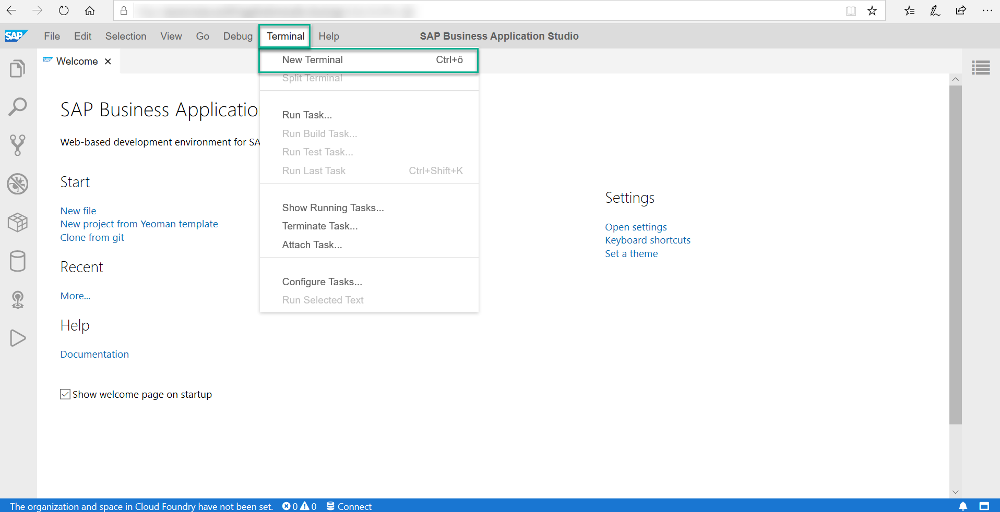
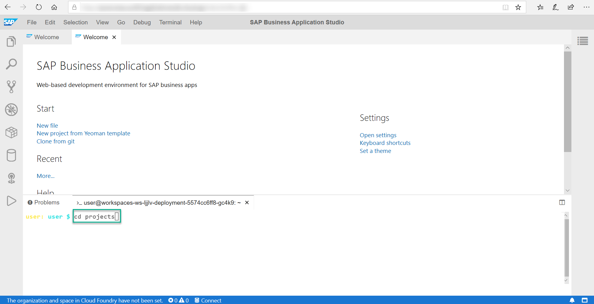
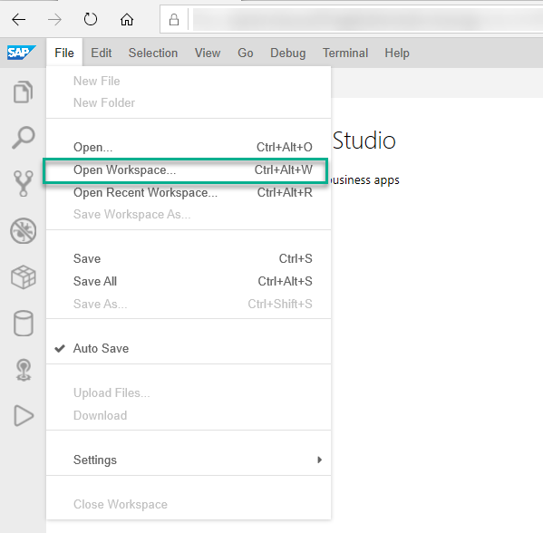
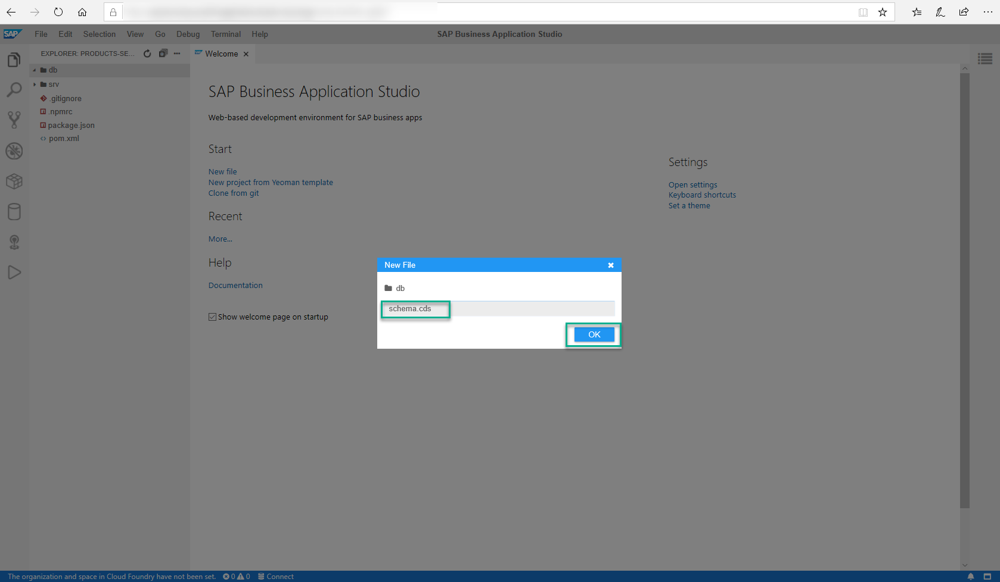
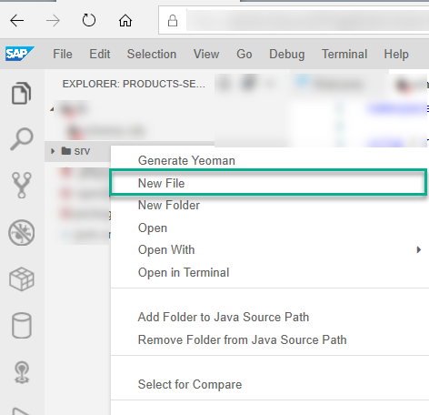
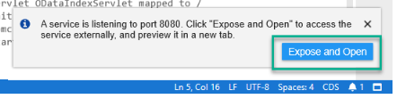

## Prerequisites
 - You have access to SAP Business Application Studio.
 - You have completed the [Create your preconfigured dev space](appstudio-devspace-create) tutorial.


## Details
### You will learn
  - 	How to develop a simple business service using CAP and Java
  -   How to define a simple data model and a service that exposes the entities you created in your data model
  - 	How to run your service locally


---


[ACCORDION-BEGIN [Step 1: ](Create your application scaffolding)]
1. In SAP Business Application Studio, click on your CAP dev space name to open it.

2. From the main menu, choose **Terminal > New Terminal**.

    

3. From the terminal, run **`cd projects`** to get to the `projects` directory.

    

4. Run the following command:
```mvn
 mvn -B archetype:generate -DarchetypeArtifactId=cds-services-archetype -DarchetypeGroupId=com.sap.cds -DarchetypeVersion=1.0.1 -DgroupId=com.sap.teched.cap -DartifactId=products-service -Dpackage=com.sap.teched.cap.productsservice
```

5. From the **File** menu, choose **Open Workspace**, select **products-service** and click **Open**.

    

[DONE]
[ACCORDION-END]

[ACCORDION-BEGIN [Step 2: ](Update the data model and service)]
**Define the Domain Model**

1. Go to your `db` folder and create a file called **`schema.cds`**.

    

2. Add the following code to your newly created `schema.cds` file to create the `product` and `categories` entities.

```code
namespace sap.capire.products;

using { Currency, cuid, managed, sap.common.CodeList } from '@sap/cds/common';

entity Products : cuid, managed {
    title    : localized String(111);
    descr    : localized String(1111);
    stock    : Integer;
    price    : Decimal(9,2);
    currency : Currency;
    category : Association to Categories;
}

entity Categories : CodeList {
    key ID   : Integer;
    parent   : Association to Categories;
    children : Composition of many Categories on children.parent = $self;
}
```

You may see some `cds` errors. This is okay, since we haven't compiled yet.


[DONE]
[ACCORDION-END]


[ACCORDION-BEGIN [Step 3: ](Define a service)]
1. Right-click on the **`srv`** folder, and choose **New File**.

    

2. Call the file **`admin-service.cds`** and choose **OK** to create it.

3. Add the following service definition to the file:

```definition
using { sap.capire.products as db } from '../db/schema';

service AdminService {
    entity Products   as projection on db.Products;
    entity Categories as projection on db.Categories;
    }
```


[DONE]
[ACCORDION-END]

[ACCORDION-BEGIN [Step 4: ](Run your service without data)]

1. Compile the model definition:
    - From the main menu, select **Terminal > New Terminal**.

    - Run **`mvn clean install`** to build your service using Maven.
2. Start the application.
    - Go to the root of your project in the terminal (cd ~/projects/products-service).
    - Run **`mvn spring-boot:run`**

     A notification tab saying "A service is listening to port 8080" will appear.

3. Choose **Expose and Open** and provide a description.

    

4. Choose **$metadata** from the welcome page to inspect the OData metadata that is automatically served by the CAP Java runtime.

    

    The application's metadata is displayed.

5. To stop the application, go to the terminal where your application is running and press **`CTRL + C`**.


[VALIDATE_5]

[DONE]
[ACCORDION-END]


---
