## Prerequisites
- You have access to SAP Business Application Studio.
- You have completed the [Enhance and test your business application](appstudio-service-create) tutorial.

## Details
### You will learn
- 	How to deploy the data model to an SQLite database
-	  How to use `SQLTools` to view your data tables
-   How to add custom handlers to serve requests that are not handled automatically
- 	How to debug your custom code


---

[ACCORDION-BEGIN [Step 1: ](Deploy the application's data model and data to local DB)]


1. Install SQLite on the project.
    - Go to the terminal where your application is running and press **`CTRL + C`** to abort the current task.
    - Run **`npm install --save-dev sqlite3@^4.0.0`**.
2. Run `npm run deploy` to initialize the database with the defined domain model. This will create a file called `sqlite.db` in your project's root. The name of this database is defined by an entry in your `package.json` file.

    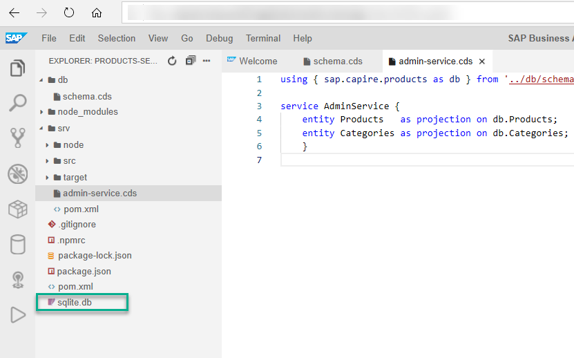

3. Configure your Java application to use the `sqlite.db` database file:
     - Go to `srv/src/main/resources/edmx`, and open the **application.yaml** file.

         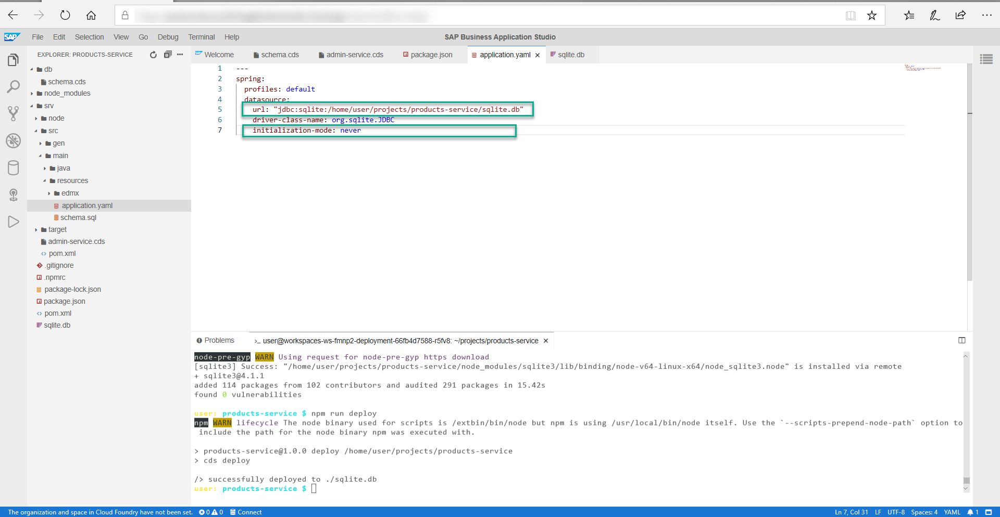

     - In the URL field, replace the string **`"jdbc:sqlite::memory:"`**  with a reference to your local database file **`"jdbc:sqlite:/home/user/projects/products-service/sqlite.db"`**.
      - Set the initialization-mode value from **always** to **never**. You initialize the database when running **`npm run deploy`**.

Your `application.yaml` file should look like this:


```
spring:
  profiles: default
  datasource:
	url: "jdbc:sqlite:/home/user/projects/products-service/sqlite.db"
	driver-class-name: org.sqlite.JDBC
	initialization-mode: never

```


[DONE]
[ACCORDION-END]

[ACCORDION-BEGIN [Step 2: ](Run and test your service)]
1. Start your application by running **`mvn spring-boot:run`** in the terminal and open it in a new tab.
2. Test your application by using **curl** from a new terminal. This request will create multiple nested categories through a deep insert.

    ```curl
    curl -X POST http://localhost:8080/odata/v4/AdminService/Categories \
    -H "Content-Type: application/json" \
    -d '{"ID": 1, "name": "TechEd", "descr": "TechEd related topics", "children": [{"ID": 10, "name": "CAP Java", "descr": "Run on Java"}, {"ID": 11, "name": "CAP Node.js", "descr": "Run on Node.js"}]}'
    ```

3. Try to query individual categories, for example by adding the following to the end of your app URL:
**`/odata/v4/AdminService/Categories(10)`**


[DONE]
[ACCORDION-END]

[ACCORDION-BEGIN [Step 3: ](Browse the tables)]
**Configure the SQL Tools in SAP Business Application Studio to view the SQL tables directly:**

1. From the main menu, go to **File > Settings > Open Preferences**.

    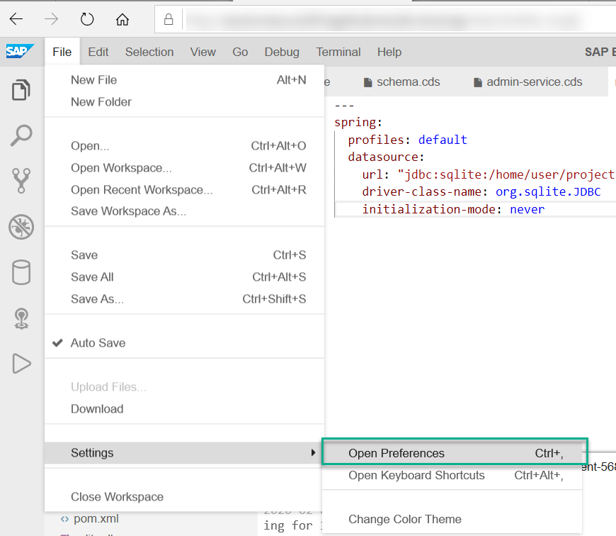

2. Add the following content to the JSON structure in the User file. Don't forget to add a comma at the end of the existing line.
```JSON
"sqltools.connections": [
    {
        "name": "sqlite",
        "dialect": "SQLite",
        "database": "/home/user/projects/products-service/sqlite.db"
    }
]
```
    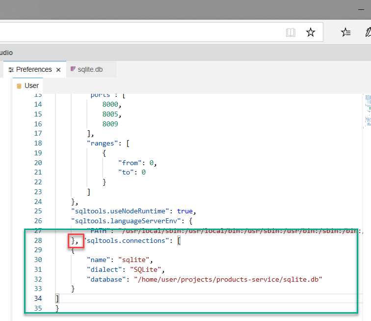

3. Open the **`SQLTools`** view from the side menu.

    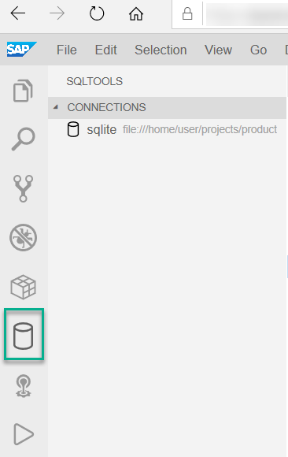

4. If prompted, click **Install now** to install the required SQLite tools and then click **Connect to `sqlite`**. You'll see a new connection called **`sqlite`**. Choose the power cable icon. A new connection called `sqlite` is added to the view.

    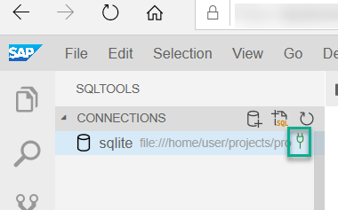

5. Expand the **tables** folder and open the **Categories** table data by clicking on the zoom icon beside the  **`sap_capire_products_Categories table`**

    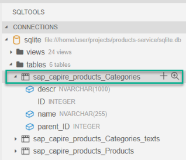

[DONE]
[ACCORDION-END]

[ACCORDION-BEGIN [Step 4: ](Add custom logic to your service)]


1. Stop the running application by entering **`ctrl+c`** from the terminal.

2. Go to the file explorer.

3. Create a new Java package by creating a new folder called **`handlers`** under **`srv/src/main/java/com/sap/teched/cap/productsservice`**.

    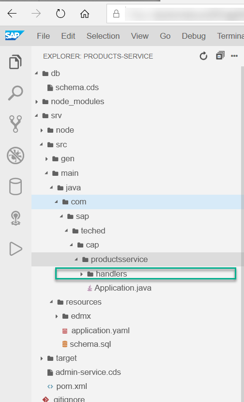

4. Create a new **AdminService.java** file in the **`handlers`** folder with the following content:

    ```import
    package com.sap.teched.cap.productsservice.handlers;

    import java.util.List;

    import com.sap.cds.services.cds.CdsService;
    import com.sap.cds.services.handler.EventHandler;
    import com.sap.cds.services.handler.annotations.After;
    import com.sap.cds.services.handler.annotations.ServiceName;

    import org.springframework.stereotype.Component;

    import adminservice.Categories;

    @Component
    @ServiceName("AdminService")
    public class AdminService implements EventHandler {

        @After(event = CdsService.EVENT_READ, entity = "AdminService.Categories")
        public void AfterRead(List<Categories> categories) {
            for(Categories category: categories){
                category.setName("CATEGORY");
            }
        }
    }
    ```

[DONE]
[ACCORDION-END]

[ACCORDION-BEGIN [Step 5: ](Debug)]

1. Choose the **Run Configuration** icon on the side panel.

    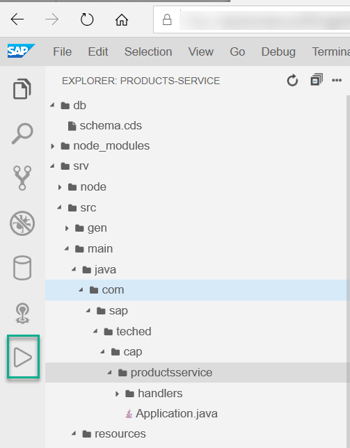

2. Choose the Create Configuration icon (plus sign) and select products-service as your **project** to run.

    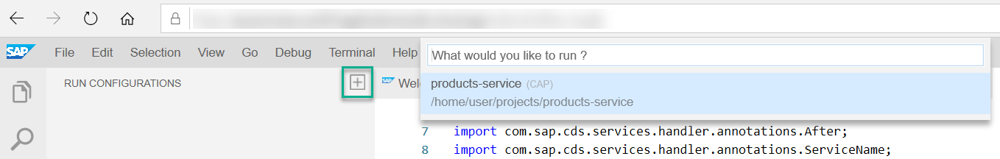

3. Click Run to start the application. The icon appears when you hover over the run configuration.

    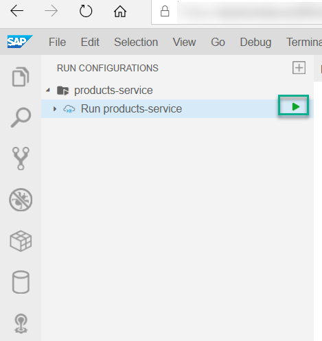
You should see the application starting in the Debug Console.

    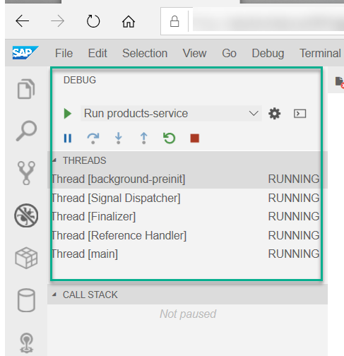

4. Open your application in the browser when you're prompted to do so.
5. In your editor, place a breakpoint in the **AdminService.java** file inside the **`AfterRead`** function.
6.	Add **`/odata/v4/AdminService/Categories`** to your URL. You should stop in the breakpoint.

    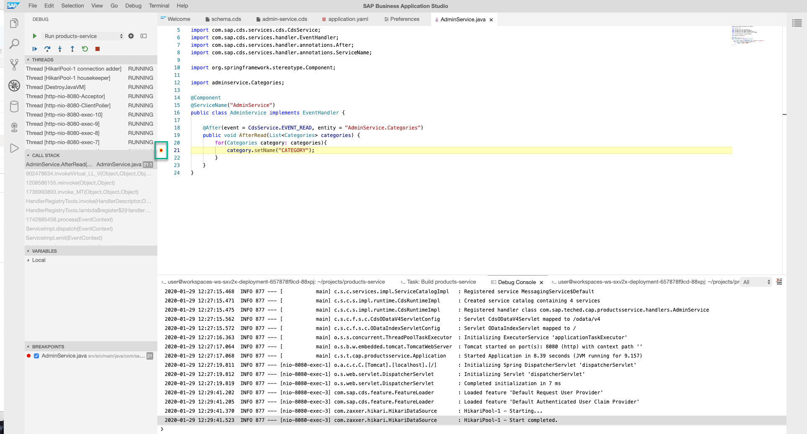

7. Continue to Run, you should see categories names had been set to **CATEGORY** according to the custom code.

    


[VALIDATE_5]

[DONE]
[ACCORDION-END]

---
