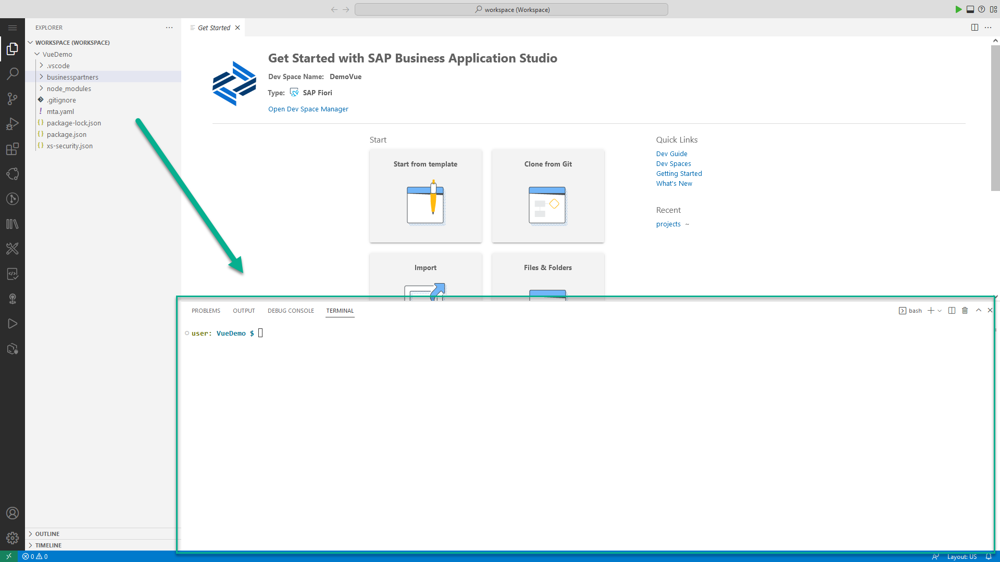

## Prerequisites
- You have created an SAP Fiori dev space in SAP Business Application Studio. See [Create a preconfigured dev space for developing SAP Fiori apps](appstudio-devspace-fiori-create).
- You configured a destination to SAP Gateway Demo System (ES5) (see [Connect SAP Cloud Platform to Your SAP Gateway Demo System Account (ES5)](cp-portal-cloud-foundry-gateway-connection)).

## Details
### You will learn
- How to create a Vue application for SAP BTP, Cloud Foundry environment
- How to test run the app locally in the dev space
- How to integrate the app in an SAP launchpad

You'll build an application that presents a list of suppliers from an on-premise backend. The suppliers' data will be retrieved from the `BusinessPartnerSet` collection in the `ZGWSAMPLE_BASIC` OData service that is available from SAP's ES5 demo Gateway system.

>**Important:** After a period of idle time, the dev space is automatically stopped. To re-start the dev space, open the [Dev Space Manager](https://triallink.eu10.trial.applicationstudio.cloud.sap/), click the **Play** icon, and click the dev space name.

>The period for idle time for Enterprise accounts is different than for trial accounts.

---

[ACCORDION-BEGIN [Step 1: ](Verify SAP Business Application Studio Extensions)]

1. Open the [Dev Space Manager](https://triallink.eu10.trial.applicationstudio.cloud.sap/) and verify that the dev space's status is `STOPPED`. If needed, click the **Stop** icon.

    !

2. Click the **Extensions Manager** icon to edit the dev space.

    !

3. Verify that the following extensions are either in displayed in the **SAP Predefined Extensions** list or are selected in the **Additional SAP Extensions** list: **HTML5 Runner**, **MTA Tools**, and **HTML5 Application Template**. If you selected an extension, click **Save Changes**.

    !

4. Click the **Play** icon to start the dev space and wait for the dev space status to change to `RUNNING`.

    !

5. Click the dev space name.

    !

[DONE]
[ACCORDION-END]

[ACCORDION-BEGIN [Step 2: ](Create Vue project)]

1. From the **Welcome** tab, click **Start from template**.

    !

    >If the Welcome Page doesn't appear, from the menu bar, select **Help | Welcome**.

    >The easiest way to develop a Vue app from scratch is to create it from a template. To continue developing an existing application, the best practice is to use Git source code management and clone the repository.

    >Using the UI wizard, you can at any point click the `Back` or `Start Over` button to go back to the previous step or click the specific wizard step to go back to that step.

    > You can create a project from the template wizard or from the terminal, using the Yeoman generator (`@sapdmz/html5 Project`).

2. Select the **HTML5 Project** tile and click **Start**.

    !

3. For **Template Selection**, select the **Vue.js Application**, and click **Next**.

    !

4. For **Project Name**, enter **`VueDemo`**, and click **Next**.

    !

5. For **Approuter Configuration**, select the following, and click **Next**.

    | Step | Parameter | Value |
    |:-----|:----------|:------|
    | A | Select your HTML5 application runtime | **Managed Approuter** |
    | B | Enter a unique name for the business solution of the project | **`VUEDemoApprouterService`** |

    >Note: Any name can be used for the business solution

    >When end-users access an app in the Cloud Foundry environment, they actually access the Application Router first. The application router is used to serve static content, authenticate users, rewrite URLs, and forward or proxy requests to other micro services while propagating user information.

    >The recommendation is to use **Managed Application Router** that provides many benefits, when compared to Standalone Application Router, such as save resources, lower maintenance efforts, etc. Standalone Application Router should only be used in advanced cases, for example when application router extensibility is required. More information is available in [Developing HTML5 Applications in the Cloud Foundry Environment](https://help.sap.com/viewer/65de2977205c403bbc107264b8eccf4b/Cloud/en-US/11d77aa154f64c2e83cc9652a78bb985.html)

    !

6. For **Module Name**, enter `businesspartners`, and click **Next**.

    !

7. For **Data Source and Service Selection**, select the following, and click **Next**.

    | Step | Parameter | Value |
    |:-----|:----------|:------|
    | A | Select a system | **My SAP Systems** |
    | B | Select a source | **ES5(Catalog)** |
    | C | Select a service | **`ZGWSAMPLE_BASIC`** |

    !

8. For **Entity Selection**, select the following, and click **Finish**.

    | Step | Parameter | Value |
    |:-----|:----------|:------|
    | A | Select the entity set name | **`BusinessPartnerSet`** |
    | B | Select the property for the first column | **`CompanyName`** |
    | C | Select the property for the second column | **`WebAddress`** |
    | D | Select the property for the third column | **`EmailAddress`** |

    !

9. Wait until the installation of project dependencies is completed.

    A notification that "The project has been generated" appears at the bottom right of the screen, SAP Business Application Studio reloads in a new workspace, and the files and project structure in the **Explorer** view are updated.

    !

[VALIDATE_2]
[ACCORDION-END]


[ACCORDION-BEGIN [Step 3: ](Test Vue application locally)]

The application runs on build artifacts. Therefore, using the **watch** command ensures that every change in the source code will be built automatically.

1. From the menu bar, select **Terminal | New Terminal**.

    !

    >A new terminal tab opens.

    >!

    >The terminal is opened for a specific project folder. You can use the following command in the terminal to verify the folder path:
    ```Shell/Bash
    pwd
    ```
    !

3. Change the directory to the `businesspartners` directory.

    ```Shell/Bash
    cd businesspartners
    pwd
    ```

    !

4. Run the `npm run watch` command in the terminal.

    ```Shell/Bash
    npm run watch
    ```

    !

    >The application is built. Any change to the code will rebuild the application.

    >!

6. Open the **Run Configurations** view.

    !

7. Press the "+" icon or click the **Create Configuration** button to create a new run configuration.

    The command palette opens at the top-center of the SAP Business Application Studio window. Select the following:

    | Step | Parameter | Value |
    |:-----|:----------|:------|
    | A | What would you like to run? | **`businesspartners`** (default) |
    | B | Enter a name | **`Run VueDemo-businesspartners`** (default) |

8. Click '>' to expand the run configuration.

    !

9. Hover over the **Data Source** resource and click the **Bind** icon.

    The command palette opens at the top-center of the SAP Business Application Studio window. Select the following:

    !

10. Select **ES5**.

    !

    >The icon next to the **Data Source** resource changes, indicating that it is successfully bound to **ES5**.

    >!

    >Binding to a XSUAA service is required when testing for different users or testing for various authorizations. For the purpose of this tutorial it is not required.

12. Click the Run Module icon to run the application.

    !

    >The run tool installs all dependencies that are missing for run execution, opens the debug view, and uses a dedicated run port (6004).

    >!

13. Click **Expose and Open**.

    >The command palette opens at the top-center of the SAP Business Application Studio window. You can optionally add a port description.

    >!

    >The application opens in a separate browser tab.

    >!

[DONE]
[ACCORDION-END]

[ACCORDION-BEGIN [Step 4: ](Modify the app)]

1. Click **Toggle Bottom Panel** to free up screen space for the editors pane.

    !

2. Open the **Explorer** view.

    !

3. Choose **`VUEDEMO` > `businesspartners` > `src` > `pages`** and click the `MasterPage.vue` file that you created with the template in a previous step.

    The **Suppliers** view opens in the **Code Editor**.

    !

4. In the **headers** section, modify the code as follows:

    | Step | Parameter | Current Value | New Value |
    |:-----|:----------|:------|:------|
    | A | text | "`CompanyName`" | "Company Name" |
    | B | text | "`WebAddress`" | "Website" |
    | C | text | "`EmailAddress`" | "Email" |

    After the update is should look like the following:

    ```JavaScript [7,12,17]
    data() {
      return {
        loading: false,
        items: [],
        headers: [
          {
            text: "Company Name",
            value: "CompanyName",
            sortable: false
          },
          {
            text: "Website",
            value: "WebAddress",
            sortable: false
          },
          {
            text: "Email",
            value: "EmailAddress",
            sortable: false
          }
        ]
      };
    },
    methods: {

    ```

    !

    >Changes to the source code trigger automatic re-build of the app.

5. Refresh the browser tab where the app is running to see the effect of the code modifications.    

    !

[DONE]
[ACCORDION-END]

[ACCORDION-BEGIN [Step 5: ](Prepare integration with SAP Launchpad service)]

1. In the **Explorer** view, choose **`VUEDEMO` > `businesspartners`**, and click the `manifest.json` file that you created with the template in a previous step. The **`manifest.json`** file opens in the **Code Editor**.

    !

2. Modify the file using the following code snippet as depicted below:

    ```json [1-15]
      },
      "crossNavigation": {
          "inbounds": {
              "intent1": {
                  "signature": {
                      "parameters": {},
                      "additionalParameters": "allowed"
                  },
                  "semanticObject": "vuedemo",
                  "action": "display",
                  "title": "Suppliers"
              }
          }
      }
    },
    ```

    !

    >Refer to [Add Content to the Launchpad](https://help.sap.com/viewer/ad4b9f0b14b0458cad9bd27bf435637d/Cloud/en-US/93aef99c934340c09bc95d9a1a7fbce9.html) for more information on the application attributes that are related to the SAP launchpad service.

[DONE]
[ACCORDION-END]


[ACCORDION-BEGIN [Step 6: ](Build, Deploy, and Run the App on SAP BTP)]

1. Follow the [Build and Deploy Your SAP Fiori App to SAP Business Technology Platform](appstudio-fioriapps-mta-build-deploy) tutorial with the necessary adjustments.

[DONE]
[ACCORDION-END]

[ACCORDION-BEGIN [Step 7: ](Add your application to  Launchpad)]

1. Follow the [Set Up the SAP Launchpad Service](cp-portal-cloud-foundry-getting-started) tutorial to onboard yourself to the SAP Launchpad service.

2. Follow the [Create a Launchpad Site Using the SAP Launchpad Service](cp-portal-cloud-foundry-create-sitelaunchpad) tutorial to create a launchpad site where you will later add the Vue application.

3. Follow the [Add a URL App to Your Launchpad Site](cp-portal-cloud-foundry-url-applaunchpad) tutorial to add your app to the launchpad site and run the app from within the launchpad. **Use the URL of the deployed application**.

    >Removing the suffix of the application from the URL, such as "-0.0.1", will cause the launchpad to launch the latest deployed version of the app.

    !

[DONE]
[ACCORDION-END]

---

Congratulations!

You have completed the development of an SAP business application that uses the Vue JavaScript framework, using SAP Business Application Studio. You created the app using a wizard, test run the app locally in the dev space, and built, deployed, and ran the app on SAP BTP, Cloud Foundry environment. As an optional step, you included the app in your SAP launchpad.

In this tutorial, you learned about high productivity tools that are available out-of-the-box in SAP Business Application Studio, including templates and wizards, the command palette, local run (Run Configurations), and more.
