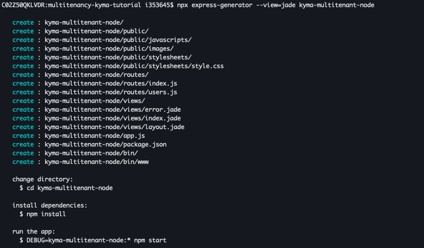

# Create a Basic Node.js Application with Express Generator
<!-- description --> Create a Node.js application skeleton with Express Generator and add some snippets into the backend as a basic application.

## Prerequisites
- You have installed [Node.js](https://nodejs.org/en/download/).
- You have a Kyma runtime environment on SAP Business Technology Platform (BTP). If not, please follow this tutorial: [Enable SAP BTP, Kyma Runtime](cp-kyma-getting-started).

## You will learn
- How to create a Node.js application skeleton with Node.js Express generator
- How to develop a particular endpoint to respond to client requests

---

### Create Node.js Application Skeleton


You can use the application generator tool [Node.js Express generator](https://expressjs.com/en/starter/generator.html) to quickly create a Node.js application skeleton.

Before that, create a new directory for your project:
```shell
mkdir multitenancy-kyma-tutorial
```

Under the `multitenancy-kyma-tutorial` directory, create your own Node.js Application.

**Option 1**: Run the application generator to create application skeleton with single one `npx` command (available in Node.js 8.2.0):
```shell
npx express-generator --view=jade kyma-multitenant-node
```

**Option 2**: Run the application generator to create application skeleton with command `npm` and `express`, by this way, packages will be saved locally as well.

Install the tool:

```shell
npm install -g express-generator
```

> Package `express` is installed together.

Verify if you have successfully installed the tool:

```shell
express --version
```

Create an application skeleton:

```shell
express --view=jade kyma-multitenant-node
```



The generated app has the following directory structure:

```
.
├── app.js
├── bin
│   └── www
├── package.json
├── public
│   ├── images
│   ├── javascripts
│   └── stylesheets
│       └── style.css
├── routes
│   ├── index.js
│   └── users.js
└── views
    ├── error.jade
    ├── index.jade
    └── layout.jade

7 directories, 9 files
```


### Add Code Snippets into Node.js Application


Routing refers to determining how an application responds to a client request to a particular endpoint, which is a URI (or path) and a specific HTTP request method (GET, POST, and so on).

Each route can have one or more handler functions, which are executed when the route is matched.

Route definition takes the following structure:

```javascript
app.METHOD(PATH, HANDLER)
```

Where:

- `app` is an instance of `express`.
- `METHOD` is an [HTTP request method](https://en.wikipedia.org/wiki/Hypertext_Transfer_Protocol#Request_methods), in lowercase.
- `PATH` is a path on the server.
- `HANDLER` is the function executed when the route is matched.

Add basic logic into the default get endpoint. To make the necessary changes you should navigate to `kyma-multitenant-node/routes/index.js` and add the logic with the following code snippets:

```javascript
/**
 * This is the default end-point when someone attempts to access the SaaS application.
 * We show a message to the logged in user.
 * Format of the message: Hello <logon name>; your tenant subdomain is <consumer sub-domain>; your tenant zone id is <consumer tenant id>
 * The logon name will be specific to each user.
 * The tenant zone and sub domain will be the same for all users of one consumer(tenant).
 * Otherwise, if there is no AuthInfo object found, We show the message "Hello World" to users.
 */
router.get("/", function(req, res, next) {
    try {
        var line1 = "Hello " + req.authInfo.getLogonName();
        var line2 = "your tenant sub-domain is " + req.authInfo.getSubdomain();
        var line3 = "your tenant zone id is " + req.authInfo.getZoneId();
        var responseMsg = line1 + "; " + line2 + "; " + line3;
        res.send(responseMsg);
    } catch (e) {
        console.log("AuthInfo object undefined.");
        var responseMsg = "Hello World!";
        res.send(responseMsg);
    }
});
```

>  For more details on how to develop Express web application, please visit the official website: [Express](https://expressjs.com/)


### Project Repository


You can find the final Node.js project from [here](https://github.com/SAP-samples/btp-kyma-runtime-multitenancy-tutorial/tree/main/Mission%20-%20Develop%20a%20Node.js%20Application%20in%20the%20SAP%20BTP%20Kyma%20Runtime).


---
