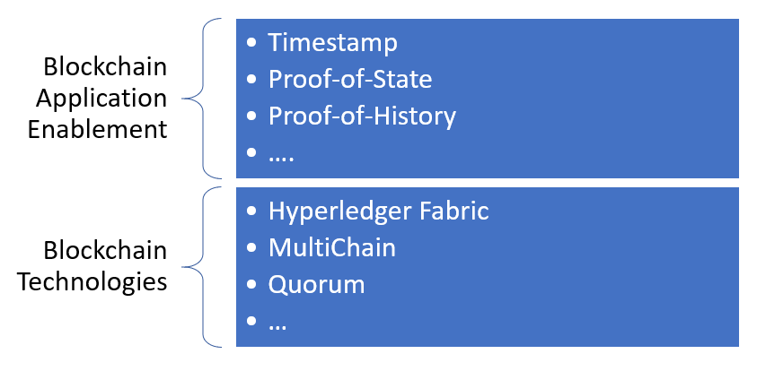
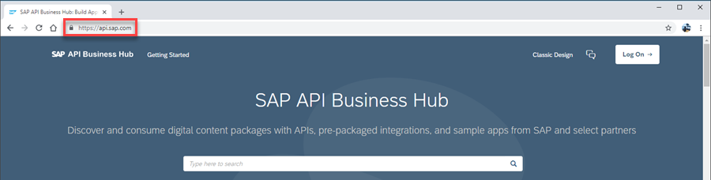
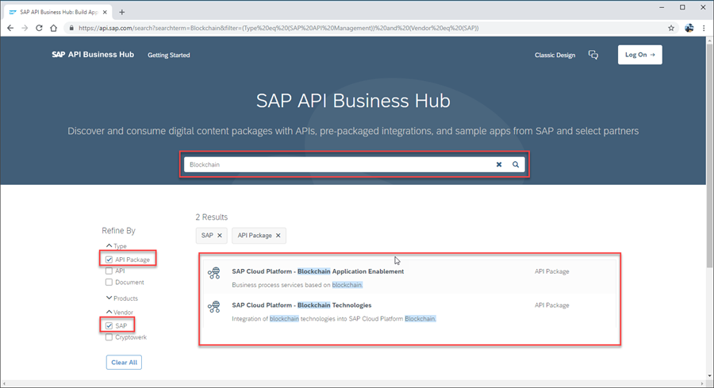
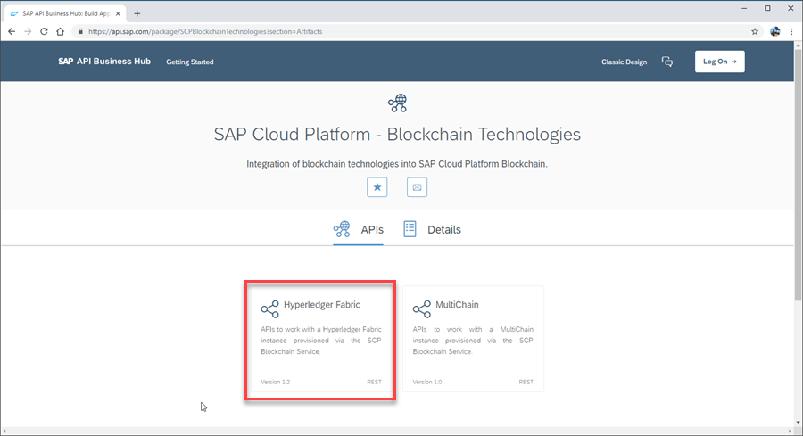
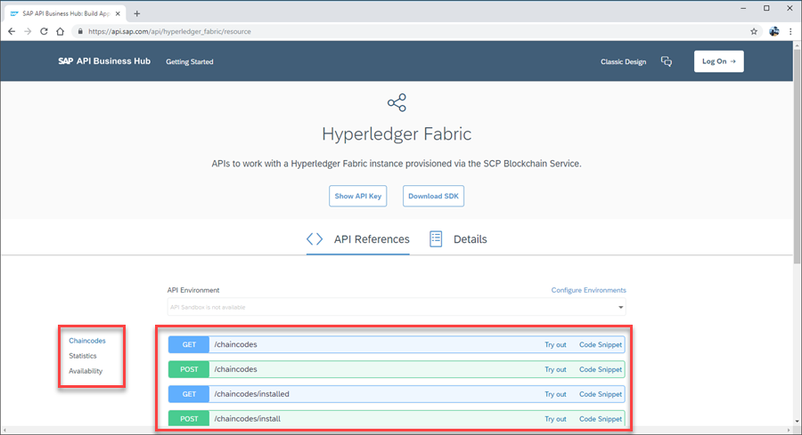
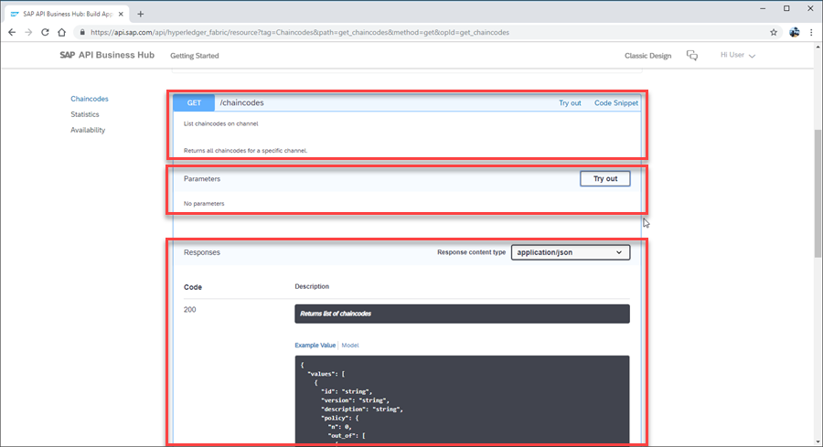

## Prerequisites  
 - Access to http://api.sap.com

## Details

### You will learn
 - How to find SAP Cloud Platform Blockchain Services on the SAP API Hub
 - How to look at a specific API

 [ACCORDION-BEGIN [Step 1: ](Understand Blockchain Service API Layers)]

SAP Cloud Platform Blockchain Service APIs are split into two layers:

- The first layer, Blockchain Technologies, encompasses all APIs for the different blockchain technologies supported. Each set of APIs are very specific to the blockchain technology and these APIs will differ between the technologies.

- At the next layer, the blockchain application enablement are the APIs for different blockchain agnostic services. These are semantic services which offer the same functionality to an application, independent of the blockchain technology over which the service is executed.

---

[ACCORDION-BEGIN [Step 2: ](Navigate to SAP API Hub)]
SAP API Hub is a documentation repository of different collections of APIs for SAP systems. The SAP API Hub hosts all the API descriptions, documentation about the APIs, and also the possibility to test the APIs. The APIs themselves are neither hosted, nor implemented, on SAP API Hub. The SAP API Hub can only be used as a testing place for testing the APIs on the relevant systems where the APIs are available.

* To start, open the [SAP API Hub -- https://api.sap.com](https://api.sap.com) in a browser window.

[DONE]
[ACCORDION-END]

[ACCORDION-BEGIN [Step 3: ](Search for SCP Blockchain packages)]
The SAP API Hub offers large collections of API packages in different categories. Now, use the search functionality to find blockchain relevant APIs.

* In the search field, input **`blockchain`** and press _ENTER_.

* On the left, refine the search by selecting type **`API Package`** and vendor **`SAP`**.

* The two API packages for `SAP Cloud Platform - Blockchain Application Enablement` and `SAP Cloud Platform - Blockchain Technologies` are displayed. Each API package is a collection of APIs.

* Select `SAP Cloud Platform - Blockchain Technologies`.

    

[DONE]
[ACCORDION-END]

[ACCORDION-BEGIN [Step 4: ](Navigate to a selected API set)]
Within the API package, all API collections are listed. We see here APIs for `Hyperledger Fabric on SAP Cloud Platform` and `MultiChain on SAP Cloud Platform`.

**Important**: these are _NOT_ APIs directly provided by the underlying blockchain technology. These are APIs hosted by the SAP Cloud Platform Blockchain Service relative to the specified blockchain technology, so as to enable a richer developer experience.

* Select **`Hyperledger Fabric`**.

[DONE]
[ACCORDION-END]

[ACCORDION-BEGIN [Step 5: ](View API)]
Listed are the relevant APIs for `Hyperledger Fabric on SAP Cloud Platform`. Note that one API collection is displayed.

* On the left are listed the different subsets of APIs within the one collection. Select **`Chaincodes`** to see all APIs related to chaincode handling.

* In the center of the screen are the relevant APIs for chaincode handling, for example `GET /chaincodes` to list all chaincode available on one Hyperledger Fabric channel.

* Select a single API, for example **`GET /chaincodes`**, to see all the information about the API. Described will be documentation about the API, expected input parameters and the response that the API will return.

[VALIDATE_1]
[ACCORDION-END]
