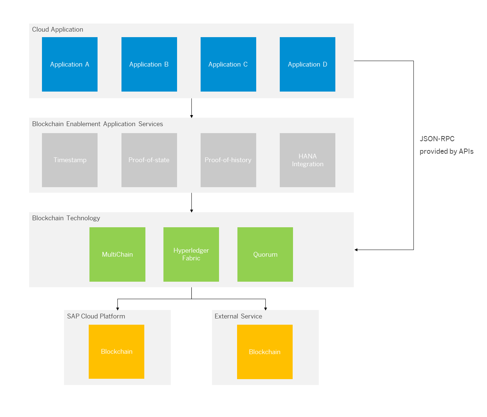
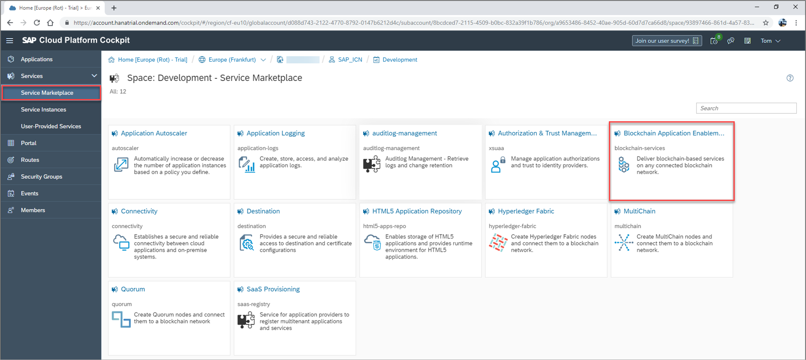
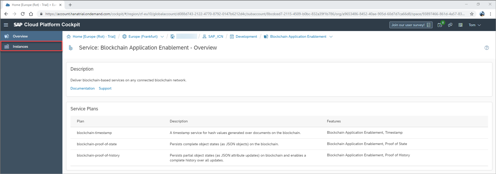
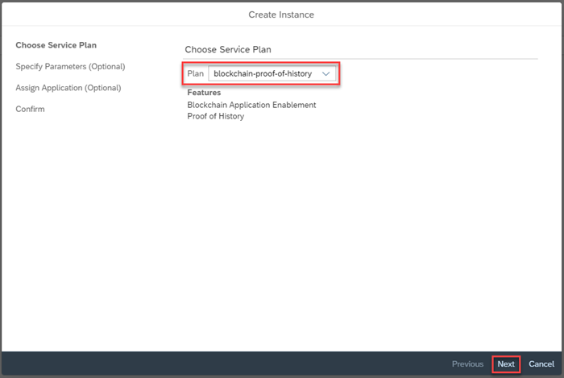
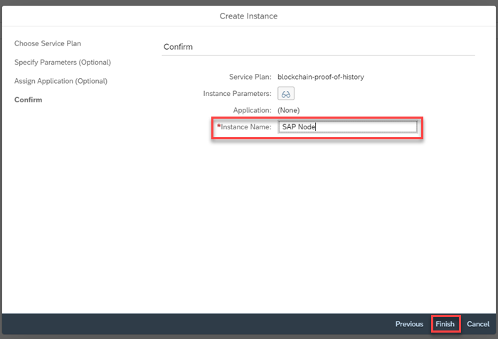
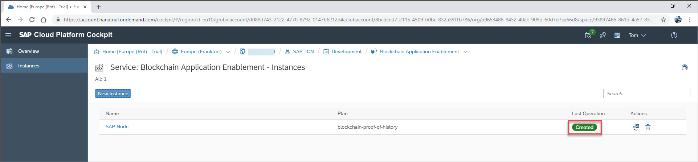
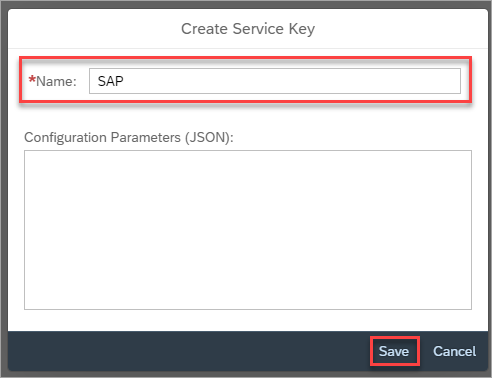

## Details
### You will learn
  - How to create a proof of history service based on an existing blockchain technology service instance on SAP Cloud Platform.

### Pre-requisites
- Access to a service key from either a Hyperledger Fabric development node, MultiChain test node, or Quorum test node on SAP Cloud Platform

---

[ACCORDION-BEGIN [Step 1: ](Understand the blockchain enablement layer)]

At a conceptual level, all blockchain technologies support the same capabilities. However, applications must be adapted to the different blockchain technologies as interactions with those technologies can differ. To enable a rapid integration of blockchain capabilities into the different applications over any number of blockchain technologies, a blockchain service layer is provided that provides blockchain services agnostic from the underlying technology.

Using the SAP blockchain application enablement services, your business application can call APIs from the blockchain service layer to enable the underlying blockchain technology capabilities.



The SAP Cloud Platform Blockchain Proof of History service allows you to record updates or changes to an attribute of a JSON object for a specified key and recall the history of those changes on request. The service achieves this by binding an instance of the Proof of History service to an instance of one of the blockchain technologies. The service stores, on request, the delta update of a JSON object that is passed in via an API call.

The Proof of History service can be used for scenarios in which you would like to keep a record of delta updates to an object. For example, the service can be used in the case that a manufacturing business uses machinery operated via a digital twin system in the cloud. Each time an attribute of the machinery is changed in the cloud based system, it can be used as a protocol and stored on the blockchain. When the spin speed of machines used to mix paint is changed, for example, the change can be recorded on the blockchain via the Proof of History service. If an error occurs in production, the audit trail (the details of the revisions to the attributes of the machinery) can be retrieved and reviewed.

[DONE]
[ACCORDION-END]


[ACCORDION-BEGIN [Step 2: ](Create proof of history service instance)]

Once on the SAP Cloud Platform Service Marketplace, locate and open the Blockchain Application Enablement service by clicking the relevant service tile.



Once in the Blockchain Application Enablement service, you will see a service description and the available plans.

Click the **Instances** tab on the side menu, opening an overview of available instances in your subaccount:



Once on your instances overview, click **New Instance** to open the service instance wizard:


Select 'blockchain-proof-of-history' as the service plan type and click **Next**.



Enter the service key details of your chosen blockchain technology in the **Specify Parameters** field. Example service keys for Hyperledger Fabric, MultiChain, and Quorum are provided here.

**Hyperledger Fabric**

Use the service key associated with your Hyperledger Fabric development node:

```JSON
{
	"documentation": "https://help.sap.com/viewer/p/BLOCKCHAIN_APPLICATION_ENABLEMENT",
	"type": "hyperledger-fabric",
	"channelId": "",
	"serviceUrl": "",
	"oAuth": {
	  "clientId": "",
	  "clientSecret": "",
	  "url": ""
	}
}
```

**MultiChain**

You must use the service key of your MultiChain service instance. Optionally you can specify the name of a MultiChain stream, that must previously be created.   

```JSON
{
	"documentation": "https://help.sap.com/viewer/p/BLOCKCHAIN_APPLICATION_ENABLEMENT",
	"type": "multichain",
	"stream": "",
	"api_key": "",
	"url": ""
}
```
**Quorum**

You must use a service key of your Quorum node instance. In addition you must specify the password of the Quorum account.
```JSON
{
	"documentation": "https://help.sap.com/viewer/p/BLOCKCHAIN_APPLICATION_ENABLEMENT",
	"type": "quorum",
	"address": "",
	"rpc": "",
	"password": ""
}
```

Enter an **Instance Name** and then click **Finish**.



Your blockchain proof of history service is now created and displayed on the overview of available service instances.



[DONE]
[ACCORDION-END]

[ACCORDION-BEGIN [Step 3: ](Create proof of history service key)]

After creating the blockchain proof of history service instance, you must create a service key to this instance. For this click on the **instance name**.


Click **Service Keys**


Click **Create Service Key** and enter a name for the service key.


Click **Save**



A service key for your blockchain proof of history service will be now created.


[DONE]
[ACCORDION-END]


[ACCORDION-BEGIN [Step 4: ](Understand the blockchain proof of history service)]

service allows you to record updates or changes to an attribute of a JSON object for a specified key and recall the history of those changes on request.

This service contains a number of APIs that can be used as microservices from other SAP Cloud Platform based applications:

|  API URL |Description   |
|---|---|
|  HEAD /histories/{id} | Validate existence of object's histories by ID  |
|PUT /histories/{id}  |  Update object's histories by ID |
|  POST /histories/{id} | Create new object histories by ID  |
| DELETE /histories/{id}  | Delete object's histories by ID  |
| GET /histories/{id}  | Retrieve object's histories by ID  |
| GET /histories/{id}/$timestamp | Retrieve object's timestamp by ID  |
| GET /histories/{id}/$history  |  Retrieve object's history by ID |
| GET /histories/{id}/{attribute}  | Retrieve a single attribute from object's histories by ID  |
| GET /histories/$count  | Count objects stored on blockchain. Absolute number is return, or -1  |
| GET /histories  | Retrieve object histories based on query parameters  |


Calls to the APIs themselves require an OAuth access token, that can be obtained using the corresponding URL and credentials (`clientId` and `clientSecret`) securely stored in the service key:

```JSON
{
	"serviceUrl": "https://blockchain-service.cfapps.eu10.hana.ondemand.com/blockchain/proofOfhistories/api/v1/",
	"authentication": {
		"url": "https://'*****.authentication.eu10.hana.ondemand.com",
		"clientId": "sb-'*****-4090-a650-0386988b67e0!b1836",
		"clientSecret": "'******yz1VelAg=",
		"identityZone": "******p"
	}
}
```

For more API information about this service, see: [SAP API Hub - Proof of History](https://api.sap.com/api/proofOfHistory/resource)

[VALIDATE_1]
[ACCORDION-END]
