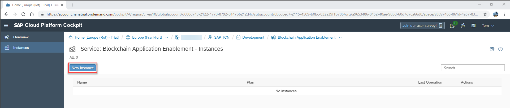
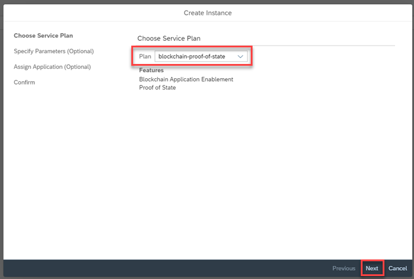
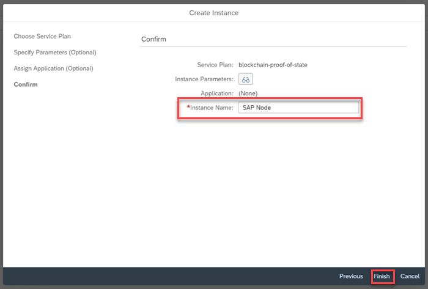
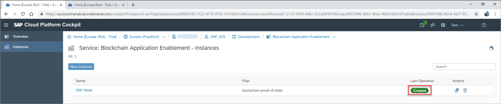
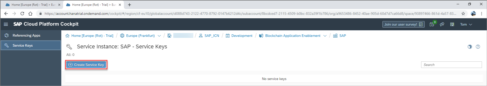
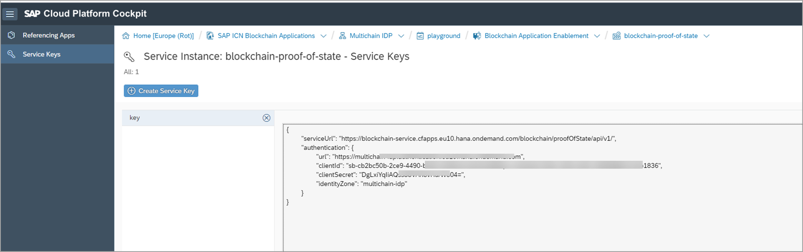

## Details
### You will learn
  - How to create a proof of state service based on an existing blockchain technology service instance on SAP Cloud Platform.

### Pre-requisites
  - Access to a service key from either a Hyperledger Fabric development node, MultiChain test node, or Quorum test node on SAP Cloud Platform

---

[ACCORDION-BEGIN [Step 1: ](Understand the blockchain enablement layer)]

At a conceptual level, all blockchain technologies support the same capabilities. However, applications must be adapted to the different blockchain technologies as interactions with those technologies can differ. To enable a rapid integration of blockchain capabilities into the different applications over any number of blockchain technologies, a blockchain service layer is provided that provides blockchain services agnostic from the underlying technology.

Using the SAP blockchain application enablement services, your business application can call APIs from the blockchain service layer to enable the underlying blockchain technology capabilities.


The SAP Cloud Platform Blockchain Proof of State service allows you to securely store the complete state of a JSON object to a specified key. The service runs in Cloud Foundry and is agnostic to the underlying blockchain network, meaning it can be used on either a Hyperledger Fabric channel, a MultiChain stream or a Quorum account. The service achieves this by binding an instance of the Proof of State service to an instance of one of the blockchain technologies. The service stores, on request, the complete state of a JSON object that is passed in via an API call.

The Proof of State service can be used for scenarios in which the complete state of an object is stored (usually, once). For example, the service can be used in the case that a business manages the end-of-year financial records for each of its sub-companies or subsidiaries on the blockchain. The records can be stored via the Proof of State service in a complete state on the blockchain by each subsidiary using its own company key. When, for example, the periodic tax accounting takes place, it is possible to recall the exact records of the subsidiary as they were at close of business for the last financial year or tax period.

[DONE]
[ACCORDION-END]


[ACCORDION-BEGIN [Step 2: ](Create proof of state service instance)]

Once on the SAP Cloud Platform Service Marketplace, locate and open the Blockchain Application Enablement service by clicking the relevant service tile.


Once in the Blockchain Application Enablement service, you will see a service description and the available plans.

Click the **Instances** tab on the side menu, opening an overview of available instances in your subaccount:


Once on your instances overview, click **New Instance** to open the service instance wizard:



Select 'blockchain-proof-of-state' as the service plan type and click **Next**.



Enter the service key details of your chosen blockchain technology in the **Specify Parameters** field. Example service keys for Hyperledger Fabric, MultiChain, and Quorum are provided here.

**Hyperledger Fabric**

Use the service key associated with your Hyperledger Fabric development node:

```JSON
{
	"documentation": "https://help.sap.com/viewer/p/BLOCKCHAIN_APPLICATION_ENABLEMENT",
	"type": "hyperledger-fabric",
	"channelId": "",
	"serviceUrl": "",
	"oAuth": {
	  "clientId": "",
	  "clientSecret": "",
	  "url": ""
	}
}
```

**MultiChain**

You must use the service key of your MultiChain service instance. Optionally you can specify the name of a MultiChain stream, that must previously be created.   

```JSON
{
	"documentation": "https://help.sap.com/viewer/p/BLOCKCHAIN_APPLICATION_ENABLEMENT",
	"type": "multichain",
	"stream": "",
	"api_key": "",
	"url": ""
}
```
**Quorum**

You must use a service key of your Quorum node instance. In addition you must specify the password of the Quorum account.
```JSON
{
	"documentation": "https://help.sap.com/viewer/p/BLOCKCHAIN_APPLICATION_ENABLEMENT",
	"type": "quorum",
	"address": "",
	"rpc": "",
	"password": ""
}
```

Enter an **Instance Name** and then click **Finish**.



Your blockchain proof of state service is now created and displayed on the overview of available service instances.



[DONE]
[ACCORDION-END]

[ACCORDION-BEGIN [Step 3: ](Create proof of state service key)]

After creating the blockchain proof of state service instance, you must create a service key to this instance. For this click on the **instance name**.


Click **Service Keys**


Click **Create Service Key** and enter a name for the service key.



Click **Save**


A service key for your blockchain proof of state service will be now created.



[DONE]
[ACCORDION-END]


[ACCORDION-BEGIN [Step 4: ](Understand the blockchain proof of state service)]

The proof of state service allows you to securely store the complete state of a JSON object to a specified key.

This service contains a number of APIs that can be used as microservices from other SAP Cloud Platform based applications:

|  API URL |Description   |
|---|---|
|  HEAD /states/{id} | Validate existence of object's state by ID  |
|PUT /states/{id}  |  Update object's state by ID |
|  POST /states/{id} | Create new object state by ID  |
| DELETE /states/{id}  | Delete object's state by ID  |
| GET /states/{id}  | Retrieve object's state by ID  |
| GET /states/{id}/$timestamp | Retrieve object's timestamp by ID  |
| GET /states/{id}/$history  |  Retrieve object's history by ID |
| GET /states/{id}/{attribute}  | Retrieve a single attribute from object's state by ID  |
| GET /states/$count  | Count objects stored on blockchain. Absolute number is return, or -1  |
| GET /states  | Retrieve object states based on query parameters  |


Calls to the APIs themselves require an OAuth access token, that can be obtained using the corresponding URL and credentials (`clientId` and `clientSecret`) securely stored in the service key:

```JSON
{
	"serviceUrl": "https://blockchain-service.cfapps.eu10.hana.ondemand.com/blockchain/proofOfState/api/v1/",
	"authentication": {
		"url": "https://'*****.authentication.eu10.hana.ondemand.com",
		"clientId": "sb-'*****-4090-a650-0386988b67e0!b1836",
		"clientSecret": "'******yz1VelAg=",
		"identityZone": "******p"
	}
}
```

For more API information about this service, see: [SAP API Hub - Proof of state](https://api.sap.com/api/proofOfState/resource)

[VALIDATE_1]
[ACCORDION-END]
