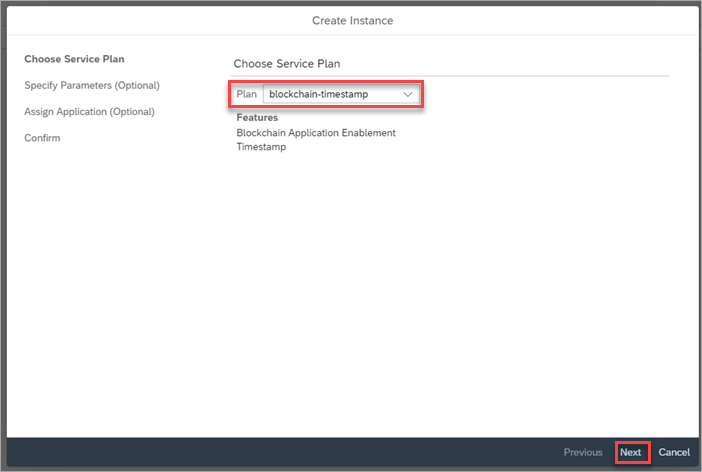
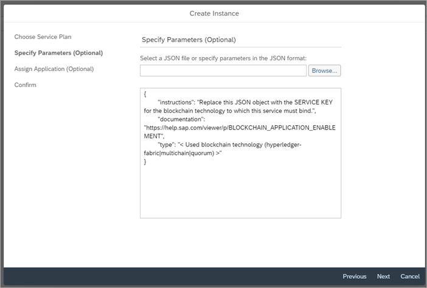
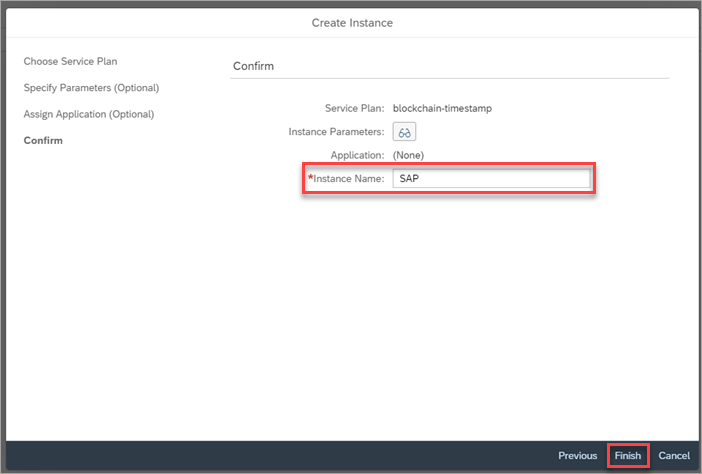
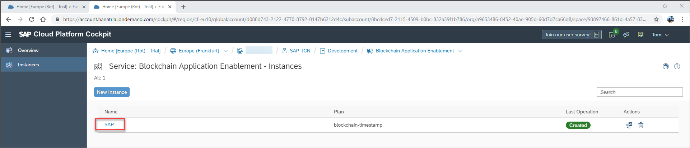
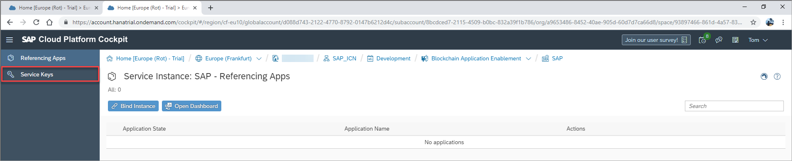
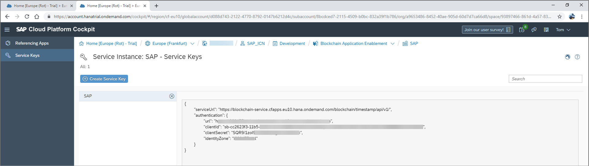

## Details
### You will learn
  - How to create a Timestamp service based on an existing blockchain technology service instance on SAP Cloud Platform.

### Pre-requisites
- Access to a service key from either a Hyperledger Fabric development node, MultiChain test node, or Quorum test node on SAP Cloud Platform

---

[ACCORDION-BEGIN [Step 1: ](Understand the blockchain enablement layer)]

At a conceptual level, all blockchain technologies support the same capabilities. However, applications must be adapted to the different blockchain technologies as interactions with those technologies can differ. To enable a rapid integration of blockchain capabilities into the different applications over any number of blockchain technologies, a blockchain service layer is provided that provides blockchain services agnostic from the underlying technology.

Using the SAP blockchain application enablement services, your business application can call APIs from the blockchain service layer to enable the underlying blockchain technology capabilities.


The SAP Cloud Platform Blockchain Timestamp service allows you to securely store timestamps for specific keys. This service can be used for scenarios in which object states require the verification of a timestamp. For example, in the case that you want to prove that a document, such as a bid document for a specific tender, existed in a specific state at a specific moment in time.

The service runs in Cloud Foundry and is agnostic to the underlying blockchain network, meaning it can be used on either a Hyperledger Fabric channel or a MultiChain stream. The service achieves this by binding an instance of the timestamp service to an instance of a blockchain technology. The service neither asks for nor contains information about the semantics of the key: it purely stores, on request, a timestamp to prove that the specific key was known at a specific time.

[DONE]
[ACCORDION-END]

[ACCORDION-BEGIN [Step 2: ](Create timestamp service instance)]

Once on the SAP Cloud Platform Service Marketplace, locate and open the Blockchain Application Enablement service by clicking the relevant service tile.


Once in the Blockchain Application Enablement service, you will see a service description and the available plans.

Click the **Instances** tab on the side menu, opening an overview of available instances in your subaccount:


Once on your instances overview, click **New Instance** to open the service instance wizard:


Select 'blockchain-timestamp' as the service plan type and click **Next**.



Enter the service key details of your chosen blockchain technology in the **Specify Parameters** field. Example service keys for Hyperledger Fabric, MultiChain, and Quorum are provided here.



**Hyperledger Fabric**

Use the service key associated with your Hyperledger Fabric development node:

```JSON
{
	"documentation": "https://help.sap.com/viewer/p/BLOCKCHAIN_APPLICATION_ENABLEMENT",
	"type": "hyperledger-fabric",
	"channelId": "",
	"serviceUrl": "",
	"oAuth": {
	  "clientId": "",
	  "clientSecret": "",
	  "url": ""
	}
}
```

**MultiChain**

You must use the service key of your MultiChain service instance. Optionally you can specify the name of a MultiChain stream, that must previously be created.   

```JSON
{
	"documentation": "https://help.sap.com/viewer/p/BLOCKCHAIN_APPLICATION_ENABLEMENT",
	"type": "multichain",
	"stream": "",
	"api_key": "",
	"url": ""
}
```
**Quorum**

You must use a service key of your Quorum node instance. In addition you must specify the password of the Quorum account.
```JSON
{
	"documentation": "https://help.sap.com/viewer/p/BLOCKCHAIN_APPLICATION_ENABLEMENT",
	"type": "quorum",
	"address": "",
	"rpc": "",
	"password": ""
}
```

Enter an **Instance Name** and then click **Finish**.



Your blockchain timestamp service is now created and displayed on the overview of available service instances.


[DONE]
[ACCORDION-END]

[ACCORDION-BEGIN [Step 3: ](Create timestamp service key)]

After creating the blockchain timestamp service instance, you must create a service key to this instance. For this click on the **instance name**.



Click **Service Keys**



Click **Create Service Key** and enter a name for the service key.


Click **Save**


A service key for your blockchain timestamp service will be now created.



[DONE]
[ACCORDION-END]

[ACCORDION-BEGIN [Step 4: ](Understand the blockchain timestamp service)]

The timestamp service can be used for scenarios in which object states require the verification of a timestamp.

This service contains two APIs that can be used as microservices from other SAP Cloud Platform based applications:

| API URL |Description   |
|---|---|
|  GET /timestamps/ {key} |  Read the timestamp for the key |
|  POST /timestamps/ {key}  | Write a timestamp for the key  |

For more API information about this service, see: [SAP API Hub - Timestamp](https://api.sap.com/api/timestamp/resource)

Calls to the APIs themselves require an OAuth access token, that can be obtained using the corresponding URL and credentials (`clientId` and `clientSecret`) securely stored in the service key:

```JSON
{
	"serviceUrl": "https://blockchain-service.cfapps.eu10.hana.ondemand.com/blockchain/timestamp/api/v1/",
	"authentication": {
		"url": "https://'*****.authentication.eu10.hana.ondemand.com",
		"clientId": "sb-'*****-4090-a650-0386988b67e0!b1836",
		"clientSecret": "'******yz1VelAg=",
		"identityZone": "******p"
	}
}
```

**The timestamp service does not allow a key to be overwritten**. The key itself can be any string between 64 and 255 bytes in length. We recommend that a well-known hash algorithm with a wide key, for example Secure Hash Algorithm (SHA256) is used to prevent key clashes. In addition, the key can be extended with additional information, such as a document name, the owner, a company name, and so on, all possibly also hashed. The goal is to create one key string that is as unique as possible for the specific blockchain network. Due to the nature of the specific hash algorithm used, there may be a residual possibility of key clashes.

[VALIDATE_1]
[ACCORDION-END]
