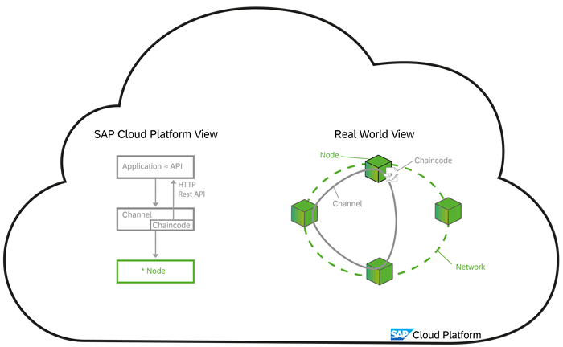
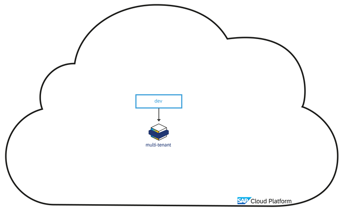
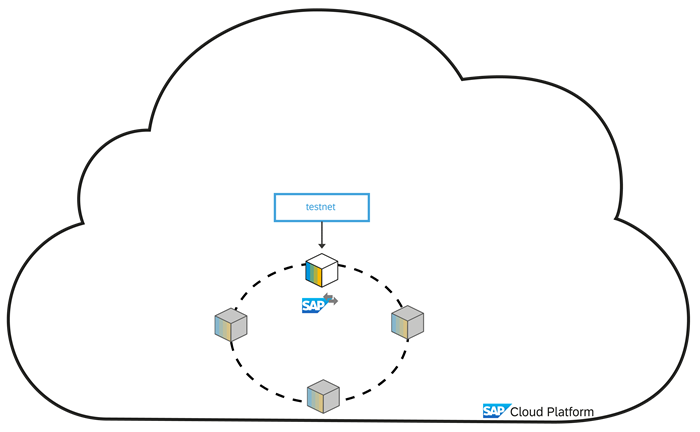
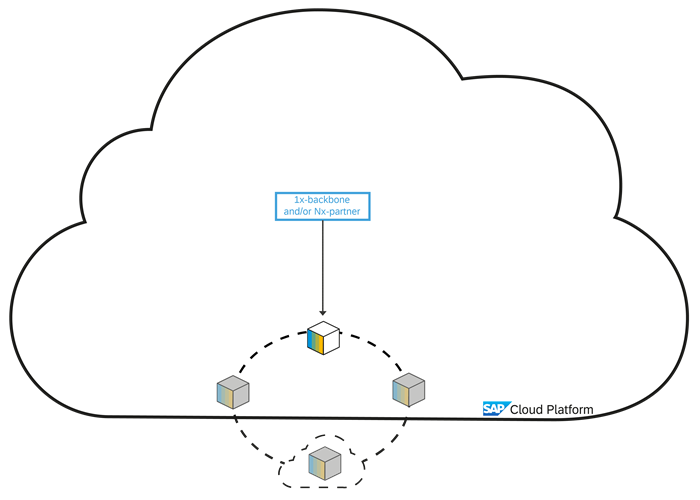
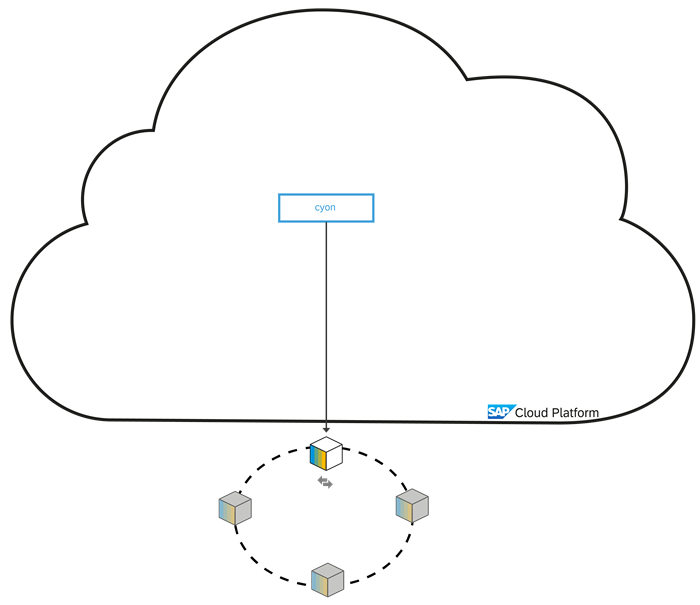
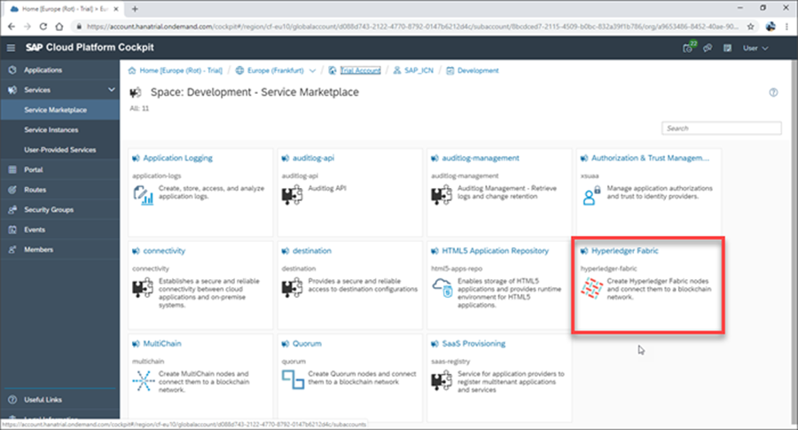
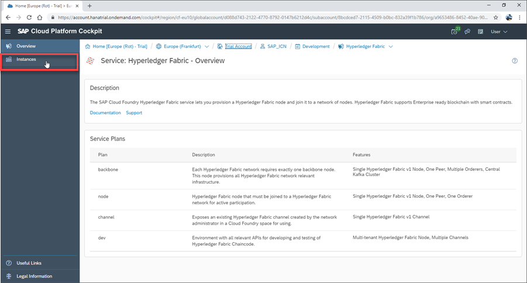
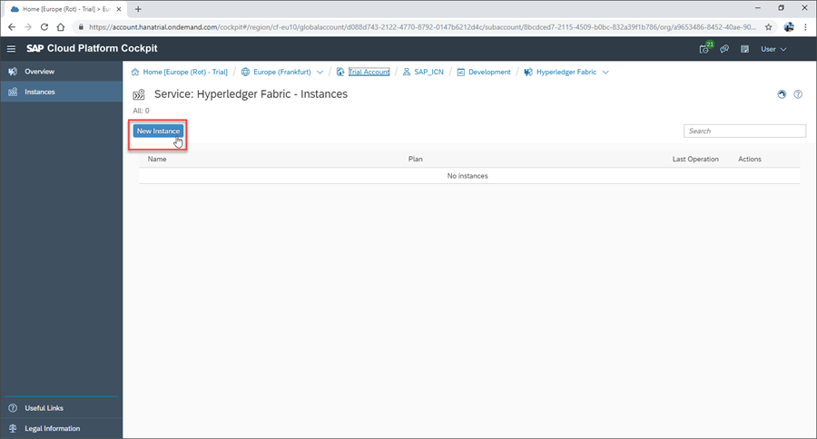
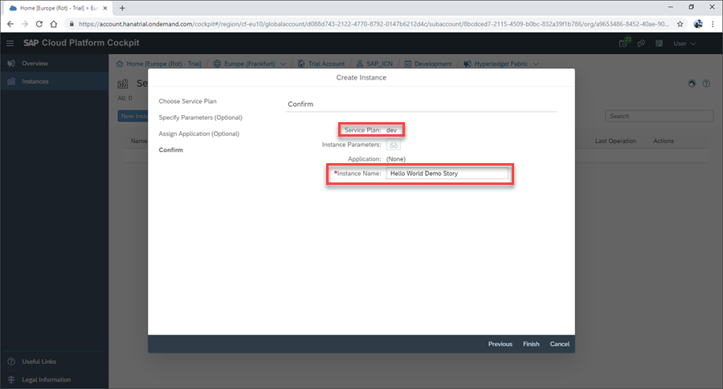
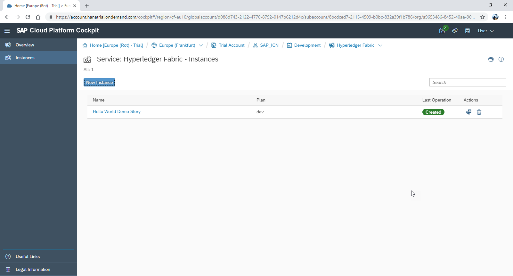

## Details
### You will learn
  - About the available Hyperledger Fabric service plans on SAP Cloud Platform
  - How a Hyperledger Fabric network is structured
  - How to provision a Hyperledger Fabric development node

  In this tutorial we will explore the use of Hyperledger Fabric nodes / service instances.

---

[ACCORDION-BEGIN [Step 1: ](Understand the Hyperledger Fabric Service)]

 The Hyperledger Fabric service is integrated into SAP Cloud Platform via a service broker. The service broker supports several node types as service plans.

 **Development Nodes**

 The simplest node type is a development node. This is effectively a single standalone node that can be used to create channels on, and then to support the development and testing of chaincode. To keep costs to a minimum, developer nodes are hosted in a multi-tenant fashion on nodes operated by SAP.

**`Testnet` Nodes**

For more complex testing of real-world scenarios, `Testnet` nodes are supported. These are relatively small nodes, that are all attached to a SAP operated network. In this network, the Hyperledger Fabric ordering service is provisioned centrally for the complete network from SAP. Partners and customers can provision single nodes into this network, create a specific Hyperledger Fabric channel for their test scenario and then test a business process on this channel.

**Backbone Nodes**

For each Hyperledger Fabric network, an ordering service (Kafka & Zoo Keeper) is required. This ordering service is grouped together with a Hyperledger Fabric peer node into a Backbone plan. Each standalone productive Hyperledger Fabric network will require exactly one backbone plan to ensure the provisioned of the ordering service. In addition, any number of Partner plans can be added into the network, each plan provisions one Hyperledger Fabric peer node. Via the backbone plan (which represents the Hyperledger Fabric ordering service), it is also possible to add external nodes into the network.

**Connect Your Own Network**

The Connect Your Own Network (`CYON`) plan supports consortium cases where the complete Hyperledger Fabric network is provisioned and operated outside of the SAP Cloud platform (for example centrally by the consortium), and where one peer node needs to be made accessible from SAP Cloud Platform.

For our `Hello World` example we will be using a Development Node, with the steps provided for provisioning this below:

[DONE]
[ACCORDION-END]

[ACCORDION-BEGIN [Step 2: ](Open the Hyperledger Fabric Service)]

Once on the SAP Cloud Platform Service Marketplace, locate and open the Hyperledger Fabric service by clicking the relevant service tile.

[DONE]
[ACCORDION-END]

[ACCORDION-BEGIN [Step 3: ](Navigate to Instances)]

Once in the Hyperledger Fabric service, you will see a service description and the available plans.

For the `Hello World` example, we will be using the `dev` plan. This is effectively a single standalone service instance (often referred to as a node) that can be used to create channels on, and then to support the development and testing of chaincode. To keep costs to a minimum, developer nodes are hosted in a multi-tenant fashion on nodes operated by SAP.

Click the **Instances** tab on the side menu, opening an overview of available Hyperledger Fabric instances in your subaccount:

[DONE]
[ACCORDION-END]

[ACCORDION-BEGIN [Step 4: ](Create New Instance)]

Once on your Hyperledger Fabric instances overview, click **New Instance** to open the service instance wizard:

[DONE]
[ACCORDION-END]

[ACCORDION-BEGIN [Step 5: ](Choose Service Instance Settings)]

Navigate through the service instance wizard, selecting the following settings:

Field | Value
:------|:--------
**Plan**  | `Dev`
Specify Parameters | N/A
Assign Application | N/A
**Name** | `Hello World Demo Story`

After selecting the settings, click **Finish**.

[DONE]
[ACCORDION-END]

[ACCORDION-BEGIN [Step 6: ](Confirm Creation of Node)]

Your development node will now be provisioned (which may take a few moments) and displayed on the overview of available service instances.

[VALIDATE_1]
[ACCORDION-END]
