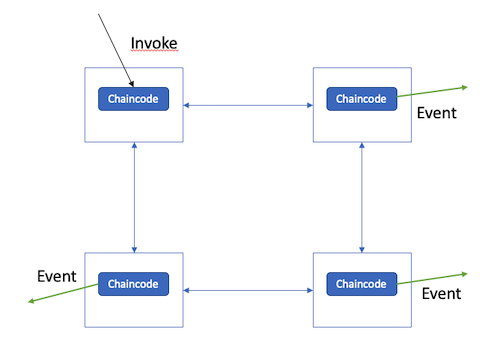
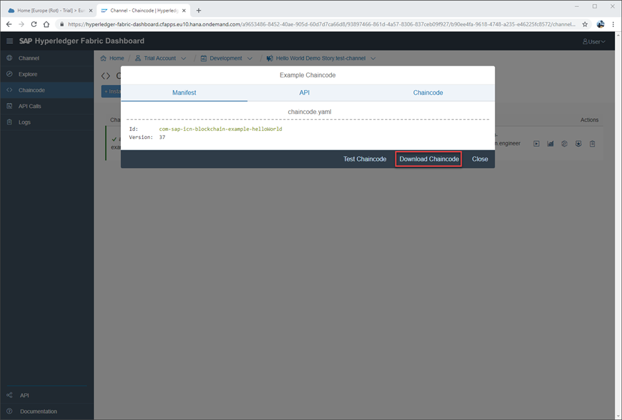
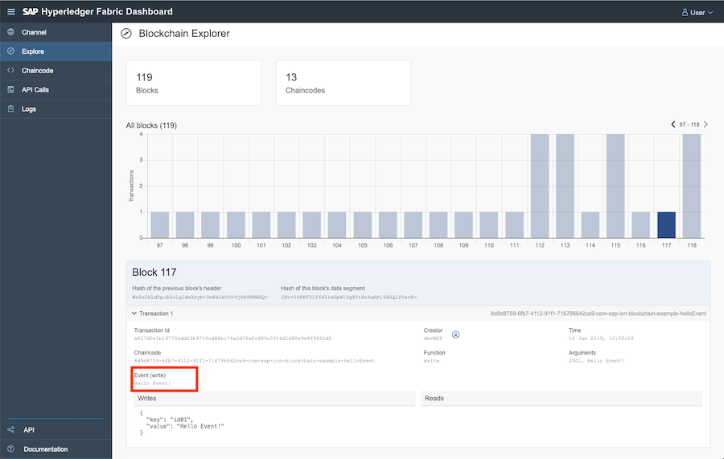

## Details
### You will learn
  - About Hyperledger Fabric chaincode events, including how they can be emitted in your chaincode.
  - How to subscribe to chaincode events using the SAP API Hub.

---

[ACCORDION-BEGIN [Step 1: ](Understand chaincode events)]

A blockchain network is a distributed system where multiple parties interact with each other. Instead of actively fetching the state of the ledger on a regular basis, chaincode events can be used to immediately notify when other parties interact with the chaincode by performing invokes.



Each Hyperledger Fabric transaction can have one event attached to it. In a chaincode you can set an event via the [`stub.SetEvent(name string, payload []byte)`](https://godoc.org/github.com/hyperledger/fabric/core/chaincode/shim#ChaincodeStub.SetEvent) function of the shim interface.

Example:
```Go
if err := stub.SetEvent("event-name", []byte("payload")); err != nil {
    return shim.Error(err.Error())
}
```

[DONE]
[ACCORDION-END]

[ACCORDION-BEGIN [Step 2: ](Add Event to the Example Chaincode)]

  1. In the **Chaincode** area of the channel dashboard, click on **Example Chaincodes** and select **Hello World** when prompted.

  2. Download the **Example Chaincode** and extract it.

  3. Edit the `hello_world.go` file and add an event at the end of the `write` function.



[VALIDATE_1]
[ACCORDION-END]


[ACCORDION-BEGIN [Step 3: ](Deploy and test chaincode)]

  1. To ensure that the new chaincode does not conflict with an existing one, edit the `chaincode.yaml` file and modify the `Id` to e.g. `com-sap-icn-blockchain-example-helloWorld-events`.

  2. Package your chaincode and **install** and **instantiate** the chaincode on your channel.

  3. Once completed, invoke the `write` function and navigate to the **Explore** area to verify that the event was written.



[DONE]
[ACCORDION-END]

[ACCORDION-BEGIN [Step 4: ](Create chaincode event subscribe application)]

Using one of your channels' service keys (found under the **Channel** area), create an `accessToken`.

Now, save the example application to `subscriber.js` and set both the `accessToken` and the `chaincodeId` in the following example application.

```JavaScript
const WebSocket = require('ws');

const accessToken = '< access token >';
const chaincodeId = 'com-sap-icn-blockchain-example-helloWorld-events'; // chaincode with events
const url = 'wss://hyperledger-fabric.cfapps.sap.hana.ondemand.com/api/v1/chaincodes/' + chaincodeId + '/events';
const client = new WebSocket(url, {
    headers: {
        Authorization: 'Bearer ' + accessToken,
    },
});

client.on('open', function () {
    console.log('Connection open.');
});
client.on('message', function (data) {
    console.log(data);
})
client.on('close', function (code, reason) {
    console.log('Connection closed.');
    console.log(code, reason);
});
```

[DONE]
[ACCORDION-END]

[ACCORDION-BEGIN [Step 5: ](Subscribe to events)]

  1. Start the example application with the following command:
```Bash
node subscriber.js
```

  2. Now, invoke the `write` function of your chaincode. The application should then print the emitted event to the console.

[DONE]
[ACCORDION-END]

[ACCORDION-BEGIN [Step 6: ](Discover optional API parameters)]

The chaincode events endpoint accepts two optional query parameters:

|  Parameter Name | Example         | Description
|  :------------- | :-------------- | :-----------
|  `block`        | `block=10`      | Returns all chaincode events that happened since block number 10.
|  `filter`       | `filter=write`  | Returns only chaincode events where the event name matches the regular expression `write`. Note: The regular expression has to be URL encoded, e.g., `.*` is encoded to `.%2A`.

Use the `block` parameter to fetch older events. This is useful when your application was offline for a short period of time and wants to catch up.

To stream the events starting from block 3, use `/events?block=3`.

[DONE]
[ACCORDION-END]

---
