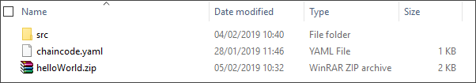

## Details
### You will learn
  - How Hyperledger Fabric chaincode is packaged for deployment

---

[ACCORDION-BEGIN [Step 1: ](Understand package requirements)]

When Hyperledger Fabric chaincode is ready to be deployed, it must be packaged in a ZIP archive (with no strict naming requirements). This zip archive must include the following files:

- `chaincode.yaml` manifest
- chaincode GO code (.go)
- `OpenAPI` description (`.yaml`)

The `chaincode.yaml` file must have exactly this file name and must be stored in the root directory of the ZIP archive.

In addition, there must be a `/src` folder in the ZIP archive that contains the `.go` and `.yaml` files that represent the chaincode. You do not have to place the chaincode source directly in the `/src` folder. You can create a deeper source path (that still starts with `/src`) in the ZIP archive, for example:

`/src/myChaincode/`.

Both the `.go` and `.yaml` files for the chaincode must then be stored in this source path.

If other packages are required for the chaincode, they can also be placed within the `/src` folder in own subfolders, following the normal GO language approach for structuring source code.

An example ZIP archive could then have the following structure:

[VALIDATE_1]
[ACCORDION-END]

[ACCORDION-BEGIN [Step 2: ](Package your chaincode)]

Locate and open your `helloWorld` folder and confirm that it has the following structure:

`/chaincode.yaml`

`/src/hello_world.go`

`/src/hello_world.yaml`

Now, using your preferred ZIP tool, create a zipped archive containing your `/src` folder and `chaincode.yaml` file. In our example we have named our file `helloWorld`:

The zip file can now be deployed to the blockchain service on SAP Cloud Platform.

[DONE]
[ACCORDION-END]
