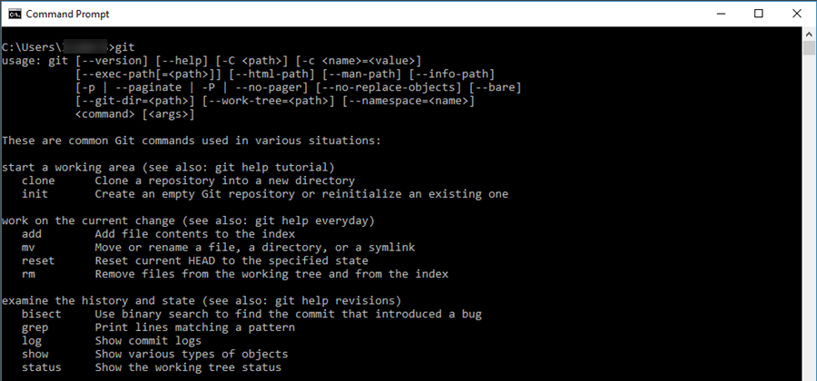
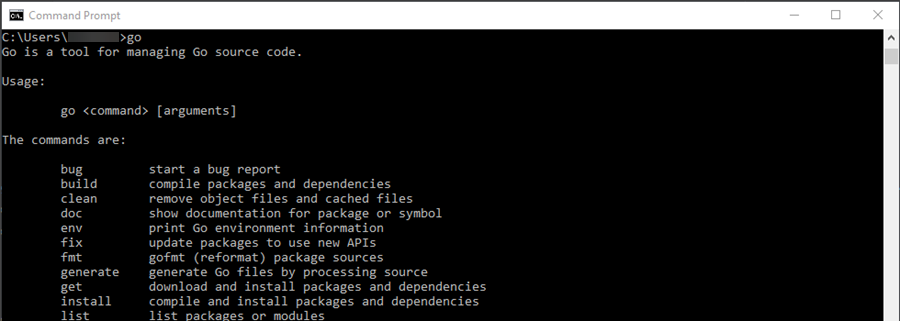
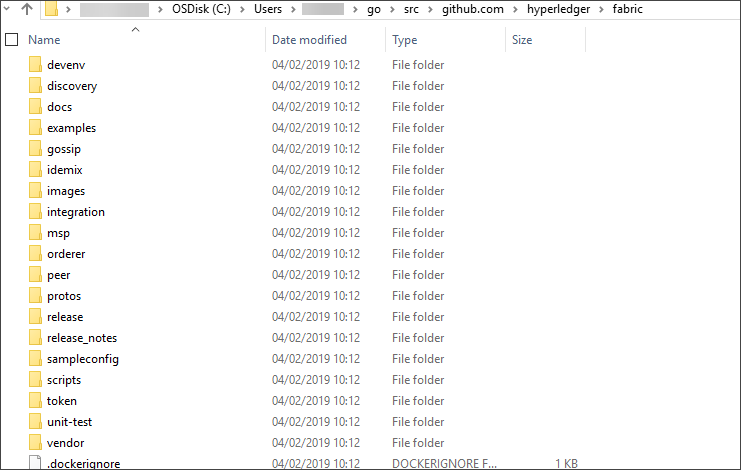

## Prerequisites
 - An understanding of using the Windows command prompt tool or equivalent

## Details
### You will learn
  - How to access and install chaincode development tools for Windows
  - How to install Hyperledger Fabric development packages
  - How to execute syntax checks
---

[ACCORDION-BEGIN [Step 1: ](Understand the benefits of chaincode development tools)]

Chaincode is a program developed using the GO programming language. For the development cycle, it is more efficient to be able to syntax check GO programs before uploading and deploying these to the Hyperledger Fabric node. You can easily do this with a minimal local installation.

The following is an approach where all or most of the steps are done either against a cloud based solution or where the Windows command prompt tool is used as basis. Any other alternative process integrated into the development environment can be used.

[DONE]
[ACCORDION-END]

[ACCORDION-BEGIN [Step 2: ](Download and install GIT Client and Go Compiler)]

Download and install a GIT client - (https://git-scm.com/downloads)

In addition, a compiler is required for Go language programs. Download and install it from - (https://golang.org/dl/)

[DONE]
[ACCORDION-END]

[ACCORDION-BEGIN [Step 3: ](Validate development tools)]

To validate that both tools are installed correctly, open a new Windows command prompt shell.

Within the shell, execute the following commands:

`git` and `go`

If both the GIT client and compiler are installed correctly, these should return sample help text.

Example return for `git` command:



Example return for `go` command:



[VALIDATE_1]
[ACCORDION-END]

[ACCORDION-BEGIN [Step 4: ](Install Hyperledger Fabric packages)]

Install the Hyperledger Fabric packages that are referenced from chaincode program.

You can use the Go language infrastructure to retrieve the following relevant packages (via GIT):

```Shell
go get github.com/hyperledger/fabric/common/util

go get github.com/hyperledger/fabric/core/chaincode/shim

go get github.com/hyperledger/fabric/protos/peer
```

This installs the following contents:



**NOTE:**
 You may get an error message about package `pkcs11`, because the system cannot find the `gcc` compiler. This is not critical. The message is caused by the fact that the `pkcs11` package includes C code as well, which needs a separate compiler. Since you do not use this package, however, you can simply use a compiler switch later to request that this package be excluded from builds.


[DONE]
[ACCORDION-END]

[ACCORDION-BEGIN [Step 5: ](Syntax check Hyperledger Fabric chaincode)]

During development, you can greatly enhance productivity if the GO program can be syntax checked after each development step, before this program is deployed to the Hyperledger Fabric node. The command to complete the code is as follows:

```Go
go build -tags nopkcs11 hello_world.go
```

The GO compiler produces an Execute program. However, you cannot execute this program locally and doing so simply results in an error message. The executable can be deleted. You need to use the `nopkcs11` tag to ensure that the `PKCS11` library is not included, since this library requires a separate C-compiler and is not used by the chaincode

[DONE]
[ACCORDION-END]
