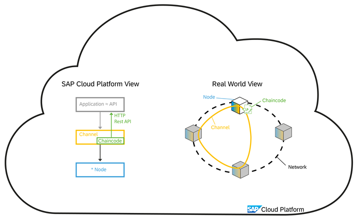
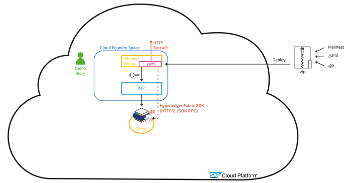
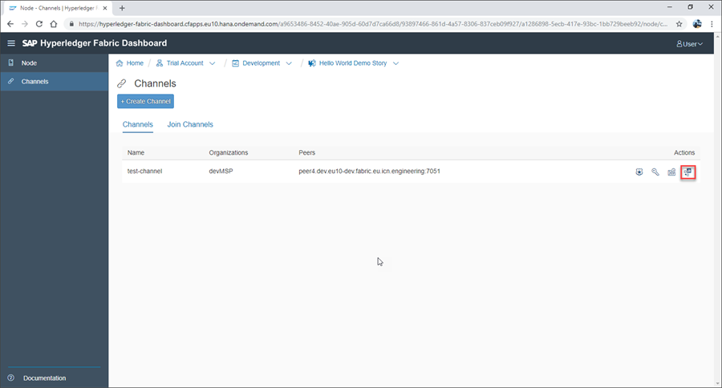
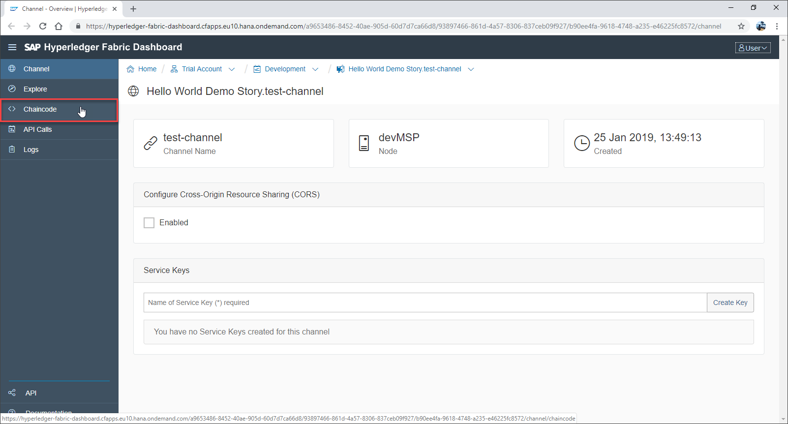
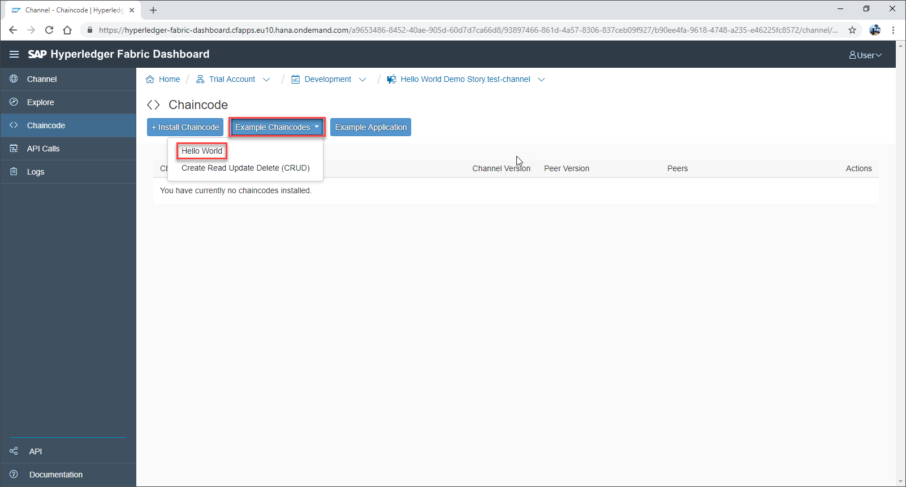
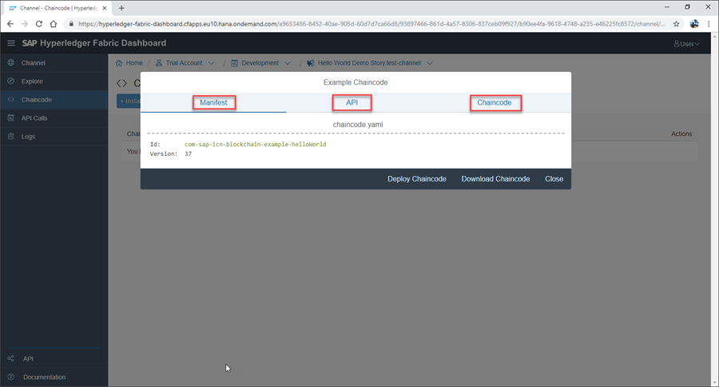
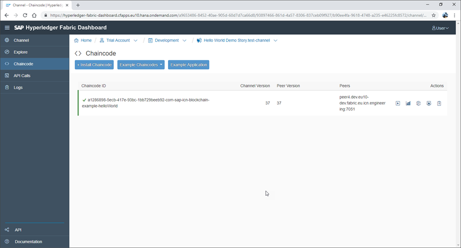

## Details
### You will learn
  - About Hyperledger Fabric chaincode, including how it is written and its main functions
  - How to deploy and test Hyperledger Fabric chaincode on SAP Cloud Platform

---

[ACCORDION-BEGIN [Step 1: ](Understand chaincode)]

Hyperledger Fabric chaincode (smart contracts) control all reading and writing to a Hyperledger Fabric channel and implements all relevant business logic.

Chaincode is written in GO code and after deployment executed directly on the Hyperledger Fabric peer node (in separate Docker containers). Usually, access to the chaincode is supported by the Hyperledger Fabric SDK via a `HTTP/2 gRPC` interface.

To describe the chaincode functions, a YAML file can be added, that uses `Swagger v2.0` semantics to describe a HTTP REST API onto the different chaincode functions. Based on this YAML description, a HTTP REST API is supported by the gateway on SAP Cloud Platform, allow applications to access chaincode functions via normal REST calls. The manifest file contains deployment information, such as the ID and version number of the chaincode.

For this demo, we develop and deploy a simple `Hello World` chaincode that just supports reading and writing text strings to the blockchain against a defined .

[DONE]
[ACCORDION-END]

[ACCORDION-BEGIN [Step 2: ](Open the channel node dashboard)]

To deploy and test chaincode, click the **Dashboard** icon to navigate to your channel service instance dashboard.

[DONE]
[ACCORDION-END]

[ACCORDION-BEGIN [Step 3: ](Access chaincode area)]

Once on your channel service instance dashboard, click **Chaincode** on the side menu.

In the chaincode area, click **Example Chaincode** and select `Hello World` when prompted.

This opens the Example Chaincode window, giving you access to the manifest, API, and chaincode.

[VALIDATE_1]
[ACCORDION-END]

[ACCORDION-BEGIN [Step 4: ](Deploying Chaincode)]

With the Example Chaincode window open, click **Deploy Chaincode**:

The chaincode will now be deployed and displayed in your list of available chaincode:

[DONE]
[ACCORDION-END]
