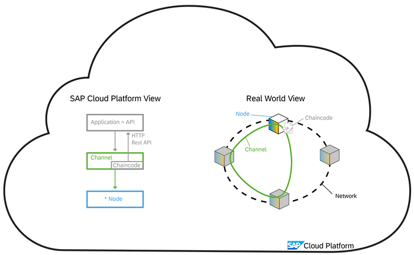
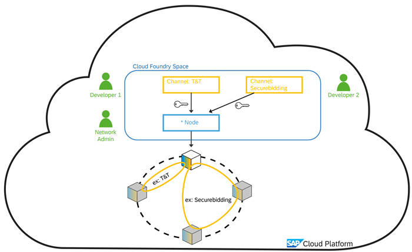
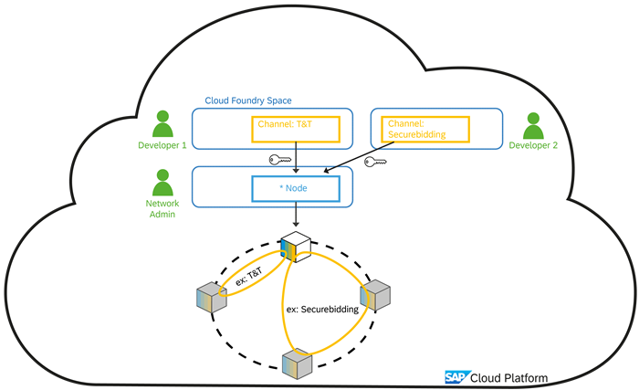
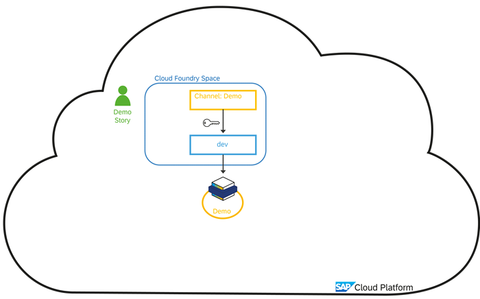
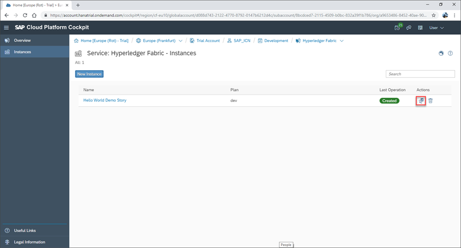
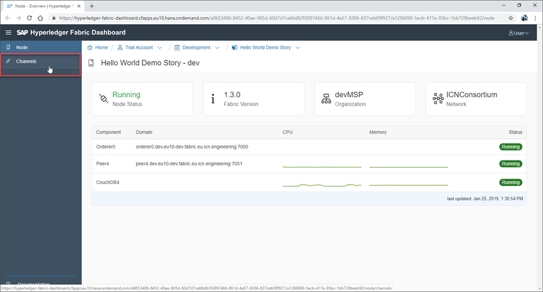
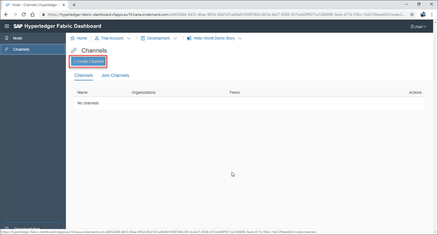
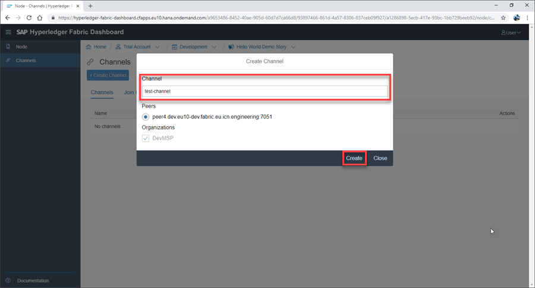
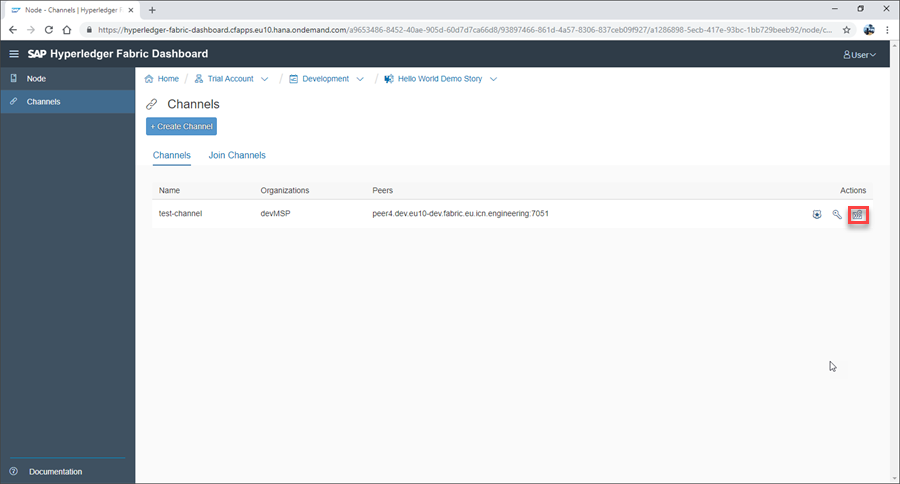

## Details
### You will learn
  - An understanding of Hyperledger Fabric channels on SAP Cloud Platform
  - How to create a Hyperledger Fabric channel
  - How to provision a channel service instance

In this tutorial we will explore the use of Hyperledger Fabric channels:

---

[ACCORDION-BEGIN [Step 1: ](Understanding Hyperledger Fabric Channels)]

A Hyperledger Fabric channel is created on any Hyperledger Fabric peer node and then selected peer nodes (based on permission and agreement) can join the channel. This channel is effectively one blockchain and any data written to this channel is only visible on the specific Hyperledger Fabric peer nodes attached to the channel.

Channel operations, such as creation of a channel or channel joining, are managed by the Hyperledger Fabric network admin. At the first moment, these channels only physically exist on the nodes.

To expose the channel into SAP Cloud Platform and make it accessible for business processes, a Cloud Foundry service key is required. The service key is effectively the channel identifier and authorization information required to use the channel. With the service key for a specific Hyperledger Fabric channel, a developer can then create an instance of a Channel plan. This is a Cloud Foundry service plan supports a dashboard that allows access the developer to interact the channel and in addition supports APIs with which applications can interact with the channel.

At a technical level, splitting channel access out via different Cloud Foundry service plans enables the implementation to support different OAuth access to the different channels. This means that each channel has its own OAuth access, and having access to one channel does not allow in any way access to another channel.

It is possible to create the channel instance in the same Cloud Foundry space where the node instance is created. However, this means that all developers that have access to the Cloud Foundry space, also have access to the Hyperledger Fabric node, and access to all channels that are visible in the space.

We recommend you create the Hyperledger Fabric node and channel plans in different Cloud Foundry spaces, and to use the space as a security container to ensure that each set of developers/users can only access the channel to which they should have access.

For this demo, we will simply create the channel instance within our demo Cloud Foundry space.

[VALIDATE_1]
[ACCORDION-END]

[ACCORDION-BEGIN [Step 2: ](Open Node Dashboard)]

To create your Hyperledger Fabric channel, click the dashboard icon to navigate to your Hyperledger Fabric node dashboard:

[DONE]
[ACCORDION-END]

[ACCORDION-BEGIN [Step 3: ](Start Channel Creation)]

Once on your node dashboard, click **Channels** on the side menu:

And now click **Create Channel**, opening the channel creation window:

[DONE]
[ACCORDION-END]

[ACCORDION-BEGIN [Step 4: ](Enter Channel Settings)]

With the channel creation window open, enter the channel name `test-channel` and then click **Create**:

The channel will now be created and you will be returned to the node dashboard.

[DONE]
[ACCORDION-END]

[ACCORDION-BEGIN [Step 5: ](Provision Channel Service Instance)]

Once returned to the node dashboard, click the **Service Instance** icon to provision a service instance for the channel in the same Cloud Foundry space:

With the 'Create Service Instance' window open, click **Create** to provision the channel service instance.

[DONE]
[ACCORDION-END]

---
