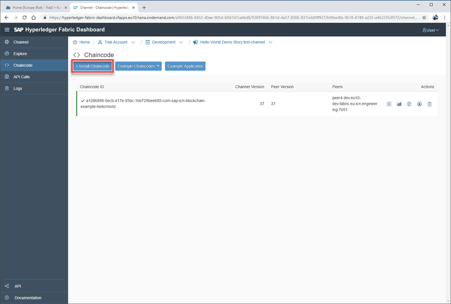
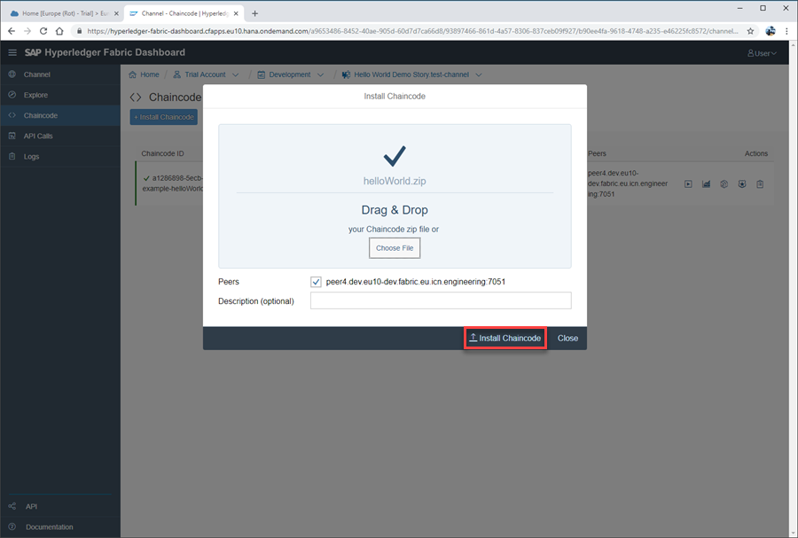
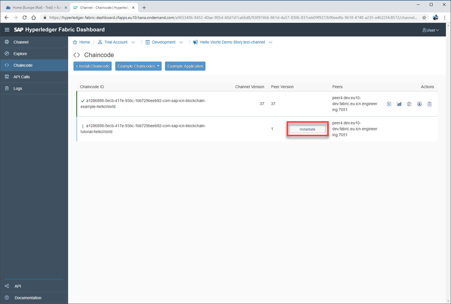
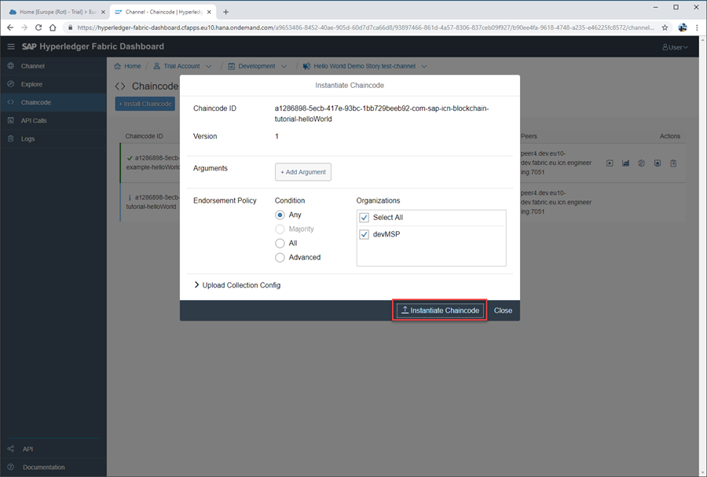

## Prerequisites
- A Hyperledger Fabric channel service instance on SAP Cloud Platform - [Tutorial](https://developers.sap.com/tutorials/blockchain-hlf-channel.html)

## Details
### You will learn
  - How to install and deploy Hyperledger Fabric chaincode on SAP Cloud platform
  - How to instantiate Hyperledger Fabric chaincode on SAP Cloud Platform

---

[ACCORDION-BEGIN [Step 1: ](Navigate to chaincode area)]

Once Hyperledger Fabric chaincode has been developed it can be installed and then instantiated to a peer on the SAP Cloud Platform. This is managed through the Chaincode page, available on all Hyperledger Fabric channel dashboards.

Open your Hyperledger Fabric Channel Dashboard, displaying your channel overview page:

Click and open the Chaincode section, displaying your chaincode overview page:

[DONE]
[ACCORDION-END]

[ACCORDION-BEGIN [Step 2: ](Install your chaincode)]

Click **+ Install Chaincode**, opening the install chaincode window:

With the Install Chaincode window open, either drag and drop your zipped chaincode or click **Choose File** to browse your files. Once a recognized .zip file has been selected, the window will confirm the file name.

Click **Install Chaincode**:

The chaincode will now be installed on the peer, and the details displayed on the chaincode overview page.

[VALIDATE_1]
[ACCORDION-END]

[ACCORDION-BEGIN [Step 3: ](Instantiate your chaincode)]

Once chaincode has been installed on a peer, it can then be instantiated to a channel. This can be achieved by returning to your Chaincode overview page and clicking the **Instantiate** button:

You are then able to add arguments, endorsement policies, select channels, and upload your collection configuration file. Here we will use the default settings.

Click **Instantiate Chaincode**:

[DONE]
[ACCORDION-END]
