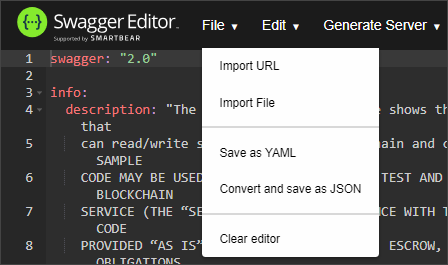
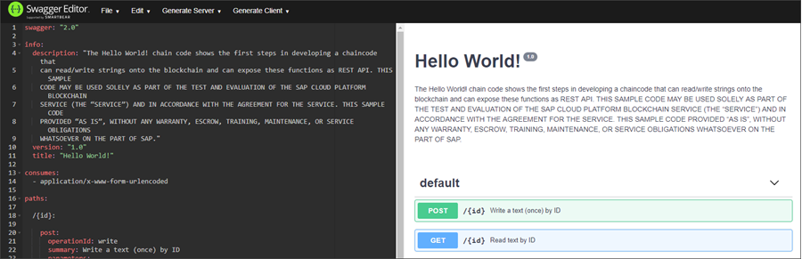

## Details
### You will learn
  - How to write a HTTP Rest API when developing Hyperledger Fabric Chaincode
  - How to validate your `hello_world.yaml` file using `Swagger.io` editor

---

[ACCORDION-BEGIN [Step 1: ](Understand API description file)]

The `hello_world.yaml` API description file, created in the previous tutorial, is used to describe the exact HTTP interface to the chaincode.

It's important is to understand that this `.yaml` file is then used in two different contexts:

- To generate the API test page from which the chaincode APIs can be tested directly.

- Specific aspects of the YAML file are used by the API gateway to decide how to extract parameters from the incoming HTTP request. Then they map these to a function in the chaincode that is to be called.

[DONE]
[ACCORDION-END]

[ACCORDION-BEGIN [Step 2: ](Understand HTTP verb mapping to chaincode calls)]

An HTTP rich set of verbs are used in a specific way for REST calls to mimic the typical database Create, Read, Update, and Delete (CRUD) operations.

On the Hyperledger Fabric side, chaincode functions can be called as follows:

- By an Invoke call which writes a transaction with read/write sets to the blockchain.

- By a Query call for read-only type of functions.

For all incoming HTTP requests, each specific HTTP verb is mapped onto either a Hyperledger Fabric Invoke or Query call.

In this chaincode example, we will be using **POST** and **GET** calls.

| HTTP Verb       | Typical Action          | Mapped To  | Blockchain Effect |
| ------------- |:-------------:| -----:|-----:|
| POST     | Create | Invoke | Write transaction
| GET     | Read     |   Query | None


[DONE]
[ACCORDION-END]


[ACCORDION-BEGIN [Step 3: ](Understand chaincode paths)]

The paths section of chaincode is used to define a rich definition of the REST-based API, and all Swagger features can be used to describe the API. Two special cases apply:

- For each path, you must specify the `operationId`. This is the direct name of the chaincode function that must be called for this path.

- For the parameters, all five parameter locations are supported. The parameters can be in the path, query, header, form, or body. For the parameter types, you can use only simple parameters that can be mapped onto chaincode type string input parameters. The supported types are: string, number, integer, boolean, and file.

[DONE]
[ACCORDION-END]

[ACCORDION-BEGIN [Step 4: ](Define chaincode post path)]

To define the chaincode post path (used for invoking the chaincode), open your `hello_world.yaml` file with a text editor and copy and paste the following lines into it:

```YAML
consumes:
  - application/x-www-form-urlencoded

paths:

  /{id}:

    post:
      operationId: write
      summary: Write a text (once) by ID
      parameters:
      - name: id
        in: path
        required: true
        type: string
      - name: text
        in: formData
        required: true
        type: string
      responses:
        200:
          description: Text Written
        500:
          description: Failed
```
This post path includes the write function (`operationID: write`), two parameters that can be written (id and text), and two response codes (200 for successful post, and 500 for failures).

Note that this example also includes the consumes section. This sets the default content types that will be accepted for all API calls if not set specifically. By default, this should be set to `application/x-www-form-urlencoded` to signal that incoming HTTP requests will have parameters in name/value format.

[VALIDATE_1]
[ACCORDION-END]

[ACCORDION-BEGIN [Step 5: ](Define get path)]

To define the chaincode get path (used for querying the chaincode), copy and paste the following lines below the previously copied post path:

```YAML
get:
     operationId: read
     summary: Read text by ID
     parameters:
     - name: id
       in: path
       required: true
       type: string
     produces:
     - text/plain
     responses:
       200:
         description: OK
       500:
         description: Failed
```

Now save your `hello_world.yaml` file.

This get path includes the read functions (`operationID: read`), a parameter to be read (id), and two response codes (200 for successful read, and 500 for failure to read.)

The defined file should look as follows:

```YAML
swagger: "2.0"

info:
  description: "The Hello World! chain code shows the first steps in developing a chaincode that
    can read/write strings onto the blockchain and can expose these functions as REST API. THIS SAMPLE
    CODE MAY BE USED SOLELY AS PART OF THE TEST AND EVALUATION OF THE SAP CLOUD PLATFORM BLOCKCHAIN
    SERVICE (THE "SERVICE") AND IN ACCORDANCE WITH THE AGREEMENT FOR THE SERVICE. THIS SAMPLE CODE
    PROVIDED "AS IS", WITHOUT ANY WARRANTY, ESCROW, TRAINING, MAINTENANCE, OR SERVICE OBLIGATIONS
    WHATSOEVER ON THE PART OF SAP."
  version: "1.0"
  title: "Hello World!"

consumes:
  - application/x-www-form-urlencoded

paths:

  /{id}:

    post:
      operationId: write
      summary: Write a text (once) by ID
      parameters:
      - name: id
        in: path
        required: true
        type: string
      - name: text
        in: formData
        required: true
        type: string
      responses:
        200:
          description: Text Written
        500:
          description: Failed
    get:
      operationId: read
      summary: Read text by ID
      parameters:
      - name: id
        in: path
        required: true
        type: string
      produces:
      - text/plain
      responses:
        200:
          description: OK
        500:
          description: Failed
```
An important point to note is that the order in which parameters feature in the `hello_world.yaml` file is the order in which they will be fed into chaincode. In our example, the id parameter will be fed into the chaincode before the text parameter.

[DONE]
[ACCORDION-END]

[ACCORDION-BEGIN [Step 6: ](Validate `hello_world.yaml` using Swagger.io)]

Your `hello_world.yaml` file can now be validated using the `Swagger.io` editor.

Open a browser and navigate to the [`Swagger.io`](https://editor.swagger.io/) editor.

The editor will load with either a default file displayed or your last input. Click **File - Clear editor** to clear this input:



Now copy and paste the contents of your `hello_world.yaml` into the editor. This displays the API test page, as outlined in step 1:



[DONE]
[ACCORDION-END]
