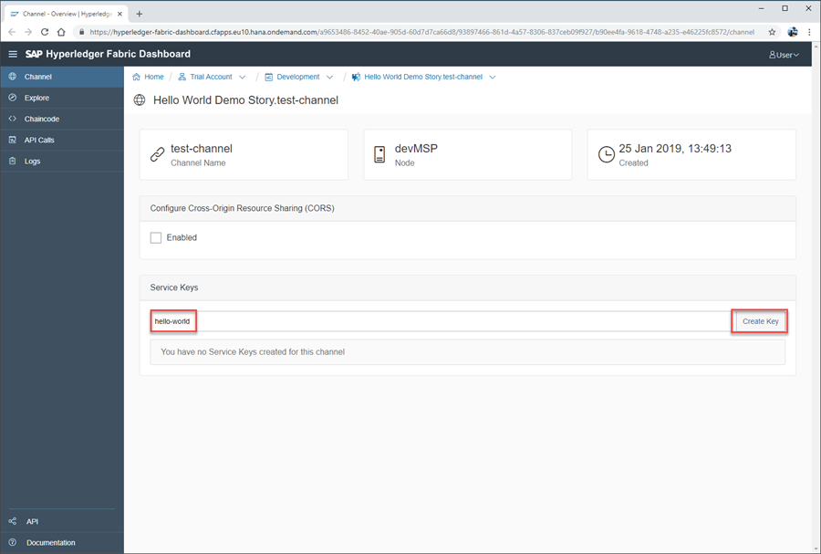
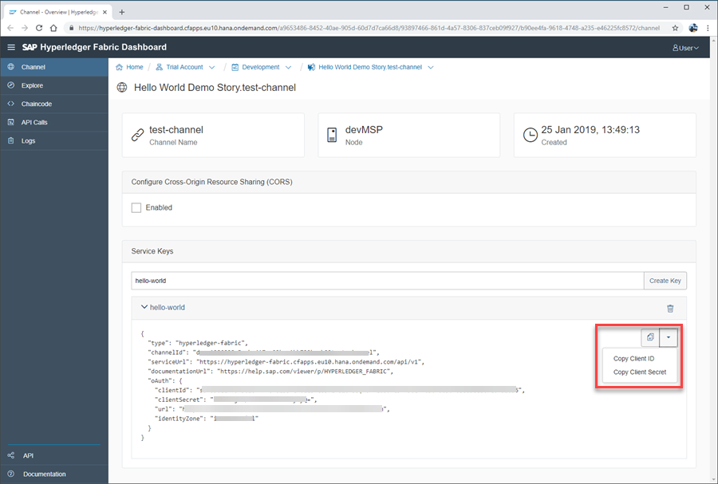

## Details
### You will learn
  - How to create and distribute Hyperledger Fabric service keys on SAP Cloud Platform

---

[ACCORDION-BEGIN [Step 1: ](Understand use of service keys)]

In the usual development process, an SAP Cloud Platform based application is deployed and bound to the Hyperledger Fabric channel. Part of the binding information is the credentials required by the application to access the channel via (micro service) APIs. This information is stored securely within the SAP Cloud Platform and only available to the bound application via its environment.

However, if you need to test the APIs from the browser, then the security credentials must be known to the browser and therefore to the user.

When a service key is created, it consists of the following elements:

```Service Key
{
  "type": "hyperledger-fabric",
  "channelId": "example-channel-id",
  "serviceUrl": "https://hyperledger-fabric.cfapps.eu10.hana.ondemand.com/api/v1",
  "documentationUrl": "https://help.sap.com/viewer/p/HYPERLEDGER_FABRIC",
  "oAuth": {
    "clientId": "example-clientID",
    "clientSecret": "example-client-secret",
    "url": "example-url.com",
    "identityZone": "global-account"
  }
}
```

It is the `clientID` and `clientSecret` that are particularly relevant to you when testing your recently deployed chaincode.

[DONE]
[ACCORDION-END]

[ACCORDION-BEGIN [Step 2: ](Create service key)]

Once on your channel dashboard, enter a service key name (an internal reference) and click **Create Key**:



The service key is now created and the details are exposed. Here you can choose to copy the whole key to your clipboard, or use the shortcuts for `clientID` and `clientSecret`:



[VALIDATE_1]
[ACCORDION-END]
