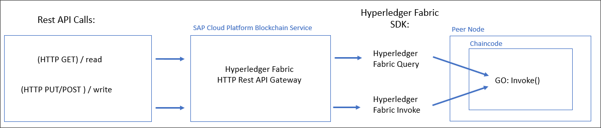

## Details
### You will learn
  - Understand how a Hyperledger Fabric chaincode .Go program is structured
  - How to implement the Hyperledger Fabric chaincode interface
  - How to add functions to your Hyperledger Fabric chaincode

---

[ACCORDION-BEGIN [Step 1: ](Create package main)]

Hyperledger Fabric chaincode is essentially a piece of code that is executed on a peer node. When creating this code you will use the package "main" for making the package an executable program. This package "main" is used to tell the Go compiler, installed in the previous tutorial, that the package should compile as an executable program instead of a shared library (used for reusable pieces of code).

The main function in the package "main" will be the entry point of our executable program. This is used to create a binary with `go build`.

Open your `hello_world.go` file and copy and paste the following below the disclaimer:

```Go
package main
```

[DONE]
[ACCORDION-END]

[ACCORDION-BEGIN [Step 2: ](Import packages)]

In Go, source files are organized into system directories called packages. These enable code reuse across Go applications. The keyword "import" is used for importing a package. We can download and install third-party Go packages by using `go get` command. The Go get command will fetch the packages from the source repository and put the packages on the GOPATH location.

Open your `hello_world.go` file and copy and paste the following below the package main:
```Go
import (
	"github.com/hyperledger/fabric/core/chaincode/shim"
	"github.com/hyperledger/fabric/protos/peer"
)
```
[DONE]
[ACCORDION-END]

[ACCORDION-BEGIN [Step 3: ](Define chaincode)]

When the chaincode is started on a peer node, the main function is executed. The chaincode is then started with `shim.Start`, which expects a `struct` that implements the `shim.Chaincode` interface.

Open your `hello_world.go` file and copy and paste the type and main functions below the import packages:

```Go
type Chaincode struct {
}

func main() {
	shim.Start(new(Chaincode))
}
```
[DONE]
[ACCORDION-END]

[ACCORDION-BEGIN [Step 4: ](Implement chaincode interface)]

Every chaincode needs to implement the following interface:

```Go
type Chaincode interface {
    // Init is called during Instantiate transaction after the chaincode container
    // has been established for the first time, allowing the chaincode to
    // initialize its internal data
    Init(stub ChaincodeStubInterface) peer.Response

    // Invoke is called to update or query the ledger in a proposal transaction.
    // Updated state variables are not committed to the ledger until the
    // transaction is committed.
    Invoke(stub ChaincodeStubInterface) peer.Response
}
```
When you instantiate or upgrade a chaincode, the chaincode's `Init` function is executed. You can use this to initialize values on the ledger.  

When you invoke or query a chaincode, the chaincode's `Invoke` function is executed. You can use this to update or query the ledger.

NOTE: Further information about this interface can be found at [`GoDoc.org`](https://godoc.org/github.com/hyperledger/fabric/core/chaincode/shim#Chaincode)

The `Init` and `Invoke` functions are both called with the [stub interface](https://godoc.org/github.com/hyperledger/fabric/core/chaincode/shim#ChaincodeStubInterface), which can be used to access transaction parameters and to modify the ledger.

Open your `hello_world.go` file and copy and paste the init and invoke functions below the import packages:

```Go
// Init is called during Instantiate transaction.
func (ptr *Chaincode) Init(stub shim.ChaincodeStubInterface) peer.Response {
	return shim.Success(nil)
}

// Invoke is called to update or query the ledger in a proposal transaction.
func (ptr *Chaincode) Invoke(stub shim.ChaincodeStubInterface) peer.Response {
	return shim.Error("Not yet implemented!")
}
```
By now your `hello_world.go` file should be structured as follows:

```Go
// DISCLAIMER:
// THIS SAMPLE CODE MAY BE USED SOLELY AS PART OF THE TEST AND EVALUATION OF THE SAP CLOUD PLATFORM
// BLOCKCHAIN SERVICE (THE "SERVICE") AND IN ACCORDANCE WITH THE TERMS OF THE AGREEMENT FOR THE SERVICE.
// THIS SAMPLE CODE PROVIDED "AS IS", WITHOUT ANY WARRANTY, ESCROW, TRAINING, MAINTENANCE, OR SERVICE
// OBLIGATIONS WHATSOEVER ON THE PART OF SAP.

package main

import (
	"github.com/hyperledger/fabric/core/chaincode/shim"
	"github.com/hyperledger/fabric/protos/peer"
)

type Chaincode struct {
}

func main() {
	shim.Start(new(Chaincode))
}

// Init is called during Instantiate transaction.
func (ptr *Chaincode) Init(stub shim.ChaincodeStubInterface) peer.Response {
	return shim.Success(nil)
}

// Invoke is called to update or query the ledger in a proposal transaction.
func (ptr *Chaincode) Invoke(stub shim.ChaincodeStubInterface) peer.Response {
	return shim.Error("Not yet implemented!")
}
```
[VALIDATE_1]
[ACCORDION-END]

[ACCORDION-BEGIN [Step 5: ](Add functions to chaincode)]



Within Hyperledger Fabric we have to distinguish between the different context where the word "Invoke" is used. Within Fabric, specifically there in the SDK used to access all Fabric functionality, there are the concept/access of Invoke versus Query. A call to the Invoke functionality at Fabric SDK level is effectively a write operation to the underlying blockchain. After the call, all updates are committed to the blockchain. However, a call to the Query functionality, is effectively a read operation on the blockchain, only returning information.

Given the concept of Invoke and Query on Fabric (at SDK level), the HTTP REST world can be mapped onto these two calls. Effectively, all HTTP GET requests are considered to be read operations and are mapped onto a Fabric SDK Query call. All HTTP POST and PUT calls are considered to be write operations and are mapped onto the Fabric Invoke call.

However, having the concept of Invoke and Query on the Fabric SDK does not map 1:1 into the Fabric chaincode. Within the chaincode, there is only one Invoke function (implemented in the chaincode using GO language). Thus, within the chaincode there are only chaincode functionality (also called functions), that are all accessed via the central entry point of the (GO language) Invoke function. This GO Invoke function does NOT know in any way whether the call from the outside was an Invoke (equals write/commit) or a Query (equals read). The chaincode function simply has to execute and return the relevant (correct) answers.

When calling chaincode via invoke or query, the chaincode `Invoke` function is executed. To access the function name and arguments of the call, you can use the `stub.GetFunctionAndParameters`. You can then use the function name to call different functions.

For example:
```Go
func (ptr *Chaincode) Invoke(stub shim.ChaincodeStubInterface) peer.Response {
	function, args := stub.GetFunctionAndParameters()
	switch function {
	case "write":
		return write(stub, args)  
	case "read":
		return read(stub, args)
	default:
		return shim.Error("unknown function")
	}
}
```
In our chaincode example we want to update our `Invoke` function to differentiate between actions, such as write and read. We do this by creating two new functions, titled `write` and `read`. The `write` function enables you to write something to the ledger, whereas the `read` function fetches data and provides the state.

Once the Invoke() GO function sees which chaincode functionality is called (Read or Write), it will call the corresponding GO function, supplying as parameters the stub interface and the complete array of strings, which are input parameters to the chaincode function.

The stub interface is a callback interface that can be used within the chaincode to access Fabric functionality and is completely discussed within the Fabric documentation.

All parameters for any chaincode functionality is marshalled as strings in an array to the chaincode. There is no check on the number of parameters supplied, nor of the type of each parameter. It is up to the chaincode functionality, effectively each GO function, to first validate that the number and types of the supplied input parameters match, and then to unpack and convert the strings into corresponding parameters. In this example, as only string parameters are used, the only check that is required it to ensure that the correct number of parameters were supplied. In addition, all ID parameters are consistently changed to lower case, so as to ensure that reading and writing will always work, independent of the supplied ID strings. (Note, it does not have to be done, it is simply an example of how parameters can be transformed with the chaincode before been written to the blockchain.)

```Go
// Write text by ID
func write(stub shim.ChaincodeStubInterface, args []string) peer.Response {

	if len(args) != 2 || len(args[0]) < 3 || len(args[1]) == 0 {
		return shim.Error("Parameter Mismatch")
	}
	id := strings.ToLower(args[0])
	txt := args[1]

	if err := stub.PutState(id, []byte(txt)); err != nil {
		return shim.Error(err.Error())
	}

	return shim.Success(nil)
}
```

The write function takes two parameters, namely the ID of the string and the string value itself. A call could be for example `write("TXT001", "Hello World!")`. The first step within the write function is to check that two parameters (of type string) are supplied, that the first parameter (ID) is at least 3 characters long and that the second parameter (the text value) is supplied (length greater than zero).

Once we have validated the parameters, we extract the two parameters from the string array (`args[]`) and assign them to local GO variables. Usually in this step all additional type checking and conversion is done, for example converting strings to integers, etc, where required. In this example, the only parameter manipulation done is to translate the ID to lower case, to ensure that the ID is case insensitive.

In the next step, the text string should be written to the blockchain. The way it works, is that all information written to the blockchain is packaged into a blob and stored under a key using the `PutState` method on the stub interface. In complex applications, the key will be index to the business object and the payload will be a (JSON) serialized string for the object. In this example, we simply use the ID directly as key and the text value directly as payload. These two parameters are used as input to `PutState`. The only minor aspect is that this method expects a byte array (`[]byte`) as input parameter, therefor we do a GO language cast just to convert the string to a byte array.

In a final step, we return simply a success message.

How do we know/determine that the ID is the first parameter (`args[0]`) and that the text value is the second parameter (`args[1]`)? This is enforced and documented in the corresponding HTTP REST interface (YAML file) that describes the interface to this function. There, two parameters were defined as input to the HTTP REST /write call, and the parameters are passed to the chaincode in exactly the sequence in which they were defined in the YAML file.

```Go
// Read text by ID
func read(stub shim.ChaincodeStubInterface, args []string) peer.Response {

	if len(args) != 1 {
		return shim.Error("Parameter Mismatch")
	}
	id := strings.ToLower(args[0])

	if value, err := stub.GetState(id); err == nil && value != nil {
		return shim.Success(value)
	}

	return shim.Error("Not Found")
}
```

The read function is a little simpler. It takes only one parameter as input (the ID of the string to read) and returns the text value of the string. It will normally be called `text = read("TXT001")`. In the first, a check is done that only one parameter is supplied. Note that we simply skipped the length check here, as we will validate the ID implicitly a bit later when reading from the blockchain.

In the next step, we again extract the ID as GO variable from the string array (`args[]`).

Reading from the blockchain is done with the `GetState` method. The ID is supplied as input parameter and the `GetState` will return a byte array with the corresponding blob value from the blockchain. If we have a success (no error and a value returned), we will return this blob to the caller. Note that the Success call also takes a byte array (`[]byte`) as return parameter, which means that we can return the retrieved blob, which is our text value, directly. The caller (on the outside) will convert this into a string to be returned to the HTTP caller.

If the read was not successful, for example because the ID does not exist, an error message is returned.

[DONE]
[ACCORDION-END]

[ACCORDION-BEGIN [Step 6: ](Finalize chaincode)]

You should now have the complete minimal chaincode within your `hello_world.go` file as follows:

```Go
// DISCLAIMER:
// THIS SAMPLE CODE MAY BE USED SOLELY AS PART OF THE TEST AND EVALUATION OF THE SAP CLOUD PLATFORM
// BLOCKCHAIN SERVICE (THE "SERVICE") AND IN ACCORDANCE WITH THE TERMS OF THE AGREEMENT FOR THE SERVICE.
// THIS SAMPLE CODE PROVIDED "AS IS", WITHOUT ANY WARRANTY, ESCROW, TRAINING, MAINTENANCE, OR SERVICE
// OBLIGATIONS WHATSOEVER ON THE PART OF SAP.

package main

import (
	"strings"

	"github.com/hyperledger/fabric/core/chaincode/shim"
	"github.com/hyperledger/fabric/protos/peer"
)

type Chaincode struct {
}

func main() {
	shim.Start(new(Chaincode))
}

// Init is called during Instantiate transaction.
func (ptr *Chaincode) Init(stub shim.ChaincodeStubInterface) peer.Response {
	return shim.Success(nil)
}

// Invoke is called to update or query the ledger in a proposal transaction.
func (ptr *Chaincode) Invoke(stub shim.ChaincodeStubInterface) peer.Response {

	function, args := stub.GetFunctionAndParameters()
	switch function {
	case "read":
		return read(stub, args)
	case "write":
		return write(stub, args)
	default:
		return shim.Error("Valid methods are 'read|write'!")
	}
}

// Write text by ID
func write(stub shim.ChaincodeStubInterface, args []string) peer.Response {

	if len(args) != 2 || len(args[0]) < 3 || len(args[1]) == 0 {
		return shim.Error("Parameter Mismatch")
	}
	id := strings.ToLower(args[0])
	txt := args[1]

	if err := stub.PutState(id, []byte(txt)); err != nil {
		return shim.Error(err.Error())
	}

	return shim.Success(nil)
}

// Read text by ID
func read(stub shim.ChaincodeStubInterface, args []string) peer.Response {

	if len(args) != 1 {
		return shim.Error("Parameter Mismatch")
	}
	id := strings.ToLower(args[0])

	if value, err := stub.GetState(id); err == nil && value != nil {
		return shim.Success(value)
	}

	return shim.Error("Not Found")
}
```

Now save your `hello_world.go` file.

[DONE]
[ACCORDION-END]
