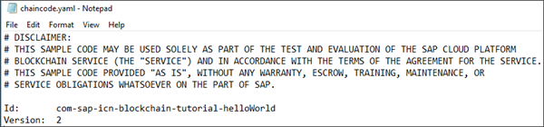
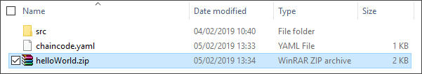
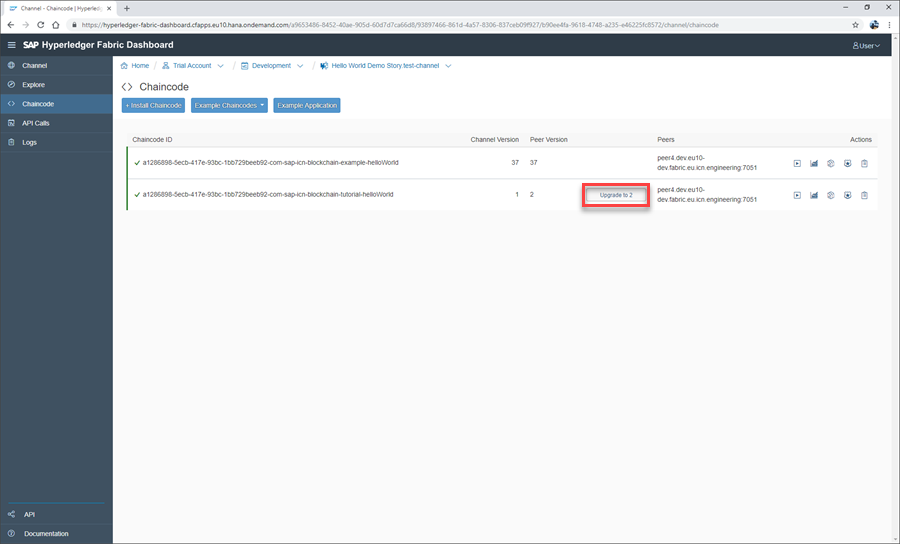
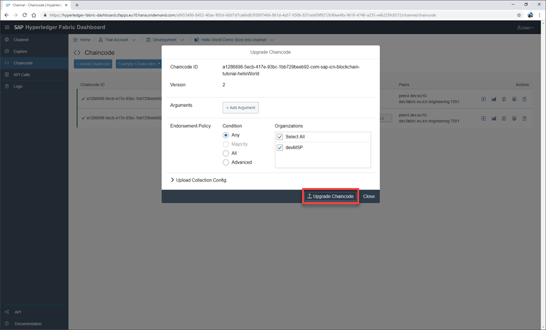

## Details
### You will learn
  - Understand Hyperledger Fabric chaincode lifecycle management
  - How to update Hyperledger Fabric chaincode
  - How to upgrade deployed Hyperledger Fabric chaincode

---

[ACCORDION-BEGIN [Step 1: ](Understand chaincode lifecycle management)]

The Chaincode tab, available on all Hyperledger Fabric channel dashboards, allows you to install, instantiate, and upgrade your chaincode. When using this chaincode tab it is important to understand the lifecycle of chaincode, how these are represented within the service, and what actions you can perform at each stage.

The following diagram highlights five possible stages of chaincode, with an explanation available for each row below:

| Row      | Status          | Description  | Possible Actions
| -------- |:---------------:| ------------:| ----------------
| 1     | Green | The chaincode is instantiated on the channel but not installed on the peer node. It is still callable, though. | You can install the chaincode on your peer node to execute it there
| 2     | Green     | The chaincode is installed and instantiated. |
| 3 | Green      | The chaincode instantiated is a higher version than the one installed on the peer. | You can install the same chaincode version to the peer node
| 4 | Green     | The chaincode is instantiated on the channel but installed in a higher version on the peer. | The chaincode can be upgraded
| 5 | Blue     | The chaincode is only installed on the peer, but hasn't been instantiated. As a result, it can't be executed. | The chaincode can be instantiated to the channel

[DONE]
[ACCORDION-END]

[ACCORDION-BEGIN [Step 2: ](Update your chaincode version)]

After installation, a chaincode can be upgraded at any time by changing its version and then installing it to peer again. This requires the chaincode to have the same name as the previous version, allowing the dashboard to recognize the upgrade.

Open your `chaincode.yaml` file and change the version number. In our example we have changed our version from 1 to 2:

Now repackage your chaincode, creating a zip archive:

[VALIDATE_1]
[ACCORDION-END]

[ACCORDION-BEGIN [Step 3: ](Deploy updated chaincode)]

Open your Hyperledger Fabric Channel Dashboard, displaying your channel overview page:

Click and open the Chaincode section, displaying your chaincode overview page:

Click **+ Install Chaincode**, opening the install chaincode window:

With the Install Chaincode window open, either drag and drop your zipped chaincode or click **Choose File** to browse your files. Once a recognized .zip file has been selected, the window will confirm the file name.

Click **Install Chaincode**:

The chaincode will now be installed on the peer, and the details displayed on the chaincode overview page.

[DONE]
[ACCORDION-END]

[ACCORDION-BEGIN [Step 4: ](Upgrade your chaincode)]

Click **Upgrade to 'X'**, opening the Upgrade Chaincode window:

You are then able to add arguments, endorsement policies, select channels, and upload your collection configuration file. Here we will use the default settings.

Click **Upgrade Chaincode**:

The chaincode is now upgraded and a confirmation message displayed.

[DONE]
[ACCORDION-END]
