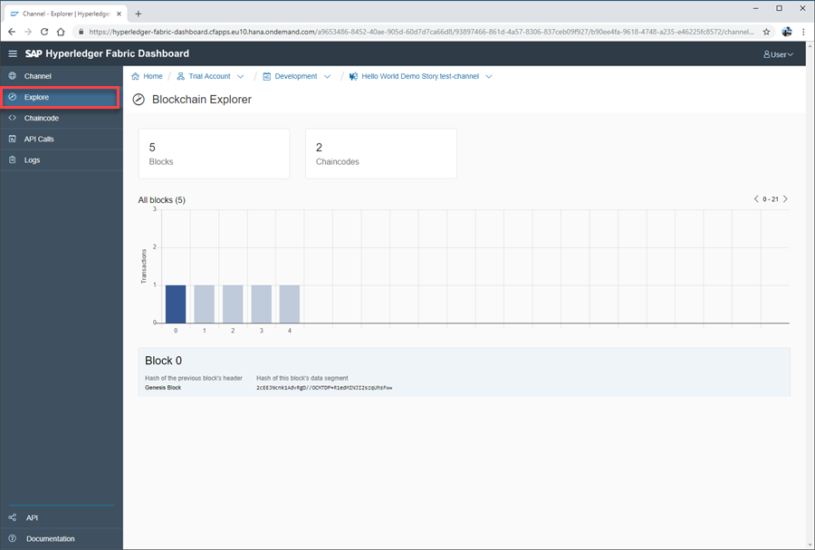
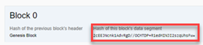
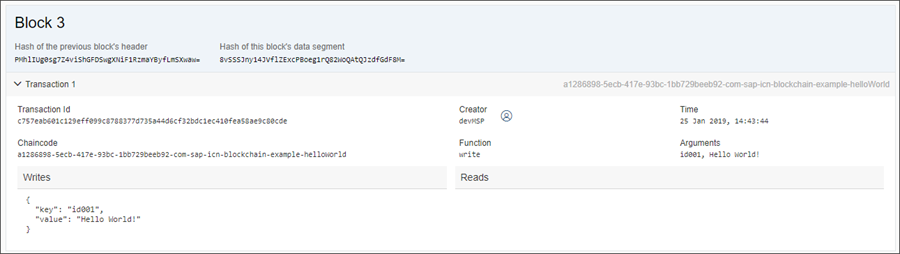
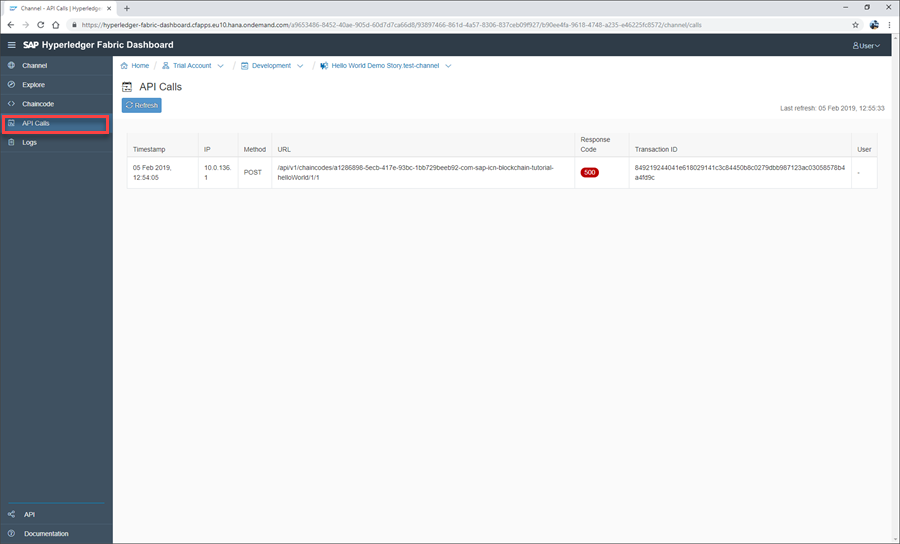
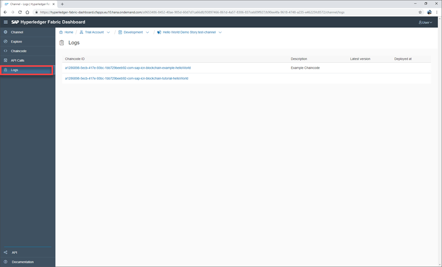

## Details
### You will learn
  - How to view deployed Hyperledger Fabric chaincode
  - How to view API calls to Hyperledger Fabric chaincode
  - How to view Hyperledger Fabric chaincode logs

---

[ACCORDION-BEGIN [Step 1: ](View chaincode explorer)]

Within the Hyperledger Fabric channel dashboard, click the **Explore** tab to view the underlying blockchain:

In the example above, you can see that five blocks have been written to the blockchain. The first block (block 0) is the genesis block that was written when the chain was created. This includes the hash information of the block:

You then have the deployment and testing blocks associated with your `hello_world` examples. It is possible that your own chaincode will be displayed with further or an increased number of blocks, depending on how many deployments you have made or tests you have run.

Click on additional blocks to view their transaction details:

The explorer visualizes all transactions, including the JSON structure of the payload. Additional meta information, such as the transaction ID, is also shown. You can use the explorer to quickly validate the information the chaincode has written to the blockchain.

[VALIDATE_1]
[ACCORDION-END]

[ACCORDION-BEGIN [Step 2: ](View API calls)]

Click the **API Calls** tab:

The API Calls area shows the HTTP REST API calls received by the API gateway and for which the corresponding chaincode functions were called.

[DONE]
[ACCORDION-END]

[ACCORDION-BEGIN [Step 3: ](View chaincode logs)]

Click the **Logs** tab:

You can use the Logs area to view log statements written by the chaincode. This is also a good way to obtain telemetric data from the chaincode, especially when working to isolate a specific error condition.

[DONE]
[ACCORDION-END]
