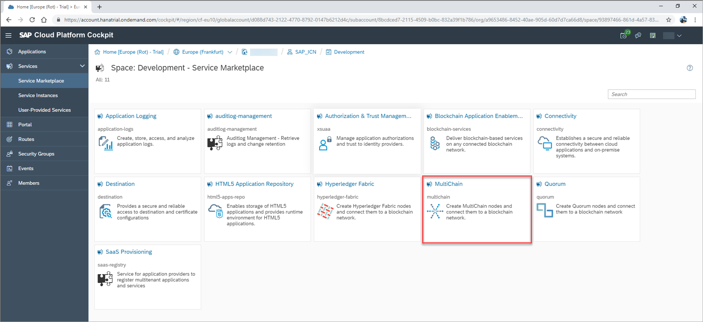
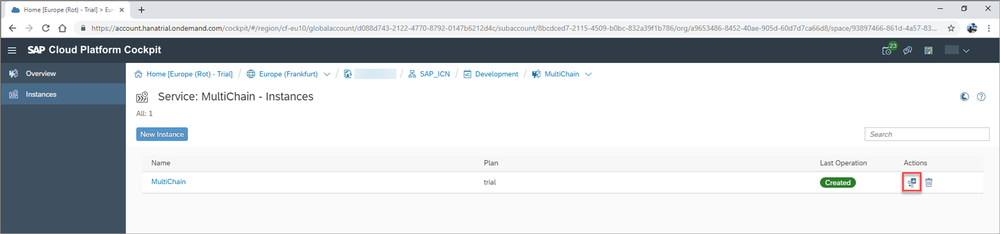
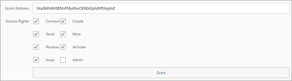
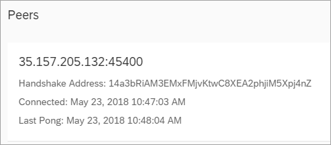

## Details
### You will learn
  - How to access your node dashboard
  - How to grant a MultiChain node permissions from the dashboard

  To complete this tutorial you need access to a second trial account on SAP Cloud Platform. This enables you to control both the join request to the MultiChain network, as completed in [Join a MultiChain Network](blockchain-mc-joins-network.html) and then the subsequent granting of permissions featured in this tutorial.

### Prerequisites
  - The **Handshake Address** of the MultiChain node requesting access to join the MultiChain network.

---
[ACCORDION-BEGIN [Step 1: ](Open the MultiChain service dashboard)]

Once on the SAP Cloud Platform Service Marketplace, locate and open the MultiChain service by clicking the relevant service tile.

Once in the MultiChain service, you will see a service description and the available plans. In this tutorial you will create a trial node. This allows you to provision a single testing node for a 14 day period. These 14 days run concurrently with your 30-day global account trial on SAP Cloud Platform, rather than activating an extension or superseding your global account trial terms.

Click the **Instances** tab on the side menu, opening an overview of available MultiChain instances in your subaccount.

Click the **Dashboard** icon of your Multichain instance, opening your node dashboard.

[DONE]
[ACCORDION-END]

[ACCORDION-BEGIN [Step 2: ](Grant permissions from your dashboard)]

In this step, you are granting the requesting node permissions to join the network.

Click on **Permissions** and enter the **Handshake Address** supplied by the node requesting access into **Grant Address** field.

Select the **Access Rights** the node should hold.

Further information about access rights options can be found here: [Specify MultiChain Service Instance Parameters](https://help.sap.com/viewer/15cb4580694c4d119793f0d3e9b8a32b/BLOCKCHAIN/en-US/3222303fb30c45edbd7450a3bdc44069.html)

Click **Grant**.

The access rights are granted to the requesting node. The node is displayed as a Peer on the node dashboard.

[VALIDATE_1]
[ACCORDION-END]
