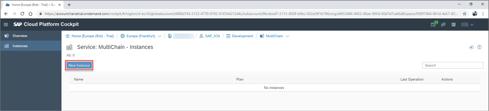
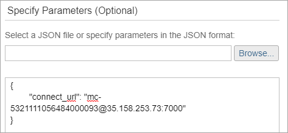
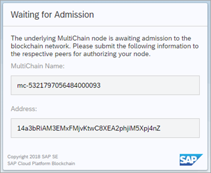
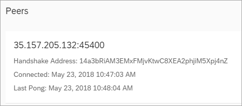

## Details
### You will learn
  - How to provision a MultiChain trial node on SAP Cloud Platform
  - How to request access to a MultiChain network
  - How to access your MultiChain dashboard

### Prerequisites
  - The **Node Address** of the Multichain node you would like to connect to join the Multichain network. An SAP controlled node address is provided in this tutorial if needed.

---

[ACCORDION-BEGIN [Step 1: ](Understand a MultiChain network on SAP Cloud Platform)]

A MultiChain network consists of two or more MultiChain service instances / nodes, connected via node address.
When requesting access to the network, you should first create MultiChain service instance using the **Node Address** of the Multichain node you would like to connect to.

All MultiChain node addresses on SAP Cloud Platform follow the same format:

```
"<chainname>@<ip address of node>:<p2p port>"
```

For this tutorial, we use the following node address:

```
MultiChain_Tutorial@18.196.13.215:7000
```

Once a connection is created, the MultiChain node administrator can then grant your node permissions via its node dashboard. Whilst this doesn't happen automatically, the process for a second SAP Cloud Platform account to follow is provided in our [Grant Requesting MultiChain Node Permission to join a MultiChain Network](blockchain-mc-node-grant-permissions) tutorial.

[DONE]
[ACCORDION-END]

[ACCORDION-BEGIN [Step 2: ](Create MultiChain instance)]

Once on the SAP Cloud Platform Service Marketplace, locate and open the MultiChain service by clicking the relevant service tile.


Once in the MultiChain service, you will see a service description and the available plans. In this tutorial you will create a trial node. This allows you to provision a single testing node for a 14 day period. These 14 days run concurrently with your 30-day global account trial on SAP Cloud Platform, rather than activating an extension or superseding your global account trial terms.

Click the **Instances** tab on the side menu, opening an overview of available MultiChain instances in your subaccount.


Once on your MultiChain instances overview, click **New Instance** to open the service instance wizard.



[DONE]
[ACCORDION-END]

[ACCORDION-BEGIN [Step 3: ](Choose service instance settings)]

Navigate through the service instance wizard, selecting the following settings:

Field | Value
:------|:--------
**Plan**  | `trial`
**Name** | `MultiChain`

In Dialog **Specify Parameters** enter the `connect_url` parameter with the **Node Address** provided by the MultiChain node you want to connect to.



After selecting the settings, click **Finish**.


[DONE]
[ACCORDION-END]

[ACCORDION-BEGIN [Step 5: ](Access MultiChain dashboard)]

Your trial node is provisioned (which may take a few moments) and is displayed on the overview of available service instances.


Click the **Dashboard** icon, displaying the **Waiting For Admission** screen:


Copy the **Address** information and send this to the administrator of the Multichain network you are requesting access to.



The administrator of this node grants you access rights / permissions.

Once granted, reopen or refresh your node dashboard to see the peer details.



> Peer-to-Peer communication between nodes in a MultiChain network is not encrypted, regardless of whether the node is hosted on SAP Cloud Platform or externally. However, the RPC Endpoint of nodes running on SAP Cloud Platform do use HTTPS and so only transfer encrypted and secure data.


[VALIDATE_1]
[ACCORDION-END]
