## Details
### You will learn
  - About using MultiChain streams for data storage
  - How to write date to a stream
  - How to read data from a stream

### Prerequisites
-	Access to a MultiChain trial node on SAP Cloud Platform. See [Create a MultiChain Trial Node](blockchain-mc-create-node).
- An API testing tool such as [Postman](https://www.getpostman.com/) or [CURL](https://curl.haxx.se/download.html).

---

[ACCORDION-BEGIN [Step 1: ](Access node dashboard)]

After creating a MultiChain service instance, provisioning a node in the process, click the **Dashboard** icon to access your individual dashboard.


MultiChain dashboards provide access to node information, network configuration information, and MultiChain object information such as MultiChain streams.

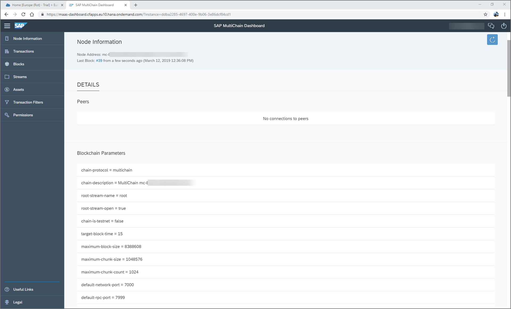

When accessing your MultiChain dashboard, you can view the following information:

* **Node information**: Display node and network configurations.
* **Transactions**: Display and monitor MultiChain transactions.
* **Blocks**: Display and monitor MultiChain blocks.
* **Streams**: Display and monitor MultiChain streams.
* **Assets**: Display and monitor MultiChain assets.
* **Permissions**: Display and monitor MultiChain Permissions. Grant other nodes access.

We focus on MultiChain streams in this tutorial. MultiChain streams allows you to use the MultiChain as a key-value pair database. For more information on MultiChain streams, see: [MultiChain Data Streams](https://www.multichain.com/developers/data-streams/).

Click **Streams**.

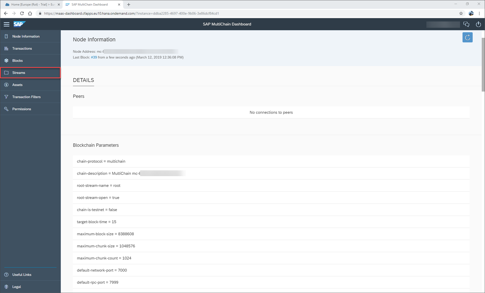

An overview of available MultiChain streams is displayed. Every MultiChain Node has the default stream root. Click on the **root** stream to see content details.

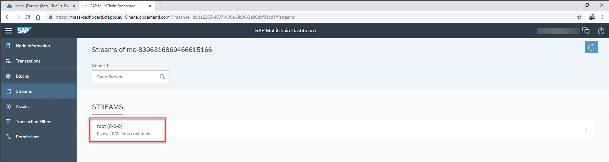

 Notice how the root stream does no yet contain key or item information.

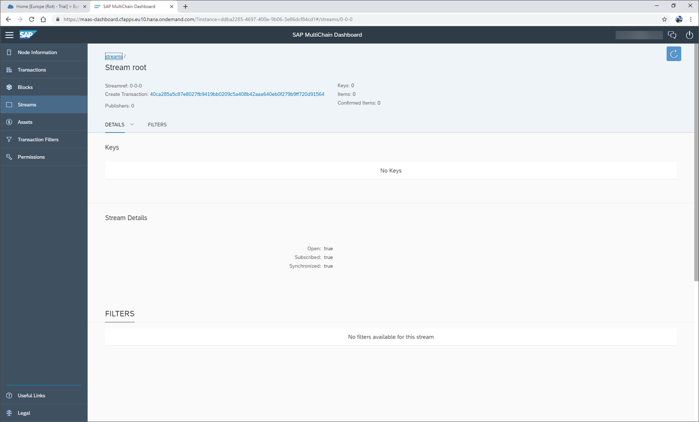

[VALIDATE_1]
[ACCORDION-END]

[ACCORDION-BEGIN [Step 2: ](Create and manage MultiChain service keys)]

Service keys for your MultiChain node provide you with the information to access the node. These can be created in your instance view in the SAP Cloud Platform Cockpit.

Return to the SAP Cloud Platform Cockpit and click on your trial node name.

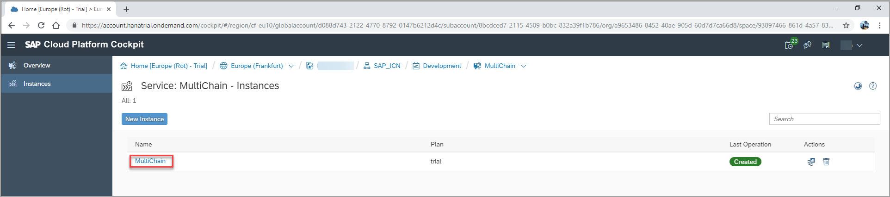

In this detail screen you see the application referring to your MultiChain service instance (service binding). Click **Service Keys**.

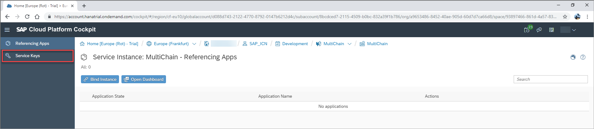

Click **Create Service Key** and then create and save a service key named `key1`.

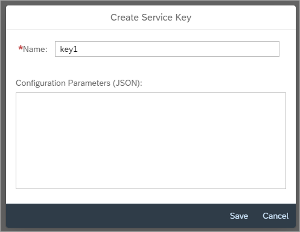

Upon creation of a service key, a unique blockchain URL endpoint and API key for your instance is created on the SAP Cloud Platform. The URL and API key are used to access your MultiChain node using `json-rpc`, either from an application hosted in SAP Cloud Foundry or directly via http calls.

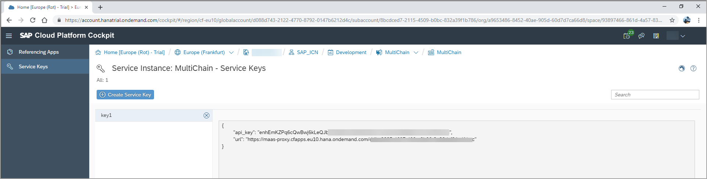

Note down the API key and URL for later use.

[DONE]
[ACCORDION-END]

[ACCORDION-BEGIN [Step 4: ](Write to a MultiChain stream)]

In the next section we will use `json-rpc` calls to communicate with the MultiChain instance.

To create a HTTP call we're using Postman, though you can use your API testing tool of choice here.

We will now write and read data to our root stream using direct HTTP calls.

All available `json-rpc` commands are listed on the [MultiChain homepage] (https://www.multichain.com/developers/json-rpc-api/).

In this example we store a key/value pair to our root stream. We use the `json-rpc` command publish with the following parameters:

Field | Value
:------|:--------
**method**  | `publish`
**`param` stream name** | root
**`param` key** | `myKey`
**`param` value** | {"text":"hello world"}

To embed this `json-rpc` to a http call use the following http parameters:

Field | Value
:------|:--------
**method**  | `POST`
**URL** | Enter your URL
**Header parameter `apikey`** | Enter your API Key
**Body parameter** (raw format with JSON (application/json)) | `{"method":"publish", "params":["root", "myKey", {"text":"hello world"}]}`

Make sure to change the URL and API key to the one from your service key. You will end-up with the following entries in Headers and Body tabs.

Headers:

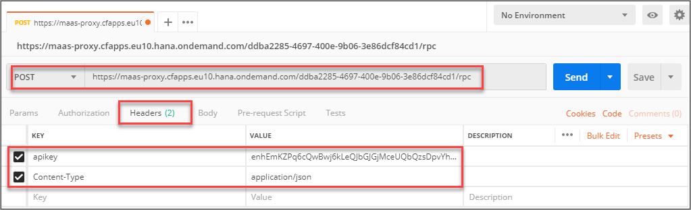

Body:

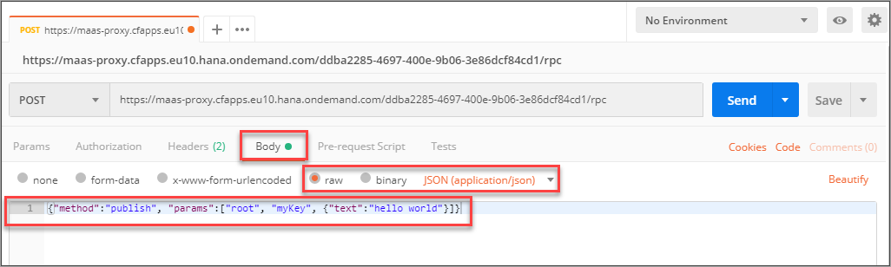

Click Send in your POSTMAN application.

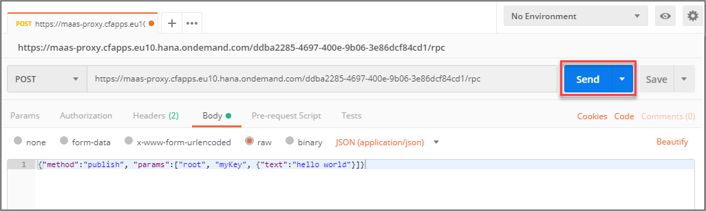

You will receive the following response.

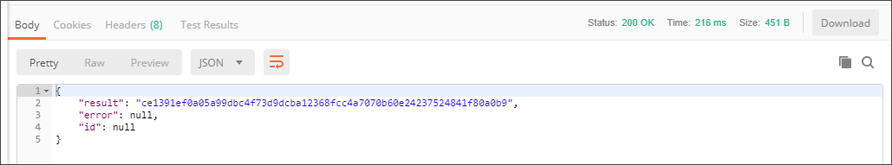

In the response you will get the MultiChain Transaction ID.

Optionally, you may execute this command in command line tool CURL for Windows 10:

```CURL
curl -X POST (INSERT URL HERE) \
-d "{\"method\":publish\", \"params\":[\"root\", \"myKey\", \"{\"text\":\"hello world\"}\"]}" \
--header "apikey: (INSERT APIKEY HERE)"
```

If the call is successful, you get back the MultiChain transaction ID for this action.

[DONE]
[ACCORDION-END]

[ACCORDION-BEGIN [Step 6: ](Monitor MultiChain stream in dashboard)]

The result can also verified on the MultiChain dashboard. Return to your MultiChain dashboard on SAP Cloud Platform and refresh your detail screen for the root stream.

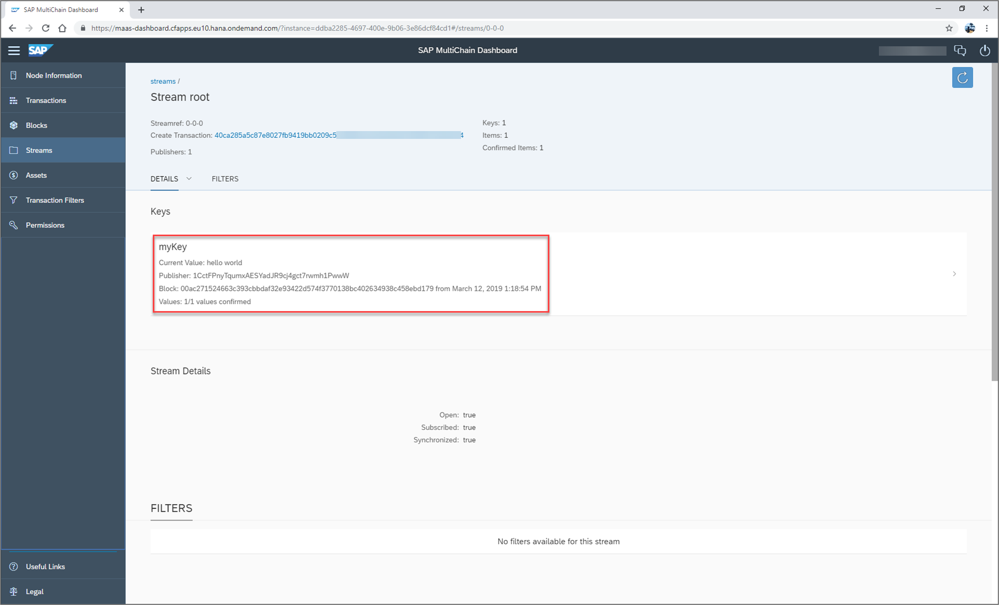

You see `myKey` has an entry with value `Hello World`. The text is embedded in a MultiChain transaction that is part of the blockchain's persistence.

[DONE]
[ACCORDION-END]

[ACCORDION-BEGIN [Step 10: ](Read from a MultiChain stream)]

In this example we will use the `json-rpc` command `liststreamkeyitems` to read the value for a key. Use the RPC command with the following parameters:

Field | Value
:------|:--------
**method**  | `liststreamkeyitems`
**parameter stream name** | root
**key** | `myKey`

To embed this `json-rpc` to a http call use the following http parameters:

Field | Value
:------|:--------
**method**  | `POST`
**URL** | Enter your URL
**Header parameter `apikey`** | Enter your API Key
**Body parameter** (raw format with JSON (application/json)) | `{"method":"liststreamkeyitems", "params":["root", "myKey"]}`

Click **Send**

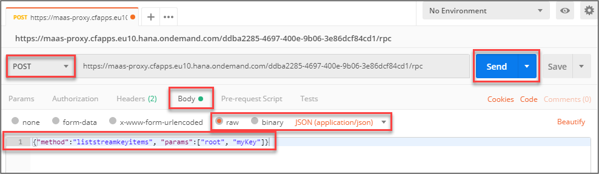

As a result you get the data field with the text `Hello World` and some additional information such as the published ID, the block timestamp, and the creation transaction ID.

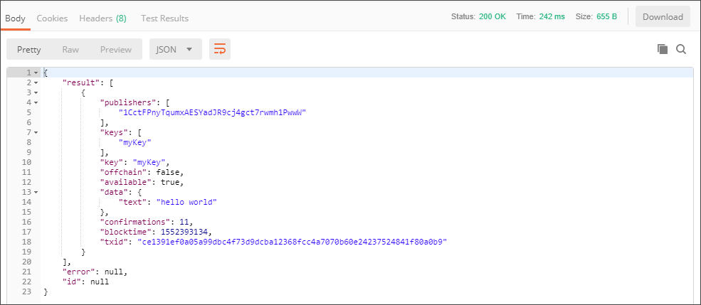

Alternatively, to execute this command in CURL for Windows 10 go the command line tool of Windows 10 and enter the following CURL command:

```CURL
curl -X POST https://maas-proxy.cfapps.eu10.hana.ondemand.com/493a769c-e7c9-48a5-a68d-6226edeb5e4a/rpc \
--data "{\"method\":\"liststreamkeyitems\", \"params\":[\"root\", \"myKey\"]}" \
--header "apikey: CVcLwx6RqxgugquhfgeJwmZT7SGmLJ78oW8HEFqc9uGJtMT2dppsSJyXJW82zxak"
```

[DONE]
[ACCORDION-END]
