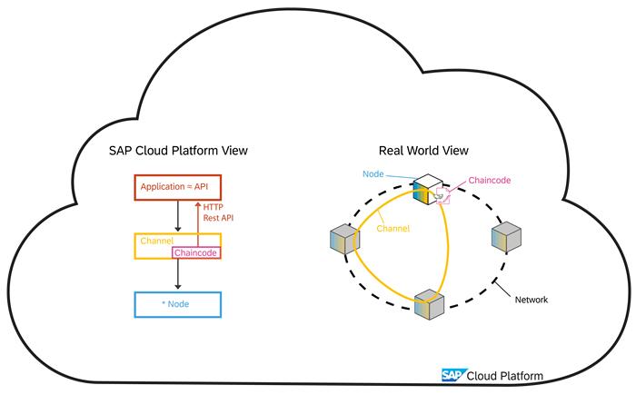
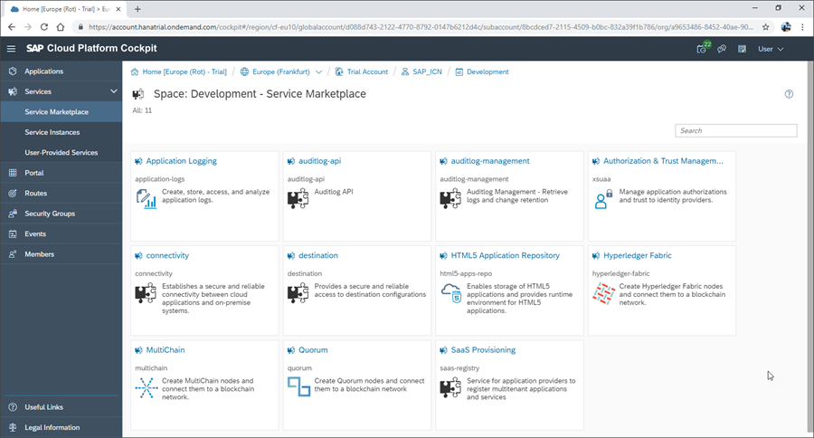

## Prerequisites
 - Access to an SAP Cloud Platform Global Account (either Trial or Paid), with accompanying Sub-Account and Space defined. Note: When registering for an SAP Cloud Platform Global trial account, both a Subaccount and a Space are automatically created for you.

## Details
### You will learn
  - An overview of SAP Cloud Platform, its environments, and wider infrastructure
  - An understanding of how blockchain services are represented on SAP Cloud Platform
  - The difference between Global Accounts, Subaccounts, and Spaces on SAP Cloud Platform
  - How to navigate to SAP Cloud Platform Service Marketplace

---
[ACCORDION-BEGIN [Step 1: ](Understanding Blockchain Service)]

On SAP Cloud Platform, different service instances are created to represent (or proxy) the real-world Hyperledger Fabric instances provisioned.

Typically, within a Hyperledger Fabric network, first nodes are created, all attached to the same ordering service. A channel (effectively the blockchain) is created between any number of nodes. Information can only be shared on this channel. On a channel, one or more chaincode are deployed, which implements the exact business logic (also known as `smart contract`). On SAP Cloud Platform, a `HTTP REST API` is made available to all the functions implemented in the chaincode.

This `Hello World` tutorial group will guide you through the steps to create a Hyperledger Fabric node, create a channel on the node, deploy chaincode and test the chaincode (using a Swagger interface).

[DONE]
[ACCORDION-END]

[ACCORDION-BEGIN [Step 2: ](An Overview of SCP)]

SAP Cloud Platform is effectively an umbrella over several cloud environments, providing the infrastructure for SAP and SAP's customers for enabling best-of-breed cloud experience.

SAP Cloud Platform supports the following environments: Neo, Cloud Foundry, Kubernetes, and ABAP.

- **Neo**: Custom SAP developed cloud infrastructure for running cloud-centric Java applications.
- **Cloud Foundry**: Environment for scalable web applications running in the cloud.
- **Kubernetes**: For hosting container landscapes.
- **ABAP in the Cloud**: Complete ABAP systems running in a cloud environment.

To achieve a world-wide footprint, SAP Cloud Platform uses different infrastructure providers: SAP own computer centers, `Amazon AWS`, `Microsoft Azure`, `Google GCP`, & `Alibaba`.

SAP Cloud Platform Blockchain service is available as a service within the Cloud Foundry environment, initially within two regions: Europe (EU10) and US East (US10).

[VALIDATE_1]

[ACCORDION-END]

[ACCORDION-BEGIN [Step 3: ](Log on to SCP)]

To access SAP Cloud Platform and navigate to the Blockchain Service, follow the below steps:

Open a browser and navigate to SAP Cloud Platform homepage:

<https://account.hanatrial.ondemand.com>

Next click 'Log-on' and enter your account details when prompted:

This gives you access to your SAP Cloud Platform Cockpit.

[DONE]
[ACCORDION-END]

[ACCORDION-BEGIN [Step 4: ](Select your Global Account)]

Once in the SAP Cloud Platform cockpit you can access Global Accounts. These often represent an entire company and can be viewed as an empty shell used for billing, recording data consumption, and grouping resources together. They can't be used to directly run applications or services, however.

Now click on the Global Account name to open its cockpit. In this example we are using our `Trial Account` Global Account:

[DONE]
[ACCORDION-END]

[ACCORDION-BEGIN [Step 5: ](Select your Subaccount)]

Once in your Global Account cockpit you can access Subaccounts.

A Subaccounts is the selection of a specific environment, hosted at a specific provider in a specific region. As such, Global Accounts can house one to many Subaccounts at any one time.

Now click your Subaccount name to open its cockpit. In this example we are using our Blockchain subaccount:

[DONE]
[ACCORDION-END]

[ACCORDION-BEGIN [Step 6: ](Select your Space)]

Once in your Subaccount you can access your relevant space.

Spaces allow organizations to divide their subaccounts into specific teams or projects, helping to map the structure of their organization into clearly defined areas.

One common example is to use one space for development, and another space for testing.

To access your spaces, click the **Spaces** tab on the side menu:

And then select your space from the dashboard. In this example we are using our Development space:

[DONE]
[ACCORDION-END]

[ACCORDION-BEGIN [Step 7: ](Open Service Marketplace)]

Once inside your space you have access to a number of features, including the Service Marketplace.

To access the Service Marketplace, click the  **Service Marketplace** tab on the side menu:

[DONE]
[ACCORDION-END]

[ACCORDION-BEGIN [Step 8: ](Viewing the Service Marketplace)]

Within the Service Marketplace, all the supported services are available. For example, if an application requires a `MongoDB`, then within the Service Marketplace select the `MongoDB` service and provision an instance of this service within this Cloud Foundry space.

The SAP Cloud Platform Blockchain offering is available with the Service Marketplace as several services, each of which can be provisioned individually as required.

 At a technology level, there are services for Hyperledger Fabric, MultiChain, and Quorum. Any of these services can be used to provision the relevant blockchain technology. In addition, SAP offers a set of blockchain agnostic services, which are grouped within the 'Blockchain Application Enablement' service. These services are for example a timestamp service, or integration with HANA database.

[DONE]
[ACCORDION-END]

---
