## Details
### You will learn
  - About the available Quorum service plans on SAP Cloud Platform
  - How to provision a Quorum development node
  - How to create and maintain Quorum service keys from your Quorum dashboard

---

[ACCORDION-BEGIN [Step 1: ](Understand the Quorum service)]

 The Quorum service is integrated into SAP Cloud Platform via a service broker. The service broker supports several node types as service plans.

 **Development Nodes**

 The simplest node type is a development node. This is effectively an environment with all relevant APIs for developing and testing of Solidity smart contracts on a fixed network with shared nodes. This node type has private transactions disabled because of the nature of shared nodes.

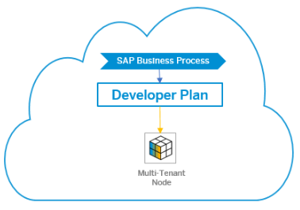

**`Testnet` Nodes**

For more complex testing of real-world scenarios, `Testnet` nodes are supported. In this network, the Quorum nodes are part of a cross organizational test network available for developing and testing distributed applications, including private transactions. Partners and customers can provision single nodes into this network creating a testing a specific private test scenario using private transactions.

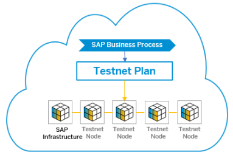

**Connect Your Own Network**

The Connect Your Own Network (`CYON`) plan supports consortium cases where the complete Quorum network is provisioned and operated outside of the SAP Cloud platform (for example centrally by the consortium), and where one peer node needs to be made accessible from SAP Cloud Platform. This service plan enables the transparent connection of SAP business processes onto this external network.

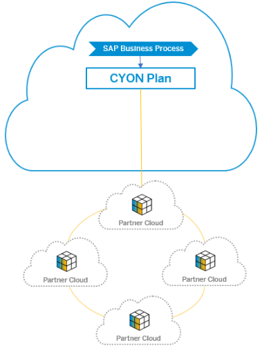

[DONE]
[ACCORDION-END]

[ACCORDION-BEGIN [Step 2: ](Open the Quorum service)]

Once on the SAP Cloud Platform Service Marketplace, locate and open the Quorum service by clicking the relevant service tile.

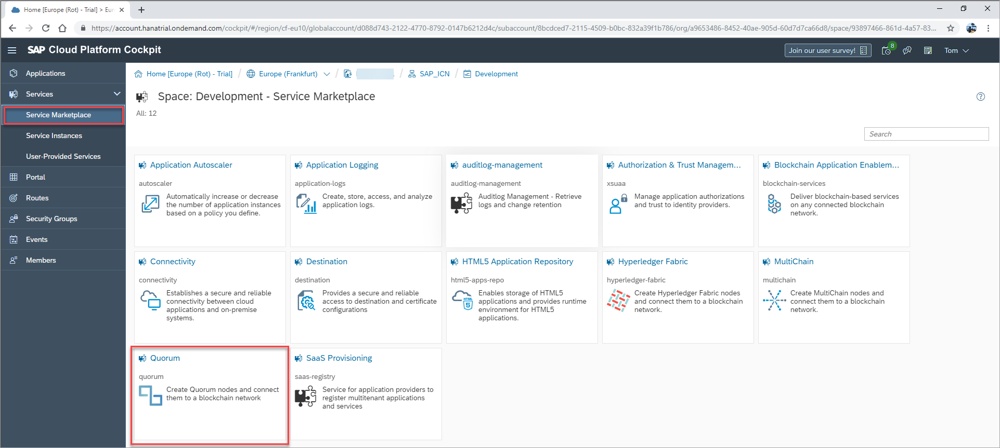

[DONE]
[ACCORDION-END]

[ACCORDION-BEGIN [Step 3: ](Create new Quorum instance)]

Once in the Quorum service, you will see a service description and the available plans.

For the `Hello World` example, we will be using the `dev` plan. This is effectively a single standalone service instance (often referred to as a node) that can be used to develop and test Solidity smart contracts. To keep costs to a minimum, developer nodes are hosted in a multi-tenant fashion on nodes operated by SAP.

Click the **Instances** tab on the side menu, opening an overview of available Quorum instances in your subaccount.

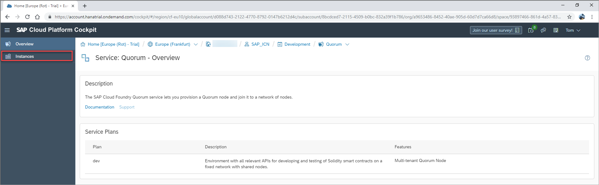

Once on your Quorum instances overview, click **New Instance** to open the service instance wizard.

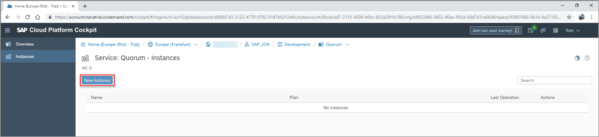

[DONE]
[ACCORDION-END]

[ACCORDION-BEGIN [Step 4: ](Choose service instance settings)]

Navigate through the service instance wizard, selecting the following settings:

Field | Value
:------|:--------
**Plan**  | `Dev`
**Name** | `SAP Dev Node`

After selecting the settings, click **Finish**.

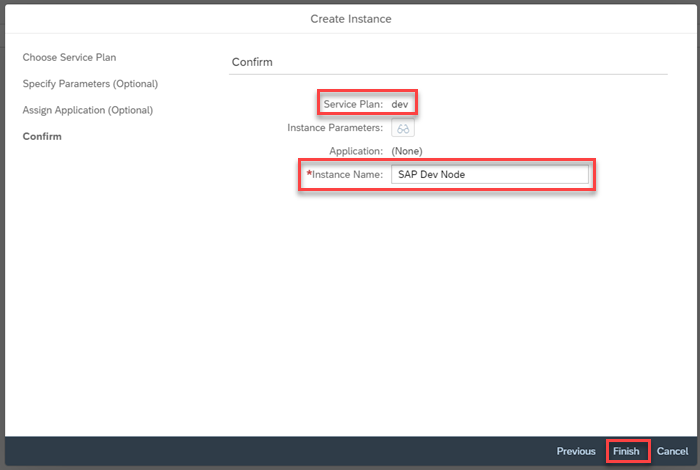

Your development node will now be provisioned (which may take a few moments) and displayed on the overview of available service instances.

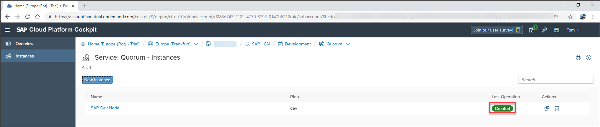

[DONE]
[ACCORDION-END]

[ACCORDION-BEGIN [Step 5: ](Access your Quorum node dashboard)]

After creating a Quorum service instance, provisioning a node in the process, you have access to your individual node dashboard. This displays the status of your node information.

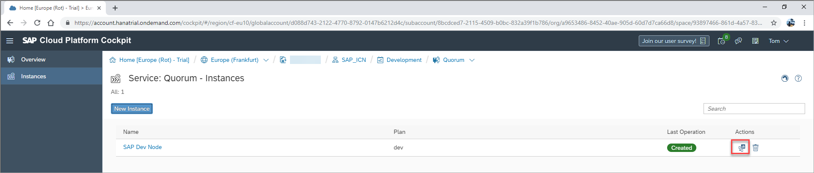

[DONE]
[ACCORDION-END]

[ACCORDION-BEGIN [Step 6: ](Create and manage Quorum service keys)]

Service keys for your Quorum node can be created and managed directly on your Quorum dashboard. Upon creation of a service key, a new blockchain account is created on the SAP Cloud Platform and a password is provided at the time of creation.

From your Quorum dashboard, you can create a service key by scrolling to the service key section and clicking **Add**.

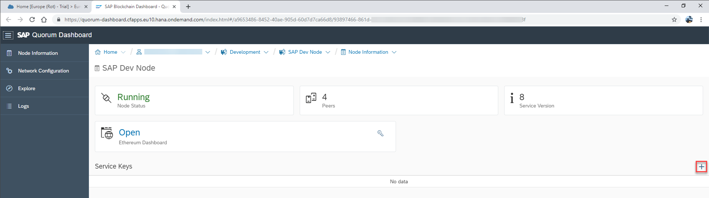

Now enter an internal service key name, provide and confirm an account password, and then click **Create**.

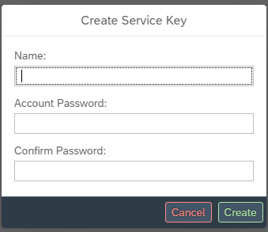

Your service key is now created and can be viewed and managed directly on your dashboard.

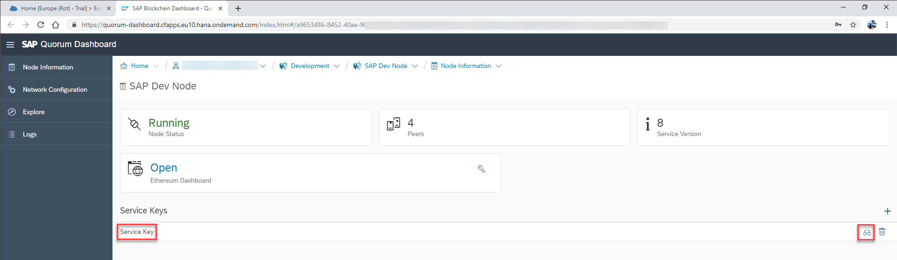

In this service key you can see:

- **address**: This is the `geth` blockchain account address.

- **RPC**: A unique RPC endpoint.

[VALIDATE_1]
[ACCORDION-END]
