## Details
### You will learn
  - How to test your Smart Contract using Remix, a Solidity IDE to create, test, debug, and deploy `Ethereum` Smart Contracts
  - How to create and deploy a Solidity Smart Contract to your Quorum instance on the SAP Cloud Platform

## Prerequisites
  - Access to a Quorum development node on SAP Cloud Platform
  - Access to a service key on your Quorum development node
  - Install the `Go Ethereum` tool - [Install](https://geth.ethereum.org/install/)

---

[ACCORDION-BEGIN [Step 1: ](Understanding Remix Solidity IDE)]

Remix is a browser-based IDE built by the `Ethereum` development team. You can visit the online version at [http://remix.ethereum.org](http://remix.ethereum.org). The purpose of the Remix IDE is to allow you to write and deploy Solidity smart contracts. It also provides you with useful debugging features.

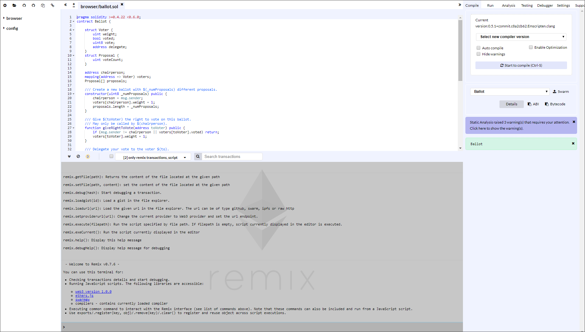

The left column contains your Solidity files, which store your smart contracts in the **.sol** format.

The middle section displays the solidity code of the current smart contract.

The right column of the Remix ID tool provides you with tools to compile, test, debug and deploy your solidity smart contracts.

[DONE]
[ACCORDION-END]

[ACCORDION-BEGIN [Step 2: ](Create your Smart Contract)]

To create a new Solidity file, click **Create New File**.

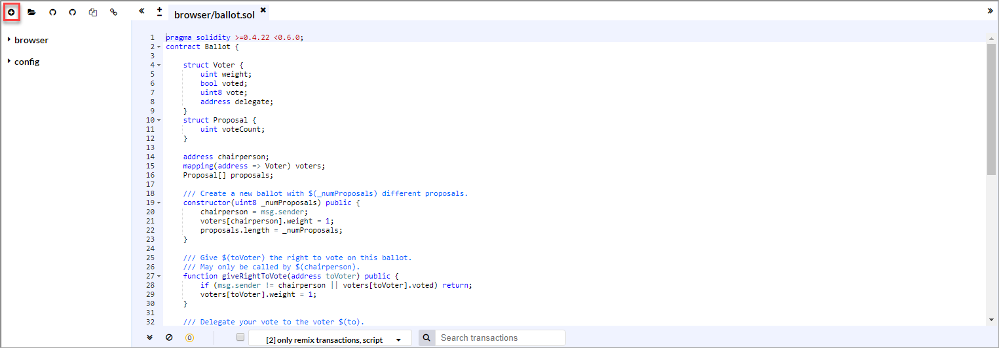

Enter a file name **Contract.sol** and click **OK**.

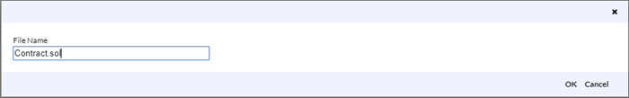

Copy and paste the following Solidity code into the new tab opened for the new file **Contract.sol**.

```Solidity
pragma solidity ^0.4.23;

contract Contract {
    struct History {
        uint timestamp;
        string value;
    }
    mapping (string => History[]) histories;
    mapping (string => bool) availableHistories;

    event WriteAttempt(
        int statusCode
    );

    function create(string memory key) public {
        if (availableHistories[key] == true) {
            emit WriteAttempt(409);
        } else {
            availableHistories[key] = true;
            History memory history = History(now, "{}");
            histories[key].push(history);
        }
    }

    function update(string memory key, string memory value) public {
        if (availableHistories[key] == false) {
            emit WriteAttempt(404);
        } else {
            histories[key].push(History({timestamp: now, value: value}));
            emit WriteAttempt(201);
        }
    }
    function get(string memory key, uint256 _index) public view returns (string memory) {
        if (availableHistories[key] == true) {
            return histories[key][_index].value;
        } else {
            return "0";
        }
    }
    function getHistorySize(string memory key) public view returns (uint256) {
         if (availableHistories[key] == true) {
            return histories[key].length;
         }
         else{
            return 0;
         }
    }
}
```

The purpose of the smart contract is to record delta updates to an object for a given key.

[DONE]
[ACCORDION-END]

[ACCORDION-BEGIN [Step 3: ](Compile your Smart Contract)]

To compile the source code, select **Compile Version - version:0.4.23+commit.124ca40d** and then click  **Smart to compile (Ctr-S)**. Ignore any static analysis warnings displayed here.

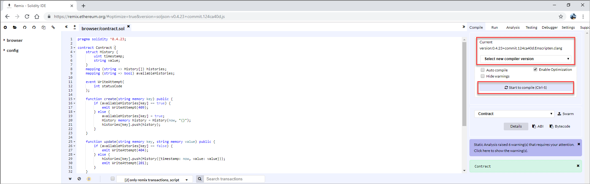

Once your smart contract successfully compiles the **ABI (Application Binary Interface)** and the **Bytecode** of the smart contract are generated. Both are needed when deploying the smart contract to your Quorum instance.

Click on **Details** to see this information:

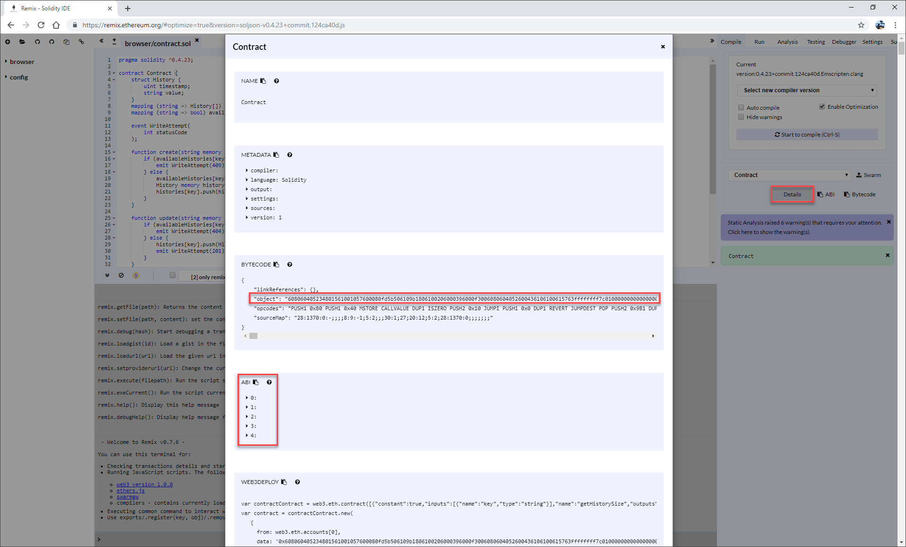

[DONE]
[ACCORDION-END]

[ACCORDION-BEGIN [Step 4: ](Deploying the smart contract to your Quorum instance)]

Once the **ABI (Application Binary Interface)** and the **Bytecode** has been generated for the smart contract after successfully compiling, you can deploy it to your Quorum instance on the SAP Cloud Platform.

For this, from the Remix Solidity IDE go to the section **Run**, choose in **Environment** Web3 Provider and click on **OK** in the popup window with the message – **Are you sure you want to connect to an `Ethereum` node?**  

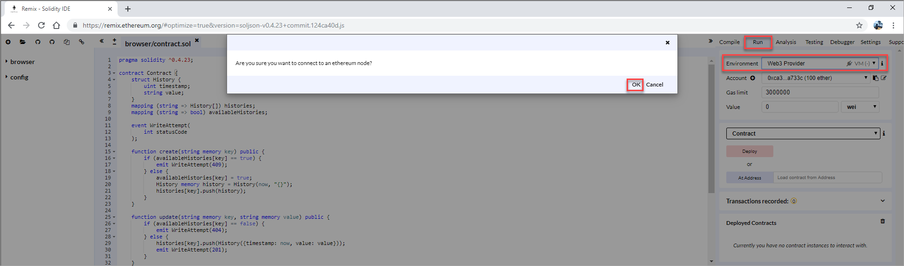

In the next popup window enter the RPC end point value from the Quorum Dashboard stored in your service key and click **OK**.

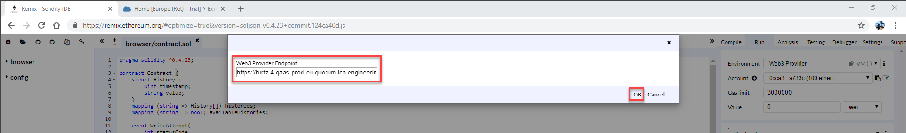

Select the Quorum account address stored on your service key to your Quorum instance from the list **Account** and press **Deploy**.

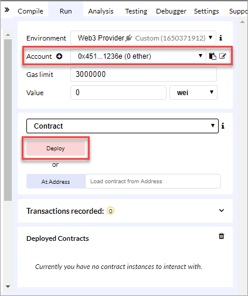

When deploying the smart contract to your Quorum instance on the SAP Cloud Platform you will get the following error message:

```
*creation of Contract pending ...*

*creation of Contract errored: authentication needed: password or unlock*
```

It means your Quorum account is still not authenticated for any deployments. This is the general procedure followed by Quorum and `Ethereum`.

To authenticate and unlock your Quorum account, open the **Go `Ethereum`** client and connect to the console of your `geth` client (Quorum node).
For this you need the **RPC end point value** from the Quorum Dashboard stored in the service key.   

```bash
> geth attach https://brrtz-4.qaas-prod-eu.quorum.icn.engineering/....VMirI3g= (RPC end point of your Quorum instance)
Welcome to the Geth JavaScript console!

instance: Geth/brrtz-4/v1.7.2-stable/linux-amd64/go1.9.4
coinbase: 0x8b0787c6581dd...f538284
at block: 10611548 (Tue, 19 Feb 2019 15:20:32 CET)
 modules: eth:1.0 net:1.0 personal:1.0 rpc:1.0 txpool:1.0 web3:1.0
>
```
Once it is connected you have to unlock the Quorum account as follows:

```bash
> personal.unlockAccount('0x6AD6ec3...') (Your Quorum account stored in the services key)
> Unlock account 0xAD6ec3...
Passphrase: (Password used when the service key was created)
true
>
```

Click **Deploy** again and you should see a success message showing the block number and the address associated to the deployed smart contract.

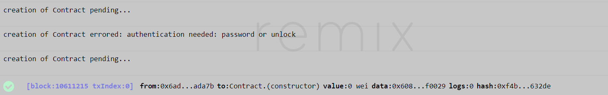

In the section **Deployed Contracts** you can now test the smart contract invoking the provided functions: *create, update, ..*

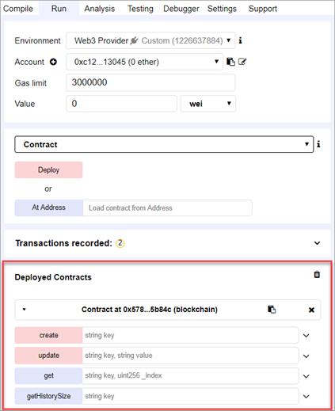

[DONE]
[ACCORDION-END]

[ACCORDION-BEGIN [Step 5: ](Using the smart contract)]
 Once the smart contract is deployed to your Quorum instance, we can use it in a specific scenario.

In this tutorial we will use the smart contract for supporting an e-voting scenario. E-voting allows voters to use electronic media to participate in votes and elections. Voters currently vote in person at the ballot boxes or by mail. Using e-voting solutions makes them possible to vote online by smartphone, tablet or computer anytime and anywhere.

Using the blockchain as a database, the ballots will be saved on a distributed network and all voters will be able to view voting results as they progress. Also, it would make sure people do not vote twice or delete votes, because of the immutable record of their vote and their identity. People responsible for counting votes would have a final record of every vote counted that could be checked by regulators or auditors at any time.

In particular, the scenario based on the Australian Electoral Division Higgins in Victoria for the Australian House of Representatives.
The system of voting used in elections for the House of Representatives in Australia is preferential, that is, voters have to rank all candidates in order of preference—they may not just vote for one candidate.

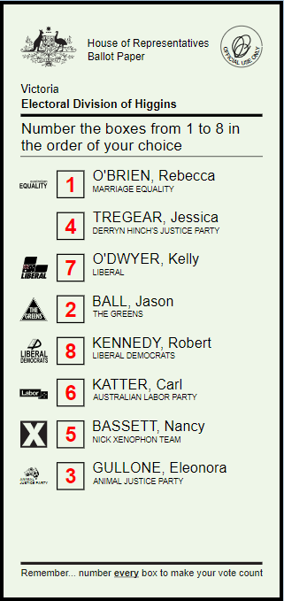

Voters are directed to mark their vote on the ballot paper by placing numbers in the squares opposite the names of the candidates so as to indicate their order of preference, for example, if there are three candidates, by writing the numbers 1, 2 and 3 in the appropriate squares. Ballot papers which are incorrectly filled out (informal) are not valid and are not included in the count.

The smart contract will then store all the ballots emitted by the voters containing the following information:

- `ballotId`: unique identifier for each voter
- `votes`: ranked candidates

**Example:**
```ruby
{'ballotId': '0x87de9877586ad2eb86001e5e7e17d9ea91dfac38',
 'votes': [
       {
         'party': 'MARRIAGE EQUALITY',
         'candidate': 'O BRIEN, Rebecca',
         'vote': '1'
       },
       {
         'party': 'DERRYN HINCH JUSTICE PARTY',
         'candidate': 'TREGEAR, Jessica',
         'vote': '7'
       },
       {
         'party': 'LIBERAL',
         'candidate': 'O DWYER, Kelly',
         'vote': '2'
       },
       {
        'party': 'THE GREENS',
        'candidate': 'BALL, Jason',
        'vote': '6'
       },
       {
        'party': 'LIBERAL DEMOCRATS',
        'candidate': 'KENNEDY, Robert',
        'vote': '3'
       },
       {
        'party': 'AUSTRALIAN LABOR PARTY',
        'candidate': 'KATTER, Carl',
        'vote': '5'
       },
       {
        'party': 'NICK XENOPHON TEAM',
        'candidate': 'BASSETT, Nancy',
        'vote': '4'
       },
       {
        'party': 'ANIMAL JUSTICE PARTY',
        'candidate': 'GULLONE, Eleonora',
        'vote': '8'
       }
 ]}
```

In this scenario, before storing the different ballots we need to initiate the smart contract by invoking the create function with a unique key identifying this electoral process.

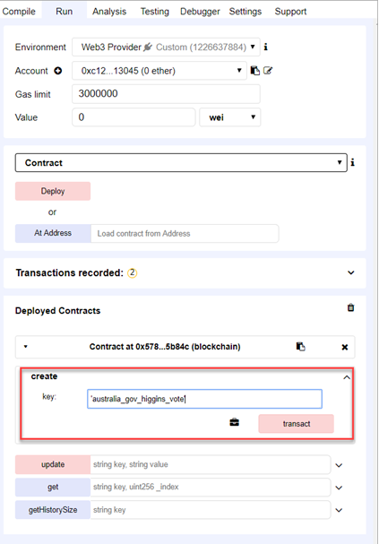

For this, expand the function create, enter the string **`australia_gov_higgins_vote`** in the field **key** and press **Transact**.   

You should see a success message displaying the resulting transaction on the **Terminal** section.  

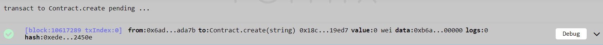

Each time a voter casts a ballot we have to record this update invoking the smart contract function **update** entering **`australia_gov_higgins_vote`** as in the field **key** and the information related to the ballot in the **value** field.

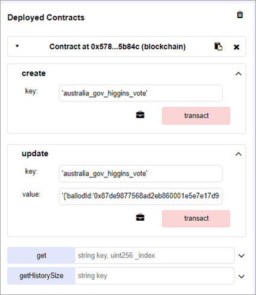

After clicking on **Transact** the resulting transaction that was mined is display in the **Terminal** section.    

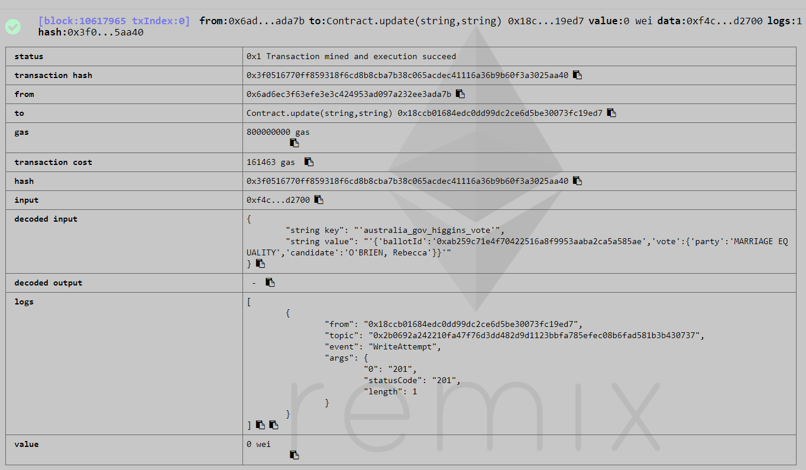

In the same way you can now test additional smart contract functions like **get** or **`getHistorySize`**. Note these functions are promised not to modify the state, thus only being used for viewing the state.

[VALIDATE_1]
[ACCORDION-END]
