## Prerequisites
 - [Access to a MultiChain node on SAP Cloud Platform](blockchain-mc-create-node)
 - [Set Up Your Local Infrastructure to Develop with SAP Cloud SDK](s4sdk-setup)
 - [Create a Sample Application on Cloud Foundry Using SAP Cloud SDK](s4sdk-cloud-foundry-sample-application)

## Details
### You will learn
  - How to implement a bank data service using Multichain (a blockchain technology)
  - How to read data from the S/4HANA system using a blockchain network
  - How to create a Java application for SAP Cloud Platform

This tutorial will guide you how to create a Java application for the SAP Cloud Platform Cloud Foundry environment using SAP Cloud SDK. You will use the SAP Cloud Platform Blockchain service for MultiChain and generate a project using the SAP Cloud SDK Maven archetype, implement blockchain features to store data retrieving from a S/4HANA OData service. You will deploy the application to SAP Cloud Foundry and monitor it with the SAP Cloud Platform Blockchain Dashboard for Multichain.

<b>GitHub Source:</b> You can also download the source file for this application, and instructions on how to install it, from [GitHub.com/SAP-Samples](https://github.com/SAP-samples/cloud-blockchain-bankdata-management-example).

---

[ACCORDION-BEGIN [Step 1: ](Generate Spring Boot project)]

In this step we create a skeleton for our Java application using the SAP Cloud SDK Maven archetype for Spring-Boot.

Run the following command:

```Java
mvn archetype:generate -DarchetypeGroupId=com.sap.cloud.sdk.archetypes -DarchetypeArtifactId=scp-cf-spring -DarchetypeVersion=3.1.0
```

We are using the version 3.1.0 of the SAP Cloud SDK to make sure that the following steps will work smoothly. You may use the current version though since compatibility should be ensured.

During the generation process, Maven will require additional parameters to form your project:


-	`groupId` - An identifier representing your group, company or organization (e.g. `com.mycompany.test`)
-	`artifactId` - An identifier for your application (e.g. `bankdata`)
-	`version` - The version of your application (e.g. 1.0-SNAPSHOT)
-	`package` - The name of the top-level package your source code will reside in (typically equal to your `groupId`, e.g. `com.mycompany.test`). Please pay attention to package and directory names in any upcoming source code when using a different package name than suggested here.

After providing these values, Maven will generate your project from the archetype for spring-boot applications.

Navigate to the project folder and build the project:

```Java
cd <your project, e.g. bankdata>
mvn clean install
```
If you want to get more details on the generated project structure, follow the Step 3 of the tutorial [Sample Application on Cloud Foundry Using SAP Cloud SDK](s4sdk-cloud-foundry-sample-application).

You may use your Development IDE of choice and import the Maven project into its workspace or use a text editor to change the sources in the following steps.

[DONE]
[ACCORDION-END]

[ACCORDION-BEGIN [Step 2: ](Explore BankDetail OData service)]

In the use case of our tutorial we want to read bank data form a S/4HANA system and store and validate it on the blockchain. In this step you will get familiar with the required OData service of S/4HANA.

For this, open a browser and open the [SAP API Business Hub](https://api.sap.com). Click on the tile for SAP S/4HANA Cloud and enter bank data in the filter text. Since we want to get the bank data out of the S/4HANA and replicate it to the blockchain we choose the *Bank – Read ODATA service*.

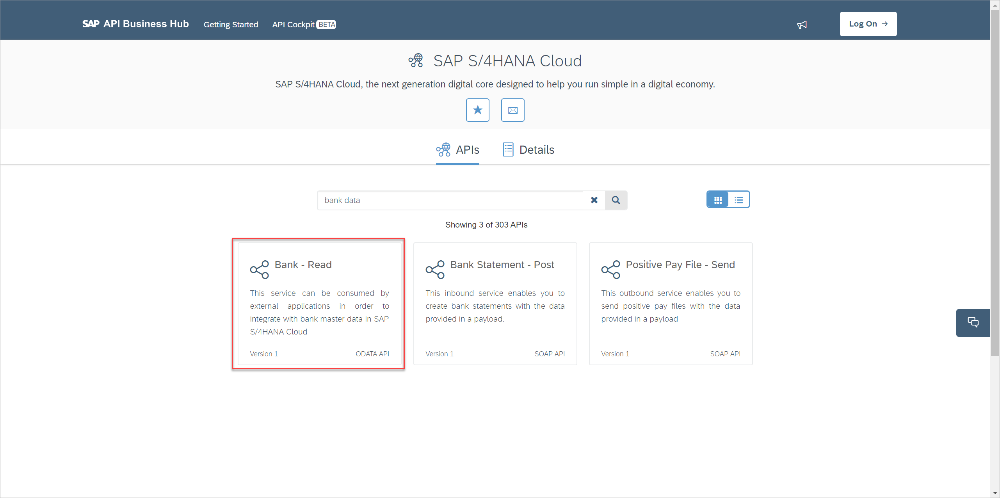

Choose the READ ODATA service and you will see two services for the entity set `A_BankDetail`. In order to test the services, you have to logon. Click on Try out for the first service and then click on Execute. In the response part you will see the data retrieved from S/4HANA.

For testing we use the sandbox system as we have not configured any other system in Configure Environments. When we will call this sandbox system from our application, we must provide a user-specific API Key. You get this API Key from the button Show API Key on the top of the page.

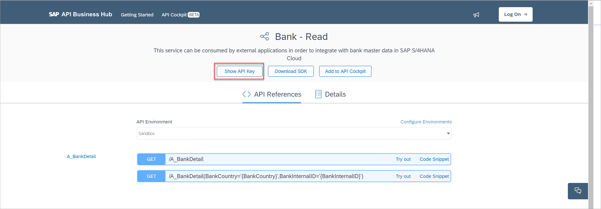

Note down the API key because we need it in the step 3. You may play around with the OData service and get familiar with the S/4HANA model for bank data. If you want to understand more on ODATA service and SAP Cloud SDK follow the tutorial [Connect to OData Service on Cloud Foundry Using SAP Cloud SDK](s4sdk-odata-service-cloud-foundry).


[DONE]
[ACCORDION-END]


[ACCORDION-BEGIN [Step 3: ](Implement BankDetail OData service)]

Go back to your Java project. Import the existing maven project into your IDE of choice or use a text editor.

We will now create a new controller class to serve a replicate or get request from the user.

In the application folder go to the Controller source folder:
- `(workspace/bankdata/application/src/main/java/com/mycompany/test/controller/)` and create a new class with the name BankDataController.java. Mind that there is already a HelloWorldController.java in the Controller package.

We are not re-using this to avoid issues with its existing unit test. During this tutorial we skip unit tests to focus on the blockchain aspects, although we believe unit test are essential for good software. As an optional exercise you may implement a unit test for the `BankDataController` class.

```Java
package com.mycompany.test.controllers;

import java.util.List;

import org.springframework.http.ResponseEntity;
import org.springframework.web.bind.annotation.RequestMapping;
import org.springframework.web.bind.annotation.RequestMethod;
import org.springframework.web.bind.annotation.RestController;

import com.sap.cloud.sdk.cloudplatform.connectivity.DefaultHttpDestination;
import com.sap.cloud.sdk.cloudplatform.connectivity.Header;
import com.sap.cloud.sdk.odatav2.connectivity.ODataException;
import com.sap.cloud.sdk.s4hana.datamodel.odata.namespaces.bankdetail.BankDetail;
import com.sap.cloud.sdk.s4hana.datamodel.odata.services.DefaultBankDetailService;

@RestController
public class BankDataController {
    private static final String BANKCOUNTRY = "DE";

    private static final String sandboxAPIKey = System.getenv("SANDBOX_APIKEY");
    private static final Header header = new Header("APIKey", sandboxAPIKey);
    private final DefaultHttpDestination destination = DefaultHttpDestination.builder("https://sandbox.api.sap.com/s4hanacloud").header(header).build();

    @RequestMapping( value = "/replicate", method = RequestMethod.GET )
    public ResponseEntity<String> replicateBankData( ) throws ODataException
    {
    	// Check if environment variable for APIKey of the sandbox system is set
    	if (sandboxAPIKey == null)
    		return ResponseEntity.ok("please maintain the environment variable SANDBOX_APIKEY for your application");    	      
	// Read all bank data from S/4HANA
	List<BankDetail> bankDataAll = new DefaultBankDetailService().getAllBankDetail().execute(destination);
/* replace the following if clause in step 4 */
if (bankDataAll.size() > 0) {
      return ResponseEntity.ok(bankDataAll.size() + " banks(s) read from S/4HANA for country code " + BANKCOUNTRY);						 	
}
/* end of replace the following if clause in step 4 */  				    
	return ResponseEntity.notFound().build();		
    }
}    
```

Our use case will only read data for language code "DE" to limit the amount of data in this tutorial. Feel free to change it to your preferences.

The application will only run, if we add an environment with the name `SANDBOX_API` that contains the API Key derived from Step 2. Later on, we will explain how to set this environment. This API Key will be passed as header parameter when we call the Sandbox API.

Our new controller will provide a new request method /replicate. Here we will make use of the `DefaultBankDetailService` from SAP Cloud SDK to easily get data from the ODATA Service for bank details.

After saving your class you can re-build the project:

```Java
mvn clean package
```

Once the project is built, we can deploy it to SAP Cloud Foundry. As prerequisite you have set the right landscape (`cf api`) and logged in to your SAP Cloud Account (`cf login`):

```Java
cf push
```

If you are not yet familiar with the deployment to SAP Cloud Foundry, please follow the tutorial [Create a Sample Application on Cloud Foundry Using SAP Cloud SDK](s4sdk-cloud-foundry-sample-application).

Once the application is successfully pushed to Cloud Foundry, open the account cockpit for your SAP Cloud Cockpit. Under application you will see your deployed application:

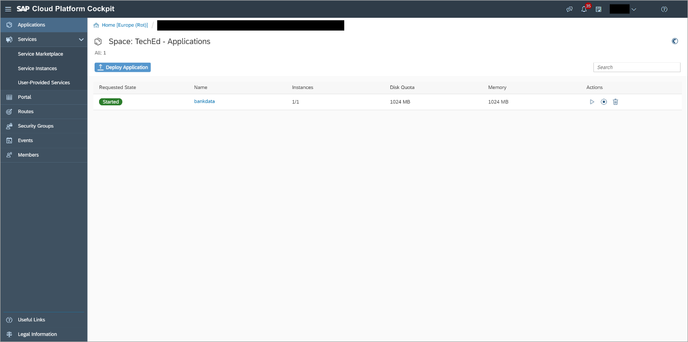

Click on your application. You will get an overview of your application.

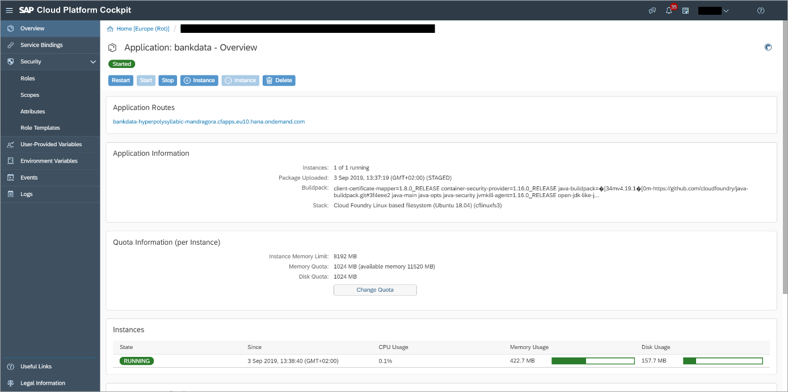

Do you remember the API Key from Step 1? Under User-Provided Variables on the left you can now enter this API key as a environment variable:

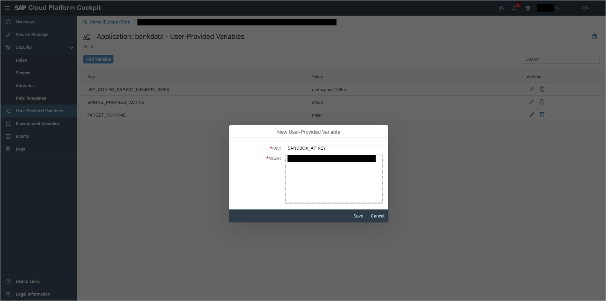

Save the environment variable. To make the environment variable effective, restart your application.

Go back to your application overview and click the Application Route.

The browser will open the standard page of the Spring-Boot Archetype of SAP Cloud SDK.

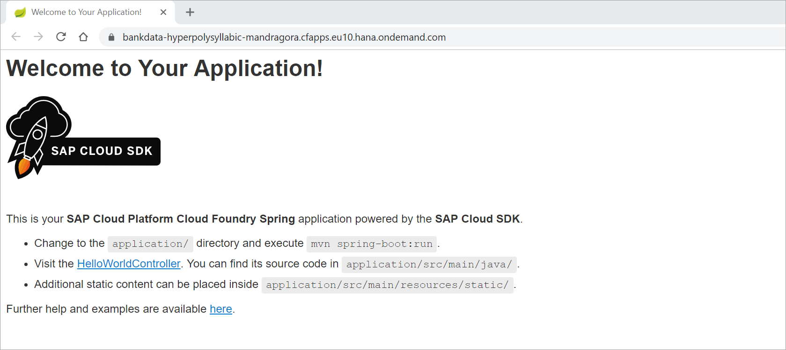

You may click on the link for the `HelloWorldController` that is delivered by default. Since we have created our own controller `BankDataController` with its request mapping replicate, enter the application route with /replicate:

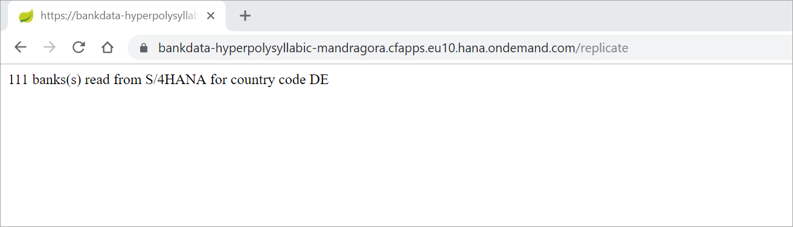

In our example, we get 111 banks from S/4HANA. This will be read from the S/4HANA sandbox system we worked in in step 2. Feel free to play around with the sandbox data and change the BANKCOUNTRY parameter in your code if you like.

[DONE]
[ACCORDION-END]

[ACCORDION-BEGIN [Step 4: ](Create blockchain service for MultiChain)]

To integrate our solution with blockchain, we first need to get a blockchain node. In this tutorial we use the blockchain technology Multichain that is integrated with some SAP applications already. To get a MultiChain node you can use the SAP Cloud Platform Blockchain service that is also available on the trial landscape.

Check the tutorial [Create a MultiChain Trial Node](blockchain-mc-create-node) and create a node. If you don't use the trial landscape but already have your own account, use the small service plan of your MultiChain service in your SAP Cloud Platform account.

As a result you have your own MultiChain node in your SAP Cloud Platform account.

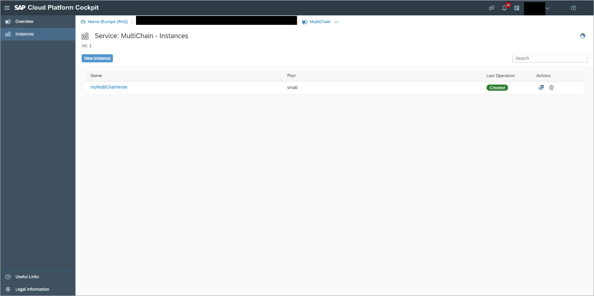

To link this node to your application you must bind the node to the application. Click on your service when it is created.

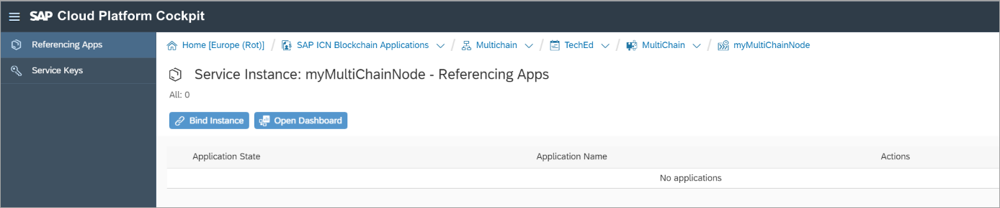

Click on Bind Instance and choose your application. You don't need to specify any parameters. After saving the binding you will get information on the environment services:

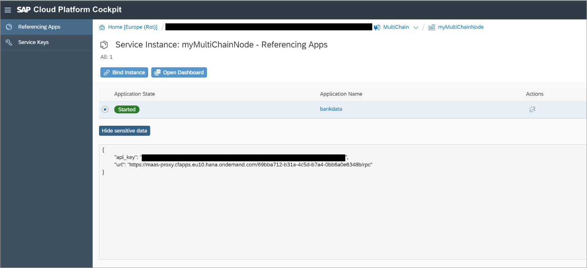

Your node is now bound to your application. The API key is used to identify the node, the URL is a landscape specific and node specific URL to access the node.

[DONE]
[ACCORDION-END]

[ACCORDION-BEGIN [Step 5: ](Add blockchain maven dependency)]

Let's now extend our Java application to communicate with this MultiChain node. The SAP Cloud SDK comes with all what you need to easily integrate with the node from your Java application.

To make use of the blockchain functionality you must add its Maven dependency in your application pom.xml file (put in underneath of the existing s4hana-all dependency).

```Java
<dependency>
        	<groupId>com.sap.cloud.sdk.services</groupId>
        	<artifactId>blockchain</artifactId>
        </dependency>
```

We instantiate the MultiChain service in the first line of our replicate method in our `BankDataController` class:

```Java
public ResponseEntity<String> replicateBankData( ) throws ODataException
{
  // create MultiChain service instance
  MultichainService mcService = MultichainService.create();    	
// Check if environment variable for APIKey of the sandbox system is set
…
```
Add the following into the import section of your class (may be done by your IDE automatically):

```Java
import com.sap.cloud.sdk.services.blockchain.multichain.service.MultichainService;
```
Instantiating the MultiChain Service will read the binding information you created in the previous step to be able to access the node.

In the next steps let's interact with the node.

[DONE]
[ACCORDION-END]

[ACCORDION-BEGIN [Step 6: ](Write BankDetails to blockchain)]

In this step we want to extend our Java application by checking if the entries are already on the blockchain and if not, write it to blockchain. By this we see how to read a blockchain entry and write an entry to it. We do it for each entry separately for didactic reasons knowing that in performance relevant scenarios you would use more complex bulk calls.

We will use the Stream concept of MultiChain to store key/value pairs on the blockchain node. You may refer to the MultiChain documentation. As key we will concatenate the BANKCOUNTRY and the ERP internal id. The value will contain selected fields of the bank data details in a JSON format.

We use the stream root that is already available in every node. Add the following line to on top of your class:

```Java
private static final String MULTICHAIN_STREAM_NAME = "root";
```

For checking if an entry already exists, we read it. Reading of an entry is done by the following command:

```Java
mcService.listStreamKeyItems(MULTICHAIN_STREAM_NAME, streamEntryKey, false, 1, -1, false);
```

You provide the stream name and the key as a query parameter. The additional parameters are verbose, count, start and local-ordering that is explained in the JSON-RPC documentation for MultiChain. The count 1 and the negative value for start implies to get the latest entry only.

To write an entry to blockchain you use the following command:

```Java
mcService.publishJson(MULTICHAIN_STREAM_NAME, streamKeys, value, null);
```

You enter the stream name, the key(s) and the value to be stored. You also find the relevant parameter documentation in the JSON-RPC documentation of MultiChain for the command publish. The `publishJson` method of the MultiChain service automatically writes the entry as a JSON entry for the RPC command publish.

Now we can put the code together with a loop over all entries, some if clauses and some logging information. Please add the following imports and replace the existing if (`bankDataAll.size`() > 0) clause with the following code:

```Java
import com.sap.cloud.sdk.services.blockchain.multichain.model.MultichainResult;
import java.util.Arrays;
import java.util.HashMap;
import java.util.Map;
```
```Java
if (bankDataAll.size() > 0) {
	int cntBanks = 0, cntExists = 0, cntWrite2Blockchain = 0;

	for (BankDetail bankDetail : bankDataAll) {
		// get only bank account for country BANKCOUNTRY_DE
		if (! bankDetail.getBankCountry().equals(BANKCOUNTRY))
			continue;

		cntBanks++;

		// Check if entry already exists by querying the blockchain
    		String streamEntryKey = BANKCOUNTRY + "_" + bankDetail.getBankInternalID();         			
    	      List<MultichainResult> queryResult = mcService.listStreamKeyItems(MULTICHAIN_STREAM_NAME, streamEntryKey, false, 1, -1, false);
    	      if (queryResult.size() > 0) {
    	      	// Entry already exists, don't overwrite
    	        	cntExists ++;
    	        	continue;    	        	
    	      }    				

    	      // Write to blockchain
            List<String> streamKeys = Arrays.asList(BANKCOUNTRY + "_" + bankDetail.getBankInternalID() );
            Map<String,Object> value = new HashMap<String,Object>() {{
                    put("NAME", bankDetail.getBankName());
                    put("NUMBER", bankDetail.getBankNumber());
                    put("SWIFT_CODE", bankDetail.getSWIFTCode());
            }};        
            mcService.publishJson(MULTICHAIN_STREAM_NAME, streamKeys, value, null);    
            cntWrite2Blockchain++;
}

return ResponseEntity.ok(cntBanks + " banks(s) read from S/4HANA for country code " + BANKCOUNTRY + ".\n" + cntExists + " entries already existed on Blockchain.\n" + cntWrite2Blockchain + " entries written to blockchain.");
    }

```
Now build the project and push the package to SAP Cloud Platform:
After the application is deployed restart your application. Make sure you have /replicate in the URL.

You will get a similar message:

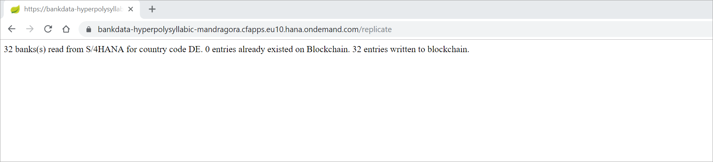

If you re-execute the URL it should be stated that all entries already existed on the blockchain.

You can validate the results in the dashboard of your MultiChain service instance in the cloud account cockpit. In the stream section you will see similar entries:

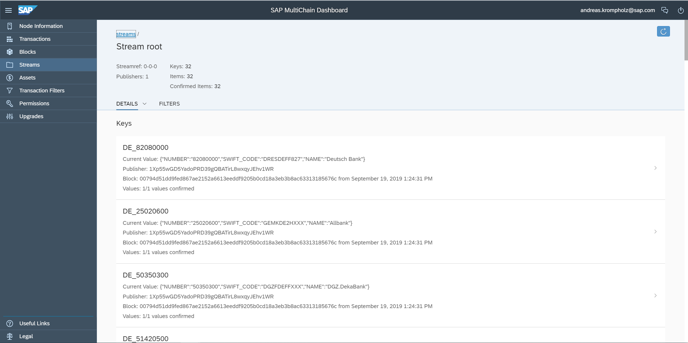


[DONE]
[ACCORDION-END]

[ACCORDION-BEGIN [Step 7: ](Query BankDetails)]

In this last step let us provide a new functionality to read a specific bank data from the blockchain using Java code.  As selection criteria we will read the key which contains the internal ERP bank number.

Add the following method to your class:

```Java
@RequestMapping( value = "/read", method = RequestMethod.GET )
public ResponseEntity<String> getBankData( @RequestParam( defaultValue = "" ) final String id ) throws ODataException
{   
  // Check if environment variable for APIKey of the sandbox system is set
  if (sandboxAPIKey == null)
    return ResponseEntity.ok("please maintain the environment variable SANDBOX_APIKEY for your application");

  // Check if bank id is provided
  if (id.equals(""))
    return ResponseEntity.ok("please provide the internal S/4HANA ID for the bank number in the Http-Get parameter id");

  // create MultiChain service instance
  MultichainService mcService = MultichainService.create();

  // Read bank ID
  String streamEntryKey = BANKCOUNTRY + "_" + id;
    List<MultichainResult> queryResult = mcService.listStreamKeyItems(MULTICHAIN_STREAM_NAME, streamEntryKey, false, 1, -1, false);
    if (queryResult.size() > 0) {
      // Entry found. Since query parameter count is set to 1, only the latest entry is provided
      MultichainResult resultEntry = queryResult.get(0);
      HashMap<String, String> payload = (HashMap<String, String>) resultEntry.getJsonData().get("json");

      // Read business information
      String bankName = payload.get("NAME");
      String bankNumber = payload.get("NUMBER");
      String swiftCode = payload.get("SWIFT_CODE");

      // Read blockchain information
      String publisher = queryResult.get(0).getPublishers().get(0);
      String blocktime = queryResult.get(0).getBlocktime().toString();

      return ResponseEntity.ok("Bank data: " + bankNumber + "(" + swiftCode + ") at " + bankName + " written to blockchain by Multichain address" + publisher + " (" + blocktime + ")" );
    }    				    	

  return ResponseEntity.notFound().build();
}
```

Add the new import:

```Java
import org.springframework.web.bind.annotation.RequestParam;
```
In this class we not only read the business data but also the blockchain data such as Publisher and block time. The Publisher is the MultiChain account that has written entry, the block time is the data and time of the block creation where your transaction was mined.

Once you have saved the method, build the project and push the package to the cloud as you know from the previous steps. Run the application and use the suffix `read?id=<one valid bank internal ID>` to call our new service for a given bank internal ID. A valid bank internal ID can be retrieved from your S/4HANA Cloud sandbox system using the API Hub from step 2.

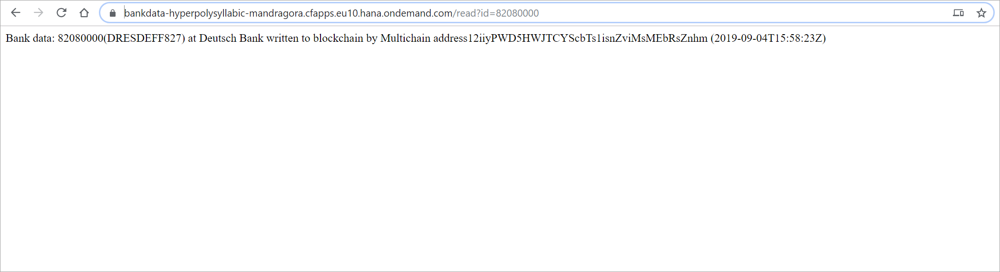

From the S/4HANA we got an internal bank ID that is now used to read its `bankdata` providing the ID as get parameter for our new service.

[VALIDATE_1]
[ACCORDION-END]
