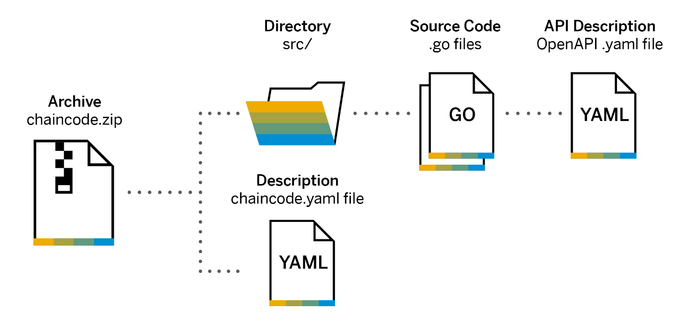
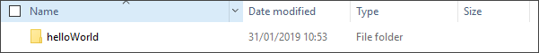
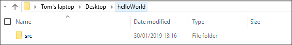
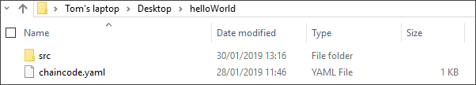
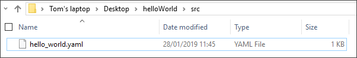
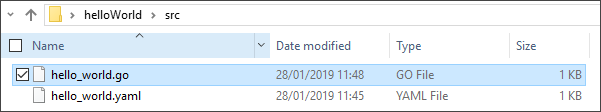

## Prerequisites
 - Access to a Hyperledger Fabric development node - [(Tutorial)](https://developers.sap.com/tutorials/blockchain-create-hlf-node.html)
 - Access to a Hyperledger Fabric channel service instance - [(Tutorial)](https://developers.sap.com/tutorials/blockchain-hlf-channel.html)
 - Access to a text editor

## Details
### You will learn
  - How Hyperledger Fabric chaincode is structured
  - How to create the Hyperledger Fabric chaincode manifest file

[ACCORDION-BEGIN [Step 1: ](Understand Hyperledger Fabric chaincode)]

Hyperledger chaincode consists of small programs (also called smart contracts) that run directly on the Hyperledger nodes. Each chaincode contains specific application logic, which in the minimal case is purely the reading and writing of data. Chaincode has an external API that exposes its business logic and uses internal APIs to interact directly with the Hyperledger node. Chaincode programs are currently programmed in the GO programming language. Further programming languages may be supported in the future.

A chaincode program is deployed on a Hyperledger channel, where each channel effectively represents a blockchain.



In the following steps we will create a "Hello World" example, starting with the creation of the directory structure.

[DONE]
[ACCORDION-END]

[ACCORDION-BEGIN [Step 2: ](Create chaincode directory structure)]

Create a new folder and name this `helloWorld`:



Within your `helloWorld` folder, create another new folder and name this `src`:



This is the source folder for your chaincode.

[DONE]
[ACCORDION-END]

[ACCORDION-BEGIN [Step 3: ](Create manifest file)]

Within your `helloWorld` folder, create a new text file and name this `chaincode.yaml`:



This is now your chaincode manifest file, effectively providing the metadata for your chaincode.

The Id and Version tags are important here.   Whenever a chaincode is called, either from a REST API call or from another chaincode, the identifier (ID) of the chaincode must be known. This ID must be supplied when the chaincode is deployed, too.
We recommend that you specify all chaincode IDs in reverse DNS format, as is typical in Java class names.

For example, our chaincode Id is `blockchain-tutorial-helloWorld`. The allowed syntax for chaincode IDs are A-Z characters (both lower- and uppercase), numbers 0-9, and the two special characters `-` and `_`.

Similarly, each chaincode is assigned a version number. Since chaincode is deployed 'forever' on the blockchain and cannot be deleted, you use the version number (which must be a monotonic integer number) to redeploy a new chaincode to replace a previous version of the chaincode. During deployment, the version number of the chaincode must also be available.

Within the `chaincode.yaml` file, enter and save the following text:

```YAML
# THIS SAMPLE CODE MAY BE USED SOLELY AS PART OF THE TEST AND EVALUATION OF THE SAP CLOUD PLATFORM
# BLOCKCHAIN SERVICE (THE "SERVICE") AND IN ACCORDANCE WITH THE TERMS OF THE AGREEMENT FOR THE SERVICE.
# THIS SAMPLE CODE PROVIDED "AS IS", WITHOUT ANY WARRANTY, ESCROW, TRAINING, MAINTENANCE, OR
# SERVICE OBLIGATIONS WHATSOEVER ON THE PART OF SAP.

Id:       blockchain-tutorial-helloWorld
Version:  1
```

This manifest file text includes an SAP disclaimer, which is purely input as a comment and can be substituted for your own input, the chaincode Id, and the version number.

[VALIDATE_1]

[ACCORDION-END]

[ACCORDION-BEGIN [Step 4: ](Create API description file)]

SAP Cloud Platform Blockchain Service provides a gateway that exposes all chaincode functions as normal REST APIs. You achieve this by providing an `OpenAPI` description of the REST API that maps onto the chaincode functions. You do this with a YAML document which is written along with the GO language chaincode. The YAML document describes exactly how each function can be accessed via a REST call, which parameters are available, and how the parameters should be passed to the chaincode.

Within your `src` folder, create a new text file and name this `hello_world.yaml`:



Within the newly created `hello_world.yaml` file, enter and save the following text:

```YAML
swagger: "2.0"
info:
  description: |
    The Hello World! chain code shows the first steps in developing a chaincode that
    can read/write strings onto the blockchain and can expose these functions as REST API. THIS SAMPLE
    CODE MAY BE USED SOLELY AS PART OF THE TEST AND EVALUATION OF THE SAP CLOUD PLATFORM BLOCKCHAIN
    SERVICE (THE "SERVICE") AND IN ACCORDANCE WITH THE AGREEMENT FOR THE SERVICE. THIS SAMPLE CODE
    PROVIDED "AS IS", WITHOUT ANY WARRANTY, ESCROW, TRAINING, MAINTENANCE, OR SERVICE OBLIGATIONS
    WHATSOEVER ON THE PART OF SAP.
  version: "1.0"
  title: "Hello World!"
```

Again, this includes an SAP disclaimer, and this can be substituted for your own text where necessary.

[DONE]
[ACCORDION-END]

[ACCORDION-BEGIN [Step 5: ](Create source code file)]

When developing chaincode, the next step is to write the GO program itself (which is your chaincode). Within the program, there can be any number of functions, each function with any number of 'unnamed' parameters. The caller of any function must know the name of the function and the exact sequence of parameters. In usual Hyperledger Fabric setups, access to chaincode is only via a SDK that requires `HTTPS/gRPC` access to the chaincode.

Within your `src` folder, create a new text file and name this `hello_world.go`:



This is now your chaincode source code file. Within the newly created `hello_world.go` file, enter and save the following text:

``` GO
// DISCLAIMER:
// THIS SAMPLE CODE MAY BE USED SOLELY AS PART OF THE TEST AND EVALUATION OF THE SAP CLOUD PLATFORM
// BLOCKCHAIN SERVICE (THE "SERVICE") AND IN ACCORDANCE WITH THE TERMS OF THE AGREEMENT FOR THE SERVICE.
// THIS SAMPLE CODE PROVIDED "AS IS", WITHOUT ANY WARRANTY, ESCROW, TRAINING, MAINTENANCE, OR SERVICE
// OBLIGATIONS WHATSOEVER ON THE PART OF SAP.
```

Like the previous step, this starts with an SAP disclaimer, which is purely input as a comment can be substituted for your own input.


[DONE]
[ACCORDION-END]
